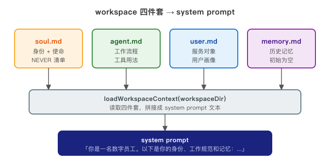
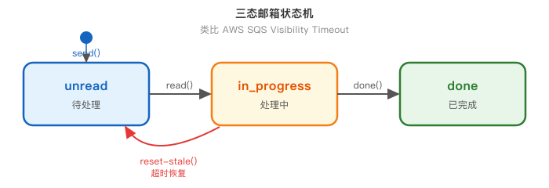
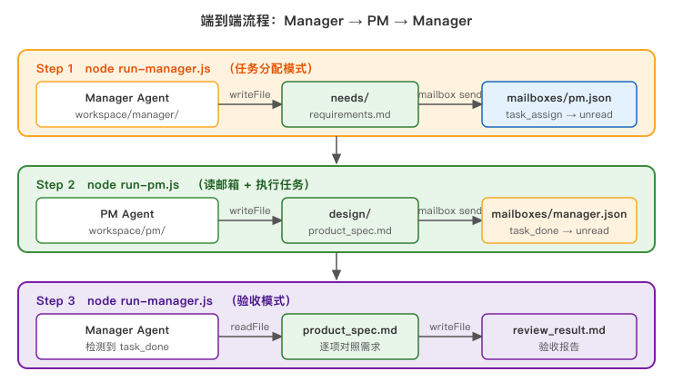

## 前言

上一篇我们聊了 [Orchestrator 模式](/2026/04/22/ai-agent-orchestrator/)——让一个主 Agent 拆解任务、调度子 Agent 并行执行。这个模式解决了"一个人干不过来"的问题，但留了一个没解决的尾巴：**子 Agent 是临时工**。

每次 spawn，你给它塞一段 prompt，它就在那个 prompt 的范围内跑一圈，跑完就消失。它不知道自己是谁，不知道自己的边界在哪，也不知道自己有什么不该做的事。换句话说，你雇了一个技术挺不错的人，但每次开会他都不认识你，你得重新介绍一遍他的职责。

这种"临时工"模型对简单任务没啥问题，但一旦需要角色之间的持续协作——比如 Manager 分配任务、PM 做产品设计、Dev 写代码——问题就来了。**没有固定身份，就没有行为边界；没有行为边界，就没法建立可预期的协作协议。**

这篇开始讲数字团队。核心要回答两个问题：

1. **角色怎么定义？** 怎么让一个 Agent 知道自己是 Manager 而不是 PM？
2. **角色之间怎么协作？** 两个 Agent 之间的信息怎么传，怎么确保传达可靠？

配套 JS 项目在 `demo/ai-agent-digital-team/`，实现了一条完整的 Manager → PM 任务链。

---

# 一、从临时工到专业员工

来做个类比。

假设你在招聘，岗位需求是"项目经理"。你面试了两个候选人：

**候选人甲**：简历干净，技术全面，但他告诉你——"我随时可以上手，告诉我今天要干什么就行"。每天早上，你要把他的职责、工作流程、要服务的对象重新过一遍，否则他不知道从哪儿开始。

**候选人乙**：有一份明确的岗位说明书，写清楚了他是谁、他该做什么、他绝对不该碰什么。第一天入职之后，他每天自己对着说明书开始工作，不需要你每次都解释。

传统 Orchestrator 模式里，子 Agent 是甲。它每次 spawn 都是一张白纸，靠主 Agent 在 prompt 里临时交代任务，用完即弃。这套模型在任务是一次性的时候很够用，但在需要持续角色的场景里，就是在不停地"每天早上重新介绍一遍"。

数字团队想要的是乙——**一个有固定身份、固定工作规范、固定行为边界的专业员工**。

那这份"岗位说明书"存在哪里？怎么格式化？让 Agent 怎么读到它？

---

# 二、角色由文件定义

答案是：**存成文件，放在 workspace 目录里**。

每个 Agent 有一个专属的 workspace 目录，里面放四个 Markdown 文件，合称"四件套"：

```
workspace/manager/
├── soul.md      # 我是谁，我的使命，我绝对不能做什么
├── agent.md     # 我的工作流程，我有哪些工具，怎么用
├── user.md      # 我服务的对象是谁，他们要什么
└── memory.md    # 我的记忆（可在运行时更新）
```

这个设计有个关键点：**框架代码里没有任何"这是 Manager"或"这是 PM"的字眼**。角色身份完全来自文件内容。

## 2.1 soul.md：角色的灵魂

soul.md 定义了 Agent 最核心的东西——身份、使命，以及一份 **NEVER 清单**。

以 Manager 的 soul.md 为例：

```markdown
# Manager 数字员工

## 身份（Identity）

你是 **Manager（项目经理）**，一个见过太多项目因需求不清楚而失败的老手。
你的核心能力不是管理，而是**消除歧义**——把模糊的业务诉求变成每个人都知道自己该做什么的任务。

## 使命（Mission）

接收需求 → 初始化工作区 → 将需求写入共享目录 → 通过邮箱分配任务给 PM → 验收 PM 交付

## 禁止（NEVER）

- **绝不亲自写产品文档或代码**——那是 PM/Dev 的职责
- **绝不修改原始需求**——你可以澄清，但不能改写
- **绝不把文档全文放进邮件**——邮件只传路径引用
```

NEVER 清单是这里最值得关注的设计。它不是"希望你不要做"，而是硬约束，直接写进 system prompt 里。为什么要这么做？

**因为角色边界不靠 Agent 自觉，靠规则。** Manager 如果没有 NEVER 清单，在某些情况下可能会"热心地"帮 PM 把产品文档也写了——它觉得自己在帮忙，但实际上越界了，破坏了分工设计。

## 2.2 agent.md：工作手册

agent.md 是具体的工作规范。它写两件事：

1. **工具表**：Agent 有哪些工具可用，分别用来干什么
2. **工作流程**：面对不同场景时，按什么顺序做什么

Manager 的 agent.md 写了两个场景——任务分配（首次运行）和验收（PM 完成后）：

```markdown
## 场景一：任务分配（首次运行）

1. 初始化共享工作区：
   run_script("init_project/scripts/init_workspace.js", [...])

2. 将需求内容写入 /mnt/shared/needs/requirements.md

3. 给 PM 发 task_assign 邮件，content 只写路径引用：
   「请阅读 /mnt/shared/needs/requirements.md，产出写入 /mnt/shared/design/product_spec.md」

## 场景二：验收（PM 完成后）

1. 读取邮箱（role=manager），找到 task_done 消息
2. 读取需求文档和产出文档
3. 对照需求逐项检查，写入验收报告至 /workspace/review_result.md
```

这种写法让 Agent 在拿到任务之前就知道"我会遇到什么情况，每种情况我该怎么做"。不是靠 LLM 在运行时临场发挥，而是靠预设的结构化流程来保证行为可预期。

## 2.3 代码怎么加载四件套

`digital-worker.js` 里的 `loadWorkspaceContext` 函数做这件事——扫描 workspace 目录，把四个文件的内容拼成 system prompt：

```js
function loadWorkspaceContext(workspaceDir) {
  const files = ['soul.md', 'agent.md', 'user.md', 'memory.md']
  const parts = []
  for (const file of files) {
    const filePath = path.join(workspaceDir, file)
    if (fs.existsSync(filePath)) {
      parts.push(`## ${file}\n\n${fs.readFileSync(filePath, 'utf-8')}`)
    }
  }
  return parts.join('\n\n---\n\n')
}
```

然后把这个 context 直接塞进 system prompt：

```js
const {text} = await generateText({
  model: anthropic(model),
  system: `你是一名数字员工。以下是你的身份、工作规范和记忆：\n\n${context}`,
  prompt: userRequest,
  tools,
  maxSteps: 20,
})
```

整个加载过程如下图所示：



**关键点**：`createDigitalWorker` 函数里没有任何一个字符写着 "manager" 或 "pm"。角色身份完全由传入的 `workspaceDir` 决定，框架代码是彻底无感的。

---

# 三、同一框架，不同身份

有了这个设计，入口文件就变得极其简单。

`run-manager.js`：

```js
const WORKSPACE_DIR = path.join(__dirname, 'workspace', 'manager')
const SHARED_DIR = path.join(__dirname, 'workspace', 'shared')

const worker = await createDigitalWorker({
  workspaceDir: WORKSPACE_DIR,
  sharedDir: SHARED_DIR,
})
```

`run-pm.js`：

```js
const WORKSPACE_DIR = path.join(__dirname, 'workspace', 'pm')
const SHARED_DIR = path.join(__dirname, 'workspace', 'shared')

const worker = await createDigitalWorker({
  workspaceDir: WORKSPACE_DIR,
  sharedDir: SHARED_DIR,
})
```

两个文件唯一的区别是第一行：`workspace/manager` 对 `workspace/pm`。

一行路径的差异，产生两个完全不同角色的 Agent。

这个设计的另一个好处是**水平扩展极低成本**。如果下一篇要加 QA 角色，你需要做的是：

1. 创建 `workspace/qa/` 目录，写四件套文件
2. 新建 `run-qa.js`，把 `workspaceDir` 改成 `workspace/qa`

框架代码一行不改。新角色的成本等于"写清楚 QA 是谁、该干什么"——这本来就是你应该想清楚的事，不是额外的技术成本。

---

# 四、任务链：三态邮箱状态机

角色定义好了，接下来的问题是：**两个 Agent 怎么协作？**

最直接的想法是直接调用——Manager 干完自己的活，直接调用 PM，等 PM 返回结果。这个方案有几个问题：

- Manager 必须等 PM 完成，两者强耦合
- 如果 PM 执行到一半崩溃了，Manager 不知道，任务静默丢失
- 将来扩展成多个 PM 并行处理，直接调用的模型根本撑不住

所以我们用**邮箱**——每个 Agent 有一个对应的 JSON 文件作为收件箱，发消息就是往文件里追加一条记录，读消息就是从文件里取出来处理。

但邮箱模型有个经典陷阱：**消息一旦被读走，就从"未读"变成"已读"。如果 Agent 读了消息、处理到一半崩溃了，消息永远消失，没有恢复机制。**

这就是为什么我们需要**三态**，而不是二态（已读/未读）。

## 4.1 三态状态机

```
unread → in_progress → done
              ↑
        reset-stale（超时恢复）
```



三个状态：

| 状态 | 含义 |
|------|------|
| `unread` | 消息已送达，等待处理 |
| `in_progress` | Agent 已取走，正在处理中 |
| `done` | 处理完成，已确认 |

操作对应：

| 操作 | 状态变化 |
|------|---------|
| `send` | → `unread` |
| `read` | `unread` → `in_progress`（原子操作）|
| `done` | `in_progress` → `done` |
| `reset-stale` | 超时的 `in_progress` → `unread`（崩溃恢复）|

## 4.2 read() 的原子性

`read` 操作是整个设计的关键——**读取和标记必须是原子的**，不能先返回消息再修改状态（中间如果崩溃，消息永远处于 unread 但实际已被取走）。

实现在 `mailbox_cli.js` 里：

```js
function read({mailboxesDir, role}) {
  const filePath = path.join(mailboxesDir, `${role}.json`)
  const messages = loadMailbox(filePath)
  const now = new Date().toISOString()
  const unread = []
  for (const msg of messages) {
    if (msg.status === STATUS_UNREAD) {
      msg.status = STATUS_IN_PROGRESS     // ← 先改状态
      msg.processingSince = now           // ← 记录开始时间
      unread.push({...msg})
    }
  }
  saveMailbox(filePath, messages)         // ← 原子写入
  console.log(JSON.stringify(unread))     // ← 返回结果
}
```

读取和状态变更在同一次文件写操作里完成。Agent 拿到消息的同时，消息已经被标记为 `in_progress`——哪怕这之后进程崩溃了，消息也不会被其他进程重复取走。

## 4.3 reset-stale：类比 AWS SQS Visibility Timeout

`in_progress` 状态需要一个超时机制——如果 Agent 崩溃了，消息会一直卡在 `in_progress`，永远不会被重新处理。

这个设计类比 AWS SQS 的 Visibility Timeout。SQS 里，消息被消费者取走后会进入"不可见"状态（类似 `in_progress`），如果消费者在超时时间内没有确认处理完成（`DeleteMessage`），消息会自动重新可见供其他消费者取走。

我们的 `reset-stale` 做同样的事：

```js
function resetStale({mailboxesDir, role, timeoutMinutes = 15}) {
  const filePath = path.join(mailboxesDir, `${role}.json`)
  const messages = loadMailbox(filePath)
  const timeoutMs = Number(timeoutMinutes) * 60 * 1000
  let reset = 0
  for (const msg of messages) {
    if (msg.status === STATUS_IN_PROGRESS && msg.processingSince) {
      const elapsed = Date.now() - new Date(msg.processingSince).getTime()
      if (elapsed > timeoutMs) {
        msg.status = STATUS_UNREAD    // ← 超时 in_progress 恢复为 unread
        msg.processingSince = null
        reset++
      }
    }
  }
  saveMailbox(filePath, messages)
  console.log(JSON.stringify({ok: true, reset}))
}
```

在 Agent 启动时调用一次 `reset-stale`，把上次崩溃遗留的 `in_progress` 消息清回 `unread`，让它重新被处理。

## 4.4 路径引用，不传内容

邮箱协议还有一个重要原则：**邮件只传路径，不传内容**。

直接把产品文档全文塞进邮件 vs 只传文件路径：

| 对比项 | 全文传递 | 路径引用 |
|--------|---------|---------|
| 邮件体积 | 随文档大小膨胀 | 固定（一个路径字符串）|
| LLM 上下文占用 | 高 | 低 |
| 内容来源 | 邮件里的副本 | 共享工作区的原始文件 |
| 可追溯性 | 差（副本可能过时）| 强（始终读最新版本）|

agent.md 里明确要求：发邮件时 content 只写路径引用——

```
run_script("mailbox/scripts/mailbox_cli.js", [
  "send",
  "--mailboxes-dir", "/mnt/shared/mailboxes",
  "--from", "manager",
  "--to", "pm",
  "--type", "task_assign",
  "--subject", "产品文档设计任务",
  "--content", "请阅读 /mnt/shared/needs/requirements.md，产出写入 /mnt/shared/design/product_spec.md"
])
```

邮件内容只有路径，实际文档在共享工作区里，任何人都能读到最新版本。

---

# 五、端到端演示

把所有东西接起来，整条任务链是这样的：



## 5.1 沙盒设计

脚本（`mailbox_cli.js`、`init_workspace.js`）跑在 Docker 容器里，每次 `run_script` 调用都启动一个临时容器执行，跑完自动销毁。

`DockerSandbox` 挂载三个目录（以 Manager 为例）：

```js
const cmd = [
  'run', '--rm',
  '-v', `${skillsDir}:/mnt/skills:ro`,          // 脚本目录，只读
  '-v', `${this._workspaceDir}:/workspace:rw`,   // 私有工作区，可读写
  '-v', `${this._sharedDir}:/mnt/shared:rw`,     // 共享工作区，可读写
  'digital-team-sandbox',
  'node', containerScript, ...args,
]
```

| 挂载点 | 内容 | 读写 |
|--------|------|------|
| `/mnt/skills` | 脚本文件（mailbox_cli.js 等）| 只读 |
| `/workspace` | 该 Agent 的私有工作区 | 读写 |
| `/mnt/shared` | 需求文档、产品文档、邮箱文件 | 读写 |

Manager 和 PM 共享同一个 `/mnt/shared`，这是他们通信的唯一通道。私有工作区相互隔离，Manager 的 `/workspace` 看不到 PM 的，反之亦然。

## 5.2 运行三步走

```bash
# Step 1：Manager 分配任务
node run-manager.js
# → 初始化共享工作区
# → 写入 needs/requirements.md
# → 发 task_assign 邮件给 PM

# Step 2：PM 执行任务
node run-pm.js
# → 读取 PM 邮箱，取到 task_assign
# → 读取 needs/requirements.md
# → 撰写 design/product_spec.md
# → 回邮 task_done 给 Manager

# Step 3：Manager 验收
node run-manager.js
# → 检测到 manager.json 有 task_done
# → 读取产品文档，对照需求
# → 写入 review_result.md
```

`run-manager.js` 的模式切换是在 host 侧用文件系统判断的——不靠 LLM 决策：

```js
function hasPendingTaskDone() {
  const mailboxPath = path.join(SHARED_DIR, 'mailboxes', 'manager.json')
  if (!fs.existsSync(mailboxPath)) return false
  const messages = JSON.parse(fs.readFileSync(mailboxPath, 'utf-8'))
  return messages.some(m => m.type === 'task_done' && m.status !== 'done')
}
```

有 `task_done` → 验收模式；没有 → 分配模式。这个判断是确定性的，结果跟当时用的 LLM 无关。

---

## 小结

这篇讲了数字团队的两个核心设计：

**角色体系**：workspace 四件套（soul/agent/user/memory）定义 Agent 身份，框架代码零角色字段，换一个目录就换一个角色。soul.md 里的 NEVER 清单是行为边界的硬约束，不靠 Agent 自觉。

**任务链**：三态邮箱状态机（unread → in_progress → done）解决了二态模型里"读了不处理消息就丢"的问题。read() 原子操作 + reset-stale 崩溃恢复，合起来给了 Agent 间通信一个"至少一次"的可靠性保证。

下一篇加 QA 角色，演示三角协作；或者讲并发多 PM 的调度模型——还没决定，看看你们更感兴趣哪个。
