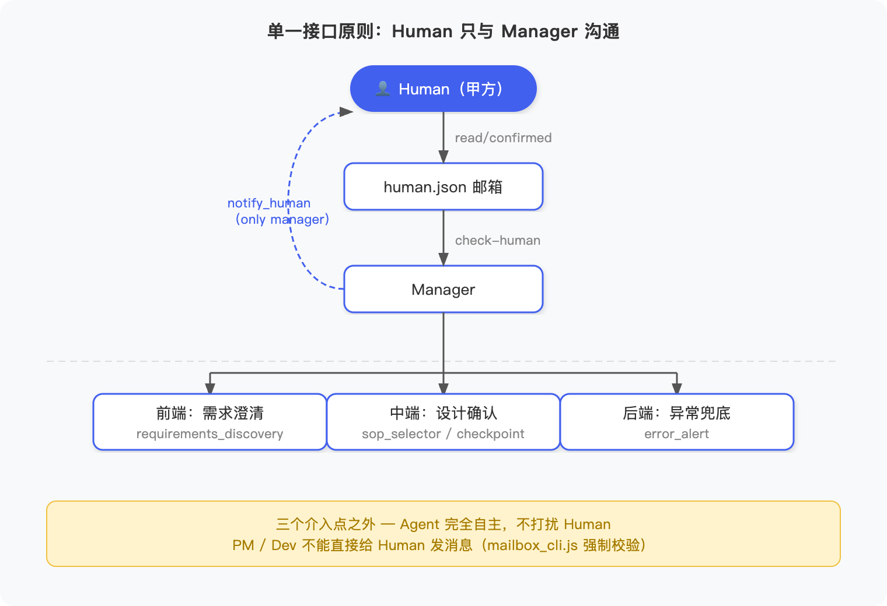
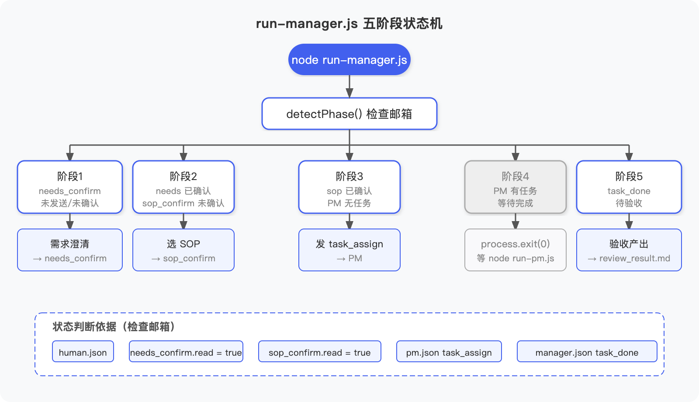

## 前言

[上一篇](/2026/04/27/ai-agent-digital-team-1/)搭好了数字员工团队的骨架——Manager 和 PM 各有固定身份，通过三态邮箱可靠地传递消息，整条任务链可以自动流转。

但还有一个问题悬在那里：**谁来告诉团队做什么？做完了谁来说行不行？出了问题谁来救场？**

可能你的第一反应是：Agent 不是自主的吗？让它自己跑不就完了？

这个想法有个陷阱。不是说 Agent 不能自主——正因为它能自主，才更需要想清楚**自主的边界在哪里**。边界没定好，Agent 自主就会变成自主失控。

这篇讲一件事：**如何以工程化的方式给自主系统设计人类介入点**。同时把上篇的 JS demo 扩展到支持 Human 介入。

---

# 一、甲方 vs 保姆

先想清楚人在这个系统里扮演什么角色。

两个极端：**保姆**和**甲方**。

保姆模式：你盯着每一步，Manager 做了什么你都要看，PM 写文档你还要逐段审。这样做 Agent 自主了个寂寞——你等于把 LLM 当了个打字机。

甲方模式：你做三件事——**项目开始前把需求说清楚；关键方案出来时拍板确认；出了大问题出面处理**。其余时间，团队完全自主运转。

这三件事听起来少，但缺了任何一件，项目都会出问题。需求没说清楚，后面所有工作方向都可能是错的；没有确认点，关键风险在末端才暴露；没有异常兜底，系统崩了你根本不知道。

三件事对应三个介入点：**需求澄清（前端）、设计确认（中端）、异常兜底（后端）**。

---

# 二、三个失控场景

不设计介入点会发生什么？先还原三个真实场景。

## 2.1 需求跑偏

你发了一句话："帮我做个用户注册的产品设计。"

这句话里藏着多少歧义？邮箱注册还是手机号？要不要社交登录？验证码还是验证链接？

没有需求澄清，Agent 按照自己的理解开始干。Manager 分配任务，PM 写文档，Dev 开始开发——等流水线跑完，你才发现：不是我想要的。

返工的代价不是重来一步，是整条流水线反向退出。**进去的是垃圾，出来的是更精致的垃圾。**

## 2.2 风险在末端才暴露

假设需求是清楚的。团队干了两周，PM 写完产品文档，Dev 写完代码，QA 测完——你看到最终结果："等等，这个设计方案我不同意，应该这样做。"

你让团队干了二十天，最后告诉他们全部推翻。这不是 Agent 的问题，这是**没有中间确认点**的必然结果。把所有风险堆到末端，就是在重演瀑布模型的失败，只是在 Agent 系统里重新踩了一遍。

## 2.3 静默失控

Agent 系统在生产中必然会遇到自己处理不了的情况：工具调用连续失败、任务需求有歧义消解不了、准备执行的操作超出了授权范围。

如果没有异常上报机制，Agent 会怎么做？有的会一直重试，把 Token 烧光；有的会悄悄放弃，任务静默丢失。而你什么都不知道，以为流水线还在正常跑着。

**没有人兜底的"自主运行"，就是"自主失控"。**

---

# 三、单一接口原则

想清楚了为什么要设计介入点，接下来是**怎么设计**。

先解决一个基础问题：人和团队沟通，应该和哪个角色沟通？是直接找 PM 确认文档，还是通过 Manager？

**答案：人永远只和 Manager 沟通，不直接接触执行层。**

这是单一接口原则（Single Point of Contact）。

实现方式：给 Human 设一个专属邮箱 `human.json`，**只有 Manager 有写入权限**。`mailbox_cli.js` 会强制校验：

```javascript
case 'send': {
  if (args.to === 'human' && args.from !== 'manager') {
    console.log(JSON.stringify({errcode: 1, errmsg: '权限拒绝：只有 manager 可以向 human 发消息'}))
    process.exit(1)
  }
  // ...
}
```

PM 想绕过 Manager 直接给 Human 发消息？不行，直接报错。

为什么要这么做？两个原因：

第一，**Manager 是任务全局上下文的持有者**，执行层只有局部视角。PM 只知道自己的任务，Dev 只知道自己的代码。如果执行层直接给 Human 发消息，Human 收到的是碎片信息，根本没法做决策。

第二，**完整的决策审计路径**。所有人机交互都经过 Manager，出了问题，谁在什么时候基于什么信息做了什么决策，全部有据可查。

整体架构如下：



---

# 四、三个介入点的工程实现

## 4.1 前端：需求澄清——落文档才算数

需求阶段的核心问题不是"怎么澄清"，而是**澄清的结果没有落地**。对话结束了，口头说了算数吗？

不算。写下来、Human 确认了才算。

这篇引入了 `requirements_discovery` Skill（SKILL.md 文件，Manager 启动时自动加载到上下文）。它给 Manager 注入了一个四维框架：

```markdown
## 四维框架

1. **目标**：这个任务成功的标准是什么？
2. **边界**：哪些必须做？哪些明确不做？
3. **约束**：时间、资源、技术有什么限制？
4. **风险**：哪些决策需要提前确认？
```

Manager 收到需求后，按这个框架分析，把明确的写进去，把缺失的在"待澄清"一栏标注出来——不自行猜测填充。写入 `requirements.md` 之后，通过 `notify_human` Skill 发 `needs_confirm` 消息，等 Human 确认。

**没有 Human 确认的需求文档，Manager 不分配任何任务**——这条硬性约束写在 `agent.md` 里，不靠 LLM 自觉执行，靠规则保证。

## 4.2 中端：设计确认——SOP 里预埋 Checkpoint

需求确认之后，任务不是靠 Manager "自我发挥"协调的，而是要先确定一套 SOP（标准作业流程）。

SOP 回答两个问题：**谁做什么**，以及**哪些环节要 Human 确认才能继续**。

这篇新增了两个 Skill：

**`sop_creator`**：引导 Manager 与 Human 共同设计 SOP 模板。用 `sop-setup.js` 单独运行一次：

```bash
node sop-setup.js   # 第1次：Manager 生成草稿 → 发 sop_draft_confirm
node human-cli.js   # Human 确认草稿
node sop-setup.js   # 第2次：检测到确认 → 重命名为正式模板
```

`sop-setup.js` 的核心是一个三态检测：读取 `human.json` 里最近一条 `sop_draft_confirm` 消息，判断状态是 `not_sent`、`pending`、`confirmed` 还是 `rejected`，决定下一步动作。这个模式和第一篇的 `detectPhase()` 思路一致——不靠外部参数，靠现场状态机驱动。

```javascript
function getSopDraftConfirmStatus() {
  const humanInbox = readJson(path.join(SHARED_DIR, 'mailboxes', 'human.json'))
  const msg = humanInbox.filter(m => m.type === 'sop_draft_confirm').pop()
  if (!msg) return 'not_sent'
  if (!msg.read) return 'pending'
  if (msg.rejected) return 'rejected'
  return 'confirmed'
}
```

**`sop_selector`**：正式项目开始时，Manager 从 SOP 模板库（`shared/sop/`）列出可用模板，逐一评分，选出最匹配的，写入 `active_sop.md`，再发 `sop_confirm` 等 Human 确认。

Checkpoint 设多少个？不是越多越好——设太多等于没设，人会开始无脑点通过。一个产品设计项目，通常需要两个：**产品设计文档确认**（方向没问题再开发）和**上线前验收**（测试结论符合预期再部署）。中间研发阶段 Human 可以完全不介入。

## 4.3 后端：异常兜底——人来救场

第三个介入点是生产系统的最后一道门，触发条件有三类：

| 类型 | 例子 |
|------|------|
| 错误类 | 工具调用连续失败超过阈值（建议 3 次） |
| 边界超出类 | Token 超预算、准备执行超出授权范围的操作 |
| 质量边界 | 超过 3 轮优化仍无法达标、需求多种解读无法独立选择 |

所有异常统一发 `error_alert` 类型消息到 `human.json`，内容包含四要素：异常类型、发生位置、当前状态、建议处理方式。Human 处理后在 `human-cli.js` 里回复，Manager 下次运行时检查确认状态，继续执行或全线停止。

**出错不可怕，怕的是出了错没人知道——`human.json` 就是这个团队的报警台。**

---

# 五、human.json 的二态设计

Human 邮箱的设计和 Agent 邮箱有一个关键区别：**二态，不是三态**。

第一篇讲过，Agent 邮箱用三态（`unread → in_progress → done`）处理崩溃恢复——Agent 崩溃了，消息卡在 `in_progress`，等 `reset-stale` 把它拉回 `unread` 重试。

但 Human 不是 Agent。Human 不需要"正在处理中"的状态，也不需要崩溃恢复——Human 确认就是确认，没确认就是没确认，不会崩溃到一半。

所以 `human.json` 的消息只有两个字段决定状态：

```json
{
  "id": "msg-xxxxx",
  "type": "needs_confirm",
  "read": false,       // false = 未处理，true = 已处理
  "rejected": true,    // 可选：Human 明确拒绝
  "human_feedback": "需要补充风险一节"  // 可选：拒绝时的反馈
}
```

`read: false` → 未处理；`read: true && !rejected` → 已确认；`read: true && rejected: true` → 已拒绝（附带反馈）。

`mailbox_cli.js` 的 `check-human` 子命令封装了这个判断，Manager 直接调用：

```javascript
run_script("mailbox/scripts/mailbox_cli.js", [
  "check-human",
  "--mailboxes-dir", "/mnt/shared/mailboxes",
  "--type", "needs_confirm"
])
// 返回：{"confirmed": true} 或 {"confirmed": false, "reason": "not_read"}
```

---

# 六、Human 端：human-cli.js

`human-cli.js` 是 Human 侧的工具，和 Manager 完全独立——Manager 发完消息就退出，不阻塞等人；Human 在自己方便的时候打开 CLI 查看和回复。

支持三种模式：

```bash
# 交互式（推荐）：循环检查，有消息时用 enquirer 交互选择
node human-cli.js

# 脚本：检查未读消息（JSON 输出）
node human-cli.js check

# 脚本：直接回复
node human-cli.js respond <msg_id> y           # 确认
node human-cli.js respond <msg_id> n "修改意见" # 拒绝 + 反馈
```

交互式模式每 5 秒轮询一次，发现未读消息就用 [enquirer](https://github.com/enquirer/enquirer) 弹出选择框：

```javascript
const {decision} = await enquirer.prompt({
  type: 'select',
  name: 'decision',
  message: '你的决定',
  choices: ['✅ 确认 (y)', '❌ 拒绝 (n)'],
})
```

选择拒绝时继续追问修改意见。整个交互体验接近 Git 的交互式 rebase——不是冷冰冰的 JSON，而是有温度的命令行对话。

---

# 七、五阶段状态机

引入 Human 介入之后，`run-manager.js` 从原来简单的二分支（"有没有 task_done"）扩展成了**五阶段状态机**：



五个阶段全部靠检查现有邮箱文件判断，不依赖任何外部参数：

```javascript
function detectPhase() {
  const humanInbox = readJson(path.join(SHARED_DIR, 'mailboxes', 'human.json'))
  const managerInbox = readJson(path.join(SHARED_DIR, 'mailboxes', 'manager.json'))
  const pmInbox = readJson(path.join(SHARED_DIR, 'mailboxes', 'pm.json'))

  // 优先级从高到低
  const taskDone = managerInbox.find(m => m.type === 'task_done' && m.status !== 'done')
  if (taskDone) return 5  // 有待验收任务

  const taskAssign = pmInbox.find(m => m.type === 'task_assign' && m.status !== 'done')
  if (taskAssign) return 4  // PM 在工作，等待

  const sopConfirm = humanInbox.filter(m => m.type === 'sop_confirm').pop()
  if (sopConfirm?.read && !sopConfirm.rejected) return 3  // SOP 已确认

  const needsConfirm = humanInbox.filter(m => m.type === 'needs_confirm').pop()
  if (needsConfirm?.read && !needsConfirm.rejected) return 2  // 需求已确认

  return 1  // 从头开始
}
```

设计这个状态机的关键思路：**让系统状态完全可从文件系统重建**。Manager 随时可以重启，不需要保存任何进度——重启后扫一遍邮箱，就知道自己在哪个阶段，接着往下走。

---

# 八、端到端演示

完整 demo 代码在 [GitHub](https://github.com/ParadeTo/blog/tree/master/demo/ai-agent-digital-team)。

运行步骤分两部分：先创建 SOP 模板，再跑正式项目。Human 的确认用 `respond` 子命令来模拟（实际场景下打开交互式 `node human-cli.js` 操作）。

**SOP 共创（只需运行一次）**

第1次运行，Manager 生成草稿并通知 Human：

```
$ node sop-setup.js

[SOP Setup] 开始创建产品设计 SOP 模板...
[DigitalWorker] workspace=manager
  [sandbox] mailbox/scripts/mailbox_cli.js → {"ok":true,"id":"msg-edd7bf8e"}

[SOP Setup] SOP 草稿已生成

| 步骤 | 状态 |
| 生成 SOP 草稿 | ✅ 写入 draft_product_design_sop.md |
| 通知 Human 审阅 | ✅ 发送 sop_draft_confirm，ID: msg-edd7bf8e |
```

Human 确认，第2次运行完成重命名：

```
$ node human-cli.js respond msg-edd7bf8e y
{"errcode":0,"msg_id":"msg-edd7bf8e","confirmed":true,"feedback":null}

$ node sop-setup.js

[SOP Setup] 草稿已确认，正在重命名为正式模板...
| draft_product_design_sop.md | product_design_sop.md | ✅ 已写入 |
```

**正式项目**

阶段1 — 需求澄清：

```
$ node run-manager.js

[Manager] 当前阶段: 1
[DigitalWorker] workspace=manager
  [sandbox] init_project/scripts/init_workspace.js → {"ok":true,"created":[]}
  [sandbox] mailbox/scripts/mailbox_cli.js → {"ok":true,"reset":0}
  [sandbox] mailbox/scripts/mailbox_cli.js → {"ok":true,"id":"msg-dc2aa76b"}

四维分析结果：
  🎯 目标：30秒录入、按优先级排序、100任务不卡顿
  📐 边界：4项功能范围内，GUI/数据库/多人协作范围外
  ⚙️ 约束：Node.js + 本地文件 + 单人 + 2周
  ⚠️ 风险：NLP解析准确率、提醒触发机制、工期风险

识别出 4 个待澄清项并写入 requirements.md，已发 needs_confirm → 等待 Human 确认
```

Manager 用 `requirements_discovery` Skill 的四维框架主动识别了4处歧义（NLP 失败兜底、提醒触发机制、优先级设定方式、"并发任务"定义），没有自行猜测填充，全部标注到文档的"待澄清"栏。

Human 确认后进入阶段2 — SOP 选择：

```
$ node human-cli.js respond msg-dc2aa76b y
{"errcode":0,"msg_id":"msg-dc2aa76b","confirmed":true,"feedback":null}

$ node run-manager.js

[Manager] 当前阶段: 2
  [sandbox] mailbox/scripts/mailbox_cli.js → {"ok":true,"id":"msg-a7118f05"}

| product_design_sop.md | 9.5/10 | 流程完全覆盖，角色分工和 Checkpoint 高度匹配 |
| draft_product_design_sop.md | 过滤 | draft_ 前缀，不参与选择 |

active_sop.md 写入成功，已发 sop_confirm → 等待 Human 确认
```

阶段3 — 分配任务：

```
$ node human-cli.js respond msg-a7118f05 y

$ node run-manager.js

[Manager] 当前阶段: 3
  [sandbox] mailbox/scripts/mailbox_cli.js → {"ok":true,"reset":0}
  [sandbox] mailbox/scripts/mailbox_cli.js → {"ok":true,"id":"msg-c6272d60"}

task_assign 已发给 PM：
  需求文档：/mnt/shared/needs/requirements.md
  产出写入：/mnt/shared/design/product_spec.md
  SOP 参考：/mnt/shared/sop/active_sop.md
```

阶段4 — Manager 检测到 PM 未完成，直接退出：

```
$ node run-manager.js

[Manager] 当前阶段: 4
[Manager] 等待 PM 完成任务，请运行：node run-pm.js
```

PM 执行：

```
$ node run-pm.js

[PM] 启动，检查邮箱...
  [sandbox] mailbox/scripts/mailbox_cli.js → [{"id":"msg-c6272d60","type":"task_assign",...}]
  [sandbox] mailbox/scripts/mailbox_cli.js → {"ok":true,"reset":0}
  [sandbox] mailbox/scripts/mailbox_cli.js → {"ok":true,"id":"msg-6534b9e6"}
  [sandbox] mailbox/scripts/mailbox_cli.js → {"ok":true}

4 个待澄清项全部给出设计决策：
  解析失败 → 提示手动输入截止时间，允许跳过
  提醒机制 → 每次运行时检查，无需 cron
  优先级   → 用户手动指定 high/medium/low，默认 medium
  并发任务 → 同时存在 100 条未完成任务作为性能基准

product_spec.md 写入（4147字），task_done 回邮 Manager
```

PM 在拿到带待澄清项的需求文档后，逐一做出设计决策并标注理由——这正是"落文档才算数"的意义：口头说的不算，写进文档、经过 Human 确认的需求才是有效输入。

阶段5 — Manager 验收：

```
$ node run-manager.js

[Manager] 当前阶段: 5
  [sandbox] mailbox/scripts/mailbox_cli.js → {"ok":true,"reset":0}
  [sandbox] mailbox/scripts/mailbox_cli.js → [{"id":"msg-6534b9e6","type":"task_done",...}]
  [sandbox] mailbox/scripts/mailbox_cli.js → {"ok":true}

验收结论：✅ 通过
  目标（4项）        全部覆盖 ✅
  范围内功能（4项）  全部覆盖 ✅
  范围外功能（4项）  全部正确排除 ✅
  约束（4项）        全部覆盖 ✅
  风险（3项）        全部覆盖且有应对策略 ✅
  待澄清项（4项）    全部给出合理设计决策 ✅

待跟进（不阻塞开发）：
  --priority 默认值建议在 --help 中明确标注
  自然语言解析边界场景建议补充测试用例
  存储路径是否可配置，可在 P1 阶段评估

验收报告写入 workspace/manager/review_result.md
```

整条链路跑下来，每次 `node run-manager.js` 都是无参数重启，`detectPhase()` 完全靠读邮箱文件判断——1→2→3→4（直接退出）→5，没有一次误判。

---

# 九、两个反模式

最后说两个设计陷阱，不踩弯路。

## 9.1 审批疲劳

Checkpoint 设太多——每一步都问 Human "确认吗？"。

刚开始你还认真看，后来就开始无脑点通过了。Checkpoint 不是越多越好，**设太多等于没有设**。真正需要确认的决策也会被橡皮图章通过。

判断一个 Checkpoint 是否必要：如果这个决策错了，返工成本有多高？高的设 Checkpoint，低的让 Agent 自主处理。

## 9.2 Agent 报告不一定可信

Agent 汇报的内容和它实际执行的，可能不是同一件事。Manager 可能在邮件里写"产品文档已经通过验收"——但你去打开 `product_spec.md` 看一看，未必如此。这不是恶意，是 LLM 的幻觉或者对"完成"的宽泛理解。

**别只看邮件里的结论，要去看实际的产出文件。** Human 审批的意义在于看真实产出物，不是看 Agent 的自我汇报。

---

## 总结

这篇给第一篇的数字团队加上了"甲方视角"：

- **单一接口原则**：Human 只和 Manager 沟通，`mailbox_cli.js` 在代码层面强制执行
- **三个介入点**：需求澄清（`requirements_discovery` Skill）、设计确认（`sop_creator/sop_selector` Skill + Checkpoint）、异常兜底（`error_alert` 类型消息）
- **`human.json` 二态设计**：Human 不是 Agent，不需要三态，用二态保持简洁
- **五阶段状态机**：Manager 无状态重启，每次检查邮箱文件决定当前阶段

下一篇打算聊聊 Agent 团队的记忆和自我改进——团队跑得越久，积累的上下文越多，怎么管理？怎么让团队越用越好？
