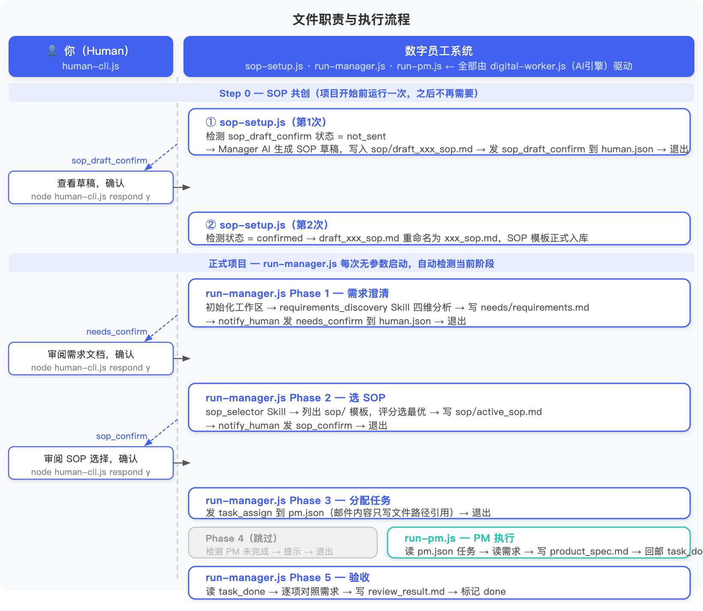

## 前言

[上一篇](/2026/04/27/ai-agent-digital-team-1/)搭好了数字员工团队的骨架——Manager 和 PM 各有固定身份，通过三态邮箱可靠地传递消息，整条任务链可以自动流转。

但还有一个问题没解决：**谁告诉团队做什么？做完了谁来拍板？出了问题谁来救场？**

这篇在上一篇的 demo 基础上扩展 Human 介入机制，回答这三个问题。

---

# 一、Human 当甲方，不当保姆

两个极端：**保姆**和**甲方**。

保姆盯着每一步——Manager 做了什么都要过目，PM 写文档要逐段审。这样 Agent 自主了个寂寞。

甲方只做三件事：**项目开始前把需求说清楚；关键方案出来时拍板确认；出了大问题出面处理**。其余时间团队完全自主。

这三件事缺了哪一件，项目都会出问题。需求没说清楚，后面所有工作方向可能都是错的；没有确认点，关键风险在末端才暴露；没有异常兜底，系统崩了你根本不知道。

三件事对应三个介入点：**需求澄清（前端）、设计确认（中端）、异常兜底（后端）**。

---

# 二、三个失控场景

不设计介入点，会发生什么？

**场景一：需求跑偏。** 你发了一句："帮我做个用户注册的产品设计。"听起来很清楚——但对 Agent 来说，歧义在哪里？邮箱还是手机号注册？要不要社交登录？验证码还是验证链接？

没有需求澄清，Agent 按自己的理解开始干，Manager 分任务，PM 写文档，Dev 开始开发——等流水线跑完，你才发现不是你想要的。返工的代价不是重来一步，是整条流水线反向退出。**进去的是垃圾，出来的是更精致的垃圾。**

**场景二：风险堆到末端。** 假设需求是清楚的，团队干了两周，PM 写完文档，Dev 写完代码，QA 测完——你看到最终结果："这个设计方案我不同意。"

让团队干了二十天再否定。这不是 Agent 的问题，是没有中间确认点的必然结果。把所有风险堆到末端，就是在重演瀑布模型的失败，只不过换成 Agent 系统重新踩了一遍。

**场景三：静默失控。** 工具调用连续失败、任务需求有歧义消解不了、准备执行的操作超出了授权范围。如果没有异常上报机制，Agent 会怎么做？有的会一直重试，把 Token 烧光；有的会悄悄放弃，任务静默丢失。你什么都不知道，以为流水线还在正常跑着。

**没有人兜底的系统"自主运行"，失控了你也不会知道。**

---

# 三、先看全图

清楚了为什么要设计介入点，再来看看整条流程是怎么跑的。



这篇在上一篇的基础上新增了三个角色工具：

| 工具 | 作用 |
|------|------|
| SOP 共创脚本 | 项目开始前运行一次——Manager AI 和 Human 一起制定工作流程模板（SOP） |
| Manager 主脚本 | 每次启动自动判断现在到哪个阶段了，执行完退出 |
| Human 操作工具 | 查看 Manager 发来的消息，确认或拒绝 |

整条流程分两段。

在看流程之前，先说清楚这套系统的运行方式——否则后面的流程图很容易让人困惑。

这不是一个一直跑着的进程。整条链路由几个独立脚本组成，每个脚本只做一件事，做完就退出。脚本之间不直接调用，靠 JSON 文件传消息：Manager 把消息写进 `human.json`，Human 用工具查看、回复，下次有人启动脚本时再读文件判断"现在到哪步了"。说白了，**系统的状态全存在文件里，不在进程里**。

这也意味着整条链路目前需要 Human 手动推进——每个阶段完成后，需要 Human 手动运行下一个命令，没有后台调度器自动触发。这是为了让 demo 跑起来更简单，不依赖任何常驻服务。在真实项目里，调度这一层完全可以自动化，脚本的逻辑不用变，只是把"Human 手动启动"换成定时任务或事件触发就行了。

**第一段：SOP 共创（只做一次）**

正式开始项目之前，Human 和 Manager 先制定一套 SOP——约定好角色分工、关键交付物、哪些环节需要 Human 拍板才能继续。SOP 确认后入库，后续每个项目直接复用，不用重复制定。

**第二段：正式项目（每次新项目走一遍，共五个阶段）**

- **阶段一：需求澄清。** Human 提出需求，Manager 分析其中的歧义和不确定项，整理成清单等 Human 确认——不猜测，不自行填补。
- **阶段二：选 SOP。** 需求确认后，Manager 从模板库里匹配最合适的 SOP，等 Human 确认要用哪套流程。
- **阶段三：分配任务。** SOP 确认后，Manager 按流程把任务派给 PM。
- **阶段四：等待 PM。** PM 还没完成时，Manager 不等待，直接退出并提示 Human 去启动 PM——Human 运行 PM 脚本，PM 完成后回邮通知 Manager。
- **阶段五：验收。** PM 完成后通知 Manager，Manager 对照需求逐项验收，出具结论。

---

# 四、工程实现

## 运行记录

完整 demo 代码在 [GitHub](https://github.com/ParadeTo/blog/tree/master/demo/ai-agent-digital-team)，下面是实际跑通的完整过程。

---

**[SOP 共创 - 第1次] Human 启动 sop-setup.js**

Manager AI 判断还没有 SOP，自动生成一份草稿，通知 Human，退出。

```
$ node sop-setup.js

[Manager] 当前状态: not_sent
  [sandbox] mailbox_cli.js → {"ok":true,"id":"msg-edd7bf8e"}
```

**[Human] 查看草稿，确认**

```
$ node human-cli.js list
$ node human-cli.js respond msg-edd7bf8e y
```

**[SOP 共创 - 第2次] Human 再次启动 sop-setup.js**

检测到已确认，把草稿重命名为正式模板入库，SOP 共创完成。

```
$ node sop-setup.js

→ draft_product_design_sop.md 重命名为 product_design_sop.md，SOP 入库
```

---

**[Phase 1] Human 提出需求，启动 run-manager.js**

Manager 用四维框架分析需求，把歧义项整理出来，等 Human 确认，退出。

```
$ node run-manager.js

[Manager] 当前阶段: 1
识别出 4 个待澄清项：
  - NLP 解析失败的兜底方案（手动输入 or 跳过？）
  - 提醒触发机制（每次运行检查 or 后台 cron？）
  - 优先级设定（手动指定 or 系统自动计算？）
  - "并发任务"的准确含义（100条同时存在？）
→ 写入 requirements.md，发 needs_confirm，退出
```

**[Human] 确认需求**

```
$ node human-cli.js respond msg-dc2aa76b y
```

**[Phase 2] Human 启动 run-manager.js**

从模板库评分选 SOP，草稿文件被过滤，正式模板入选，等 Human 确认，退出。

```
$ node run-manager.js

[Manager] 当前阶段: 2
| product_design_sop.md       | 9.5/10 | 流程完全匹配，角色分工清晰 |
| draft_product_design_sop.md | 过滤   | draft_ 前缀不参与选择     |
→ 写入 active_sop.md，发 sop_confirm，退出
```

**[Human] 确认 SOP**

```
$ node human-cli.js respond msg-sop-xxx y
```

**[Phase 3] Human 启动 run-manager.js**

SOP 已确认，给 PM 分配任务，退出。

```
$ node run-manager.js

[Manager] 当前阶段: 3
  [sandbox] mailbox_cli.js → {"ok":true,"id":"msg-task-assign"}
→ 已分配任务给 PM，退出
```

**[Phase 4] Human 启动 run-manager.js（PM 还没完成）**

PM 任务还在进行中，Manager 不等待，直接打印提示退出。

```
$ node run-manager.js

[Manager] 当前阶段: 4
[Manager] 等待 PM 完成任务，请运行：node run-pm.js
```

**[Human] 启动 run-pm.js**

PM 拿到需求文档，对4个待澄清项逐一决策，写入产品规格文档，回邮通知 Manager。

```
$ node run-pm.js

4 个待澄清项全部决策：
  解析失败 → 提示手动输入，允许跳过
  提醒机制 → 每次运行时检查，无需 cron
  优先级   → 手动指定 high/medium/low，默认 medium
  并发任务 → 同时存在 100 条未完成任务作为性能基准
→ 写入 product_spec.md（4147字），回邮 task_done
```

**[Phase 5] Human 最后启动 run-manager.js**

Manager 收到 task_done，逐项验收，通过，附跟进建议，写入结论文件。

```
$ node run-manager.js

[Manager] 当前阶段: 5
验收结论：✅ 通过（目标/范围/约束/风险/待澄清项全部覆盖）
待跟进：--priority 默认值建议在 --help 标注 / 边界场景补测试用例 / 存储路径是否可配置
→ 写入 review_result.md
```

整条链路，Human 共手动触发了 8 次命令，`detectPhase()` 五次判断全部正确。

---

## 4.1 单一接口原则

流程跑通了，再来看几个关键的工程设计决策。第一个问题：Human 应该和哪个角色沟通？是直接找 PM 确认文档，还是通过 Manager？

**Human 永远只和 Manager 沟通，不直接接触执行层。**

实现：给 Human 设一个专属邮箱 `human.json`，**只有 Manager 有写入权限**。`mailbox_cli.js` 强制校验：

```javascript
case 'send': {
  if (args.to === 'human' && args.from !== 'manager') {
    console.log(JSON.stringify({errcode: 1, errmsg: '权限拒绝：只有 manager 可以向 human 发消息'}))
    process.exit(1)
  }
  // ...
}
```

PM 想绕过 Manager 直接联系 Human？直接报错。这条约束不靠 Agent 自觉，靠代码保证。

为什么要这么做？Manager 是任务全局上下文的持有者，执行层只有局部视角。如果 PM 直接给 Human 发消息，Human 收到的是碎片信息，根本没法做决策。而且所有人机交互都经过 Manager，出了问题，谁在什么时候基于什么信息做了什么决策，全部有据可查。

## 4.2 human.json 的二态设计

`human.json` 的消息状态和 Agent 邮箱不同——**二态，不是三态**。

第一篇讲过，Agent 邮箱用三态（`unread → in_progress → done`）处理崩溃恢复。Human 不是 Agent，不需要"正在处理中"的状态，也不会崩溃到一半。所以 `human.json` 用两个字段决定状态：

```json
{
  "id": "msg-dc2aa76b",
  "type": "needs_confirm",
  "read": false,
  "rejected": true,
  "human_feedback": "需要补充风险一节"
}
```

`read: false` → 未处理；`read: true && !rejected` → 已确认；`read: true && rejected: true` → 已拒绝（附带反馈）。

`mailbox_cli.js` 新增了 `check-human` 子命令封装这个判断，Manager 直接调用：

```javascript
run_script("mailbox/scripts/mailbox_cli.js", [
  "check-human",
  "--mailboxes-dir", "/mnt/shared/mailboxes",
  "--type", "needs_confirm"
])
// 返回：{"confirmed": true} 或 {"confirmed": false, "reason": "not_read"}
```

## 4.3 前端介入：需求澄清（requirements_discovery Skill）

需求阶段的核心问题不是"怎么澄清"，而是**澄清的结果没有落地**。口头说了不算，写下来、Human 确认了才算。

Manager 的 `workspace/skills/` 目录里新增了 `requirements_discovery/SKILL.md`。`digital-worker.js` 启动时会自动扫描 skills 目录，把所有 SKILL.md 文件内容注入 system prompt——Manager 看到这个 Skill 后，收到新需求时会按**四维框架**分析：目标、边界、约束、风险，缺失的标注到"待澄清"一栏，不自行猜测填充。

分析结果写入 `needs/requirements.md`，然后通过 `notify_human` Skill 发 `needs_confirm` 消息。**没有 Human 确认的需求文档，Manager 不分配任何任务**——这条硬性约束写在 `agent.md` 里，不靠 LLM 自觉，靠规则保证。

## 4.4 中端介入：SOP 共创（sop-setup.js）

需求确认之后，任务不是靠 Manager 自我发挥协调的，而是要先确定一套 SOP（标准作业流程）。SOP 回答两个问题：**谁做什么**，以及**哪些环节要 Human 确认才能继续**。

SOP 模板由 `sop-setup.js` 在项目开始前共创：

```javascript
function getSopDraftConfirmStatus() {
  const humanInbox = readJson(path.join(SHARED_DIR, 'mailboxes', 'human.json'))
  const msg = humanInbox.filter(m => m.type === 'sop_draft_confirm').pop()
  if (!msg) return 'not_sent'
  if (!msg.read) return 'pending'
  if (msg.rejected) return 'rejected'
  return 'confirmed'
}
```

每次启动 `sop-setup.js`，它读 `human.json` 的状态决定下一步：

- `not_sent` → 调 Manager AI，用 `sop_creator` Skill 生成草稿写入 `sop/` 目录，再用 `notify_human` Skill 发 `sop_draft_confirm` 消息，退出
- `pending` → 草稿已发出，打印"等待 Human 确认"，退出
- `rejected` → Human 拒绝了草稿（附带反馈），调 Manager AI 读取拒绝原因重新生成一版，退出
- `confirmed` → 调 Manager AI，让 AI 用 `listDir/readFile/writeFile` 把所有 `draft_xxx.md` 重命名为 `xxx.md`，入库完成

`confirmed` 状态下的重命名没有直接用 `fs.rename`，而是交给 Manager AI 来做——AI 先列出 `sop/` 目录的文件，找到 `draft_` 前缀的，读取内容再写入新文件名。这样所有文件操作都走 Agent 的 sandbox 工具，和其他阶段保持一致，方便审计。

模板入库之后，每次正式项目运行时，`sop_selector` Skill 从模板库里评分选最优，写入 `active_sop.md`，再发 `sop_confirm` 等 Human 确认。

Checkpoint 设多少个合适？不是越多越好——设太多等于没设，人会开始无脑点通过。判断标准：如果这个决策错了，返工成本有多高？高的设 Checkpoint，低的让 Agent 自主处理。

## 4.5 后端介入：异常兜底（error_alert）

第三个介入点是生产系统的最后一道门，触发条件有三类：工具调用连续失败、任务执行超出授权范围、质量超过 3 轮迭代仍无法达标。

所有异常统一发 `error_alert` 类型消息到 `human.json`，内容包含：异常类型、发生位置、当前状态、建议处理方式。Human 处理后在 `human-cli.js` 里回复，Manager 下次运行时继续执行。

出错不可怕。怕的是出了错你什么都不知道，以为流水线还在正常跑着。`human.json` 就是这个团队的报警台，有什么问题都先往这里发。

## 4.6 五阶段状态机（run-manager.js）

引入 Human 介入之后，`run-manager.js` 从原来的二分支（"有没有 task_done"）扩展成了五阶段状态机：

```javascript
function detectPhase() {
  const humanInbox = readJson(path.join(SHARED_DIR, 'mailboxes', 'human.json'))
  const managerInbox = readJson(path.join(SHARED_DIR, 'mailboxes', 'manager.json'))
  const pmInbox = readJson(path.join(SHARED_DIR, 'mailboxes', 'pm.json'))

  const taskDone = managerInbox.find(m => m.type === 'task_done' && m.status !== 'done')
  if (taskDone) return 5  // 有待验收任务

  const taskAssign = pmInbox.find(m => m.type === 'task_assign' && m.status !== 'done')
  if (taskAssign) return 4  // PM 在工作，等待

  const sopConfirm = humanInbox.filter(m => m.type === 'sop_confirm').pop()
  if (sopConfirm?.read && !sopConfirm.rejected) return 3  // SOP 已确认

  const needsConfirm = humanInbox.filter(m => m.type === 'needs_confirm').pop()
  if (needsConfirm?.read && !needsConfirm.rejected) return 2  // 需求已确认

  return 1  // 从头开始
}
```

五个阶段全部靠检查现有邮箱文件判断，不依赖任何外部参数。关键设计思路：**让系统状态完全可从文件系统重建**——Manager 随时可以重启，不需要保存任何进度，重启后扫一遍邮箱就知道在哪个阶段。

---

# 五、两个反模式

最后说两个设计陷阱。

**审批疲劳：** Checkpoint 设太多，每一步都问"确认吗？"刚开始你还认真看，后来就无脑点通过了。设太多等于没设——真正需要确认的决策也会被橡皮图章通过。

**只看 Agent 的汇报：** Agent 汇报的内容和它实际执行的，可能不是同一件事。Manager 可能在邮件里写"产品文档已通过验收"——但你去打开 `product_spec.md` 看一看，未必如此。这不是恶意，是 LLM 的幻觉。别只看邮件结论，要去看实际产出文件。

---

# 总结

这篇给第一篇的数字团队加上了"甲方视角"。

Human 只和 Manager 沟通，`mailbox_cli.js` 在代码层强制执行这条约束，不靠 Agent 自觉。三个介入点——需求澄清、设计确认、异常兜底——对应甲方最需要管的三件事。`human.json` 用二态而非三态，因为 Human 不是 Agent，不需要崩溃恢复。Manager 无状态重启，靠扫描邮箱文件还原进度，随时可以中断再续。

下一篇打算聊聊 Agent 团队的记忆和自我改进——团队跑得越久，积累的上下文越多，怎么管理？怎么让团队越用越好？
