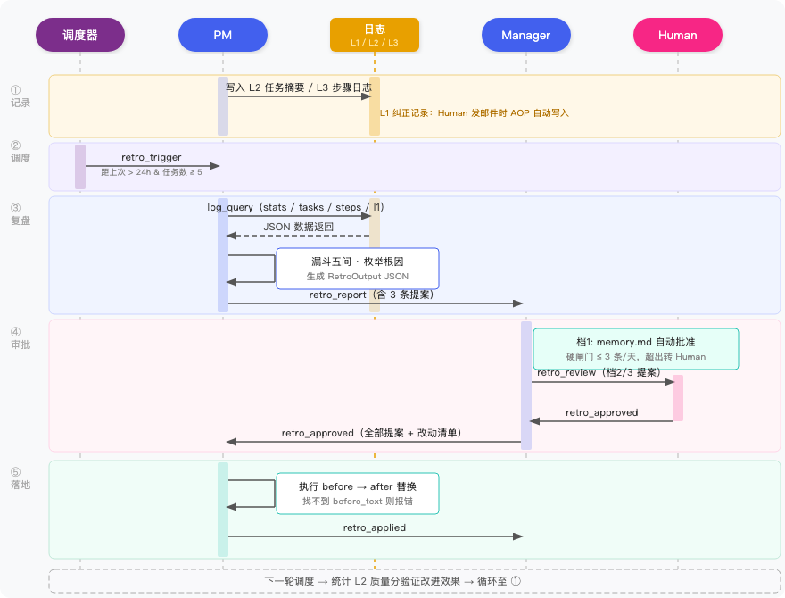

# 前言

前两篇搭完之后，团队能跑了——Manager 收需求、PM 做设计、Human 在三个关键节点把关。看起来挺完整的。

但有一件事没解决：这套系统不会变好。

PM 第一周忘了检查移动端适配，Human 退回了设计文档，留了反馈。第八周，同样的任务，PM 又忘了。那条反馈从没被写进 SOP——Human 的纠正消失在上下文窗口里，跑完这轮就没了。上下文窗口刷新，经验归零。

不止这一种。某个 API 接好了，但对应 Skill 没更新，PM 还在走三步绕路的旧流程；PM 和 Manager 之间的交接文档格式从来没对齐，验收时总有歧义，看起来是 PM 的问题，但换个 PM 也会发生——根因是协作接口设计，不是执行者。这两类问题不产生退回记录，更不容易被发现。

这篇把自我进化加进来：**记录 → 复盘 → 提案 → 落地 → 验证**，五步闭环，让系统在运行中学习，越跑越好。

---

# 一、三层日志：复盘的原料

复盘要有原料。原料是运行日志，但不是把所有日志堆在一起——三层，各自负责不同的问题。


| 层级 | 记录什么 | 生命周期 | 核心用途 |
|------|---------|---------|---------|
| L1 人类交互层 | 每次 Human 纠正 | 永久保留 | 黄金数据——判断偏差的最直接信号 |
| L2 任务摘要层 | 每个任务一条摘要（含质量分） | 保留 90 天 | 定位"哪些任务做得差" |
| L3 ReAct 步骤层 | Agent 内部每步推理 | 滚动 30 天 | 定位"差在哪一步" |

**三层里最值钱的是 L1。** Agent 自己觉得任务完成得挺好——质量 0.85，没有报错。但 Human 说"不对，移动端方案呢"——这条纠正比 Agent 自己做的 10 次分析都有价值。L1 不是 Agent 的自评，是人类给出的 ground truth。

**为什么不合并成一层？** 三层的生命周期完全不同。L1 稀缺宝贵，每条都可能揭示一个系统性问题，永久保留。L3 量最大，一个月前的单步推理对今天的复盘毫无用处。合并就意味着要给它们设同一个保留策略——要么永久保留一堆废数据，要么删掉本来不该删的 L1。

## 1.1 L1 的 AOP 写入

L1 写入有一个关键的设计点：调用方零感知。

以前的代码里，Agent 发邮件靠 `mailbox_cli.js` 里的 `send` 子命令。第三篇只改了这一个地方：当发件人是 `human` 时，自动写一条 L1 日志。

```javascript
// workspace/{role}/skills/mailbox/scripts/mailbox_cli.js
function _writeL1Log(mailboxesDir, msg) {
  try {
    const logsDir = path.join(path.dirname(mailboxesDir), 'logs', 'l1_human')
    fs.mkdirSync(logsDir, {recursive: true})
    const record = {
      id: msg.id, from: msg.from, to: msg.to, type: msg.type,
      subject: msg.subject, content: msg.content, timestamp: msg.timestamp
    }
    fs.writeFileSync(path.join(logsDir, `${msg.id}.json`), JSON.stringify(record, null, 2))
  } catch {}
}

// send() 函数里，Human 发出的消息写 L1：
if (from === 'human') { _writeL1Log(mailboxesDir, msg) }
```

Agent 调用 `send` 时什么都不用改，L1 日志自动落地。这就是 AOP（面向切面编程）的思路：在执行路径的横截面加逻辑，不侵入调用方。

一条 L1 纠正记录长这样：

```json
{
  "id": "msg-l1-001",
  "from": "human",
  "to": "pm",
  "type": "checkpoint_rejected",
  "subject": "设计文档退回",
  "content": "移动端适配方案缺失，请补充桌面端和移动端的差异化设计",
  "timestamp": "2026-04-30T11:00:00Z"
}
```

## 1.2 L2 的结构

L2 是每个任务完成后写的摘要，文件名格式 `{agent_id}_{task_id}.json`：

```json
{
  "agent_id": "pm",
  "task_id": "t001",
  "task_desc": "用户登录功能产品设计文档",
  "result_quality": 0.40,
  "duration_sec": 180,
  "error_type": "checkpoint_rejected",
  "timestamp": "2026-04-30T10:00:00Z"
}
```

`result_quality` 是 0-1 的质量分，由 Manager 验收后写入。`error_type` 是枚举值——`checkpoint_rejected` 表示被 Human 退回，`timeout` 表示超时，`tool_error` 表示工具调用失败。有了这两个字段，复盘时不用下钻到 L3 就能快速过滤出问题任务。

写入时机在 `run-manager.js` 的 phase 5（验收）结束后：拿到 LLM 输出，检测是否包含"不通过/退回/reject"等关键词，通过则 quality=0.85，退回则 quality=0.4，然后把任务摘要写进 `l2_task/`。

## 1.3 L3 的复用

L3 不需要另建——复用[第一篇](/2026/04/27/ai-agent-digital-team-1/)的 session 日志格式（`*_raw.jsonl` + `index.jsonl`），只加了 `task_id` 字段，让复盘时能按任务切片回放。

`index.jsonl` 记录每个任务对应的行范围：

```json
{"session_id": "ses-001", "task_id": "t001", "start_line": 0, "end_line": 18, "timestamp": "2026-04-30T10:00:00Z"}
```

`ses-001_raw.jsonl` 里是逐步的 ReAct 执行记录：

```jsonl
{"type": "think", "content": "收到任务：生成用户登录功能设计文档", "step": 1, "task_id": "t001"}
{"type": "action", "tool": "read_file", "input": "requirements.md", "step": 2, "task_id": "t001"}
{"type": "observation", "content": "需求：支持邮箱和手机号登录，需记住登录态", "step": 3, "task_id": "t001"}
{"type": "action", "tool": "write_file", "input": "product_design.md", "step": 4, "task_id": "t001"}
```

注意这里直接从"读需求"跳到了"写文档"——没有"检查移动端"这一步。复盘时 `steps --task-id t001` 就是回放这段记录，根因一眼看出来。

---

# 二、复盘方法论：从"出了问题"到"改哪一行"

有了日志，下一步是怎么看。这里有个陷阱叫**复述式反思**，不绕过去，复盘就是走过场。

## 2.1 复述式反思

给 Agent 一段任务失败的日志，让它"总结一下哪里做得不好"，它很可能输出：

> 下次生成设计文档时，需要注意覆盖移动端适配。

听起来很像分析，其实是把失败过程重新描述了一遍——这叫**复述式反思**，根因一句没提到。

办法也直接：逼 Agent 从枚举里选根因，不给自由发挥的空间。

## 2.2 漏斗五问

有效复盘的路径是一个漏斗——从上千条日志里，一层一层收窄到精确的文件改动位置。

| 问题 | 数据源 | 收窄到 |
|------|-------|-------|
| ① 哪些任务做得差？ | L2 定量 | 最差的 N 条任务 |
| ② 差在哪一步？ | L3 下钻 | 具体失败的 ReAct 步骤 |
| ③ 人类怎么看？ | L1 交叉验证 | 人类纠正记录 |
| ④ 根因是什么类型？ | 枚举分类 | 4 种根因之一 |
| ⑤ 改哪个文件的哪一段？ | 精确锚点 | `before_text` / `after_text` |

大多数复盘死在第 ④ 步。知道"出了问题"，不知道"根因是什么类型"，就没法确定"改哪个文件"。

## 2.3 root_cause 枚举

思路是以终为始：先想清楚能改什么，再反推根因类型。

| 枚举值 | 含义 | 改动对象 |
|-------|------|---------|
| `sop_gap` | 流程缺步骤 | `skills/*.md` |
| `prompt_ambiguity` | 指令模糊 | `soul.md` |
| `ability_gap` | 经验不足 | `memory.md` |
| `integration_issue` | 协作接口问题 | `agent.md` 协作部分 |

Agent 一旦完成归因，立刻知道要改哪个文件——路径确定，不需要再做一轮推理。

---

# 三、自我复盘实战

PM 走一遍完整的复盘链路如下所示：



下面挑几个重点讲解一下：

## 3.1 Skill vs Script

复盘用的 `self_retrospective/SKILL.md` 不是操作手册——最直接的替代方案是写一个脚本（Script）：先跑 stats，再过滤低质量任务，再查 L3，最后生成报告，顺序固定。但 SKILL.md 不这样，它不规定"先查什么再查什么"，只给 Agent 提供思考框架：

> 你现在要做一次自我复盘。用以下五个递进问题引导分析，但顺序可以根据实际情况调整。目标是产出一份 RetroOutput JSON，包含发现和具体改进提案。

Skill 只给约束，不规定顺序。如果 L1 纠正记录很突出，先看 L1 更高效；如果 L2 质量分很均匀，先做 stats 全局扫描。让 Agent 自己判断从哪里切入，不是偷懒，是它在这件事上比固定脚本好使。

## 3.2 log-query CLI

日志查询走一个统一的 CLI（`stats` / `tasks` / `steps` / `l1` / `all-agents`），Agent 通过 `run_script` 调用，输出纯 JSON。

设计原则只有一条：CLI 只查数据，不判断，不推荐。"三条最差都是设计文档类"是 Agent 自己看出来的，不是 CLI 告诉它的。

## 3.3 RetroOutput JSON

PM 输出结构化提案，发 `retro_report` 给 Manager：

```json
{
  "retrospective_report": {
    "agent_id": "pm",
    "period": "2026-04-28 ~ 2026-05-04",
    "summary": "设计文档任务质量偏低，根因是 product_design Skill 缺少移动端检查步骤",
    "findings": [{
      "pattern": "3/8 任务被退回，全是设计文档类",
      "evidence_task_ids": ["t001", "t003", "t006"],
      "l1_corroboration": "2条 L1 纠正记录均指向移动端适配缺失"
    }]
  },
  "improvement_proposals": [{
    "root_cause": "sop_gap",
    "target_file": "skills/product_design/SKILL.md",
    "before_text": "1. **需求来源**：从 requirements.md 读取原始需求",
    "after_text": "1. **需求来源**：从 requirements.md 读取原始需求\n2. **多端检查**：如需求涉及用户界面，必须明确桌面端/移动端差异并分别设计",
    "expected_improvement": "设计文档 checkpoint 通过率从 62% 提升至 85%+",
    "evidence": ["t001", "t003", "t006"]
  }]
}
```

三个关键约束：

- **`evidence` 不允许为空**——Human 审批时应该点开日志 ID 查原始记录，不盲信 Agent 摘要
- **一次最多 3 条提案**——超过 3 条说明 Agent 在发散而不是聚焦
- **`before_text` 不允许为空**——逼 Agent 读文件、找到精确位置，不是泛泛地"加一步检查"

---

# 四、团队复盘与三档 HITL（Human-In-The-Loop）

PM 的自我复盘精度高——能下钻到具体哪个 ReAct 步骤失败——但视野窄，只看自己的数据。**团队复盘由 Manager 执行**，看 L1 全量 + 所有 Agent 的 L2 聚合，能发现自我复盘看不到的：

- 跨 Agent 的共同模式：不只 PM 有移动端问题，是不是 SOP 模板本身缺了这一步？
- 协作接口问题：PM 和 Manager 之间的交接失败率最高，不是某个人的问题
- 瓶颈定位：`all-agents` 命令显示 PM 均质 0.68，Manager 0.88——PM 是瓶颈，该触发 PM 的自我复盘

Manager 发现瓶颈后，不自己做 L3 深分析——那是 PM 的长项。直接发 `retro_trigger` 给 PM，这叫**级联触发**，各做各擅长的。

## 4.1 三档 HITL（Human-In-The-Loop）

提案审批不能全交给 Agent——为什么不让它自己落地改进？soul 一旦改错，Agent 所有后续判断都会跟着偏——包括它下一次复盘对自己的评价。这是无法自我纠正的漂移，改的越深，后果越难逆转。

三档，按改动深度决定审批力度：

| 档位 | 改动对象 | 审批方式 |
|-----|---------|---------|
| 档 1 | `memory.md` | Manager 自动批准 + 硬闸门（3 条/天） |
| 档 2 | `skills/*.md`、`agent.md` | Manager LLM 预审 → 转 Human 确认 |
| 档 3 | `soul.md` | Human 必审，绕不过 |

档 1 设了硬闸门：单天最多 3 条 memory 更新自动落地，超了就转 Human。防止 Agent 靠"加经验"绕过流程管控。

## 4.2 邮箱闭环路由

复盘走的还是[第二篇](/2026/04/28/ai-agent-digital-team-2/)建好的邮箱系统，新增五个消息类型：

```
PM → Manager       : retro_report（提案 JSON）
Manager → Human    : retro_pending_approval（档 2/3 提案）
Human → Manager    : retro_approved / retro_rejected
Manager → PM       : retro_approved / retro_rejected
PM → Manager       : retro_applied（执行确认）
```

Human 只和 Manager 沟通，单一接口原则不变。PM 收到 `retro_approved` 后，机械执行 `before_text → after_text` 替换——找到 `before_text` 就替换，找不到就报错，不猜测，不硬改。

---

# 五、跑一遍


完整 demo 代码在 [GitHub](https://github.com/ParadeTo/blog/tree/master/demo/ai-agent-digital-team)。我们用几个脚本人为串起整个流程：

**Step 1：生成历史数据**

```bash
$ node seed-logs.js

[SEED] PM L2 日志已写入：8 条
[SEED] Manager L2 日志已写入：3 条
[SEED] PM L3 步骤日志已写入：3 个失败任务
[SEED] PM session L3 日志已写入（v6 格式）
[SEED] L1 人类纠正日志已写入：3 条
[SEED] product_design SKILL.md 已重置到 baseline
[SEED] 完成！
```

`seed-logs.js` 模拟 PM 过去一周的运行：8 条 L2 任务（3 条低质量，全是设计文档类被退回），3 条 L1 人类纠正记录（全指向移动端适配），L3 步骤日志。同时把 `product_design/SKILL.md` 重置到 baseline。


**Step 2：调度触发**

```bash
$ node run-scheduler.js

[Scheduler] pm: 条件满足
[Scheduler] 已发送 retro_trigger 给 pm
[Scheduler] manager: 任务量不足（3 < 5）
[Scheduler] 触发完成：pm
```

双条件检查：距上次复盘 > 24 小时，且最近任务数 ≥ 5。PM 无历史记录（时间条件通过）且 8 条任务，两条件都过，触发；Manager 只有 3 条任务，跳过。`retro_trigger` 发进 PM 邮箱。

**Step 3：PM 自我复盘**

```bash
$ node run-pm.js

[PM] 当前阶段: retro_trigger
  [sandbox] log_query/log-query.js → {"avg_quality":0.68,"failure_count":3,"human_correction_count":3,...}
  # 并行下钻 3 个失败任务步骤
  [sandbox] log_query/log-query.js → {"task_id":"t006","steps":[...]}
  [sandbox] log_query/log-query.js → {"task_id":"t001","steps":[...]}
  [sandbox] log_query/log-query.js → {"task_id":"t003","steps":[...]}
  [sandbox] log_query/log-query.js → {"count":2,"records":[{"type":"checkpoint_rejected",...}]}
  [sandbox] mailbox/scripts/mailbox_cli.js → {"ok":true,"id":"msg-281642e2"}

[PM] 完成
 3/8 任务 checkpoint_rejected（t001/t003/t006），根因 sop_gap + ability_gap。
 提案已写入 /mnt/shared/proposals/pm_retro_20260507.json，retro_report 已发 Manager。
```

`[sandbox]` 行是 PM 的 ReAct 工具调用记录。注意中间三行同时出现（t006/t001/t003）——Agent 自己判断这三个步骤查询互不依赖，并发发出，比串行省了两个来回。漏斗五问全部在这个循环里自动完成。

PM 分析完生成了提案文件（关键内容截取）：

```json
{
  "improvement_proposals": [
    {
      "root_cause": "sop_gap",
      "target_file": "agent.md",
      "before_text": "4.5. **自检（写入前必做）**：...（三项检查项）",
      "after_text": "...\n\n   ⛔ **阻断规则**：任意一项未通过，禁止进入步骤 5（writeFile）。",
      "evidence": ["t003"]
    },
    {
      "root_cause": "sop_gap",
      "target_file": "agent.md",
      "before_text": "3.5. **提取关键约束**（撰写前必做）：...（三类约束）",
      "after_text": "...\n\n   📌 **落地要求**：约束必须写入 product_spec.md「关键约束」小节，不得仅停留在思考过程中。",
      "evidence": ["t001", "t006"]
    },
    {
      "root_cause": "ability_gap",
      "target_file": "memory.md",
      "before_text": "# 记忆\n\n（初始为空）",
      "after_text": "# 记忆\n\n## 高频失败模式\n\n### 模式 1：验收标准缺少异常路径\n...",
      "evidence": ["t001", "t003", "t006"]
    }
  ]
}
```

三条提案，前两条 `root_cause: sop_gap`，指向 `agent.md`（流程补漏洞）；第三条 `root_cause: ability_gap`，指向 `memory.md`（补失败模式记录）。每条都带 `evidence` 任务 ID——SKILL.md 强制要求，不允许为空。

**Step 4：Manager 审批提案**

```bash
$ node run-manager.js   # 第一次：预审，按档位路由

[Manager] 当前阶段: 6
  [sandbox] mailbox/scripts/mailbox_cli.js → {"ok":true,"id":"msg-retro-review-xxx"}

[Manager] 完成
 档 2 提案（agent.md × 2）已转 Human 审批，retro_review 已发出。
```

Manager 按 `target_file` 判断档位：前两条改 `agent.md`，属档 2，不能自动批准；第三条改 `memory.md`，档 1，直接自动批准。档 2 的部分发 `retro_review` 给 Human，本轮结束。

```bash
$ node human-cli.js

找到 1 条待审批提案：
  【0】agent.md — 新增多端检查阻断规则 + 落地要求
确认？(y/n) → y
已确认
```

Human 看到的是 Manager 整理好的摘要，不需要读原始提案 JSON。确认后 Manager 再跑一次：

```bash
$ node run-manager.js   # 第二次：Human 已批，打包 retro_approved 发给 PM

[Manager] 当前阶段: 7
  [sandbox] mailbox/scripts/mailbox_cli.js → {"ok":true,"id":"msg-dec66332"}

[Manager] 完成
 3 条提案全部批准（档 2 × 2 Human 确认，档 1 × 1 自动批准），retro_approved 已发给 PM。
```

Manager 需要跑两次：第一次发 `retro_review` 给 Human，第二次检测到 Human 已批后打包 `retro_approved` 发给 PM。这是邮箱驱动状态机的模式——每次 kickoff 只处理当前状态，不阻塞等待。

**Step 5：PM 落地改进**

```bash
$ node run-pm.js

[PM] 当前阶段: retro_approved
  [sandbox] mailbox/scripts/mailbox_cli.js → [{"type":"retro_approved",...}]
  [sandbox] mailbox/scripts/mailbox_cli.js → {"ok":true,"id":"msg-737fa1f7"}

[PM] 完成
 3 条改动全部应用：agent.md × 2 + memory.md × 1，retro_applied 已发 Manager。
```

`retro_approved` 邮件里附的 `changes` 数组是 Manager 打包好的改动清单，每条有 `before_text` 和 `after_text`。PM 逐条在目标文件里找 `before_text` 做字符串替换，找不到就报错，不猜，不硬改。改完的 `agent.md` 新增了两处：

```markdown
3.5. **提取关键约束**（撰写前必做）：
   - 平台/端侧约束（如：移动端优先、仅桌面端、跨平台）
   - 目标用户角色、核心限制条件...

   📌 **落地要求**：提取的约束必须以「## 关键约束」小节形式写入 product_spec.md
   （位于「项目背景」之后），不得仅停留在思考过程中。步骤 4.5 自检时须逐条核对。

4.5. **自检（写入前必做）**：
   - [ ] 每个功能点是否有对应验收标准？
   - [ ] 验收标准是否同时覆盖正常路径和异常路径？
   - [ ] 需求中的平台约束是否已在文档中体现？

   ⛔ **阻断规则**：上述任意一项答案为「否」，必须立即返回步骤 4 补充修改，
   **禁止**进入步骤 5（writeFile）。「部分补充」不视为通过。
```

规则是 PM 从失败数据里自己推导的，Human 确认后才落地。从今以后，同样的问题再出现，`agent.md` 会在步骤 4.5 直接拦住——不是靠 PM 记住了，是流程把它挡住了。

**验证**：下次 `run-scheduler.js` 触发时，重新统计 L2 质量分。如果 `product_design` 类任务的通过率回升，说明改进有效；若无改善，进入下一轮复盘。五步闭环的第五步，就在下一个调度周期里自动完成。

---

# 总结

这篇讲了怎么给 Agent 团队加上自我进化的闭环。三层日志（L1 人类纠正、L2 任务摘要、L3 ReAct 步骤）提供复盘原料，漏斗五问 + `root_cause` 枚举把问题从"出了什么事"收窄到"改哪个文件的哪一段"。提案按改动深度走三档审批——memory 自动落地，skill/agent.md 转 Human 确认，soul 必须 Human 审，防止 Agent 在无法自我纠正的方向上漂移。系列三篇到这里收尾，后面会拿一个实际项目跑跑看。
