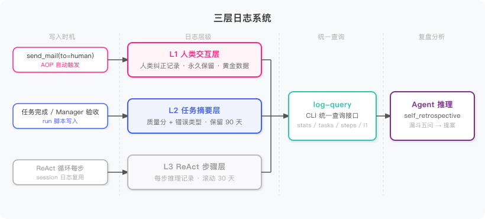

# 前言

[第一篇](/2026/04/27/ai-agent-digital-team-1/)搭了骨架——Manager 和 PM 各有固定身份，通过三态邮箱传消息。[第二篇](/2026/04/28/ai-agent-digital-team-2/)加了 Human 介入——需求澄清、设计确认、异常兜底，三个关键节点不让 Agent 自行发挥。

但这两篇都没解决一个问题：**团队跑了三百天，和第一天质量一样**。

PM 在第一周忘了检查移动端适配，Human 退回了设计文档并留了反馈。第八周，同样的任务，PM 又忘了。因为那条反馈从没被写进 SOP——Human 的纠正消失在了上下文窗口里，跑完这轮就没了。

对人类团队来说，这是危险信号。对数字团队来说，这是**设计缺陷**。

这篇把自我进化机制加进来。不是让 Agent 随意改自己，而是建一套闭环：**记录每次执行 → 定期复盘找根因 → 写成提案 → 人类审批后落地 → 下次验证效果**。改的不是 Agent 的权重，是它读的 SOP 文件。

---

# 一、为什么需要自我进化

不设计自我进化机制，三件事必然发生。

**第一件：同样的错误反复出现。** PM 每次忘了检查移动端适配，Human 每次退回。反馈留在 `human.json` 里，但没人把它写进 `product_design/SKILL.md`。下次 PM 启动，读的还是原来那个 Skill，自然还是忘。**上下文窗口刷新，经验归零。**

**第二件：工具路径冗余没人发现。** 某个 API 接好了，但对应 Skill 没更新，PM 还在走三步绕路的旧流程。任务能完成，但每次多花两分钟。一天十个任务，三百天，永远没人知道这损耗在哪里。

**第三件：协作问题被误归因给个体。** PM 和 Manager 之间的交接文档格式从来没对齐，验收时总有歧义，Manager 每次让 PM 改。看起来是 PM 的问题，但换个 PM 也会发生——根因是协作接口设计，不是执行者。没有全局视角，就发现不了跨 Agent 的模式。

真正的解法：让系统自己把值得关注的信号提炼出来，再交给人类决策。

五步闭环：**记录 → 复盘 → 提案 → 落地 → 验证**。记录和落地是工程基础设施，看代码就懂。难的是中间——怎么从上千条运行日志里找到"到底该改哪一行"。

---

# 二、三层日志：复盘的原料

复盘要有原料。原料是运行日志，但不是把所有日志堆在一起——三层，各自负责不同的问题。



| 层级 | 记录什么 | 生命周期 | 核心用途 |
|------|---------|---------|---------|
| L1 人类交互层 | 每次 Human 纠正 | 永久保留 | 黄金数据——判断偏差的最直接信号 |
| L2 任务摘要层 | 每个任务一条摘要（含质量分） | 保留 90 天 | 定位"哪些任务做得差" |
| L3 ReAct 步骤层 | Agent 内部每步推理 | 滚动 30 天 | 定位"差在哪一步" |

**三层里最值钱的是 L1。** Agent 自己觉得任务完成得挺好——质量 0.85，没有报错。但 Human 说"不对，移动端方案呢"——这条纠正比 Agent 自己做的 10 次分析都有价值。L1 不是 Agent 的自评，是人类给出的地面真相。

**为什么不合并成一层？** 三层的生命周期完全不同。L1 稀缺宝贵，每条都可能揭示一个系统性问题，永久保留。L3 量最大，三个月前的单步推理对今天的复盘毫无用处。合并就意味着要给它们设同一个保留策略——要么永久保留一堆废数据，要么删掉本来不该删的 L1。

## 2.1 L1 的 AOP 写入

L1 最关键的工程设计：**调用方零感知**。

以前的代码里，Agent 发邮件靠 `mailbox_cli.js` 里的 `send` 子命令。第三篇只改了这一个地方：当收件人是 `human` 时，自动写一条 L1 日志。

```javascript
// workspace/{role}/skills/mailbox/scripts/mailbox_cli.js
function _writeL1Log(mailboxesDir, msg) {
  try {
    const logsDir = path.join(path.dirname(mailboxesDir), 'logs', 'l1_human')
    fs.mkdirSync(logsDir, {recursive: true})
    const record = {
      id: msg.id, from: msg.from, to: msg.to, type: msg.type,
      subject: msg.subject, content: msg.content, timestamp: msg.timestamp
    }
    fs.writeFileSync(path.join(logsDir, `${msg.id}.json`), JSON.stringify(record, null, 2))
  } catch {}
}

// send() 函数里，写完邮箱之后加一行：
if (to === 'human') { _writeL1Log(mailboxesDir, msg) }
```

Agent 调用 `send` 时什么都不用改，L1 日志自动落地。这就是 AOP（面向切面编程）的思路：在执行路径的横截面加逻辑，不侵入调用方。

## 2.2 L2 的结构

L2 是每个任务完成后写的摘要，文件名格式 `{agent_id}_{task_id}.json`：

```json
{
  "agent_id": "pm",
  "task_id": "t001",
  "task_desc": "用户登录功能产品设计文档",
  "result_quality": 0.40,
  "duration_sec": 180,
  "error_type": "checkpoint_rejected",
  "timestamp": "2026-04-30T10:00:00Z"
}
```

`result_quality` 是 0-1 的质量分，由 Manager 验收后写入。`error_type` 是枚举值——`checkpoint_rejected` 表示被 Human 退回，`timeout` 表示超时，`tool_error` 表示工具调用失败。有了这两个字段，复盘时不用下钻到 L3 就能快速过滤出问题任务。

## 2.3 L3 的复用

L3 不需要另建——复用[第一篇](/2026/04/27/ai-agent-digital-team-1/)的 session 日志格式（`*_raw.jsonl` + `index.jsonl`），只加了 `task_id` 字段，让复盘时能按任务切片回放。

---

# 三、复盘方法论：从"出了问题"到"改哪一行"

有了日志，下一步是怎么看。这里有个陷阱，不绕过去，复盘就是走过场。

## 3.1 复述式反思

给 Agent 一段任务失败的日志，让它"总结一下哪里做得不好"，它很可能输出：

> 下次生成设计文档时，需要注意覆盖移动端适配。

听起来很像分析，其实是把失败过程重新描述了一遍——这叫**复述式反思**，是改良版的失败重演，不是根因分析。

NeurIPS 2023 的 Reflexion 论文发现了这个现象：犯错的 Agent 在评估自己的错误时，倾向于合理化而不是纠正。ICLR 2024 的 Retroformer 进一步指出：自由文本反思会系统性地产生复述，需要结构化约束来打破这个循环。

解法：**不让 Agent 自由发挥，逼它从枚举里选根因**。

## 3.2 漏斗五问

有效复盘的路径是一个漏斗——从上千条日志里，一层一层收窄到精确的文件改动位置。

| 问题 | 数据源 | 收窄到 |
|------|-------|-------|
| ① 哪些任务做得差？ | L2 定量 | 最差的 N 条任务 |
| ② 差在哪一步？ | L3 下钻 | 具体失败的 ReAct 步骤 |
| ③ 人类怎么看？ | L1 交叉验证 | 人类纠正记录 |
| ④ 根因是什么类型？ | 枚举分类 | 4 种根因之一 |
| ⑤ 改哪个文件的哪一段？ | 精确锚点 | `before_text` / `after_text` |

大多数复盘死在第 ④ 步。知道"出了问题"，不知道"根因是什么类型"，就没法确定"改哪个文件"。

## 3.3 root_cause 枚举

**以终为始：先想清楚"我最终能改什么"，再反推根因分类。**

| 枚举值 | 含义 | 改动对象 |
|-------|------|---------|
| `sop_gap` | 流程缺步骤 | `skills/*.md` |
| `prompt_ambiguity` | 指令模糊 | `soul.md` |
| `ability_gap` | 经验不足 | `memory.md` |
| `integration_issue` | 协作接口问题 | `agent.md` 协作部分 |

Agent 一旦完成归因，立刻知道要改哪个文件——路径确定，不需要再做一轮推理。

---

# 四、自我复盘实战

让 PM 走一遍完整的复盘链路。

## 4.1 Skill vs Script

复盘用的 `self_retrospective/SKILL.md` 不是操作手册——它不规定"先查什么再查什么"，只给 Agent 提供思考框架：

> 你现在要做一次自我复盘。用以下五个递进问题引导分析，但顺序可以根据实际情况调整。目标是产出一份 RetroOutput JSON，包含发现和具体改进提案。

**Skill 给约束，不给顺序。** 如果 L1 纠正记录很突出，先看 L1 更高效；如果 L2 质量分很均匀，先做 stats 全局扫描。Agent 的判断力是资产，不是成本。

## 4.2 log-query CLI

日志查询走一个统一的 CLI，Agent 通过 `run_script` 调用，输出纯 JSON：

```bash
# 全局统计
node log-query.js stats --agent-id pm --days 7
# → {"task_count": 8, "avg_quality": 0.68, "failure_count": 3, "human_correction_count": 3}

# 最差的几个任务
node log-query.js tasks --agent-id pm --days 7 --sort quality_asc --limit 3
# → 三条最差全是设计文档类，error_type 全是 checkpoint_rejected

# 某个任务的执行步骤
node log-query.js steps --task-id t001 --agent-id pm
# → 6 步：读需求 → 写文档 → 提交，全程没有"检查移动端"

# 人类纠正记录
node log-query.js l1 --days 7 --keyword "移动端"
# → 2 条退回记录：缺移动端适配方案

# 团队整体
node log-query.js all-agents --days 7
# → pm avg 0.68，manager avg 0.88——PM 是瓶颈
```

**CLI 只做数据查询，不做判断，不排序推荐。** 判断留给 Agent LLM——"三条最差都是设计文档类"是 Agent 自己看出来的，不是 CLI 告诉它的。LLM 擅长语义理解和判断，CLI 擅长结构化查询，各做各擅长的。

## 4.3 完整推理链

PM Agent 拿到 `retro_trigger` 邮件，开始分析：

**① 先看整体统计**

`stats` 命令返回：task_count 8，avg_quality 0.68，failure_count 3，human_correction_count 3。0.68 偏低，3 条失败，有问题，需要下钻。

**② 哪些任务做得差？**

`tasks --sort quality_asc --limit 3`：t006 (0.38)、t001 (0.40)、t003 (0.42)，三条全是 `checkpoint_rejected`，全是设计文档类任务。**模式出现了。**

**③ 差在哪一步？**

`steps --task-id t001`：只有三个阶段——读需求、生成文档、提交。"检查移动端适配"从来没出现在执行路径里。不是 PM 忘了，是 Skill 里根本没这一步。

**④ 人类怎么看？**

`l1 --keyword "移动端"`：2 条退回记录，全指向同一个问题。L1 验证了 L2/L3 的发现。

**⑤ 分类根因**

自由文本会写："下次生成设计文档时要注意移动端适配。"——复述失败，不是根因。

枚举约束逼出真正分类：这是 `sop_gap`——`product_design` Skill 里根本没有"检查移动端"这一步。根因确定，改动对象也确定：`skills/product_design/SKILL.md`。

## 4.4 RetroOutput JSON

PM 输出结构化提案，发 `retro_report` 给 Manager：

```json
{
  "retrospective_report": {
    "agent_id": "pm",
    "period": "2026-04-28 ~ 2026-05-04",
    "summary": "设计文档任务质量偏低，根因是 product_design Skill 缺少移动端检查步骤",
    "findings": [{
      "pattern": "3/8 任务被退回，全是设计文档类",
      "evidence_task_ids": ["t001", "t003", "t006"],
      "l1_corroboration": "3条 L1 纠正记录均指向移动端适配缺失"
    }]
  },
  "improvement_proposals": [{
    "root_cause": "sop_gap",
    "target_file": "skills/product_design/SKILL.md",
    "before_text": "1. **需求来源**：从 requirements.md 读取原始需求",
    "after_text": "1. **需求来源**：从 requirements.md 读取原始需求\n2. **多端检查**：如需求涉及用户界面，必须明确桌面端/移动端差异并分别设计",
    "expected_improvement": "设计文档 checkpoint 通过率从 62% 提升至 85%+",
    "evidence": ["t001", "t003", "t006"]
  }]
}
```

三个关键约束：

- **`evidence` 不允许为空**——Human 审批时应该点开日志 ID 查原始记录，不盲信 Agent 摘要
- **一次最多 3 条提案**——超过 3 条说明 Agent 在发散而不是聚焦
- **`before_text` 不允许为空**——逼 Agent 读文件、找到精确位置，不是泛泛地"加一步检查"

---

# 五、团队复盘与三档 HITL

PM 的自我复盘精度高——能下钻到具体哪个 ReAct 步骤失败——但视野窄，只看自己的数据。**团队复盘由 Manager 执行**，看 L1 全量 + 所有 Agent 的 L2 聚合，能发现自我复盘看不到的：

- **跨 Agent 模式**：不只 PM 有移动端问题，是不是 SOP 模板本身缺了这一步？
- **协作设计问题**：PM 和 Manager 之间的交接失败率最高，不是某个人的问题
- **瓶颈识别**：`all-agents` 命令显示 PM 均质 0.68，Manager 0.88——PM 是瓶颈，该触发 PM 的自我复盘

**级联触发**：Manager 发现瓶颈后，不自己做 L3 深分析——那是 PM 自己擅长的。发 `retro_trigger` 给 PM，让 PM 启动自我复盘。各做各擅长的。

## 5.1 三档 HITL

为什么不让 Agent 自己落地改进？**soul 一旦改错，Agent 所有后续判断都会跟着偏——包括它下一次复盘对自己的评价。** 这是无法自我纠正的漂移。改的越深，后果越难逆转。

三档，按改动深度决定审批力度：

| 档位 | 改动对象 | 审批方式 |
|-----|---------|---------|
| 档 1 | `memory.md` | Manager 自动批准 + 硬闸门（3 条/天） |
| 档 2 | `skills/*.md`、`agent.md` | Manager LLM 预审 → 转 Human 确认 |
| 档 3 | `soul.md` | Human 必审，绕不过 |

档 1 设了硬闸门：单天最多 3 条 memory 更新自动落地，超了就转 Human。防止 Agent 靠"加经验"绕过流程管控。

## 5.2 邮箱闭环路由

复盘走的还是[第二篇](/2026/04/28/ai-agent-digital-team-2/)建好的邮箱系统，新增四个消息类型：

```
PM → Manager       : retro_report（提案 JSON）
Manager → Human    : retro_pending_approval（档 2/3 提案）
Human → Manager    : retro_approved / retro_rejected
Manager → PM       : retro_approved / retro_rejected
PM → Manager       : retro_applied（执行确认）
```

Human 只和 Manager 沟通，单一接口原则不变。PM 收到 `retro_approved` 后，机械执行 `before_text → after_text` 替换——找到 `before_text` 就替换，找不到就报错，不猜测，不硬改。

---

# 六、跑一遍

完整 demo 代码在 [GitHub](https://github.com/ParadeTo/blog/tree/master/demo/ai-agent-digital-team)。五条命令走完整条链路：

**Step 1：生成历史数据**

```bash
$ node seed-logs.js

[SEED] PM L2 日志已写入：8 条
[SEED] Manager L2 日志已写入：3 条
[SEED] PM L3 步骤日志已写入：3 个失败任务
[SEED] PM session L3 日志已写入（v6 格式）
[SEED] L1 人类纠正日志已写入：3 条
[SEED] product_design SKILL.md 已重置到 baseline
[SEED] 完成！
```

`seed-logs.js` 模拟 PM 过去一周的运行：8 条 L2 任务（3 条低质量，全是设计文档类被退回），3 条 L1 人类纠正记录（全指向移动端适配），L3 步骤日志。同时把 `product_design/SKILL.md` 重置到 baseline——baseline 版本没有多端检查步骤，这就是后面要修的那个 gap。

**Step 2：调度触发**

```bash
$ node run-scheduler.js

[Scheduler] pm: 条件满足
[Scheduler] 已发送 retro_trigger 给 pm
[Scheduler] manager: 任务量不足（3 < 5）
[Scheduler] 触发完成：pm
```

双条件检查：距上次复盘 > 24 小时，且最近任务数 ≥ 5。PM 满足（8 条），触发；Manager 不满足（3 条），跳过。`retro_trigger` 发进 PM 邮箱。

**Step 3：PM 自我复盘**

```bash
$ node run-pm.js
```

PM 收到 `retro_trigger`，加载 `self_retrospective` Skill，调用 `log-query` CLI 分析，输出 RetroOutput JSON，发 `retro_report` 给 Manager。

**Step 4：Manager 审批提案**

```bash
$ node run-manager.js
```

Manager 收到 `retro_report`，加载 `review_proposal` Skill。`target_file` 是 `skills/product_design/SKILL.md`，属于档 2——Manager 预审后，发 `retro_pending_approval` 给 Human 确认（Human 走[第二篇](/2026/04/28/ai-agent-digital-team-2/)的 `human-cli.js` 确认）。

**Step 5：PM 落地改进**

```bash
$ node run-pm.js
```

PM 收到 `retro_approved`，读取提案里的 `before_text` / `after_text`，在 `product_design/SKILL.md` 里找到对应位置做字符串替换，发 `retro_applied` 确认，闭环完成。

从此以后，PM 做产品设计文档时，Skill 里多了"多端检查"这一步，不再遗漏移动端适配。这条改进经历了：数据记录 → PM 发现 → Manager 预审 → Human 确认 → PM 落地——完整的人机协作改进链路。

---

# 总结

这篇给数字员工团队加上了自我进化机制。核心设计思路：**LLM 负责看和想，机械操作负责做，Human 负责拍板**。日志 CLI 只查数据，判断留给 Agent；`before_text → after_text` 是纯字符串替换，不靠 LLM 理解代码结构；档 2/3 的改动必须经过 Human，防止自我纠正失效。

几个值得注意的坑：

- **复述式反思**几乎是 LLM 的默认行为——`root_cause` 枚举是打破它的关键约束，不是可选的
- **提案累积膨胀**：模型倾向"加规则"而不是"改规则"，半年后 SKILL.md 可能从 20 行长到 200 行。定期做一次"小重构"——合并重复规则、删掉过时补丁
- **样本不足强行复盘**：基于 2-3 条任务的分析噪声很大，`run-scheduler.js` 里设了 min_tasks=5 的门槛，不到就跳过

系列三篇到这里，把数字员工团队从"能跑起来"推到了"能自我改进"：[第一篇](/2026/04/27/ai-agent-digital-team-1/)定义角色，[第二篇](/2026/04/28/ai-agent-digital-team-2/)引入 Human，第三篇让系统越用越好。
