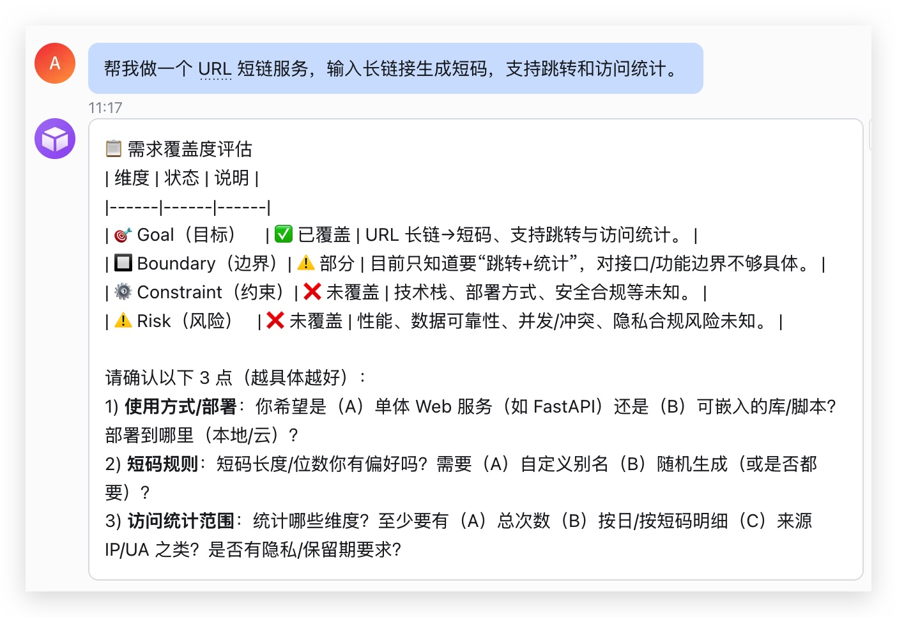
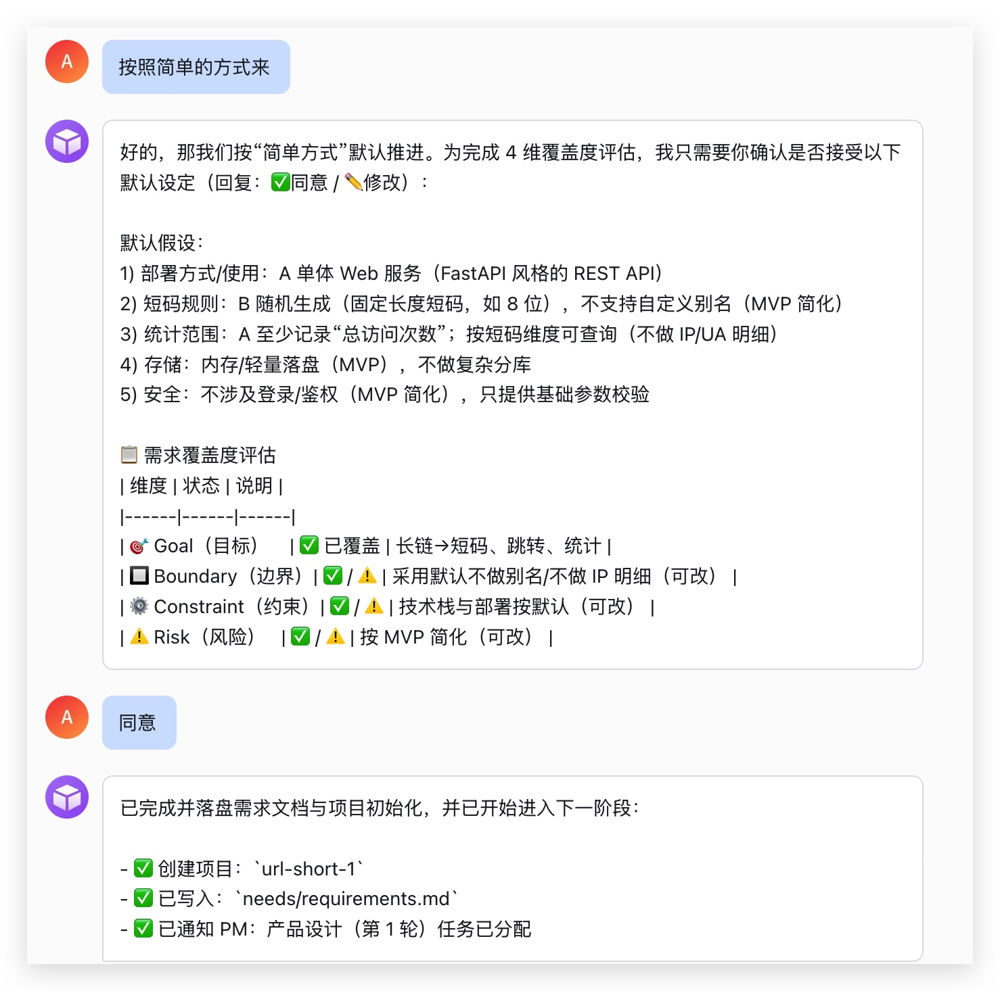
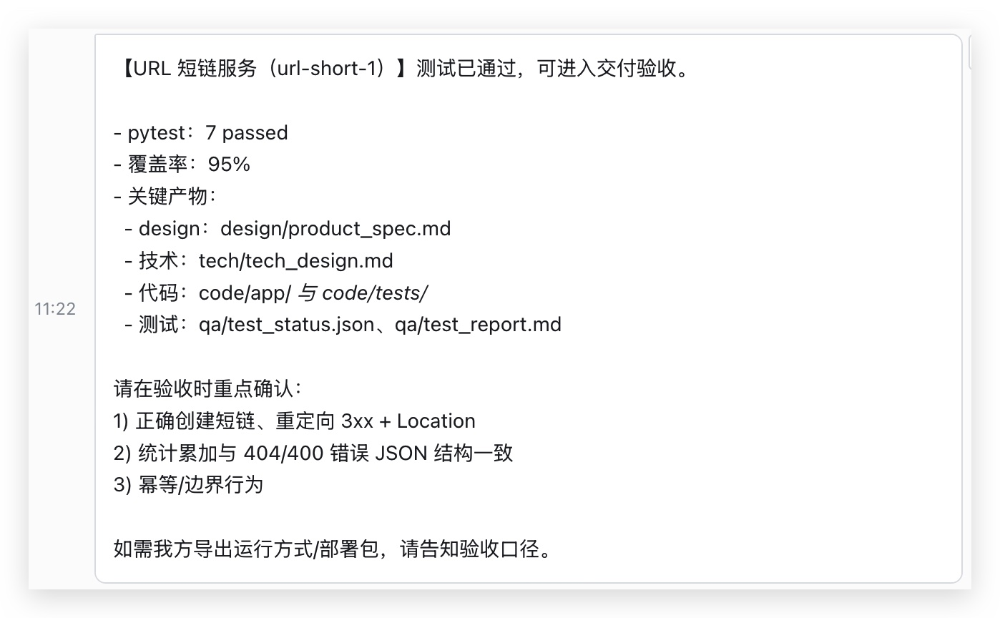

# 前言

前三篇把数字团队的几个零件拆开讲了一遍：固定角色、文件邮箱、Human 介入、自我进化。单看每一块都还说得通，麻烦通常出现在最后一步：

**这些机制放在一起，能不能像一个小团队一样，完成一个真实项目？**

所以这篇不再继续加概念，而是跑一个完整需求：做一个 URL 短链服务。用户输入长链接，系统生成短码；访问短码能跳转回原链接；还能查询访问统计。

项目本身不大，但环节齐全：Manager 收需求，PM 写产品规格，RD 写技术方案和代码，QA 写测试计划并执行，最后 Manager 发起验收。这个例子刚好可以拿来验一件事：多 Agent 系统是不是只会“看起来很忙”，还是能把产物一步步落到文件、代码和测试结果里。

这篇对应的 demo 代码在这里：[ParadeTo/blog/demo/xiaoquan](https://github.com/ParadeTo/blog/tree/master/demo/xiaoquan)。

---

# 这次要验证什么

我最关心的不是模型能不能写 FastAPI。这个需求不难。上下文给够，一个单 Agent 通常也能写出可用版本。

这次主要看团队协作：

| 问题 | 需要系统回答什么 |
|------|------------------|
| 谁来接用户需求 | 用户只和 Manager 对话，PM/RD/QA 不直接找用户 |
| 产物放在哪里 | 需求、设计、代码、测试报告都沉淀到项目共享目录 |
| 谁决定下一步 | Manager 按 SOP Skill 推进阶段 |
| 失败怎么办 | QA 发现缺陷后能打回 RD，RD 修完后 QA 继续重测 |
| 什么时候能交付 | 交付前必须读 QA 机器可读状态，不能只看自然语言汇报 |

我看的是这支小队有没有“组织能力”：任务能不能交接，产物会不会归档，失败能不能返修，验收前有没有门禁。

---

# 小队分工

这次小队里有四个角色：

| 角色 | 主要职责 | 关键产物 |
|------|----------|----------|
| Manager | 接用户需求、建项目、派任务、收敛阶段、发起验收 | `needs/requirements.md`、事件流、交付报告 |
| PM | 把自然语言需求翻译成产品契约 | `design/product_spec.md` |
| RD | 写技术方案、实现代码、修复缺陷 | `tech/tech_design.md`、`code/` |
| QA | 写测试计划、执行测试、发现缺陷、推动返修 | `qa/test_plan.md`、`qa/test_report.md`、`qa/test_status.json` |

Human 只面对 Manager。这个约束看起来有点死板，但很有用。用户如果同时和 PM、RD、QA 对话，项目状态很快就会散掉。

---

# 项目现场

一轮跑完后，短链项目会落在共享工作区里：

```text
workspace/shared/projects/url-short-1/
├── needs/
│   └── requirements.md
├── design/
│   └── product_spec.md
├── tech/
│   └── tech_design.md
├── code/
│   ├── app/
│   ├── tests/
│   ├── requirements.txt
│   └── run_tests.sh
├── qa/
│   ├── test_plan.md
│   ├── test_report.md
│   └── test_status.json
├── mailboxes/
│   ├── manager.json
│   ├── pm.json
│   ├── rd.json
│   └── qa.json
└── events.jsonl
```

这个目录就是项目现场。Agent 的每一步动作最后都要落到这里：邮件发给了谁、哪个阶段完成了、测试跑没跑、报告是不是通过，都能从文件里查出来。

这点比“Agent 回复了一段话”可靠得多。回复会被上下文窗口吞掉，文件至少给了我们一个可检查、可恢复的落点。

---

# 架构：代码管工具，流程放在 Skill 里

整体结构大概是这样：


底层还是前几篇做过的 Agent 运行时：接收消息、构造 prompt、调用模型、执行工具、写日志。

这次新增的是团队协作层：

| 模块 | 作用 |
|------|------|
| 角色工作区 | 每个角色有自己的 `soul.md`、`agent.md`、`memory.md`、`user.md` 和 Skills |
| Skill Index | 把当前角色能用的 Skill 列表注入 system prompt |
| 团队工具 | `send_mail`、`read_inbox`、`mark_done`、`read_shared`、`write_shared` 等 |
| 共享项目目录 | 所有阶段产物都写到 `workspace/shared/projects/{projectId}/` |
| 文件邮箱 | 角色之间通过 `mailboxes/*.json` 传递任务 |
| 交付门禁 | Manager 交付前读取 QA 状态，决定交付、打回 RD，还是让 QA 重测 |

我最想保留的一点是：**流程判断不写在 JS 里，而是写在 Skill 文本里。**

Manager 的 system prompt 里会注入当前角色可用的 Skill 列表：

```text
<skill_usage_rules>
执行匹配任务前必须先调用 get_skill(name) 获取详细指令。
当任务匹配 skill description 中的“一定/必须/触发”规则时，必须先 get_skill。
</skill_usage_rules>

<available_skills role="manager">
- sop_feature_dev: Manager 主 SOP：小功能开发 6 阶段主流程...
- requirements_guide: 需求澄清指南...
- delivery_gate_check: Manager 交付前的业务门禁 skill...
</available_skills>
```

这样 Manager 收到“帮我做一个短链服务”时，不需要 JS 告诉它“下一步调用 PM”。它会先加载 `sop_feature_dev`，再按 SOP 里的阶段规则推进。

---

# 阶段 1：Manager 收需求

用户在飞书里发需求：

> 帮我做一个 URL 短链服务，输入长链接生成短码，支持跳转和访问统计。

Manager 判断这是一个新功能需求，于是加载两个 Skill：

| Skill | 用来做什么 |
|-------|------------|
| `sop_feature_dev` | 决定完整项目应该走哪几个阶段 |
| `requirements_guide` | 按 goal / boundary / constraint / risk 检查需求是否足够 |

需求足够明确后，Manager 会创建项目目录，把需求写入 `needs/requirements.md`，然后通过飞书发 checkpoint，让用户确认“这个需求可以开工”。



用户批准后，Manager 记录 `checkpoint_approved` 事件，再给 PM 发一封 `task_assign` 邮件：

```json
{
  "to": "pm",
  "type": "task_assign",
  "subject": "产品设计 (第 1 轮)",
  "projectId": "url-short-1"
}
```



邮件只是一个 JSON 文件，但它是小队协作的接口。PM 被唤醒后，第一件事不是猜上下文，而是调用 `read_inbox(projectId)`，从自己的收件箱里取任务。

---

# 阶段 2：PM 把需求变成产品契约

PM 收到任务后加载 `product_design` Skill，产出 `design/product_spec.md`。

这一阶段不是为了“写一份 PRD”而写 PRD，而是把用户的一句话变成下游可执行的契约。RD 要按它写接口，QA 要按它写断言。

短链项目的产品规格里，PM 把接口收敛成三类：

| 能力 | 接口 |
|------|------|
| 创建短码 | `POST /api/links` |
| 短码跳转 | `GET /{code}` |
| 查询统计 | `GET /api/stats/{code}` |

它还把验收标准写成了可以机械检查的形式：

```markdown
3. 跳转返回 3xx 且 Location 正确
   - Given：创建短码成功得到 code
   - When：GET /{code}
   - Then：HTTP status 为 3xx
   - And：Location header == 创建时的 long_url

4. 访问统计累加
   - When：对 GET /{code} 连续请求 N 次
   - Then：GET /api/stats/{code} 的 total_visits == N
```

这种细节很琐碎，但少不了。如果 PM 只写“支持访问统计”，RD 可能返回 `count`，QA 可能断言 `total_visits`，最后大家都觉得自己没错。产品契约的作用就是提前消灭这种分歧。

PM 完成后，会给 Manager 回 `task_done`。Manager 收到后，根据 SOP 派 RD 做技术方案。

---

# 阶段 3：RD 分两步实现

RD 阶段刻意拆成两封任务邮件：

| 顺序 | 任务 | 产物 |
|------|------|------|
| 1 | 技术方案设计 | `tech/tech_design.md` |
| 2 | 代码实现 | `code/` + 单元测试 |

这个拆分不是仪式感，是跑出来的经验。一次消息里同时要求“写技术设计 + 写完整代码”，很容易前半段做完，后半段漏掉。SOP 里直接把这条规则写成硬约束：

```markdown
| 当前 task_done 来自 | 下一 task_assign | 必须独立发送 |
|-------------------|-----------------|-------------|
| PM（含 product_spec.md） | to=rd "技术方案设计" | ✅ 仅技术方案，不含实现 |
| RD（含 tech_design.md） | to=rd "代码实现" | ✅ 单独再发一次 |
| RD（含 code/main.py + tests/） | to=qa "测试设计" | ✅ 仅测试设计，不含执行 |
| QA（含 test_plan.md） | to=qa "测试执行" | ✅ 单独再发一次 |
```

这次 RD 选择了 FastAPI + SQLAlchemy + SQLite，代码目录里包含应用、模型、路由、服务层和测试。完成后，RD 会先自己跑测试，通过后再向 Manager 回报。

共享目录也做了写权限隔离。PM 只能写 `design/`，RD 只能写 `tech/` 和 `code/`，QA 只能写 `qa/`。这个限制不是靠 prompt 里说“请不要乱写”，而是在工具层拦截：

```javascript
const OWNER_BY_PREFIX = {
  'needs/': new Set(['manager']),
  'design/': new Set(['pm']),
  'tech/': new Set(['rd']),
  'code/': new Set(['rd']),
  'qa/': new Set(['qa']),
}
```

Agent 可以犯错，但工具不能放行越权写入。

---

# 阶段 4：QA 测试和返修闭环

Manager 收到 RD 的代码完成邮件后，不会直接交付，而是先让 QA 做两件事：

| 顺序 | 任务 | 产物 |
|------|------|------|
| 1 | 测试设计 | `qa/test_plan.md` |
| 2 | 测试执行 | `qa/test_report.md`、`qa/test_status.json` |

这一段最像真实团队：QA→RD→QA。

如果 QA 发现缺陷，QA 会自己给 RD 发 `task_assign`，让 RD 修复；RD 修完后，再通知 QA 重测；全部通过后，QA 才给 Manager 发 `task_done`。这个闭环不是 JS 里写的 `if qaFail then callRD()`，而是写在 `test_run` Skill 的自然语言里。

摘一段真实 Skill 文本：

```markdown
若返回 status=pass，确认 qa/test_report.md 与 qa/test_status.json 已写入，
然后 mark_done 当前测试执行邮件。

若返回 status=fail，工具已经写 defect 并发送 RD 修复任务；
你只需确认结果并 mark_done 当前测试执行邮件。

测试命令失败不是沙箱失败：pytest 非 0、断言失败、
服务启动后接口返回不符合预期，都必须写 defect 并发给 RD。

xfail/xpass 不能算通过：pytest 即使 returncode=0，
只要 summary 出现 xfailed 或 xpassed，都必须标 fail、写 defect、发 RD 修复。
```

这也是我喜欢把业务编排放进 Skill 的原因。工具层只管几件确定的事：跑测试、写报告、发邮件。至于“什么情况该打回 RD”，由 QA Skill 决定。

这次短链项目的最终测试结果是：

```text
状态：pass
命令：python -m pip install -q -r requirements.txt && bash run_tests.sh
pytest outcome：{"passed":7}
disallowed outcome：["xfailed","xpassed"]
覆盖率：95%
状态原因：all_tests_passed
```

终端里能看到小队在自己接力：


---

# 阶段 5：交付前再过一道门禁

QA 回 `task_done` 之后，Manager 还不能直接发验收。

交付前必须加载 `delivery_gate_check` Skill。这个 Skill 会读取：

```text
qa/test_status.json
qa/test_report.md
mailboxes/manager.json
mailboxes/qa.json
mailboxes/rd.json
```

然后按顺序判断：

| 情况 | 决策 |
|------|------|
| 缺测试报告或状态文件 | 派 QA 执行测试 |
| `test_status.status != pass` | 派 RD 修复，或派 QA 重测 |
| 出现 QA policy 失败 | 派 RD 修复 |
| RD 修复时间晚于 QA 通过时间 | 派 QA 重测 |
| 全部通过 | 允许交付 |

Manager 不能凭一句“QA 说通过了”就交付，它要读机器可判定的状态文件。这个门禁后来很有用：如果测试里出现 `xfailed` 这种“看似 pytest 通过，实际关键路径被跳过”的情况，系统会自动打回 RD，而不是把旧验收当成通过。

门禁通过后，Manager 才向用户发送交付报告。



交付确认后，还有一步可以继续触发：复盘。Manager 按 SOP 加载 `team_retrospective`，给 PM、RD、QA 各发一封 `retro_trigger` 邮件。三个角色会回看本轮项目里的需求、设计、代码、测试报告和邮件链，写出自己的 retro，再把改进建议发回 Manager。

这一步对应第三篇讲的自我进化机制。它不影响本次短链服务是否交付，但会影响下一次小队怎么工作：比如把“测试通过必须有 `qa/test_status.json`”写进 QA 规则，把“代码修复后必须重测”写进交付门禁，把容易漏掉的任务拆分规则沉淀到 SOP。经验不能只停在聊天记录里，得回写到团队的工作说明书里。

---

# 验收之后：真的跑一下成品

交付报告不是结束，我还把短链服务跑起来试了一遍。

创建短码：

```bash
curl -X POST http://127.0.0.1:8000/api/links \
  -H 'Content-Type: application/json' \
  -d '{"long_url":"https://example.com/demo"}'
```

示例返回如下，短码每次运行可能不同：

```json
{
  "code": "teyhke",
  "long_url": "https://example.com/demo"
}
```

访问短码会返回 3xx，并带上 `Location`：

```bash
curl -i http://127.0.0.1:8000/teyhke
```

查询统计：

```bash
curl http://127.0.0.1:8000/api/stats/teyhke
```

返回：

```json
{
  "code": "teyhke",
  "total_visits": 1
}
```

这时候我才敢把它当成一个最小服务：能跑，能测，也能验收。

---

# 关键接缝

跑完整个项目之后再回头看，需要代码兜住的地方并不多，但每个都不能省。

| 接缝 | 放在哪里 | 解决什么问题 |
|------|----------|--------------|
| Skill Index 注入 | `build-team.js` | Agent 先知道自己有哪些 Skill，才可能按规则加载 |
| 文件邮箱 | `mailboxes/*.json` | 角色之间用稳定文件传任务，消息不会丢在上下文里 |
| 邮箱监听 | `mailbox-watcher.js` | 有新未读邮件才唤醒对应角色 |
| workspace 权限 | `workspace.js` / team tools | PM/RD/QA 只能写自己的目录 |
| QA 自动测试 | `run_project_tests` + `test_run` Skill | 测试结果写成报告和机器可读状态 |
| 交付门禁 | `delivery_gate_check` Skill + 工具层检查 | Skill 定义交付口径，工具层读取状态并执行确定性检查 |
| 执行串行化 | `build-team.js` 共享锁 | 避免多个角色同时跑时污染同一套运行上下文 |

这条边界我会单独记下来：**确定性的事情交给代码，业务判断留给 Skill。**

比如“文件里有没有 unread 邮件”，代码读 JSON 就能判断；“QA 失败后应该打回 RD 还是上报基础设施问题”，这属于业务规则，更适合写在 QA Skill 里。规则以后变了，改 Skill 文本就行。

---

# 结语

这篇是整个数字团队系列的最后一篇。前面几篇像是在做零件，这篇终于把它们装起来，跑了一次完整项目。

跑完之后，我最大的感受是：多 Agent 的难点不在“多”，而在“团队”。角色要有边界，产物要有归档，消息要能追踪，测试要能挡住交付，业务流程还要能改。

如果所有流程都写进 JS，系统很快会变成一堆难维护的 `if/else`。把流程放进 Skill，把文件和工具做扎实，反而更像真实团队的工作方式：人读 SOP，按产物交接，出了问题回到上一个责任人，直到测试和验收都过。

一个最小但完整的 Agent 小队，就这样跑通了。
