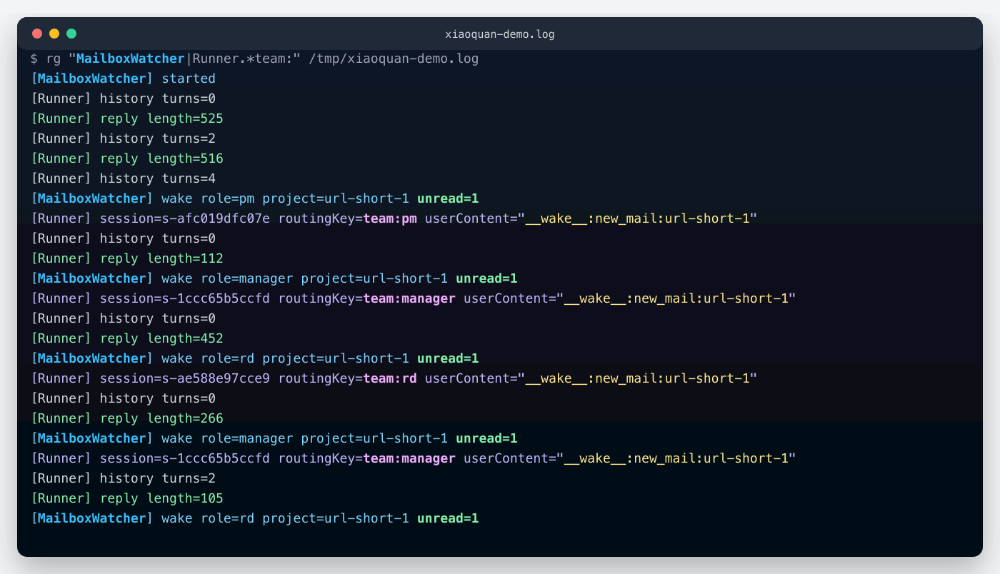

# 前言

前三篇各解决了一个维度：角色定义让 Agent 知道自己是谁、能做什么；邮箱通信解决了 Agent 之间怎么传话；Human 介入设计了三个关键节点和单一入口；自我进化给团队加上了从错误中学习的闭环。

每篇单独看，逻辑都跑得通。但放在一起就有点像招了四个能力很强的人，每个人都通过了单项考核，第一天一起开会却完全乱套：不知道谁先说话，不知道结论交给谁，不知道下一步是谁的事。这不是能力问题，是**拼装问题**。

今天做的事就是把这四个机制装进同一个进程，用一个具体项目跑完整的交付流程来验证：URL 短链服务，输入一条长 URL，系统输出一个短码，支持跳转和访问统计。项目足够小，跑起来不费时间；又有完整的需求分析、设计、开发、测试环节，够验证协作链路。

一边跑，一边回答这个问题：**四个机制装在一起，哪里需要加"胶水代码"，加多少？**

---

# 架构鸟瞰

先看整体结构：


系统分三层。底层是单个 Agent 的运行层，ReAct 循环、工具调用、日志写入，第一篇讲的那套，这次一行没改。中间层是邮箱通信层，三态邮箱、Human 收件箱、日志的 AOP 写入，第一、二、三篇搭的，这次也一行没动。

**所有新代码都在顶层，也就是团队协作层。**

这里有一个关键的设计取向，值得单独说一下：团队协作层没有任何写死的流程判断。代码里找不到 `if (stage === 'design') callPM()` 这样的东西。Manager 读的是自然语言写的 Skill 文件，根据文件内容决定当前任务该交给谁、下一步是什么。**SOP 是这套系统的流程操作系统。** 要改工作流，改 Skill 文本文件就够了，不用动 JS。

---

# 全流程走一遍

以 URL 短链服务为例，跟着六个阶段走一遍完整交付。

---

## 阶段 0：SOP 共创（可选）

正式开始前，用户可以先和 Manager 在飞书里共创一份定制 SOP。Manager 加载 `sop_cocreate_guide`，和用户来回对话三到四轮，依次覆盖六个维度：目标、阶段划分、角色职责、交付物、检查点、复盘方式。对话结束后，结果落地成一个新的 SOP Skill `.md` 文件，保存到 `workspace/manager/skills/`。

这件事值得单独拿出来说的原因是：**SOP 是文本文件，改工作流等于改文本，不碰 JS。** 团队有新要求，比如加一个安全审查环节，或者把 PM 审批改成 Manager 直批，改一个 `.md` 文件，下次运行就生效了。

---

## 阶段 1：需求澄清

用户在飞书发了一条消息："帮我做一个 URL 短链服务，输入长链接生成短码，支持跳转和访问统计。"

Manager 判断这是一个新需求，加载 `sop_feature_dev`，从四个维度评估：目标、边界、约束、风险。评估完，向用户发一张 Checkpoint 确认卡，等用户点确认。用户批了之后，Manager 在 workspace 里建好项目目录树（`needs/`、`design/`、`tech/`、`code/`、`qa/`、`mailboxes/`、`events.jsonl`），然后给 PM 发一封 `task_assign` 邮件。

邮件发完，下一个问题自然出现：**发邮件之后 PM 怎么知道该醒来了？**

来看 `send_mail` 工具的 `execute` 函数：

```javascript
// team-tools.js — send_mail 工具的 execute
execute: async ({to, type, subject, content, projectId}) => {
  const msgId = await mailbox.sendMail(mailboxDir, {to, from: role, type, subject, content, projectId})
  const jobId = await tasksStore.scheduleWake(cronTasksPath, {role: to, reason: 'new_mail', delayMs: 1000, projectId})
  return JSON.stringify({errcode: 0, msgId, scheduledWake: jobId, to, type})
}
```

`sendMail` 在内部做了两件事：写入邮箱文件，同时给收件人注册一个 1 秒后的唤醒任务。Agent 不需要知道"发完邮件还要通知调度器"，工具层把这两步封装在一起了。**发邮件 = 叫人**，这就是为什么整个系统里不需要写显式的编排代码。

---

## 阶段 2：PM 产品设计

PM 被唤醒，读收件箱，加载 `product_design` Skill，开始输出产品设计文档：API 定义（`POST /shorten`、`GET /{code}`、`GET /{code}/stats`）、数据模型、验收标准，写完用 `self_score` 自评一遍，再把 `task_done` 邮件发回给 Manager。

**这里有一个容易忽视的并发 bug。**

最初的 SkillLoader 用一个模块级全局变量存 `skillsDir`。单个 Agent 跑的时候没问题，但四个角色并发时，PM 的 Loader 可能被 Manager 的调用覆盖，PM 一不小心就会读到 Manager 的 13 个 Skill，而不是自己的 5 个。

修复只改了一行：

```javascript
// 改之前：模块级全局变量，四角色并发时互相覆盖
let _skillsDir = null  // ← 危险

// 改之后：每次调用从参数派生，与任何全局状态无关
export function loadRoleScopedSkillRegistry(workspaceRoot, role) {
  const skillsDir = path.join(workspaceRoot, role, 'skills')  // ← 实例绑定
  const registry = {}
  // ...从 skillsDir 读取
  return registry
}
```

从全局变量改成函数参数，Manager 的 `skillsDir` 是 `workspace/manager/skills/`，PM 的是 `workspace/pm/skills/`，互不干扰。**这是单 Agent 转多 Agent 最典型的 bug 模式：一行改动，从全局到实例。**

---

## 阶段 3：RD 技术实现

Manager 收到 PM 的 `task_done` 邮件，分两步给 RD 派任务：先发一封 `tech_design` 任务，等 RD 把 `tech/tech_design.md` 写完回报后，再单独发一封 `code_impl` 任务。两步拆开不是为了仪式感。实测把两个任务合在一封邮件里，Agent 写完技术方案就当自己完成了，代码实现根本没动。

RD 收到 `code_impl` 后，加载对应 Skill，建好目录结构，在沙箱里写代码：Express + SQLite，实现三个接口（`POST /shorten`、`GET /:code`、`GET /:code/stats`）。代码写完自动跑测试，如果失败，RD 会读 stderr、修代码、重新跑，最多三轮，跑通为止。

**这里有一个问题值得停下来想一下：**

四个角色共享同一个项目目录，RD 不能动 PM 的 `design/`，QA 也不能往 `code/` 里写。怎么保证？

靠 Prompt 说"请不要改别人的目录"？这太软了，Agent 偶尔会忘。真正可靠的办法是在工具层做强制拦截，用前缀 ACL：

```javascript
// workspace.js — 前缀 ACL
const OWNER_BY_PREFIX = {
  'needs/':  new Set(['manager']),
  'design/': new Set(['pm']),
  'tech/':   new Set(['rd']),
  'code/':   new Set(['rd']),
  'qa/':     new Set(['qa']),
}

export function checkWrite(role, relPath) {
  for (const [prefix, owners] of Object.entries(OWNER_BY_PREFIX)) {
    if (relPath.startsWith(prefix) && !owners.has(role)) {
      throw new Error(`${role} cannot write ${relPath} (owner=${[...owners]})`)
    }
  }
}
```

Prompt 约束是软约束，Agent 想绕就能绕。这个是工具层的硬抛出，Agent 就算想写也写不进去。`PermissionError` 直接返回给 Agent，它自己就知道这条路不通。

---

## 阶段 4：QA 测试 + 缺陷修复循环

Manager 先给 QA 发 `test_design` 任务，QA 输出 `qa/test_plan.md`；之后再发 `test_run` 任务，QA 在沙箱里跑完所有测试用例。

这里有一个值得注意的设计：如果发现缺陷，QA **自己**给 RD 发 `task_assign` 邮件，不需要经过 Manager 中转。RD 修完，QA 再验一遍，全部通过后才把 `task_done` 发回给 Manager。这个 QA→RD→QA 的闭环，JS 代码里一行都没有写死。QA 的 `test_run` Skill 文本里用自然语言描述了这个决策逻辑，Agent 自己读完就知道该怎么做。编排逻辑在 Skill 文本里，不在 JS 里。

---

## 阶段 5-6：交付 + 复盘

所有测试通过，Manager 调用 `send_to_human({kind: 'delivery'})` 向用户发送交付报告，用户在飞书确认，系统记录 `delivered` 事件。

复盘阶段，Manager 同时给 PM、RD、QA 发 `retro_trigger` 邮件，三个角色同时被唤醒，各自写复盘。

**这里又有一个问题：**

JS 是单线程，三个角色同时唤醒有问题吗？

有，而且是真实踩到过的问题。单线程不等于没有并发问题。PM 的 ReAct 循环挂在 `await generateText(...)` 等待 LLM 返回时，事件循环可以调度 Manager 开始跑，两个角色的循环**交替执行**。任何 SDK 里的模块级可变状态，都可能在这个交替里被污染。

解法是用 Promise 链串行化所有 Agent 的执行：

```javascript
// build-team.js — Promise 链串行化
export function wrapWithLock(agentFn) {
  let lock = Promise.resolve()
  return function lockedAgentFn(...args) {
    let resolve
    const prev = lock
    lock = new Promise(r => { resolve = r })
    return prev.then(() => agentFn(...args)).finally(() => resolve())
  }
}
```

有意思的是，Python 版本也有一把锁，但原因不一样。Python 那边是 CrewAI 的 `@before_llm_call` 钩子挂在全局事件总线上，并发执行时 PM 的钩子会触发在 QA 的 LLM 调用上，把系统提示搞乱。JS 版没有这个框架层面的问题，这把锁是纯粹的防御性编程，防止任何潜在的 SDK 级共享状态被异步交替污染。**同一个接缝，Python 和 JS 各有各的根因。**

---

# Demo 实录

上面六个阶段都是设计层面的描述。下面是接入飞书、真实跑起来之后的实录。

## 用户发起需求

用户在飞书里发了一条消息，提到 URL 短链项目。Manager 收到后将其分类为新需求，进入澄清流程，开始向用户追问目标范围和约束条件。


## Manager 发 checkpoint 卡片

Manager 整理好需求（目标、边界、约束、风险），在飞书里向用户发送一张确认卡片。用户需要在卡片上点"批准"或"请修改"，项目才会正式启动。


## 用户批准，项目正式启动

用户点了批准。Manager 收到 `checkpoint_response` 后，创建项目目录树（needs/ design/ tech/ code/ qa/ mailboxes/ events.jsonl），并向 PM 发出第一封 `task_assign` 邮件。自驱动循环从这一刻开始。


## 终端日志：自驱动循环

终端日志里可以看到自驱动循环的完整链条：Manager 发信 → CronService 1 秒后唤醒 PM → PM 处理完发信 → RD 被唤醒 → RD 完成发信 → QA 被唤醒……这整条序列在 JS 代码里没有任何硬编码的调度逻辑，全部由 `sendMail` 内部的 `scheduleWake` 驱动。



## Manager 发出交付汇报

所有测试通过后，Manager 在飞书里发出交付报告，列出交付物清单（API 文档、DB Schema、测试报告、短链接口地址）。用户确认，事件日志记录 `delivered`，项目结束。


---

跑完之后，`workspace/shared/projects/url-shortener/` 里保存了完整的项目产物。events.jsonl 和邮箱文件的具体内容，等作者跑完 demo 后填入：

```
<!-- 运行后填入：events.jsonl 前几行（项目事件链） -->
<!-- 运行后填入：mailboxes/pm.json 中 Manager→PM 的首封 task_assign 邮件 -->
```

---

# 接缝总结

六个阶段全部跑通。回头数一下，真正需要写的"胶水代码"到底有多少。

| 接缝 | 文件 | 解决的问题 |
|------|------|-----------|
| SendMail = 叫人 | team-tools.js | 发邮件自动注册唤醒，消灭显式编排代码 |
| RoleScopedSkillLoader | skill-tools-scoped.js | skillsDir 从全局变量改为实例绑定，多角色 Skill 不串台 |
| workspace 前缀 ACL | workspace.js | 共享目录按角色隔离写权限，工具层硬拦截 |
| 全局锁（Promise 链） | build-team.js | async 交织执行不污染，JS/Python 根因不同 |

业务逻辑全在 Skill 文本文件里，JS 代码只管接缝。**新增一个角色几乎不用动接缝代码**：在 `workspace/` 下建一个目录，在 `ROLES` 数组里加一条，在 `OWNER_BY_PREFIX` 里加一个前缀，就结束了。

---

# 结语

四篇写完了，从"临时工"写到"能自我进化的团队"。回头看，多 Agent 系统最难的不是业务逻辑，那些都在 Skill 文件里，改文本就够了。真正难的是接缝：几行看起来不起眼的代码，每一行都是踩过坑才知道要加的。SOP 是流程操作系统，邮件是调度器，JS 只管把这几处拼缝粘好。
