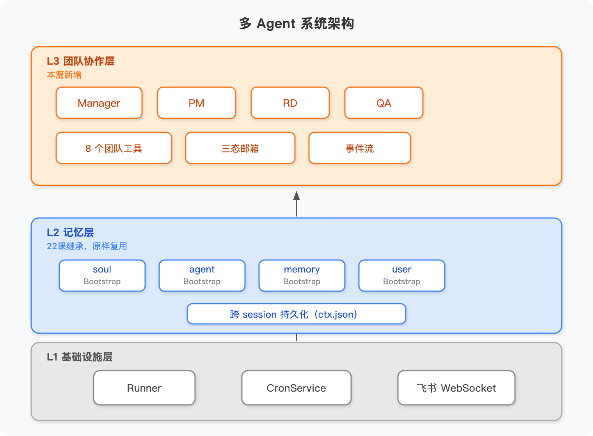

# 前言

前三篇各解决了一个维度：角色定义让 Agent 知道自己是谁、能做什么；邮箱通信解决了 Agent 之间怎么传话；Human 介入设计了三个关键节点和单一入口；自我进化给团队加上了从错误中学习的闭环。

每篇单独看，逻辑都跑得通。但放在一起就有点像——招了四个能力很强的人，每个人都通过了单项考核，第一天一起开会却完全乱套：不知道谁先说话，不知道结论交给谁，不知道下一步是谁的事。这不是能力问题，是**拼装问题**。

今天做的事就是把这四个机制装进同一个进程，用一个具体项目跑完整的交付流程来验证：URL 短链服务——输入一条长 URL，系统输出一个短码，支持跳转和访问统计。项目足够小，跑起来不费时间；又有完整的需求分析、设计、开发、测试环节，够验证协作链路。

一边跑，一边回答这个问题：**四个机制装在一起，哪里需要加"胶水代码"，加多少？**

---

# 架构鸟瞰

先看整体结构：



系统分三层。L1 是单个 Agent 的运行层——ReAct 循环、工具调用、日志写入，第一篇讲的那套，这次一行没改。L2 是邮箱通信层——三态邮箱、Human 收件箱、L1 日志的 AOP 写入，第一、二、三篇搭的，这次也一行没动。

**所有新代码都在 L3，也就是团队协作层。**

这里有一个关键的设计取向，值得单独说一下：L3 没有任何写死的流程判断。代码里找不到 `if (stage === 'design') callPM()` 这样的东西——Manager 读的是自然语言写的 Skill 文件，根据文件内容决定当前任务该交给谁、下一步是什么。**SOP 是这套系统的流程操作系统。** 要改工作流，改 Skill 文本文件就够了，不用动 JS。

---

# 全流程走一遍

以 URL 短链服务为例，跟着六个阶段走一遍完整交付。

---

## 阶段 0：SOP 共创（可选）

正式开始前，用户可以先和 Manager 在飞书里共创一份定制 SOP。Manager 加载 `sop_cocreate_guide`，和用户来回对话三到四轮，依次覆盖六个维度：目标、阶段划分、角色职责、交付物、检查点、复盘方式。对话结束后，结果落地成一个新的 SOP Skill `.md` 文件，保存到 `workspace/manager/skills/`。

这件事值得单独拿出来说的原因是：**SOP 是文本文件，改工作流等于改文本，不碰 JS。** 团队有新要求——加一个安全审查环节，或者把 PM 审批改成 Manager 直批——改一个 `.md` 文件，下次运行就生效了。

---

## 阶段 1：需求澄清

用户在飞书发了一条消息："帮我做一个 URL 短链服务，输入长链接生成短码，支持跳转和访问统计。"

Manager 判断这是一个新需求，加载 `sop_feature_dev`，从四个维度评估：目标、边界、约束、风险。评估完，向用户发一张 Checkpoint 确认卡，等用户点确认。用户批了之后，Manager 在 workspace 里建好项目目录树——`needs/`、`design/`、`tech/`、`code/`、`qa/`、`mailboxes/`、`events.jsonl`——然后给 PM 发一封 `task_assign` 邮件。

邮件发完，下一个问题自然出现：**发邮件之后 PM 怎么知道该醒来了？**

来看 `send_mail` 工具的 `execute` 函数：

```javascript
// team-tools.js — send_mail 工具的 execute
execute: async ({to, type, subject, content, projectId}) => {
  const msgId = await mailbox.sendMail(mailboxDir, {to, from: role, type, subject, content, projectId})
  const jobId = await tasksStore.scheduleWake(cronTasksPath, {role: to, reason: 'new_mail', delayMs: 1000, projectId})
  return JSON.stringify({errcode: 0, msgId, scheduledWake: jobId, to, type})
}
```

`sendMail` 在内部做了两件事：写入邮箱文件，同时给收件人注册一个 1 秒后的唤醒任务。Agent 不需要知道"发完邮件还要通知调度器"——工具层把这两步封装在一起了。**发邮件 = 叫人**，这就是为什么整个系统里不需要写显式的编排代码。

---

## 阶段 2：PM 产品设计

PM 被唤醒，读收件箱，加载 `product_design` Skill，开始输出产品设计文档：API 定义（`POST /shorten`、`GET /{code}`、`GET /{code}/stats`）、数据模型、验收标准，写完用 `self_score` 自评一遍，再把 `task_done` 邮件发回给 Manager。

**这里有一个容易忽视的并发 bug。**

最初的 SkillLoader 用一个模块级全局变量存 `skillsDir`。单个 Agent 跑的时候没问题——但四个角色并发时，PM 的 Loader 可能被 Manager 的调用覆盖，PM 一不小心就会读到 Manager 的 13 个 Skill，而不是自己的 5 个。

修复只改了一行：

```javascript
// 改之前：模块级全局变量，四角色并发时互相覆盖
let _skillsDir = null  // ← 危险

// 改之后：每次调用从参数派生，与任何全局状态无关
export function loadRoleScopedSkillRegistry(workspaceRoot, role) {
  const skillsDir = path.join(workspaceRoot, role, 'skills')  // ← 实例绑定
  const registry = {}
  // ...从 skillsDir 读取
  return registry
}
```

从全局变量改成函数参数，Manager 的 `skillsDir` 是 `workspace/manager/skills/`，PM 的是 `workspace/pm/skills/`，互不干扰。**这是单 Agent 转多 Agent 最典型的 bug 模式：一行改动，从全局到实例。**
