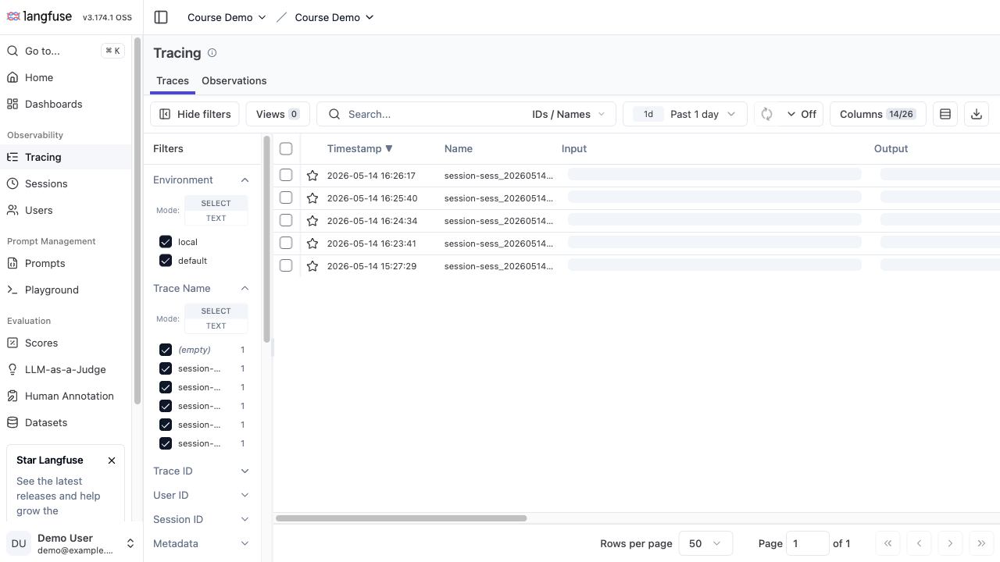
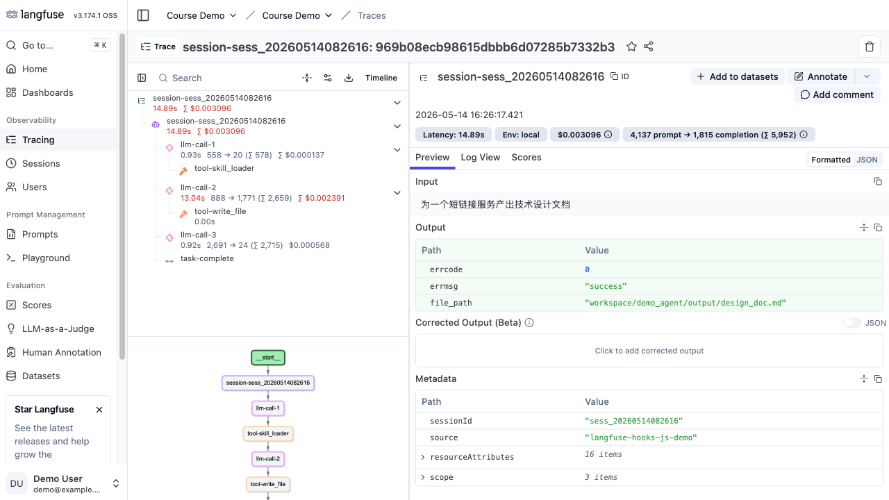

# 前言

写 Agent demo 时，最烦的不是模型偶尔答错，而是你根本不知道它在哪一步开始跑偏。

它看懂用户请求了吗？Skill 加载对了吗？工具到底传了什么参数？文件写成功了吗？只靠终端里那坨日志查，调两次还行，流程一长就是体力活。

所以这篇文章就介绍下用 **Langfuse** 来监控 agent 的运行。

这篇对应的 demo 在这里：[ParadeTo/blog/demo/langfuse-hooks](https://github.com/ParadeTo/blog/tree/master/demo/langfuse-hooks)。

---

# 一、Langfuse 解决什么问题

Langfuse 是开源 LLM 工程平台，支持 trace、prompt 管理、评估和数据集。这里先用最基础的 **Tracing**。

Agent 调试时，我最想看到四类信息：

| 信息 | 对应 Langfuse 里的东西 |
|------|------------------------|
| 一次用户请求 | trace / session |
| 一次 Agent 运行阶段 | span / agent |
| 一次 LLM 调用 | generation |
| 一次工具调用 | tool span |

普通日志是一行一行的。Langfuse 更像把这些日志重新排成树。

先把几个词对齐：`generation` 可以理解成一次模型调用记录；`tool span` 是一次工具调用记录；`observation` 是 Langfuse 里这些可观测节点的统称。先这么理解就够了，后面看图会更直观。

先看列表页。它用来快速定位“刚才是哪一次 run”，完整调用细节留到详情页看。

左侧 `Filters` 可以按 `Environment`、`Trace Name`、`Session ID` 过滤；顶部有搜索框和时间范围；中间表格里先看 `Timestamp` 和 `Name`，用它们找到刚才那次 run。`Input`、`Output` 在列表页只适合扫一眼，完整内容还是进详情页看。对 Agent 来说，`Name` 最好带上 session id，不然后面 trace 一多，很容易找错那次运行。

下面是本地跑完 demo 后的 trace 列表，`session-sess_20260514082616` 这一行就是一次真实请求：



点进去以后，才真正开始排查。页面大概这么看：

| 区域 | 看什么 |
|------|--------|
| 左侧 observation 树 | LLM 和 tool 的父子关系、耗时、token、cost |
| 左下 timeline | 整条 trace 的执行顺序和嵌套关系 |
| 右侧 Preview | 当前节点的 input、output |
| 右侧 Metadata | sessionId、source、环境等自定义字段 |

如果结果不对，先在左边找最后一次正常的 `llm-call`，再看下一次 tool 的入参和返回。比如 `tool-write_file` 失败，就直接点它，看传进去的 path、content 长度和返回错误；如果成本突然变高，就看是哪一轮 `llm-call` 的 token 飙了。

这次运行里，`llm-call-1`、`tool-skill_loader`、`llm-call-2`、`tool-write_file`、`llm-call-3` 都挂在同一条 trace 下：



```text
session-sess_20260514082616
├── llm-call-1
│   └── tool-skill_loader
├── llm-call-2
│   └── tool-write_file
├── llm-call-3
└── task-complete
```

这个结构省掉很多猜测。你不用再问“这条日志属于哪次 LLM 调用”，父子关系已经挂好了。

---

# 二、为什么先做 Hook 层

直接在业务代码里到处写 Langfuse 也能跑，但很快会乱。

刚开始只接 Langfuse，后来又想加 JSON log 和审计文件。如果这些逻辑散在 Agent loop、tool executor、task runner 里，最后业务流程会被观测代码泡满。

所以我先加一层 Hook，把 Agent 的生命周期压成 5+2 个事件：

```js
export const EventType = Object.freeze({
  BEFORE_TURN: 'before_turn',
  BEFORE_LLM: 'before_llm',
  BEFORE_TOOL_CALL: 'before_tool_call',
  AFTER_TOOL_CALL: 'after_tool_call',
  AFTER_TURN: 'after_turn',
  TASK_COMPLETE: 'task_complete',
  SESSION_END: 'session_end',
})
```

前 5 个事件对应一轮 Agent turn：

```text
before_turn -> before_llm -> before_tool_call -> after_tool_call -> after_turn
```

后 2 个事件负责收尾：

| 事件 | 用途 |
|------|------|
| `task_complete` | 记录最终产物、写审计 |
| `session_end` | 关闭 span、flush trace |

这样观测逻辑都变成 handler。Agent loop 不关心它们怎么实现，只负责在合适的时机发事件。

---

# 三、JS Demo 的结构

Agent 框架很多，事件入口也不一样。这个 demo 用一个轻量 adapter 承接 Hook，Agent loop 只暴露几个关键节点。

Agent loop 调这几个方法就够了：

```js
const adapter = new AgentObservabilityAdapter(registry, { sessionId })

await adapter.beforeLlm({ agentId, taskDescription, messages, llm })
await adapter.beforeToolCall({ toolName, toolInput })
await adapter.afterToolCall({ toolName, toolInput, toolOutput })
await adapter.afterTurn({ agentId, output, llmResponse })
await adapter.taskComplete({ rawOutput, description })
await adapter.cleanup()
```

后面的结构化日志、审计文件和 Langfuse trace，都会从这些事件里生成。

目录结构是这样：

```text
demo/langfuse-hooks/
├── src/
│   ├── demo.js
│   ├── instrumentation.js
│   ├── agent/real-agent.js
│   └── hook-framework/
│       ├── registry.js
│       ├── loader.js
│       └── agent-adapter.js
├── shared-hooks/
│   ├── hooks.yaml
│   ├── structured-log.js
│   └── langfuse-trace.js
└── workspace/demo_agent/
    ├── hooks/
    │   ├── hooks.yaml
    │   └── task-audit.js
    └── skills/
        └── sop_design/SKILL.md
```

这里用了两层配置：

| 层级 | 目录 | 放什么 |
|------|------|--------|
| 全局层 | `shared-hooks/` | 结构化日志、Langfuse trace |
| Workspace 层 | `workspace/demo_agent/hooks/` | 当前 Agent 自己的审计逻辑 |

全局 hook 配置长这样：

```yaml
hooks:
  BEFORE_LLM:
    - handler: structured-log.beforeLlmHandler
    - handler: langfuse-trace.beforeLlmHandler
  BEFORE_TOOL_CALL:
    - handler: structured-log.beforeToolHandler
    - handler: langfuse-trace.beforeToolHandler
  AFTER_TOOL_CALL:
    - handler: structured-log.afterToolHandler
    - handler: langfuse-trace.afterToolHandler
```

Workspace 自己只关心任务完成后的审计：

```yaml
hooks:
  TASK_COMPLETE:
    - handler: task-audit.writeAuditEntry
```

这个分层用起来很顺。日志和 trace 属于通用能力，每个 Agent 都复制一遍没必要；审计、告警、业务埋点和角色关系更近，放在 workspace 里更顺手。

---

# 四、接入 Langfuse JS SDK v5

Langfuse 初始化代码在 `src/instrumentation.js`：

```js
import { NodeSDK } from '@opentelemetry/sdk-node'
import { LangfuseSpanProcessor } from '@langfuse/otel'

const sdk = new NodeSDK({
  spanProcessors: [
    new LangfuseSpanProcessor({
      publicKey: process.env.LANGFUSE_PUBLIC_KEY,
      secretKey: process.env.LANGFUSE_SECRET_KEY,
      baseUrl: process.env.LANGFUSE_BASE_URL || 'https://cloud.langfuse.com',
      environment: process.env.LANGFUSE_TRACING_ENVIRONMENT || 'local',
      exportMode: 'immediate',
    }),
  ],
})
```

`LANGFUSE_PUBLIC_KEY` 和 `LANGFUSE_SECRET_KEY` 来自 Langfuse 项目的 **Settings -> API Keys**。Public Key 通常长得像 `pk-lf-...`，Secret Key 通常长得像 `sk-lf-...`。

trace 创建逻辑在 `shared-hooks/langfuse-trace.js`。

第一次收到事件时，先创建一个 root observation：

```js
const root = startObservation(
  `session-${key}`,
  {
    metadata: {
      sessionId: key,
      source: 'langfuse-hooks-js-demo',
    },
  },
  { asType: 'agent' },
)
```

每次 `before_llm` 开一个 generation：

```js
state.generation = state.root.startObservation(
  `llm-call-${state.genCount}`,
  {
    input: promptPreview ? { prompt: promptPreview } : undefined,
    model,
    metadata: {
      agentId: ctx.agentId,
      turn: ctx.turnNumber,
    },
  },
  { asType: 'generation' },
)
```

每次工具调用挂在当前 generation 下面：

```js
const observation = currentToolParent(state).startObservation(
  `tool-${ctx.toolName}`,
  {
    input: ctx.toolInput,
    metadata: {
      tool: ctx.toolName,
      turn: ctx.turnNumber,
    },
  },
  { asType: 'tool' },
)
```

trace 树就这么长出来。

我还留了个兜底：如果 `after_turn` 时还有没关掉的 tool span，会自动关闭并标成 `WARNING`。真实 Agent 很容易在异常分支里漏收尾，Hook 层最好兜一下。

---

# 总结

这篇其实只解决一个问题：Agent 跑起来以后，怎么知道每一步发生了什么。

我把运行过程拆成 5+2 个 Hook 事件，再用 handler 接上日志、审计和 Langfuse trace。HookRegistry 管分发，HookLoader 管从全局层和 workspace 层加载配置。

Langfuse 里，一次任务是一个 root observation，下面挂 generation、tool span 和 task-complete。下次结果不对，先点开 trace，看最后一次正常的 LLM 调用和紧跟着的工具调用，问题通常就在那里。
