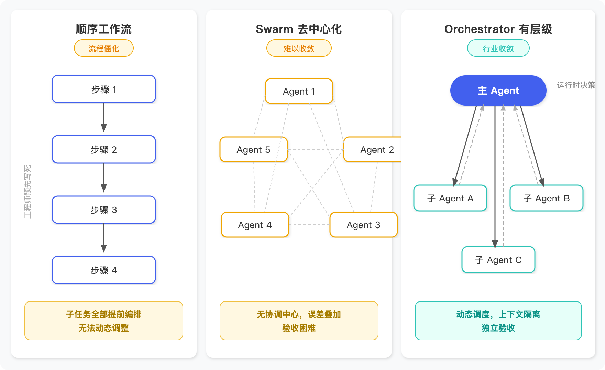
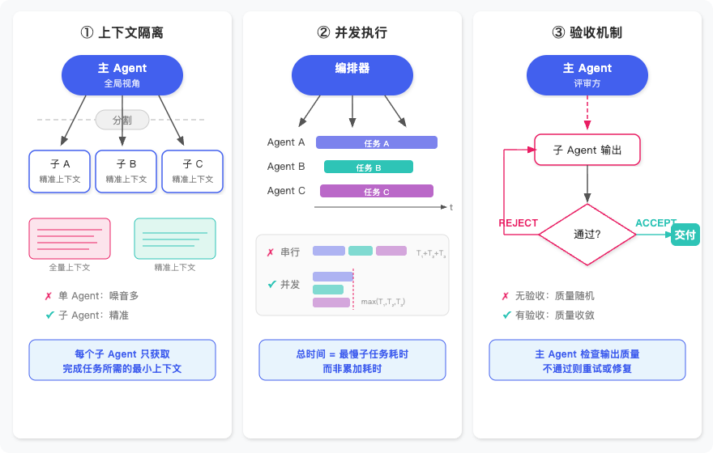

## 前言

这个系列写到第七篇了。前面六篇分别聊了 [Skill 系统](/2026/04/07/ai-agent-skill/)、[ReAct 循环](/2026/04/09/ai-agent-skill-2/)、Context Engineering、文件系统记忆、RAG 长期记忆，以及把这些东西[整合进一个飞书助手](/2026/04/16/ai-agent-final/)。回头看，整条线的方向一直没变：让一个 Agent 从"能听懂话"到"能干活"，能力越堆越多。

但问题是，所有这些能力都跑在同一个 Agent 的上下文里。

一个人干活，任务简单的时候没什么感觉。可一旦任务变复杂——比如要同时改前端页面、写后端接口、跑测试用例、更新文档——单 Agent 就开始撞墙了。撞的还不是一堵墙，是好几堵。

第一堵是**效果墙**。上下文越塞越长，模型的注意力是有限的，塞到后面推理质量就开始往下掉。你让它同时关注 UI 样式和数据库 Schema，它大概率顾了这头忘那头。

第二堵是**性能墙**。一个 Agent 只能串行执行，任务多了就排队。五个子任务每个要两分钟，串着跑就是十分钟，没法并行。

第三堵是**成本墙**。每一轮对话都要把完整上下文发给模型，前端的代码、后端的代码、测试的代码全混在一起，Token 数蹭蹭往上涨。干的活越多，每一轮的账单就越贵。

你可能会想，之前不是讲过 Context Engineering 吗？压缩、裁剪、摘要，把上下文控制住不就行了？能缓解，但治标不治本。上下文再怎么压，一个 Agent 的注意力窗口就那么大，塞不进去的东西该丢还是会丢。串行的问题压缩也解决不了。

所以思路得换一下：既然一个人干不过来，那就拆成一个团队。一个主 Agent 负责理解任务、拆解成子任务、分配给不同的子 Agent，每个子 Agent 拿着自己那份上下文独立干活，干完把结果交回来。这就是 **Orchestrator 模式**。

如果你用过 Claude Code，应该对这个模式不陌生。当你让它做一个稍微复杂点的任务时，它会把任务拆成几块，分发给子 Agent 并行执行，每个子 Agent 有自己独立的上下文窗口。用的时候能明显感觉到，几个子任务是同时在跑的，最后结果汇总回来。

这篇就来拆解这个模式的原理，然后自己动手实现一个。

## 一、三种协作模式

既然单 Agent 撞了墙，那多 Agent 协作就是自然的下一步。问题在于，多个 Agent 之间到底该怎么配合？业界摸索下来，主要有三种模式。

**Pipeline（顺序工作流）**，最直观的一种。工程师在代码里预先定义好执行步骤：step1 做完交给 step2，step2 做完交给 step3，一路串下去。好处显而易见：流程固定、行为可预测、出了问题容易定位是哪一步挂的。但坏处也很明显，整条链路在启动前就已经写死了。如果 step2 执行到一半发现 step1 的设计方案有问题，Pipeline 没法回头，只能硬着头皮往下走。你可以把它想象成工厂流水线：拧螺丝、装外壳、贴标签，每个工位只管自己那道工序，效率确实高，但如果来了一个形状不规则的零件，整条线就卡住了。

**Swarm（去中心化）**，走的是另一个极端。没有中央调度，所有 Agent 之间点对点通信，谁都可以跟谁说话。理论上这是最灵活的架构，每个 Agent 都能根据当前情况自主决定下一步找谁协作。但实际跑起来会发现，没有一个角色在全局把控方向，错误会像传话游戏一样层层放大。Google DeepMind 的一项研究（Agent Protocol AP-4）指出，扁平化的 Agent 网络产生的错误是层级化结构的 17 倍。想象一下一个没有主持人的群聊：二十个人同时在说话，每个人都很积极，但讨论了半小时回头一看，什么结论也没达成。

**Orchestrator（有层级）**，这是本文的主角。一个 **Main Agent** 负责理解用户意图、制定计划、拆解子任务，然后把子任务分派给 N 个 **Sub-Agent** 去独立执行。跟 Pipeline 最大的区别在于，Main Agent 的调度决策发生在**运行时**，而不是开发时写死的。面对一个需求，Main Agent 会动态判断需要几个子 Agent、每个子 Agent 扮演什么角色、以什么顺序或并行方式执行。子 Agent 完成工作后，把结果交回 Main Agent 做验收审查，不合格可以打回重做。这个模式有三个核心优势：**动态调度**，任务拆分根据实际情况决定而不是提前硬编码；**上下文隔离**，每个子 Agent 只拿到自己那份信息，不会互相污染；**独立验收**，Main Agent 可以逐个检查子任务质量，不合格就重新派发。



Orchestrator 是目前工业界实践的收敛方向。你用的 Claude Code、Devin、Cursor，底层都是这个模式的变体。下一节我们就来拆解 Orchestrator 内部到底是怎么运转的。

## 二、三个核心机制

知道了 Orchestrator 的基本思路，接下来要回答一个更具体的问题：Main Agent 和 Sub-Agent 之间到底靠什么机制协作？我把它拆成三个：上下文隔离、并发执行、验收机制。每一个都对应着单 Agent 时代的一个具体痛点。



### 1. 上下文隔离

单 Agent 做复杂任务的时候，所有信息都塞在同一个上下文里。前端代码、后端 Schema、测试 fixtures、部署配置，全部混在一起。任务少的时候还好，任务一多，上下文越来越长，模型的注意力被摊薄，推理质量就开始往下掉。这就像你一边写前端页面一边脑子里还要记着整个后端的数据库表结构、测试数据的 mock 规则、CI 的环境变量配置，记着记着就开始出错了。

Orchestrator 的解法是把上下文按任务切开。Main Agent 自己只保留全局视角：需求概览和各子任务的进度状态。每个 Sub-Agent 启动时，只拿到完成自己任务所需的那份信息，不多也不少。

这里有一个关键的设计：**显式上下文传递**。Main Agent 在 spawn 一个 Sub-Agent 的时候，需要明确把需求文档、API 接口定义这些材料作为 `context` 参数传进去。Sub-Agent 不会自动继承 Main Agent 的上下文，它只知道你显式告诉它的东西。这跟人类团队是一样的：你给新来的同事派活，不能假设他知道项目的所有背景，得把相关文档链接发给他。

结果的回传也做了精简。Sub-Agent 完成工作后，把产出写到文件里，只把**文件路径**返回给 Main Agent，而不是把整个文件内容塞回去。Main Agent 需要的时候再用 FileReadTool 按需读取。一个 300 行的代码文件，回到 Main Agent 的上下文里就是一行路径字符串。这样 Main Agent 的上下文始终保持精简，不会因为子任务越做越多而膨胀失控。

### 2. 并发执行

单 Agent 只能串行工作。五个子任务每个要两分钟，排着队跑就是十分钟，中间没有任何优化空间。

Orchestrator 能做的事情是：识别出哪些任务之间没有依赖关系，然后让它们同时跑。总耗时从所有任务的时间之和，变成最慢那一组的时间。

拿一个请假管理系统举例。整个开发流程大概是这样的：先做架构设计，设计完了出 API 接口定义，接口定义确认后让 Mock 工程师生成 Mock 数据。这三步是串行的，每一步都依赖上一步的产出。但一旦 API 接口定义和 Mock 数据都准备好了，前端和后端的开发就是**独立的**。前端拿着 Mock 数据开发页面，后端照着接口定义实现真实逻辑，两边谁也不需要等谁。这时候 Main Agent 就可以同时 spawn 两个 Sub-Agent，一个做前端一个做后端，并行推进。

但并发执行有一个前提条件：**共享的规范必须在并发开始之前冻结**。如果 API 接口定义还在变，你就让前端和后端同时开工，两边各自按不同版本的接口写代码，最后合到一起必然对不上。Cognition/Devin 的工程博客里专门提过这个坑：并发执行的任务如果共享了一份还没定稿的规范，产出的代码根本没法合并。所以 Main Agent 的调度逻辑里，必须先确保共享依赖已经就绪，才能放开并发。

### 3. 验收机制

没有 review 环节，产出质量就是一个黑盒。让写代码的 Agent 自己评价自己写的代码，它天然带有"执行偏差"：它觉得自己的实现是对的，因为它就是按自己的理解写的。

Orchestrator 把执行和审查拆给了不同角色。Sub-Agent 负责执行，Main Agent 负责验收。流程是这样的：Sub-Agent 完成工作，把产出写到文件里。Main Agent 读取输出文件，对照需求逐项检查，给出 ACCEPT 或 REJECT 的判定。

REJECT 之后的处理才是真正考验设计的地方。Main Agent 不能无脑重试，把同样的任务描述再发一遍。我们在 system prompt 里要求它：先读失败报告，分析根因到底是什么——是环境问题导致依赖没装上？是 import 路径写错了？是测试用例本身的逻辑有问题？还是业务理解偏了？搞清楚原因之后，再 spawn 一个修复用的子 Agent，在 context 里带上失败摘要、根因分析和具体的修复建议。当然，这些行为全靠 prompt 引导，LLM 不一定每次都严格照做，但通过 SOP 和 system prompt 的双重约束，大多数情况下能得到预期的效果。

如果同样的错误模式重试之后还是出现，Main Agent 必须换策略。可能是任务描述不够清楚，可能是给的上下文不够，也可能是任务粒度太粗需要拆得更细。总之不能复制粘贴同样的 spawn 参数反复跑。这个逻辑跟人类团队的 Code Review 流程是一样的：开发者提 PR，Tech Lead 审查，打回的时候会附上具体的修改意见，而不是只说一句"重新做"。

讲了这么多原理，下面我们进入代码，看看这三个机制在实现层面是什么样的。

## 三、代码实战

接下来我们用代码实现一个简化版的 Orchestrator，让它能协调多个子 Agent 完成一个软件开发任务。技术栈和这个系列前面几篇一样，JavaScript + Vercel AI SDK（`ai` 包）。核心思路也不复杂：Orchestrator 本身就是一个普通的 `generateText` 调用加上 tool-use，只不过它调用的 tool 里面会再发起新的 `generateText` 调用，每一个都是一个独立的子 Agent，拥有自己的上下文。

### 1. 动态创建子 Agent

先看最底层的构建单元——怎么创建一个子 Agent：

```javascript
import { generateText } from 'ai'
import { anthropic } from '@ai-sdk/anthropic'
import fs from 'fs'

async function runSubAgent({ role, goal, task, context, tools, outputFile }) {
  await generateText({
    model: anthropic('claude-sonnet-4-20250514'),
    system: `你是${role}。\n目标：${goal}\n\n背景信息：\n${context}`,
    prompt: `${task}\n\n请将最终结果写入文件 ${outputFile}。`,
    tools,
    maxSteps: 15,
  })

  return outputFile
}
```

这段代码的核心设计值得拆开说。

每次调用 `runSubAgent`，都会发起一个**全新的** `generateText` 请求。这意味着每个子 Agent 的上下文是从零开始的，不会带上主 Agent 的对话历史，也不会带上其他子 Agent 的任何信息。这就是上一节说的**上下文隔离**在代码层面的体现。

`system` prompt 由 `role`、`goal`、`context` 三部分拼接而成，全部由调用方（也就是主 Agent）显式传入。子 Agent 不会自动继承任何东西，它只知道你明确告诉它的信息。这个设计强制主 Agent 在派活的时候想清楚：这个子 Agent 到底需要知道什么？

函数用了解构参数 `{ role, goal, task, context, tools, outputFile }`，全部由调用方在运行时传入。没有预定义的角色类，角色是什么、目标是什么、带哪些工具，都是主 Agent 派活时动态决定的。`tools` 参数决定了子 Agent 能用什么工具，架构设计师可能只需要 `readFile` 和 `writeFile`，而测试工程师可能还需要 `runCommand` 来跑测试脚本。工具的分配本身就是权限控制的一部分。

函数返回的是 `outputFile` 路径，不是文件内容。子 Agent 把产出写进文件，回到主 Agent 手里的只有一个路径字符串。主 Agent 需要审查的时候再自己去读文件。这样不管子 Agent 写了 50 行还是 500 行代码，主 Agent 的上下文只增加一行。

`maxSteps: 15` 意味着每个子 Agent 内部会跑自己的 ReAct 循环（这个系列[第二篇](/2026/04/09/ai-agent-skill-2/)讲过的机制），自主调用工具、观察结果、继续推理，直到任务完成。

### 2. 串行与并发

有了 `runSubAgent` 这个基础设施，下一步是把它包装成主 Agent 能调用的 tool。我们需要两个：一个串行执行，一个并发执行。

```javascript
import { tool } from 'ai'
import { z } from 'zod'

const spawnSubAgent = tool({
  description: '创建一个子 Agent 执行任务（串行，等完成再返回）',
  parameters: z.object({
    role: z.string().describe('子 Agent 角色'),
    goal: z.string().describe('一句话目标'),
    task: z.string().describe('详细任务描述'),
    context: z.string().describe('子 Agent 需要的完整上下文'),
    outputFile: z.string().describe('结果输出文件路径'),
  }),
  execute: async ({ role, goal, task, context, outputFile }) => {
    const result = await runSubAgent({
      role, goal, task, context, outputFile,
      tools: { writeFile, readFile },
    })
    return { status: 'done', file: result }
  },
})

const spawnParallel = tool({
  description: '并发启动多个独立子 Agent',
  parameters: z.object({
    subtasks: z.array(z.object({
      role: z.string(),
      goal: z.string(),
      task: z.string(),
      context: z.string(),
      outputFile: z.string(),
    })),
  }),
  execute: async ({ subtasks }) => {
    const results = await Promise.allSettled(
      subtasks.map(st =>
        runSubAgent({ ...st, tools: { writeFile, readFile } })
      )
    )
    return results.map((r, i) => ({
      file: subtasks[i].outputFile,
      status: r.status === 'fulfilled' ? 'done' : `error: ${r.reason}`,
    }))
  },
})
```

`spawnSubAgent` 是串行版本。主 Agent 调用这个 tool 后，会 await `runSubAgent` 执行完毕才返回结果。适合有依赖关系的场景：必须先拿到架构设计文档，才能开始写 API 接口定义。

`spawnParallel` 是并发版本，用 `Promise.allSettled` 同时启动多个子 Agent。这里用 `allSettled` 而不是 `Promise.all` 是有讲究的：`all` 的语义是"一个失败全部中断"，而 `allSettled` 会等所有 Promise 都结束，不管成功还是失败，每个任务的结果独立记录。前端开发失败了不应该连带着把后端开发也杀掉。

两个 tool 底层调用的都是同一个 `runSubAgent` 函数。串行和并发不是两套不同的架构，只是调度策略不同。主 Agent 根据任务之间的依赖关系自行判断用哪个：有依赖就串行，没依赖就并发。

### 3. 主 Agent 的 Prompt 设计

基础设施都就位了，最后看主 Agent 本身怎么组装：

```javascript
async function runOrchestrator(requirementPath) {
  const sop = fs.readFileSync('skills/dev-sop.md', 'utf-8')
  const requirement = fs.readFileSync(requirementPath, 'utf-8')

  const { text } = await generateText({
    model: anthropic('claude-sonnet-4-20250514'),
    system: `你是一名有 10 年全栈经验的技术负责人。

你的工作方式：
1. 架构、代码、文档一律由子 Agent 产出——你只负责派单和验收
2. 给子 Agent 派任务时，把它需要的信息全部传进 context，不要假设它知道任何背景
3. 没有依赖关系的任务用 spawnParallel 并发；有依赖的用 spawnSubAgent 串行
4. 子 Agent 完成后，用 readFile 读取产出文件做验收
5. 验收不通过时，先分析根因，再带着分析结果 spawn 新的子 Agent 修复

━━━ SOP 流程 ━━━
${sop}`,
    prompt: `请处理以下需求，按 SOP 完成交付：\n\n${requirement}`,
    tools: { spawnSubAgent, spawnParallel, readFile },
    maxSteps: 50,
  })

  return text
}
```

这段代码里最值得关注的是 system prompt 的设计。

首先是 **SOP Skill 注入**。系统提示里嵌入了一个 `dev-sop.md` 文件，它定义了完整的交付流程：设计 → Mock → 开发 → 测试 → 修复 → 交付。这和这个系列[第一篇](/2026/04/07/ai-agent-skill/)讲的 Skill 系统是一个思路——用一份 Skill 文件来驱动 Agent 的行为，只不过这次驱动的是整个 Orchestrator 的工作流。

然后看主 Agent 手里只有**三个 tool**：`spawnSubAgent`、`spawnParallel`、`readFile`。注意它没有 `writeFile`——主 Agent 不能自己写代码、不能自己写文档，所有产出工作必须委派给子 Agent。"你只负责派单和验收"这条规则从工具层面做了硬约束，不是靠 prompt 里说一句"请不要自己写代码"这种软约束。

system prompt 里的 5 条工作规则，直接对应了上一节讲的三个核心机制。规则 2（"把它需要的信息全部传进 context"）对应上下文隔离；规则 3（"没有依赖关系的任务用 spawnParallel 并发"）对应并发执行；规则 5（"先分析根因，再带着分析结果 spawn 新的子 Agent 修复"）对应验收机制里的"不能无脑重试"。理论和代码就这样对上了。

`maxSteps: 50` 比子 Agent 的 15 要大得多。这是因为 Orchestrator 的每一轮操作涉及多个 tool 调用：spawn 一个子 Agent 是一次调用，读取产出文件做验收又是一次，验收不通过再 spawn 修复子 Agent 又是一次。一个典型的流程（spawn 架构师 → 读产出 → spawn 接口设计师 → 读产出 → 并发 spawn 前后端 → 读产出 → 验收 → 可能重试）轻轻松松就要 20-30 步。

最后值得强调的一点：整个 Orchestrator 就是一个 `generateText` 调用加上几个 tool，没有用任何特殊框架。所谓"编排器"不是一个需要额外学习的架构组件，它就是一个普通的 LLM 调用，只不过它的 tool 里面恰好会发起新的 LLM 调用。这种递归结构——LLM 调用 tool，tool 里面再调用 LLM——就是 Orchestrator 模式的本质。

### 4. 运行效果

把上面的代码跑起来，整个执行过程大概是这样的：

```text
========== Orchestrator 启动 ==========
[主 Agent] 读取 requirements.md...

--- 阶段 1-2：串行（有依赖） ---
[sub-agent: 架构设计师] 启动 (独立上下文)
[sub-agent: 架构设计师] 完成 → design/architecture.md
[主 Agent] 验收 architecture.md + api_spec.md ✓

[sub-agent: Mock 工程师] 启动 (独立上下文)
[sub-agent: Mock 工程师] 完成 → tests/leaves.test.js
[主 Agent] 验收 mock + tests ✓

--- 阶段 3：并发（无依赖） ---
[并发启动] 2 个子 Agent 同时运行...
  [前端开发工程师] 启动 (独立上下文)
  [后端开发工程师] 启动 (独立上下文)
  [完成] → public/index.html
  [完成] → server/app.js

--- 验收 ---
[主 Agent] 验收后端 ✓
[主 Agent] 验收前端 → 发现 2 个 Bug ✗
  → Bug 1：list.js 中 UUID 在 onclick 属性中未加引号，连字符被解析为减法
  → Bug 2：api.js 中 201 Created 被误判为错误，新建功能失效

[sub-agent: 前端修复工程师] 启动 (独立上下文)
  context: 失败报告 + 根因分析 + 修复建议
[sub-agent: 前端修复工程师] 完成 → public/js/list.js (修复版)
[主 Agent] 验收前端 ✓

[sub-agent: 交付工程师] 完成 → delivery_report.md
========== 交付完成 ==========
```

从这个日志里可以看到上一节讲的三个机制是怎么配合工作的。

**串行阶段**（架构设计 → Mock）：架构设计师同时产出了 `architecture.md` 和 `api_spec.md`，Mock 工程师基于接口定义生成测试骨架。这两步有明确的前后依赖，所以必须一个接一个地跑。

**并发阶段**（前端 + 后端同时开发）：接口定义和测试骨架就位后，前端和后端的开发工作互不依赖。主 Agent 调用 `spawnParallel` 同时启动两个子 Agent，两边并行推进。

**验收 + 修复**：前端验收没通过，主 Agent 发现了两个 Bug——UUID 的连字符在 `onclick` 属性里被当成减法运算符、`201 Created` 状态码被误判为请求失败。它没有简单地把同样的任务再发一遍，而是 spawn 了一个前端修复工程师，在 context 里带上了具体的 Bug 描述和修复建议。这是有针对性的修复，不是盲目重试。

整个流程由一个 `generateText` 调用（Orchestrator）驱动。日志里每一行 `[sub-agent]` 都对应着一个嵌套的 `generateText` 调用，拥有独立的上下文。实际运行的输出会比这个详细得多，这里做了简化方便阅读。

## 四、实践建议

原理和代码都讲完了，这一节聊聊实际跑 Orchestrator 时容易踩的坑，以及哪些做法确实有效。

### 别做的事

第一个坑是**没有 kill switch**。你给 Orchestrator 设了 `maxSteps: 50`，子 Agent 设了 `maxSteps: 15`，看起来有上限了。但如果主 Agent 反复验收不通过、反复 spawn 修复子 Agent 重试呢？它不会觉得"我已经试了五次了该放弃了"，它会一直试下去直到 maxSteps 耗尽。HackerNews 上有人分享过案例，一个没设预算上限的 Agent 跑了一整晚，醒来发现 $600 账单换来零产出。解决办法很朴素：给 Orchestrator 加一个全局的 step 计数器，跑超了就强制停止，输出一份当前进度报告让人来接手。

第二个坑是**规划出错层层放大**。Orchestrator 的工作流是树状的：主 Agent 的规划决定了所有子 Agent 的方向。如果主 Agent 的架构决策就是错的，比如把前后端的数据流设计反了，那后面每个子 Agent 都在错误前提下执行，写出来的代码全是错的。错误不是加法，是乘法。所以主 Agent 的 prompt 质量比什么都重要，它是整棵树的根节点，根歪了枝叶全歪。

第三个坑是**共享规范没定就并发**。前面第二节讲并发执行的时候专门提过这个问题，这里再强调一次是因为它真的太常见了。接口定义还没冻结就让前后端 Agent 同时开工，两边各自按自己的理解写代码，最后合到一起发现字段名对不上、数据结构不一样。Cognition/Devin 的工程博客里专门写过这个坑，并发任务共享的规范必须在启动前就完全确定，一个字都不能留"待定"。

第四个坑是 **Agent 平铺不分层**。所有 Agent 放在同一层互相通信，没有一个角色负责全局把控。前面第一节提到 Google DeepMind 的研究发现，平铺 Agent 产生的误差是层级结构的 17 倍，这个数字不是夸张，是因为没人管全局的时候错误会在 Agent 之间来回传递、互相放大，很快就失控了。

### 该做的事

第一条，**先跑通单 Agent**。别上来就搞多 Agent 架构。先用一个 Agent 加上精心设计的 prompt 把任务跑一遍，看看效果。很多时候你会发现，单 Agent 的产出已经够用了，根本不需要拆分。只有当你确认任务确实有可以并行的独立子任务，而且并发能带来明显的时间或质量收益时，再考虑上 Orchestrator。

第二条，**执行和评审分离**。这一点在第二节的验收机制里已经讲过原理，这里补充一下为什么它在实践中特别重要。写代码的 Agent 对自己的代码有天然的"执行偏差"，它很难客观评价自己写的东西。让主 Agent 来做独立的评审和验收，相当于给流程加了一层 Code Review。验收的标准要写在 prompt 里，越具体越好："接口响应格式是否符合 api_spec.md 的定义""测试覆盖率是否达到目标"，不要只说"检查一下代码质量"。

第三条，**每一步的可靠性要够高**。可靠性是指数衰减的，这个数学事实经常被忽略。如果你的流程有 10 个步骤，每一步的成功率是 95%，串起来的整体成功率是 0.95 的 10 次方，大约 60%。步骤越多，对每一步的要求就越高。所以在拆子任务的时候要克制，不是拆得越细越好，粒度太细反而会因为步骤太多拉低整体成功率。

第四条，**显式传递上下文**。Anthropic 分享过一个真实案例：三个子 Agent 重复调查同一个 bug，原因是主 Agent 在 spawn 后面的子 Agent 时没有把前面子 Agent 的调查结果传进去。每个子 Agent 都从零开始排查，做了大量重复工作。永远显式传递上下文，不要假设子 Agent 知道任何事情。代码层面就是那个 `context` 参数，每次 spawn 的时候问自己一句：这个子 Agent 需要知道哪些已有信息？

## 五、总结

回顾一下整篇文章的核心：Orchestrator 模式就是一个主 Agent 负责拆解任务、分派调度、验收结果，加上 N 个子 Agent 各自独立执行，子 Agent 的产出通过文件路径传回主 Agent。

这个系列前六篇的方向一直是让一个 Agent 越来越强——加 Skill、加 ReAct、加记忆、加 RAG。从这篇开始方向变了：不是让一个 Agent 更强，而是让多个 Agent 协作。单 Agent 的能力是多 Agent 协作的基础，前面积累的那些技术在子 Agent 身上全用得到。

什么时候该用 Orchestrator？判断标准很简单：你的任务能不能自然地拆成几个独立的子任务，拆开之后并发执行能不能带来明显收益。如果能，上 Orchestrator；如果拆不开，或者拆开了也没有并发收益，单 Agent 加上好的 prompt 就够了。不要为了用多 Agent 而用多 Agent。
