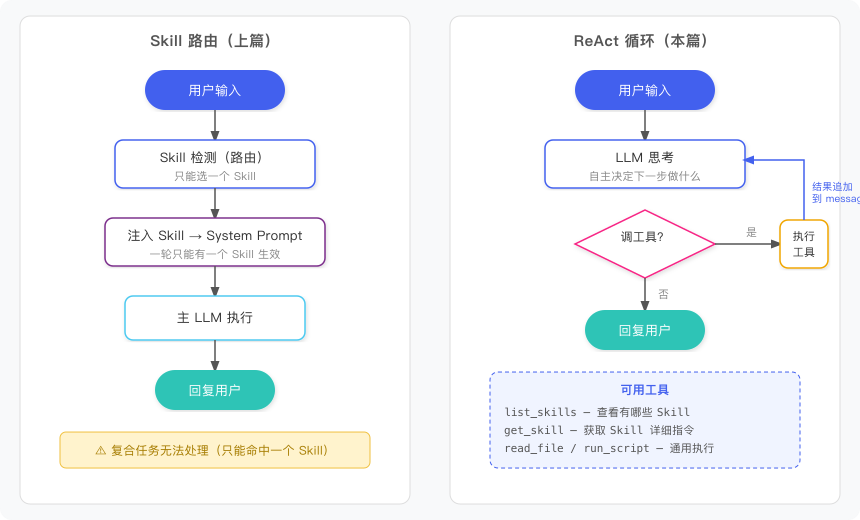
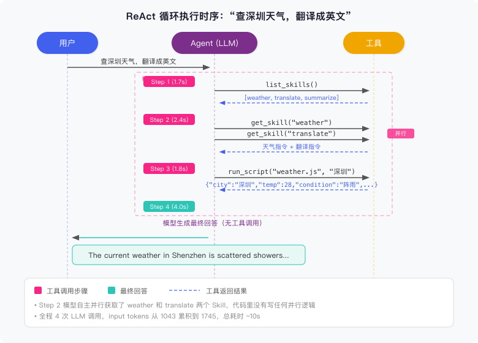

# 前言

[上篇文章](/2026/04/07/ai-agent-skill/)把 Agent 的能力拆成了独立的 Skill 文件，用向量检索或 LLM 意图分类做路由，命中哪个就加载哪个的 prompt。解决了 System Prompt 膨胀的问题，跑起来效果也不错。

但后来测试时碰到一个绕不过去的问题：用户说"查一下北京天气，翻译成英文"。上篇的流程是路由器先做一次检测、命中一个 Skill、注入 system prompt、调 LLM 回复。**检测只做一次，只能返回一个 Skill**。不管命中 `weather` 还是 `translate`，另一半任务都完不成。根源在于检测和执行是分离的两个阶段，检测把决策一次性做完了，执行阶段没有回头的机会。

这篇来解决这个问题。思路是换掉 detect-then-execute 的两阶段架构，改用 ReAct 循环，让 Agent 在执行过程中自己判断需要什么 Skill，按需获取，逐步完成。

# 一、从"路由"到"循环"

上篇的模式是"先选再做"——先选好 Skill，再一口气执行完。

换个思路：让模型每次只做一个决定。要不要调工具？调哪个？拿到结果后再想下一步。一直重复，直到任务做完。这就是 **ReAct**（Reason + Act）循环。

用伪代码表达：

```javascript
while (true) {
  response = LLM(messages)

  if (response 没有调用工具)
    return response.text     // 任务完成，输出最终回答

  执行工具，拿到结果
  把工具调用和结果追加到 messages
  // 进入下一轮，模型能看到之前所有的工具调用和结果
}
```

每一轮循环，模型看到完整的对话历史（包括之前的工具调用和结果），自己决定下一步。不需要提前路由，不需要一次性选好所有 Skill。需要什么能力，循环到那一步再拿就行。

其实上篇在第六节加入工具调用时就用了 `maxSteps: 5`，Vercel AI SDK 在内部做的事情和上面的伪代码一样——模型调了工具就自动执行并继续，直到模型不再调工具或者到达步数上限。本篇把这个循环从 SDK 里拿出来自己写，看得更清楚，也方便在循环中加日志和自定义逻辑。

# 二、把 Skill 变成工具

有了循环还不够。上篇的 Skill 是作为 System Prompt 注入的——路由选中一个 Skill，它的 prompt 变成系统消息，整个对话都在这个 Skill 的语境下。一轮对话只有一个 System Prompt，所以只能有一个 Skill 生效。

要在循环里用多个 Skill，做法很直接：**别把 Skill 塞进 System Prompt，让 Agent 自己来查。**

提供两个工具：

- **`list_skills`**：返回所有 Skill 的名称和描述（轻量摘要，不含完整指令）
- **`get_skill`**：传入名称，返回那个 Skill 的完整行为指令

System Prompt 只写一句话："你有一组 Skill，需要时用工具去查。"具体指令在运行时按需拉取。

这样做的好处是 Agent 可以在同一轮对话里获取多个 Skill 的指令。先拿 weather 的指令查天气，再拿 translate 的指令做翻译，每个 Skill 的指令只在需要时才进入上下文。说白了就是渐进披露——别一股脑把所有信息塞给模型，让它需要什么自己去拿。

下面这张图展示了两种架构的区别：



左边是上篇的 detect-then-execute，右边是本篇的 ReAct 循环。区别一目了然：右边的 Agent 可以在执行过程中多次获取不同 Skill。

# 三、完整实现

依然用 Vercel AI SDK，代码量不大，一个文件搞定。

项目结构：

```
agent-react/
├── index.js            # 全部逻辑：工具 + ReAct 循环 + REPL
├── package.json
└── skills/
    ├── weather.md
    ├── weather.js
    ├── translate.md
    └── summarize.md
```

## 3.1 System Prompt

精简到只描述工作方式，不包含任何 Skill 的具体指令：

```javascript
const SYSTEM_PROMPT = `你是一个通用智能助手，可以自主使用工具来完成用户的任务。

你拥有一组 Skill（专项能力），但你并不预先知道它们的详细指令。
当你判断任务可能需要某项专项能力时，请先用 list_skills 查看可用 Skill 列表，
再用 get_skill 获取相关 Skill 的详细指令，然后严格按照指令执行。

请根据用户的需求，自主决定每一步该做什么。
如果任务需要多个步骤（例如"查天气并翻译成英文"），请逐步完成，按需获取所需的 Skill 指令。`
```

对比上篇：上篇的 System Prompt 是被选中 Skill 的完整内容（比如翻译 Skill 的全部规则）。这里不注入任何 Skill 内容，全靠 Agent 在循环中通过工具获取。

## 3.2 工具定义

四个工具，两类用途：

```javascript
function createTools(skills) {
  return {
    // Skill 发现
    list_skills: tool({
      description: '列出所有可用的 Skill（专项能力）及其简要描述',
      parameters: z.object({}),
      execute: async () => {
        const list = skills.map((s) => ({
          name: s.name,
          description: s.description,
        }))
        return JSON.stringify(list)
      },
    }),
    get_skill: tool({
      description:
        '获取指定 Skill 的详细行为指令，在执行相关任务前应先调用此工具',
      parameters: z.object({
        name: z.string().describe('Skill 名称'),
      }),
      execute: async ({name}) => {
        const skill = skills.find((s) => s.name === name)
        if (!skill) return `未找到名为 "${name}" 的 Skill`
        return skill.prompt
      },
    }),

    // 通用执行
    read_file: tool({
      description: '读取指定路径的文件内容',
      parameters: z.object({path: z.string().describe('文件路径')}),
      execute: async ({path: filePath}) => {
        try {
          return fs.readFileSync(filePath, 'utf-8')
        } catch (e) {
          return `读取失败: ${e.message}`
        }
      },
    }),
    run_script: tool({
      description: '执行指定的 Node.js 脚本文件，返回执行结果',
      parameters: z.object({
        path: z.string().describe('脚本文件路径'),
        args: z.string().optional().describe('传给脚本的参数'),
      }),
      execute: async ({path: scriptPath, args}) => {
        const cmd = args ? `node ${scriptPath} ${args}` : `node ${scriptPath}`
        try {
          return execSync(cmd, {encoding: 'utf-8', timeout: 10000}).trim()
        } catch (e) {
          return `执行失败: ${e.message}`
        }
      },
    }),
  }
}
```

`list_skills` 只返回 name 和 description，不返回完整 prompt。Agent 看到描述后，用 `get_skill` 按名称获取需要的那个 Skill 的全部行为指令。

注意这里没有 `get_weather` 这样的专用工具。天气查询是一个 Skill，Agent 通过 `get_skill("weather")` 拿到指令后，自己用 `run_script` 去调 `weather.js`。所有领域能力都走 Skill，工具层保持通用。

## 3.3 显式 ReAct 循环

关键一步：把 SDK 的 `maxSteps` 设为 1，每次只走一步，循环由我们自己控制。

```javascript
const MAX_ITERATIONS = 10

async function chat(messages, tools) {
  for (let i = 1; i <= MAX_ITERATIONS; i++) {
    const {steps, text, response} = await generateText({
      model: anthropic('claude-sonnet-4-6'),
      system: SYSTEM_PROMPT,
      messages,
      tools,
      maxSteps: 1,
    })

    const step = steps[0]
    if (!step) return text

    // 没有工具调用 → 最终回答，跳出循环
    if (step.toolCalls.length === 0) {
      return step.text
    }

    // 有工具调用 → 打印中间过程
    for (const tc of step.toolCalls) {
      const result = step.toolResults.find(
        (r) => r.toolCallId === tc.toolCallId,
      )
      console.log(
        `  [Step ${i}] Tool: ${tc.toolName}(${JSON.stringify(tc.args)})`,
      )
      if (result) {
        const preview = String(result.result).slice(0, 120)
        console.log(`           Result: ${preview}`)
      }
    }

    // 把本轮的 assistant + tool_result 追加到 messages，进入下一轮
    messages.push(...response.messages)
  }

  return '（达到最大迭代次数）'
}
```

`maxSteps: 1` 让 SDK 每次只做一件事：调一次模型，如果有工具调用就执行，然后停住不往下走。控制权回到我们的 `for` 循环，想加日志、做限制都方便。

循环退出有两个条件：模型不再调用任何工具（任务完成），或者到达最大迭代次数。

# 四、复合任务实战

为了验证 Skill 指令确实被执行了而不是模型自由发挥，我在两个 Skill 里各加了一个特殊要求：

- **weather.md**：回复开头必须带"【天气播报】"前缀
- **translate.md**：翻译结果末尾必须带 `(translated by Skill)` 标记

如果最终输出里出现了这两个标记，就说明模型确实读取并遵守了 Skill 指令。跑一下"查深圳天气，翻译成英文"：

```
You: 查一下深圳天气，然后翻译成英文

  [Step 1] Tool: list_skills({})
           Result: [{"name":"summarize",...},{"name":"translate",...},{"name":"weather",...}]

  [Step 2] Tool: get_skill({"name":"weather"})
           Result: 你是一个天气助手。用 skills/weather.js 查询天气数据...
                   回复时必须在开头加上"【天气播报】"前缀。
  [Step 2] Tool: get_skill({"name":"translate"})
           Result: 你是一位专业翻译。请将用户提供的文本翻译成目标语言：...
                   翻译结果末尾必须加上"(translated by Skill)"标记

  [Step 3] Tool: run_script({"path":"skills/weather.js","args":"深圳"})
           Result: {"city":"深圳","temp":28,"condition":"阵雨","humidity":78,"wind":"南风4级"}

Agent: 【天气播报】
       深圳当前天气情况如下：阵雨，温度 28°C，湿度 78%，南风4级

       The current weather in Shenzhen is as follows:
       Condition: Showers, Temperature: 28°C, Humidity: 78%,
       Wind: Southerly wind, Level 4 (translated by Skill)
```

两个标记都出现了——模型确实读取并遵守了两个 Skill 的指令。

下面是对应的时序图：



四次 LLM 调用走完。拆开看：

- **Step 1**：Agent 先查有哪些 Skill 可用，发现 weather 和 translate 都在列表里
- **Step 2**：模型一次性并行获取了 weather 和 translate 两个 Skill 的指令，因为它判断出两个都需要
- **Step 3**：按 weather Skill 的指令，调 `run_script` 拿到天气 JSON
- **Step 4**：模型手里有天气数据和翻译指令，直接生成英文回答，不再调用任何工具

Step 2 的并行调用挺有意思。代码里没写任何"并行获取"的逻辑，是模型自己决定一次发两个 `get_skill`。

# 五、延伸：Claude Code 怎么管理 Skill 上下文

有一点需要留意：Skill 指令通过 `get_skill` 加载后，会作为 tool result 留在消息历史里，后续每一轮 LLM 调用都会带上。即使那个 Skill 的任务已经完成，它的指令仍然占着 token。短对话问题不大，但长对话中如果累积加载多个 Skill，上下文开销会越来越高。

这不是疏忽。Claude Code 它也不清理已加载的 Skill 内容，甚至专门写了机制保证 Skill 内容在上下文压缩后不丢。

先说加载方式。Claude Code 的 Skill 工具有两种执行模式：**inline**（默认）和 **fork**。inline 模式下，调用 Skill 后，Skill 的完整内容被包装成一条 user message 注入到对话历史中；工具本身的返回值只有一句 `"Launching skill: xxx"`，几乎不占 token。真正的 Skill 指令作为普通消息留在上下文里，后续每轮调用模型都能看到。fork 模式则相反——Skill 在一个独立的子 Agent 中运行，只把最终结果摘要返回主对话，Skill 指令不进入主上下文。

为什么要让指令一直留着？因为很多 Skill 是持续生效的行为规则。比如 `test-driven-development` 的内容是"写代码前先写测试"，`verification-before-completion` 是"声称完成前必须跑验证"。清除了，模型在后续步骤就会忘掉这些约束。

还有压缩的问题。Claude Code 在对话接近上下文上限时会自动压缩（compact）历史消息。普通 tool result 压缩后只剩摘要，但 Skill 内容不能丢。它的做法是：每次加载 Skill 时，把它的名称、路径和完整内容存入一个全局的 `invokedSkills` Map；每次 compact 执行后，从这个 Map 里取出内容，作为 `invoked_skills` 类型的 attachment 重新注入到压缩后的上下文中。源码注释里写得很明确：_"We intentionally do NOT clear invoked skill content here. Skill content must survive across multiple compactions."_

回到我们的实现：`get_skill` 返回的指令留在 messages 里，后续每轮都带上。现在上下文窗口够大，这么做问题不大。如果你的场景涉及大量 Skill 或超长对话，可以参考 Claude Code 的做法——持续生效的行为规则用 inline 保留，一次性任务用 fork 隔离，别让已完成的 Skill 指令占着上下文。

顺便说一下 Claude Code 里怎么开启 fork 模式。很简单，在 Skill 的 YAML frontmatter 里加一行 `context: fork` 就行：

```markdown
---
name: blog-stats
description: 统计博客文章数据
context: fork
---

...
```

实际跑起来两种模式的 UI 不一样：inline 完成后显示 `Successfully loaded skill`，fork 完成后显示 `Done`，执行过程中还能看到子 Agent 的工具调用进度。

# 总结

上篇把能力拆成 Skill 文件解决了 Prompt 膨胀问题，但路由是一次性的，碰到复合任务就卡住了。这篇做了两个改动：用显式 ReAct 循环替换 detect-then-execute，让 Agent 可以多步决策；把 Skill 从 System Prompt 里拿出来变成 `list_skills` / `get_skill` 两个工具，让 Agent 按需获取。

两种方案可以共存。单一意图的任务用路由，两次 LLM 调用就搞定；复合任务走 ReAct，让 Agent 自己规划步骤。

两个改动加起来，Agent 在同一轮对话里就能自主发现和组合多个 Skill。工具层保持通用（`list_skills` / `get_skill` / `read_file` / `run_script`），新增 Skill 只需要加一个 `.md` 文件，不用改代码。
