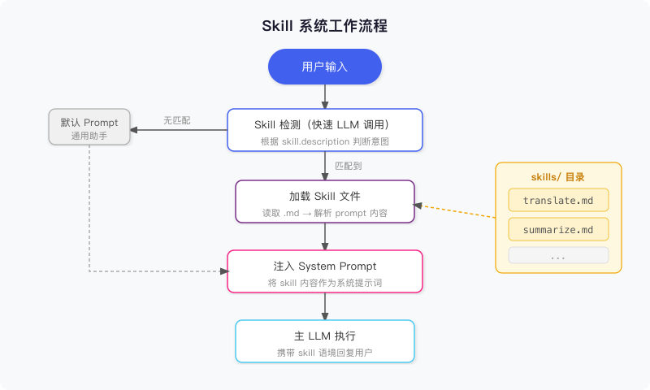
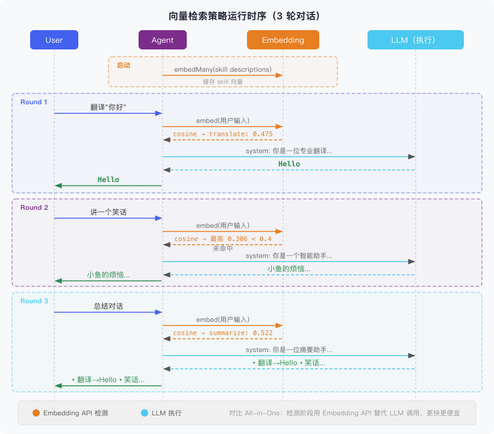
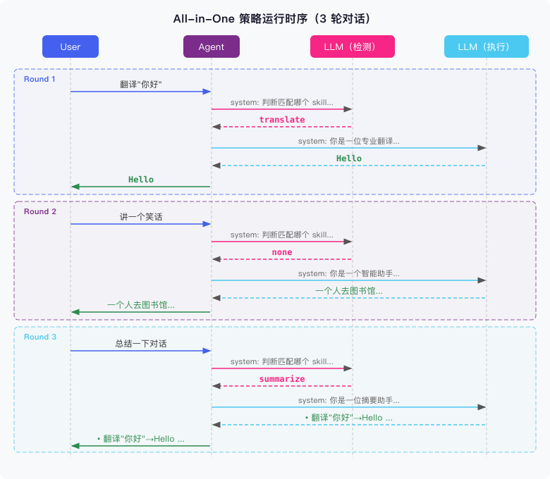
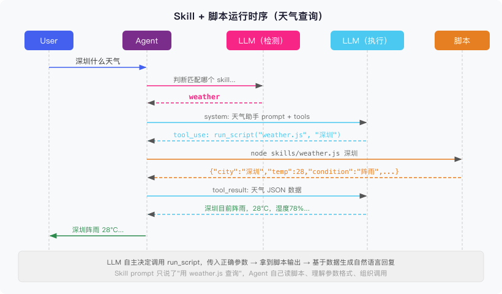

# 前言

给 Agent 加能力，最直觉的做法是往 System Prompt 里塞——翻译加一段、总结加一段、代码审查再加一段。一开始没什么问题，但随着功能越来越多，System Prompt 慢慢膨胀成了一个数千 token 的怪物，改哪里都要小心翼翼，生怕踩到别的能力。

接入 MCP 之后情况更糟。一个 MCP Server 动辄暴露十几个 Tool，每个 Tool 的 name、description、参数 schema 全都得注入上下文。接入五六个 Server，Tool 定义本身就能烧掉几千 token——而且大多数时候这些工具根本用不上，白白挤占上下文窗口。

问题的根源其实一样：**所有能力始终在线，没有按需加载。**

Skill 系统就是为了解决这个问题——把每种能力（包括行为指导和它依赖的工具集）独立成一个文件，Agent 只在需要的时候才加载进上下文，不需要的能力和工具定义完全不占 token。下面讲设计思路，然后用 Vercel AI SDK 实现两种检测策略，跑通看看效果。

# 一、什么是 Skill

先说清楚一件事：Skill 和 Tool 不是同一个东西。

Tool 是函数调用层面的扩展，给 Agent 定义可以调用的函数，比如 `search_web(query)`、`get_weather(city)`，模型通过 function calling 触发它们，拿到执行结果继续推理。说白了，Tool 管的是"Agent 能做什么"。

Skill 是提示词层面的扩展，给 Agent 注入一段行为指导，告诉它在特定场景下该用什么角色、什么方式去响应。Skill 管的是"Agent 怎么做"。

打个比方：Tool 是锤子、扳手，Skill 是"木工操作手册"。手册本身不增加工具，但告诉你什么时候用锤子、什么时候用扳手。

两者也可以组合使用。比如一个"数据分析"Skill 描述分析思路和输出格式，同时搭配 `query_database` 等 Tool 来获取数据。行为和工具捆在一起，按需激活。

# 二、Skill 的数据结构设计

Skill 用 Markdown 文件来存储，结构分两部分：

- **Frontmatter**：机器读取，用于检索和匹配。包含 `name`（唯一标识）和 `description`（一句话描述能力，这个字段是 Skill 能否被正确触发的关键）
- **正文**：人类可读的指令内容，直接作为 System Prompt 注入给 Agent

以一个翻译 Skill 为例：

```markdown
---
name: translate
description: 将用户提供的文本翻译成目标语言，支持中英互译
---

你是一位专业翻译。请将用户提供的文本翻译成目标语言：

- 如果原文是中文，翻译成英文
- 如果原文是英文，翻译成中文
- 如果用户指定了目标语言，按用户要求翻译
- 保持原文的语气和风格
- 只输出翻译结果，不需要解释或附加说明
```

为什么选 Markdown？放进 Git 改动历史一目了然，非开发者能直接打开编辑，加 Skill 就是加文件，不碰代码。

# 三、Agent 如何发现 Skill

有了 Skill 文件，下一个问题是：Agent 怎么知道该用哪个？

有两种常见方案：

**方案一：向量语义检索**

把每个 Skill 的 description embedding 化，用户输入来了先做向量相似度搜索，取 Top-K 个候选 Skill。适合 Skill 数量很多（几十到几百）的场景，但需要额外的 embedding 服务。

**方案二：LLM 意图判断**

把所有 Skill 的 name + description 列出来，让 LLM 判断"用户这句话匹配哪个 Skill？"。只传描述不传完整指令，上下文开销很小。可以用主模型做检测，也可以换成轻量的小模型（如 claude-haiku）来降低延迟和成本。

两种方案各有取舍，下面都实现出来，横向对比一下。

# 四、完整工作流程

不管用哪种检测策略，整体执行流程都是一样的：



核心路径是：

1. 用户输入到来
2. **Skill 检测**：通过某种策略（向量 / LLM 分类）判断是否命中某个 Skill
3. **加载 Skill**：如果命中，读取对应 `.md` 文件，提取正文作为 System Prompt
4. **执行**：带着 Skill 注入的 System Prompt，调用主 LLM 回复用户
5. 如果没有命中任何 Skill，使用默认的通用 System Prompt 兜底

整个过程用户无感知。他只会觉得"这个 Agent 翻译挺像样"，不需要知道背后有 Skill 在驱动。

# 五、JavaScript 实现

框架选 **Vercel AI SDK**（`ai` + `@ai-sdk/anthropic`），比直接用 Anthropic SDK 简洁，切换模型换个 provider 就行。

项目结构：

```
agent-skill/
├── index.js                   # 统一入口，通过 STRATEGY 环境变量切换策略
├── utils.js                   # 公共逻辑：加载 Skill、执行主 LLM
├── package.json
├── strategies/
│   ├── vector-search.js       # 方案一：向量检索
│   └── intent-detect.js       # 方案二：LLM 意图分类
└── skills/
    ├── translate.md
    └── summarize.md
```

## 5.1 公共模块 utils.js

两种策略都会用到的代码统一放这里：解析 Skill 文件、加载 skills 目录、调用主 LLM。

```javascript
import {generateText} from 'ai'
import {anthropic} from '@ai-sdk/anthropic'
import fs from 'fs'
import path from 'path'

export function parseFrontmatter(raw) {
  const match = raw.match(/^---\n([\s\S]*?)\n---\n([\s\S]*)$/)
  if (!match) return {data: {}, body: raw.trim()}

  const data = {}
  for (const line of match[1].split('\n')) {
    const colonIdx = line.indexOf(':')
    if (colonIdx === -1) continue
    data[line.slice(0, colonIdx).trim()] = line.slice(colonIdx + 1).trim()
  }
  return {data, body: match[2].trim()}
}

export function loadSkills(skillsDir) {
  const files = fs.readdirSync(skillsDir).filter((f) => f.endsWith('.md'))
  return files.map((file) => {
    const raw = fs.readFileSync(path.join(skillsDir, file), 'utf-8')
    const {data, body} = parseFrontmatter(raw)
    return {name: data.name, description: data.description, prompt: body}
  })
}

// 两种策略共用的主 LLM 执行函数
export async function executeWithSkill(messages, skill) {
  if (skill) console.log(`\n[触发 Skill: ${skill.name}]\n`)

  const {text} = await generateText({
    model: anthropic('claude-sonnet-4-6'),
    system: skill?.prompt ?? '你是一个智能助手，请帮助用户解决问题。',
    messages,
  })
  return text
}
```

## 5.2 方案一：向量语义检索

对 Skill description 和用户输入做向量化，用余弦相似度找最近邻，**无需任何 LLM 调用**，纯本地计算完成检测。

```javascript
// strategies/vector-search.js
import {embed, embedMany, cosineSimilarity} from 'ai'
import {createOpenAI} from '@ai-sdk/openai'
import {executeWithSkill} from '../utils.js'

const openai = createOpenAI({
  baseURL: 'http://localhost:3001',
  apiKey: 'no-key',
})
const embeddingModel = openai.embedding('text-embedding-3-small')

// 缓存 Skill 的 embedding，启动时只算一次
let skillEmbeddings = null

async function initEmbeddings(skills) {
  if (skillEmbeddings) return
  const {embeddings} = await embedMany({
    model: embeddingModel,
    values: skills.map((s) => `${s.name}: ${s.description}`),
  })
  skillEmbeddings = embeddings
}

async function detectSkill(userInput, skills, threshold = 0.4) {
  await initEmbeddings(skills)

  const {embedding: inputEmbedding} = await embed({
    model: embeddingModel,
    value: userInput,
  })

  const scores = skills.map((s, i) => ({
    skill: s,
    score: cosineSimilarity(inputEmbedding, skillEmbeddings[i]),
  }))
  scores.sort((a, b) => b.score - a.score)

  const best = scores[0]
  const second = scores[1]
  // 最高分低于阈值，不匹配
  if (best.score < threshold) return null
  // 最高分和次高分差距太小，无法确定匹配
  if (second && best.score - second.score < 0.05) return null

  return best.skill
}

export async function chat(messages, skills) {
  const lastUserMsg = messages.findLast((m) => m.role === 'user')?.content ?? ''
  const skill = await detectSkill(lastUserMsg, skills)
  return executeWithSkill(messages, skill)
}
```

Skill 的 embedding 在启动时算一次就缓存住，之后每轮只需要对用户输入做一次 embedding 请求，再跟缓存做余弦相似度比较。`embedMany` 和 `cosineSimilarity` 都是 Vercel AI SDK 提供的，不需要自己实现。

这里用的是 OpenAI 兼容的 embedding 接口（`text-embedding-3-small`），换成其他 embedding 服务只需改 `createOpenAI` 的 `baseURL`。

下面是实际运行 3 轮对话的时序：



关键在检测阶段：向量检索用 embedding + 余弦相似度完成匹配，不需要额外的 LLM 调用。第二轮"讲笑话"的最高分只有 0.306，低于阈值 0.4，正确地走了默认 prompt。

## 5.3 方案二：LLM 意图分类

把所有 Skill 的 name + description 列出来，让 LLM 判断匹配哪个。只传描述不传完整指令，上下文开销很小。

```javascript
// strategies/intent-detect.js
import {generateText} from 'ai'
import {anthropic} from '@ai-sdk/anthropic'
import {executeWithSkill} from '../utils.js'

async function detectSkill(userInput, skills) {
  const skillList = skills
    .map((s) => `- ${s.name}: ${s.description}`)
    .join('\n')

  const {text} = await generateText({
    model: anthropic('claude-sonnet-4-6'),
    maxTokens: 20,
    system: `判断用户输入是否匹配以下某个 skill。
如果匹配，只输出该 skill 的 name；如果都不匹配，只输出 none。
不要输出任何其他内容。

可用 Skill：
${skillList}`,
    prompt: userInput,
  })

  const name = text.trim().toLowerCase()
  return skills.find((s) => s.name === name) ?? null
}

export async function chat(messages, skills) {
  const lastUserMsg = messages.findLast((m) => m.role === 'user')?.content ?? ''
  const skill = await detectSkill(lastUserMsg, skills)
  return executeWithSkill(messages, skill)
}
```

LLM 只需输出一个单词，maxTokens 设 20 就够。LLM 能理解语义，所以"把这句话换成英语说"和"翻译一下"都能正确命中 `translate`，容错比向量方案好不少。

下面是实际运行 3 轮对话的时序：



每轮对话两次 LLM 调用：第一次判断意图（只传 skill 描述，返回 name 或 none），第二次带上命中的 Skill prompt 执行。第二轮"讲笑话"没有匹配到任何 Skill，走了默认的通用 prompt。

**用小模型优化成本**：检测步骤不需要太强的理解力，换成 `claude-haiku` 就能把检测成本降到主模型的三分之一，延迟也更低。只需改一行：

```javascript
model: anthropic('claude-haiku-4-5'), // 换成小模型
```

## 5.4 两种方案对比

|                | 向量检索                  | LLM 意图分类             |
| -------------- | ------------------------- | ------------------------ |
| **检测方式**   | Embedding API             | LLM 调用                 |
| **准确率**     | 中（依赖 embedding 质量） | 高（语义理解）           |
| **上下文占用** | 低（只注入命中的 Skill）  | 低（只注入命中的 Skill） |
| **适用规模**   | Skill 多、延迟敏感        | 任意规模                 |
| **额外依赖**   | embedding 模型            | 无（可选小模型优化）     |

下面是基于实际运行日志算出的单轮检测成本（执行阶段都用 Sonnet，差异只在检测）：

|                 | 向量检索            | LLM 意图分类（Sonnet） | LLM 意图分类（Haiku） |
| --------------- | ------------------- | ---------------------- | --------------------- |
| **检测用量**    | 59 embedding tokens | 138 input + 4 output   | 142 input + 4 output  |
| **检测单价**    | $0.02 / MTok        | $3 / $15 MTok          | $1 / $5 MTok          |
| **检测成本/轮** | $0.0000012          | $0.000474              | $0.000162             |

向量检索的检测成本几乎可以忽略。LLM 做检测贵一些，但绝对值很低——用 Haiku 的话一万轮才 $1.6。

**怎么选？** Skill 数量多且对延迟敏感，用向量检索。其他情况默认 LLM 意图分类，逻辑简单，准确率最有保障。对成本敏感可以把检测模型换成 Haiku。

# 六、Skill + 脚本：让 Agent 自己动手

前面的 Skill 都是纯 prompt，告诉 Agent 怎么回复，但没法获取外部数据。用户问"北京今天天气怎么样"，光靠 prompt 答不了，还得有个脚本去拿数据。

一种做法是在框架层面硬编码脚本执行逻辑，但这不够灵活。更自然的方式是给 Agent 两个通用工具 `read_file` 和 `run_script`，Skill 的 prompt 里写清楚该读哪个脚本、怎么执行。Agent 自己读脚本、理解逻辑、调用执行，跟人拿到一份操作手册后的行为一样。

## 6.1 给 Agent 配备通用工具

不管触发哪个 Skill，Agent 始终有两个基础工具可用：

```javascript
import {tool} from 'ai'
import {z} from 'zod'

const agentTools = {
  read_file: tool({
    description: '读取指定路径的文件内容',
    parameters: z.object({
      path: z.string().describe('文件路径'),
    }),
    execute: async ({path: filePath}) => {
      return fs.readFileSync(filePath, 'utf-8')
    },
  }),
  run_script: tool({
    description: '执行指定路径的脚本文件，返回执行结果',
    parameters: z.object({
      path: z.string().describe('脚本文件路径'),
      args: z.string().optional().describe('传给脚本的参数'),
    }),
    execute: async ({path: scriptPath, args}) => {
      const cmd = args ? `node ${scriptPath} ${args}` : `node ${scriptPath}`
      return execSync(cmd, {encoding: 'utf-8', timeout: 10000}).trim()
    },
  }),
}
```

这两个工具和 Skill 无关，是 Agent 的基础能力。5.1 的 `executeWithSkill` 只做纯对话，现在给它加上工具调用能力，设置 `maxSteps` 让 Agent 能走完多轮工具调用：

```javascript
async function executeWithSkill(messages, skill) {
  const {text} = await generateText({
    model: anthropic('claude-sonnet-4-6'),
    system: skill?.prompt ?? '你是一个智能助手，请帮助用户解决问题。',
    messages,
    tools: agentTools,
    maxSteps: 5,
  })
  return text
}
```

## 6.2 Skill 里指定脚本路径

Skill 的 prompt 里直接写脚本路径和操作步骤，Agent 照着做：

```markdown
---
name: weather
description: 查询指定城市的天气信息
---

你是一个天气助手。用 skills/weather.js 查询天气数据，根据返回结果用自然语言回答用户。
```

脚本本身就是一个普通的 Node.js 文件：

```javascript
// skills/weather.js
const city = process.argv[2]

const mockData = {
  北京: {temp: 22, condition: '晴', humidity: 45, wind: '北风3级'},
  上海: {temp: 25, condition: '多云', humidity: 62, wind: '东南风2级'},
  深圳: {temp: 28, condition: '阵雨', humidity: 78, wind: '南风4级'},
}

if (city && mockData[city]) {
  console.log(JSON.stringify({city, ...mockData[city]}))
} else {
  console.log(
    JSON.stringify({error: '未找到该城市', supported: Object.keys(mockData)}),
  )
}
```

## 6.3 Agent 的执行过程

用户输入"深圳什么天气"后，Agent 的行为是渐进式的：

1. **读脚本**：调用 `read_file("skills/weather.js")`，看到脚本接受城市名作为参数
2. **执行脚本**：调用 `run_script("skills/weather.js", "深圳")`，拿到 `{"city":"深圳","temp":28,...}`
3. **生成回复**：基于脚本输出，用自然语言回复"深圳今天阵雨，气温 28°C，湿度 78%，南风 4 级"

整个过程是 Agent 自主完成的。Skill 只提供了"操作手册"，Agent 自己决定怎么读、怎么传参、怎么组织回复。框架层面不需要知道哪个 Skill 用了脚本，脚本执行本身就是 Agent 的通用能力。

下面是实际运行"深圳什么天气"的时序：



可以看到 LLM 在执行阶段自主调用了 `run_script`，传入正确的参数 `"深圳"`，拿到 JSON 数据后生成自然语言回复。Skill prompt 只写了一句"用 weather.js 查询"，其余全是 Agent 自己推理出来的。

# 总结

回头看，Skill 系统做的事情很简单：把 Agent 的能力从一坨巨大的 System Prompt 里拆出来，变成一个个独立的 `.md` 文件。加能力就是加文件，删能力就是删文件，不碰一行代码。只有被触发的 Skill 才会进上下文，其余的不占 token。

检测策略上，向量检索适合 Skill 多、对延迟敏感的场景，成本几乎可以忽略；LLM 意图分类准确率更高，用 Haiku 做检测一万轮才花 $1.6，大多数场景够用了。两种策略可以随时切换，执行逻辑不用动。

加上 `read_file` 和 `run_script` 之后，Skill 不再局限于纯文字指导，还能让 Agent 自己去读脚本、跑脚本、拿数据。行为指导和工具调用捆在同一个文件里，Agent 拿到就知道该怎么干。
