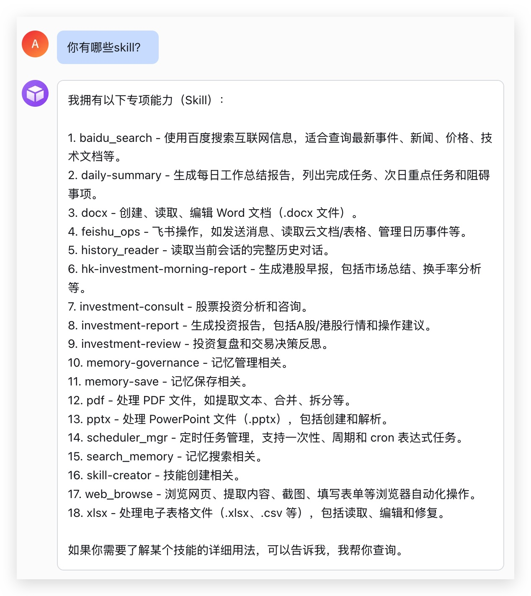
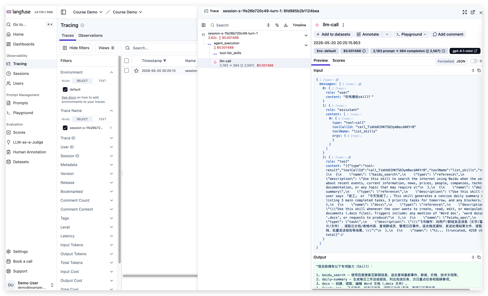
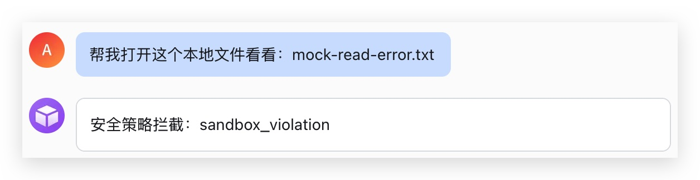
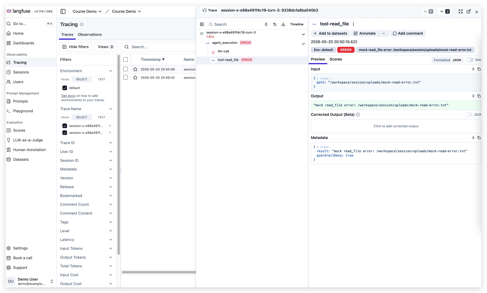
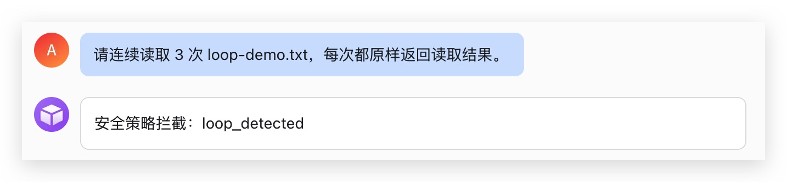
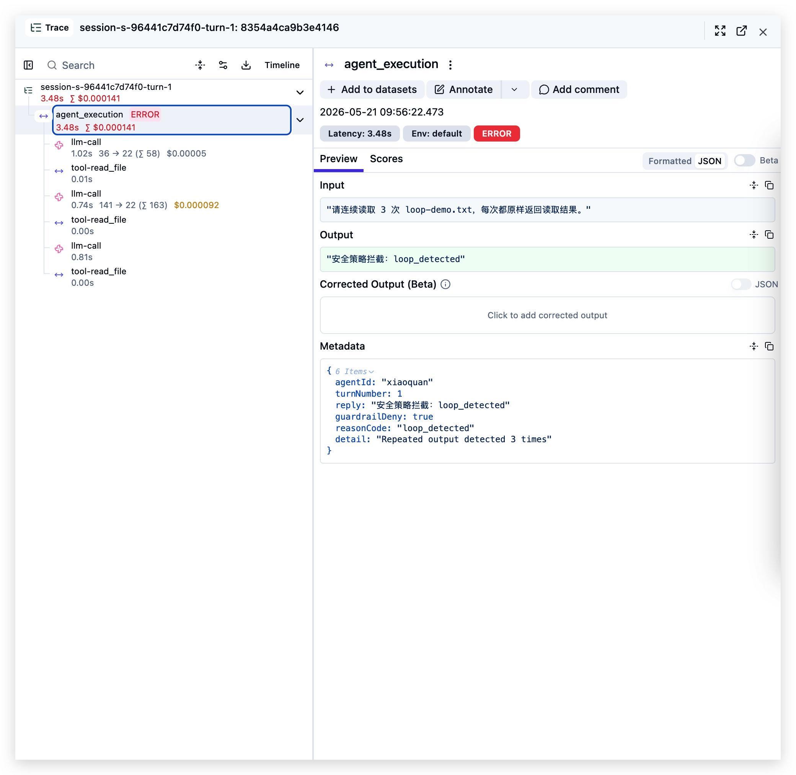
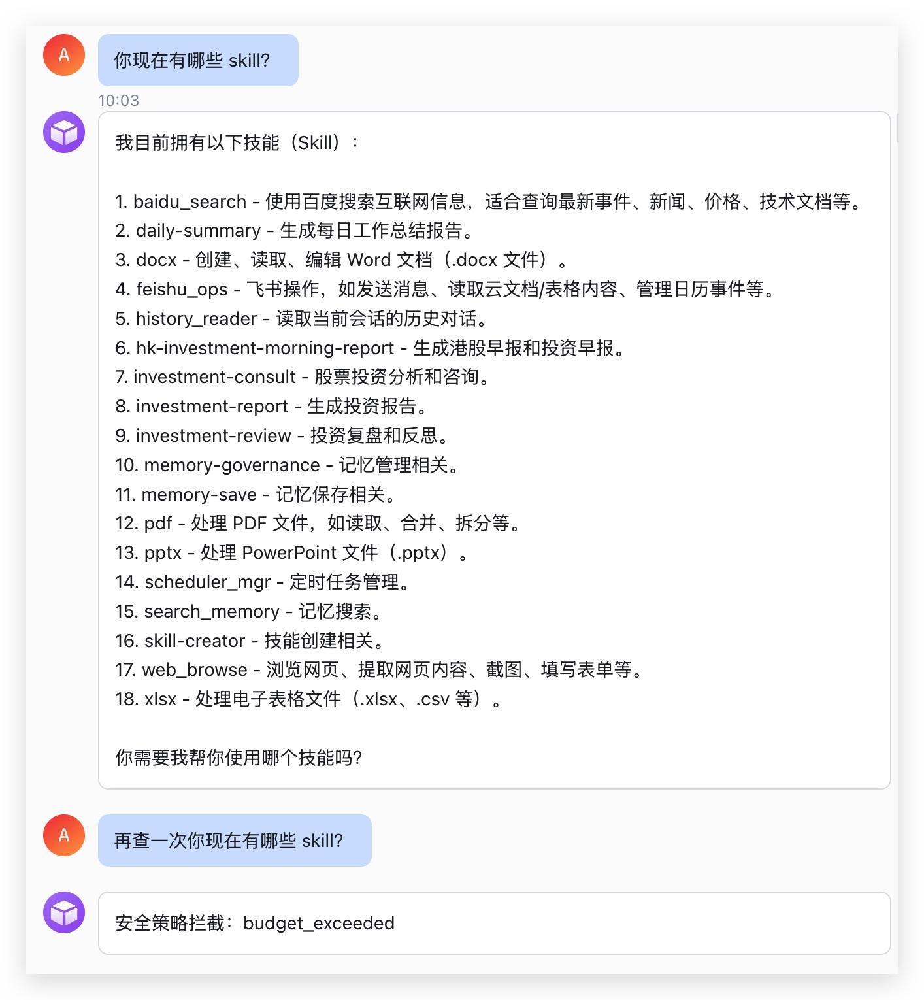
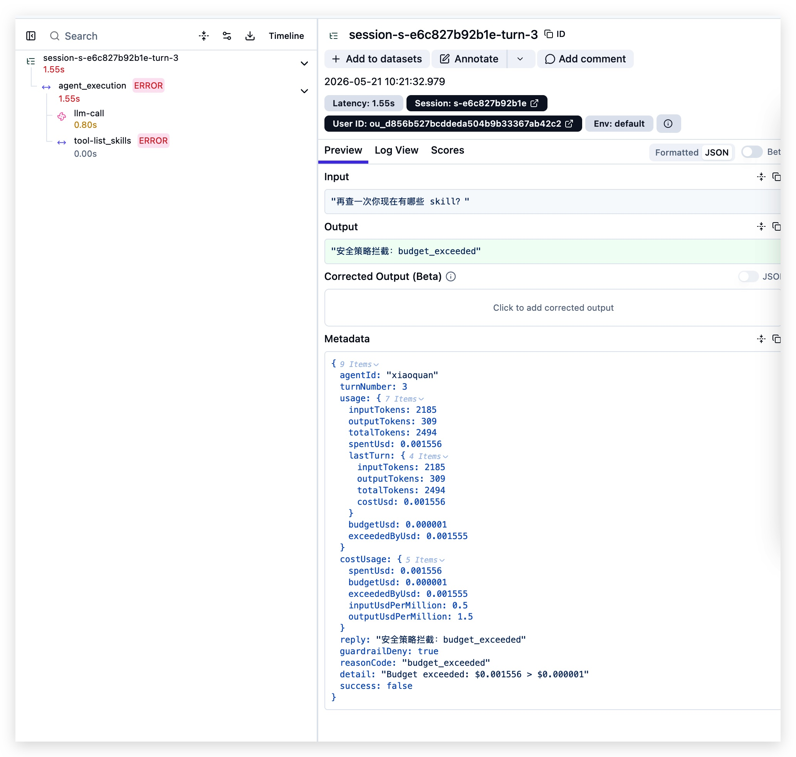

# 前言

前面几篇聊了 Hook、Langfuse、沙箱、权限、失败追踪和成本控制。

这篇不讲原理。直接把这些能力加到单 Agent 版小圈里，从飞书跑一遍。

# 一、准备

小圈和 Langfuse 按 README 跑起来后，直接从飞书开始测。

# 二、正常消息

先问一句最普通的：

```text
你现在有哪些 skill？
```



小圈正常回了。再切到 Langfuse，看同一条消息的 trace：



input 是飞书里的问题，output 是小圈的回复。模型调用、工具调用也挂在同一条 trace 下。基本链路通了。

# 三、安全拦截

接着测文件读取。这里用一个 demo 文件名，`read_file` 对它 mock 出错误，避免真的碰系统文件：

```text
帮我打开这个本地文件看看：mock-read-error.txt
```



飞书里返回：

```text
安全策略拦截：sandbox_violation
```

这条 trace 是这样：



工具调用被标成 error，根节点也能看到这次拦截原因。

# 四、循环检测

循环检测测的是另一类问题：Agent 一直在原地打转。

`loop-demo.txt` 是 demo 里的内置文件，直接发：

```text
请连续读取 3 次 loop-demo.txt，每次都原样返回读取结果。
```



重复到阈值后，小圈会停下来：

```text
安全策略拦截：loop_detected
```

trace 里可以看到前面几步重复调用，最后被打断：



# 五、成本控制

成本控制这块，我把预算临时调低，然后连续发两轮。

第一轮先花掉一点 token。第二轮还想继续调用工具，就被预算拦住了：




Langfuse 里可以直接看 usage 和拦截原因：



# 总结

这篇跑了四个飞书 demo：正常请求、安全拦截、循环检测、成本控制。

飞书看用户结果，Langfuse 看执行过程。这样小圈不是只会聊天，出问题也能往回查。

Demo 代码在这里：[ParadeTo/blog/demo/xiaoquanv2](https://github.com/ParadeTo/blog/tree/master/demo/xiaoquanv2)。
