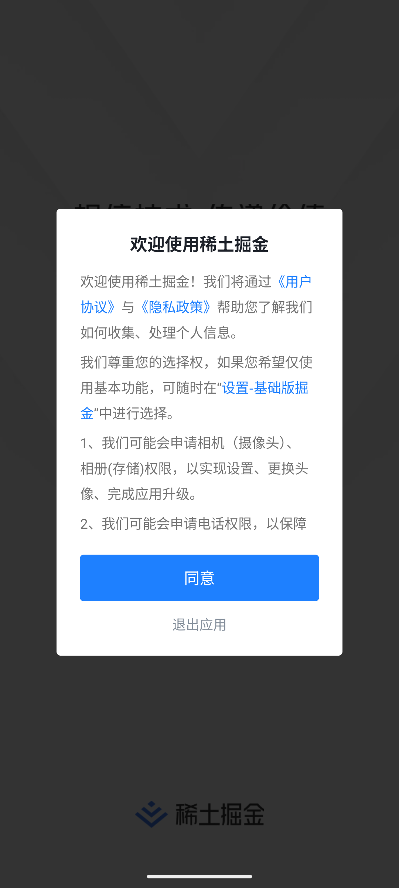
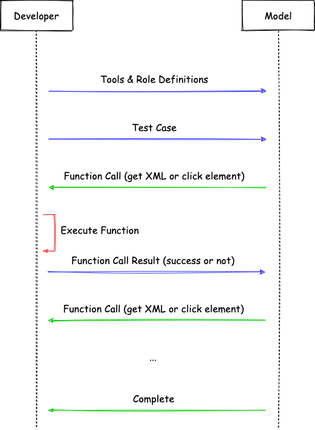

# 前言
上篇文章，我们使用 Appium 的插件 [appium-llm-plugin](https://github.com/headspinio/appium-llm-plugin/) 来辅助我们进行 UI 自动化测试。不过整个流程感觉还是不够智能，我们还是得手动去调用 API 来完成一个测试用例的编写，有没有可能把这个也去掉，用纯自然语言来写一个自动化测试用例呢？这篇文章就来试一下，来实现一个简单的自动化测试 Agent。

先上效果，这是我们的测试用例，

```bash
你帮我进行如下自动化测试：

等待 2 秒
点击页面上对话框的同意按钮
等待 2 秒
点击文章列表中的第一篇文章
等待 2 秒
点击关注
```

该用例演示了 “进入掘金首页 -> 打开第一篇文章 -> 点击关注” 这个流程：




# 实现方式
本文是基于 OpenAI 的 [Function Call](https://platform.openai.com/docs/guides/function-calling?api-mode=chat) 来实现。整体流程如下：




首先，我们需要定义一些 Tools 来供大模型使用：

```js
[
  {
    name: 'wait',
    description: `等待一段时间`,
    inputSchema: {
      type: 'object',
      properties: {
        seconds: {
          type: 'string',
          description: '等待的秒数',
        },
      },
      required: ['seconds'],
    },
  },
  {
    name: 'get_page_xml',
    description: `获取当前页面的 XML 描述文件`,
    inputSchema: {
      type: 'object',
      properties: {},
      required: [],
    },
  },
  {
    name: 'click_by_xpath',
    description: `使用 xpath 选择元素并点击`,
    inputSchema: {
      type: 'object',
      properties: {
        selector: {
          type: 'string',
          description: 'webdriverio 支持的 xpath 选择器',
        },
      },
      required: ['selector'],
    },
  },
]
```

我们把上述 Tools 作为系统提示词传递给大模型：

```
you are a test engineer who is good at automated testing, you can use the following tools to complete automated testing:
 
# Tools
 
${toolsStr}
 
# Notes 
- Ensure responses are based on the latest information available from function calls.
- Maintain an engaging, supportive, and friendly tone throughout the dialogue.
- Always highlight the potential of available tools to assist users comprehensively.
- Decide the next action based on XML.
- Always get the latest page information before you decide the next action.
```


然后，把我们的测试用例也传递给大模型。接下来不断重复下面这个步骤：

* 大模型返回 Function Call 的指令
* 执行 Function Call
* 将 Function Call 的执行结果传递给大模型，这里要么执行成功，要么大部分情况下就是元素找不到，返回 `Element not found`，我们期待的是大模型会聪明地重新进行尝试。


下面是测试的记录及分析：


```json
[
  {
    "role": "user",
    "content": "\n你帮我进行如下自动化测试：\n\n等待 2 秒\n点击页面上对话框的同意按钮\n等待 2 秒\n点击文章列表中的第一篇文章\n等待 2 秒\n点击关注\n\n      "
  },
  // 大模型返回执行 wait 和 get_page_xml 的指令
  {
    "content": null,
    "refusal": null,
    "role": "assistant",
    "annotations": [],
    "audio": null,
    "function_call": null,
    "tool_calls": [
      {
        "id": "call_8ftk1bjDtsVEY0Gotfouahbp",
        "function": {
          "arguments": "{\"seconds\": \"2\"}",
          "name": "wait"
        },
        "type": "function"
      },
      {
        "id": "call_KpfEBZo67WXsQ3YhSRZg2teE",
        "function": {
          "arguments": "{}",
          "name": "get_page_xml"
        },
        "type": "function"
      }
    ]
  },
  // 执行结果都为成功
  {
    "role": "tool",
    "content": "Wait successfully",
    "tool_call_id": "call_8ftk1bjDtsVEY0Gotfouahbp"
  },
  {
    "role": "tool",
    "content": "...", // xml 内容太多了，省略
    "tool_call_id": "call_KpfEBZo67WXsQ3YhSRZg2teE"
  },
  // 大模型返回 click_by_xpath 和 wait 的指令
  {
    "content": null,
    "refusal": null,
    "role": "assistant",
    "annotations": [],
    "audio": null,
    "function_call": null,
    "tool_calls": [
      {
        "id": "call_N44tjs7O76wVCowOJf2JHTj6",
        "function": {
          "arguments": "{\"selector\": \"//android.widget.TextView[@resource-id='com.daimajia.gold:id/btn_ok']\"}",
          "name": "click_by_xpath"
        },
        "type": "function"
      },
      {
        "id": "call_GVRdcAPBVULEMZYnbgztqtSg",
        "function": {
          "arguments": "{\"seconds\": \"2\"}",
          "name": "wait"
        },
        "type": "function"
      }
    ]
  },
  // 执行结果，成功
  {
    "role": "tool",
    "content": "[{\"type\":\"text\",\"content\":\"Click successfully\"}]",
    "tool_call_id": "call_N44tjs7O76wVCowOJf2JHTj6"
  },
  {
    "role": "tool",
    "content": "Wait successfully",
    "tool_call_id": "call_GVRdcAPBVULEMZYnbgztqtSg"
  },
  // 大模型返回 click_by_xpath 和 wait 的指令（点击文章列表中的第一篇文章）
  {
    "content": null,
    "refusal": null,
    "role": "assistant",
    "annotations": [],
    "audio": null,
    "function_call": null,
    "tool_calls": [
      {
        "id": "call_5gUEZ6JrRZ1Cd6mNYmUdGfXR",
        "function": {
          "arguments": "{\"selector\": \"//androidx.recyclerview.widget.RecyclerView/android.widget.LinearLayout[1]\"}",
          "name": "click_by_xpath"
        },
        "type": "function"
      },
      {
        "id": "call_C2oXiINLoDGWdKPfwDDiUMHR",
        "function": {
          "arguments": "{\"seconds\": \"2\"}",
          "name": "wait"
        },
        "type": "function"
      }
    ]
  },
  // click_by_xpath 执行失败，没有找到元素（原因在于大模型没有按照要求再次获取 XML）
  {
    "role": "tool",
    "content": "[{\"type\":\"text\",\"content\":\"Element not found\"}]",
    "tool_call_id": "call_5gUEZ6JrRZ1Cd6mNYmUdGfXR"
  },
  {
    "role": "tool",
    "content": "Wait successfully",
    "tool_call_id": "call_C2oXiINLoDGWdKPfwDDiUMHR"
  },
  // 大模型返回执行 get_page_xml 的指令（表现还算不错，意识到要重新获取 XML）
  {
    "content": null,
    "refusal": null,
    "role": "assistant",
    "annotations": [],
    "audio": null,
    "function_call": null,
    "tool_calls": [
      {
        "id": "call_PMQ72TSMy0i6aTYcTam1HFSM",
        "function": {
          "arguments": "{}",
          "name": "get_page_xml"
        },
        "type": "function"
      },
      {
        "id": "call_vCTopzCHVbLyP3L25H1cngZG",
        "function": {
          "arguments": "{\"seconds\": \"2\"}",
          "name": "wait"
        },
        "type": "function"
      }
    ]
  },
  // 执行成功
  {
    "role": "tool",
    "content": "...",
    "tool_call_id": "call_PMQ72TSMy0i6aTYcTam1HFSM"
  },
  {
    "role": "tool",
    "content": "Wait successfully",
    "tool_call_id": "call_vCTopzCHVbLyP3L25H1cngZG"
  },
  // 再次返回 click_by_xpath （点击文章列表中的第一篇文章）
  {
    "content": null,
    "refusal": null,
    "role": "assistant",
    "annotations": [],
    "audio": null,
    "function_call": null,
    "tool_calls": [
      {
        "id": "call_0nWMw8rEOJvhRfUrKaAafnD6",
        "function": {
          "arguments": "{\"selector\":\"//android.widget.RelativeLayout[@index='0']\"}",
          "name": "click_by_xpath"
        },
        "type": "function"
      }
    ]
  },
  // 这次成功了
  {
    "role": "tool",
    "content": "[{\"type\":\"text\",\"content\":\"Click successfully\"}]",
    "tool_call_id": "call_0nWMw8rEOJvhRfUrKaAafnD6"
  },
  // 大模型返回执行 wait 和 get_page_xml 的指令
  {
    "content": null,
    "refusal": null,
    "role": "assistant",
    "annotations": [],
    "audio": null,
    "function_call": null,
    "tool_calls": [
      {
        "id": "call_7Bg3Qrv52uJ5knZrRX0VMBFR",
        "function": {
          "arguments": "{\"seconds\": \"2\"}",
          "name": "wait"
        },
        "type": "function"
      },
      {
        "id": "call_iAXPQyYDlkz5oCt2jwYBm53T",
        "function": {
          "arguments": "{}",
          "name": "get_page_xml"
        },
        "type": "function"
      }
    ]
  },
  // 执行成功
  {
    "role": "tool",
    "content": "Wait successfully",
    "tool_call_id": "call_7Bg3Qrv52uJ5knZrRX0VMBFR"
  },

  {
    "role": "tool",
    "content": "...",
    "tool_call_id": "call_iAXPQyYDlkz5oCt2jwYBm53T"
  },
  // 大模型返回执行 click_by_xpath 的指令（点击关注）
  {
    "content": null,
    "refusal": null,
    "role": "assistant",
    "annotations": [],
    "audio": null,
    "function_call": null,
    "tool_calls": [
      {
        "id": "call_fkYD6oSJoow7GFdpsbxTHJ3S",
        "function": {
          "arguments": "{\"selector\":\"//android.widget.TextView[@resource-id='com.daimajia.gold:id/web_focus_button']\"}",
          "name": "click_by_xpath"
        },
        "type": "function"
      }
    ]
  },
  {
    "role": "tool",
    "content": "[{\"type\":\"text\",\"content\":\"Click successfully\"}]",
    "tool_call_id": "call_fkYD6oSJoow7GFdpsbxTHJ3S"
  }
]
```

# 总结
本文通过一个非常简单的例子试验了一下基于 Appium 的自动化测试 AI Agent，得到了一个成功的结果，但是过程中还是有些问题的：

* 大模型一开始总是拿着上一个页面的 XML 来找当前页面的元素，如果找不到还好一点，就怕找到一个错的，点击后到了一个不该去的页面，接下来就 GG 了，加上这句提示词后效果会好一点 “Always get the latest page information before you decide the next action.”，下一步可以试试把提示词进一步优化。
* 如何让大模型知道自己点错了元素进入到了错误的页面？是不是可以给目标页面一些简单的描述，比如“你进入的应该是文章详情”。这样当大模型意识到进入到了错误的页面时，可以尝试后退到上一步进行重试。不过这里注意注意的是不要和断言混淆了，因为断言失败时，整个测试的结果应该是失败的。
* 可以支持让大模型通过页面截图来定位元素，跟 XML 的方法结合起来，提高准确性。