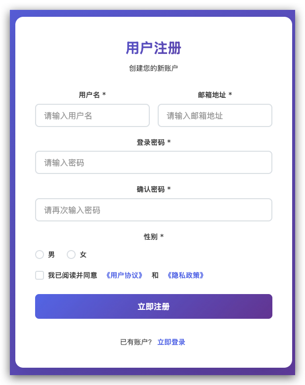
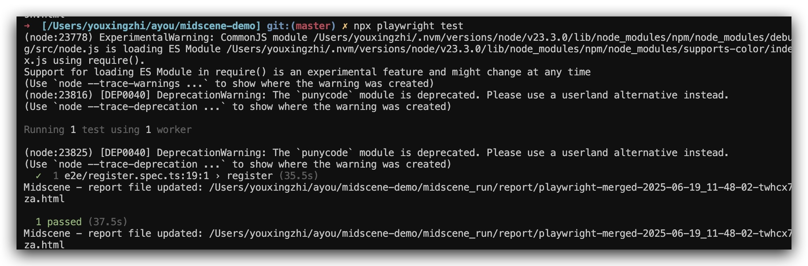
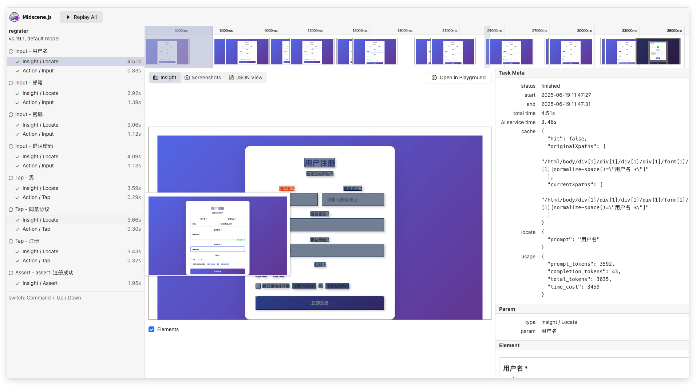
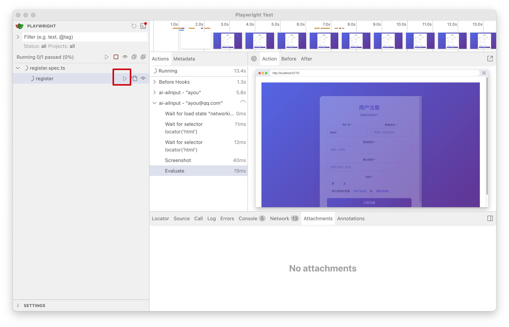
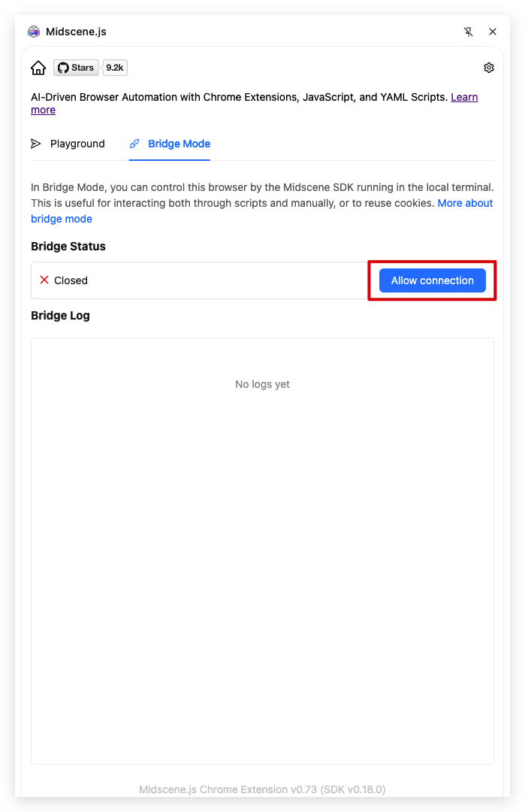
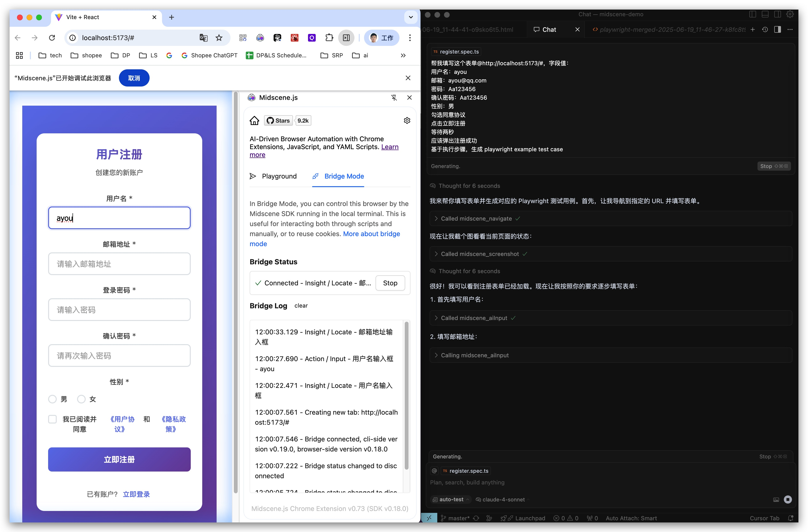

传统的 UI 自动化测试工具通常需要开发者编写大量的选择器代码来定位页面元素，维护起来比较麻烦。最近发现了一个有趣的工具 **Midscene.js**，它基于 AI 技术，允许我们用自然语言来描述测试操作，比如"点击登录按钮"、"在用户名框输入 admin"等。

今天就来体验一下这个工具，看看它的实际效果如何。

首先，先用 React 写一个简单的注册页面：



然后，搭建好 Playwright 环境，并集成 Midscene.js，写一个简单的 test case：

```js
import {test as base} from '@playwright/test'
import type {PlayWrightAiFixtureType} from '@midscene/web/playwright'
import {PlaywrightAiFixture} from '@midscene/web/playwright'

process.env.OPENAI_API_KEY = '**********'
process.env.OPENAI_BASE_URL = '**********'

export const test =
  base.extend <
  PlayWrightAiFixtureType >
  PlaywrightAiFixture({
    waitForNetworkIdleTimeout: 2000, // optional, the timeout for waiting for network idle between each action, default is 2000ms
  })

test.beforeEach(async ({page}) => {
  await page.goto('http://localhost:5173/')
})

test('register', async ({aiInput, aiTap, aiHover, aiAssert}) => {
  await aiInput('ayou', '用户名')
  await aiInput('ayou@qq.com', '邮箱')
  await aiInput('Aa123456', '密码')
  await aiInput('Aa123456', '确认密码')
  await aiTap('男')

  await aiTap('同意协议')
  await aiTap('注册')
  await new Promise((resolve) => setTimeout(resolve, 2000))
  await aiAssert('注册成功')
})
```

执行 `npx playwright test`，可以看到执行成功，并生成了报告：



打开报告，可以查看执行过程：



也可以执行 `npx playwright test --ui` 打开交互界面：



如果你不想手动写测试用例，还可以使用 Midscene 提供的 MCP Server，让 AI IDE 来帮我生成，下面以 Cursor 为例。

1. 首先安装 Midscene 的浏览器插件

2. 安装 MCP Server

```json
"mcp-midscene": {
  "command": "npx",
  "args": ["-y", "@midscene/mcp@0.19.0"],
  "env": {
    "OPENAI_API_KEY": "***",
    "OPENAI_BASE_URL": "******",
    "MCP_SERVER_REQUEST_TIMEOUT": "800000"
  }
},
```

3. 打开插件，点击 “allow connection”



4. Cursor 中输入如下提示词：

```
帮我填写这个表单@http://localhost:5173/#，字段值：
用户名：ayou
邮箱：ayou@qq.com
密码：Aa123456
确认密码：Aa123456
性别：男
勾选同意协议
点击立即注册
等待两秒
应该弹出注册成功
基于执行步骤，生成 playwright example test case
```

执行过程如下：



生成的测试用例如下：

```js
test('register', async ({aiInput, aiTap, aiAssert, aiWaitFor}) => {
  // 填写用户名
  await aiInput('ayou', '用户名输入框')

  // 填写邮箱地址
  await aiInput('ayou@qq.com', '邮箱地址输入框')

  // 填写登录密码
  await aiInput('Aa123456', '登录密码输入框')

  // 填写确认密码
  await aiInput('Aa123456', '确认密码输入框')

  // 选择性别为男
  await aiTap('男')

  // 勾选同意协议
  await aiTap('我已阅读并同意')

  // 点击立即注册
  await aiTap('立即注册')

  // 等待并验证注册成功（等待2秒超时）
  await aiWaitFor('注册成功', {timeoutMs: 2000})

  // 最终断言确认注册成功
  await aiAssert('注册成功')
})
```

可以看到，生成的用例跟我自己写的差不多，甚至更好。
