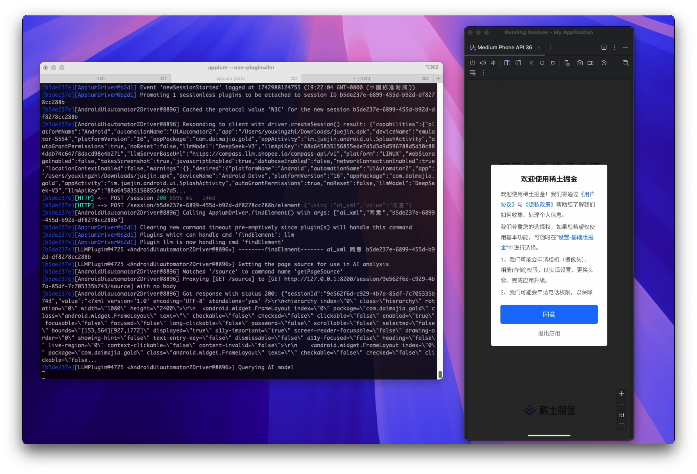
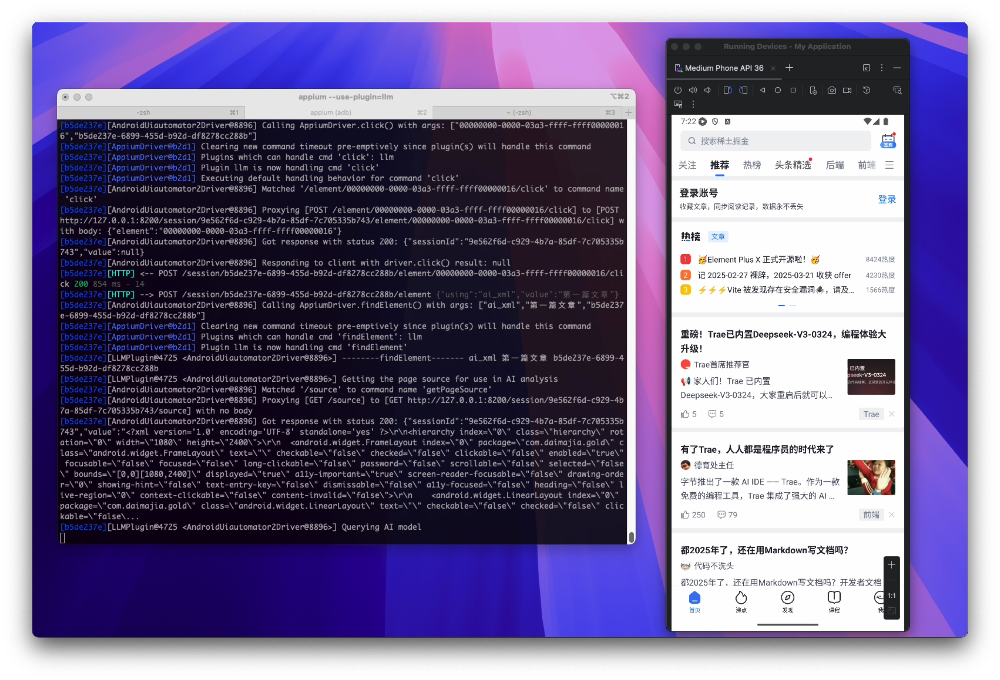
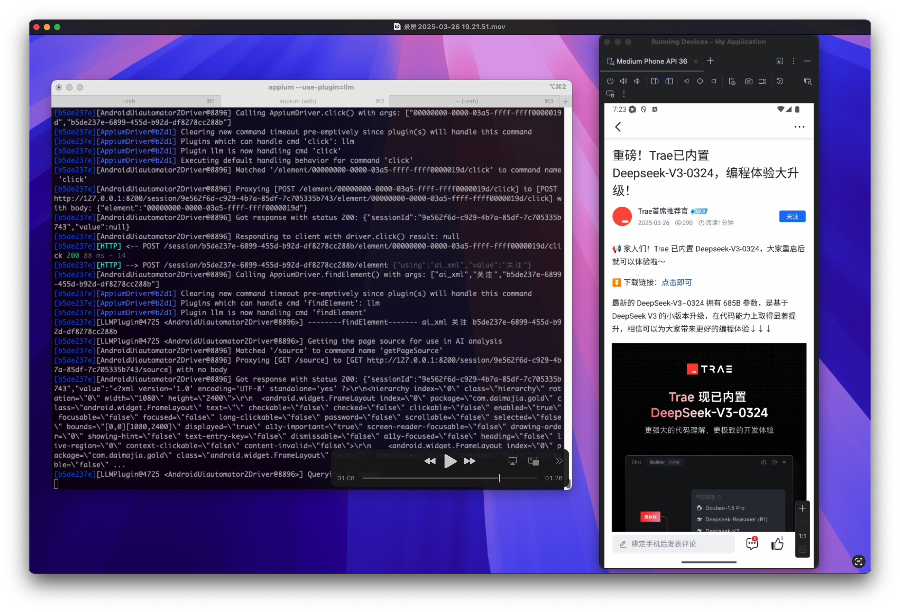

# 引言
前段时间字节推出了一款基于 AI 的自动化测试工具 [Midscene.js](https://midscenejs.com/)，但它只能测试 Web 应用，不能测试移动端应用，所以本文就来调研下基于 Appium 的 AI 辅助自动化测试。

先上效果，测试用例如下：

```python
import time
from appium.options.android import UiAutomator2Options
from selenium.webdriver.support.ui import WebDriverWait
from selenium.webdriver.support import expected_conditions as EC
from appium import webdriver

class TestJueJin:
    def setup(self):
        caps = {
            "platformName": "Android",
            "appium:app": "/****/juejin.apk",
            "appium:automationName": "UiAutomator2",
            "appium:deviceName": "Android Deive",
            "appium:platformVersion": "16",
            "appium:appPackage": "com.daimajia.gold",
            "appium:appActivity": "im.juejin.android.ui.SplashActivity",
            "appium:autoGrantPermissions": True,
            "appium:noReset": False,
            "appium:llmModel": "****",
            "appium:llmApiKey": '******',
            'appium:llmServerBaseUrl': "******",
        }
        self.driver = webdriver.Remote("http://localhost:4723", options=UiAutomator2Options().load_capabilities(caps))
    def test_one(self):
        WebDriverWait(self.driver, 10).until(
            EC.presence_of_element_located(('ai_xml', "同意"))
        )
        btn = self.driver.find_element('ai_xml', "同意")
        btn.click()
        time.sleep(2)
        btn = self.driver.find_element('ai_xml', "第一篇文章")
        btn.click()
        time.sleep(2)
        assert self.driver.find_element('ai_xml', "关注") is not None

```

使用 `pytest` 运行，过程中截图如下：







# 实现过程
首先，我们需要安装一些工具：

* appium：本文用的是 v2 版本
* UiAutomator2 driver：用于连接 Android 设备
* Android Studio：用于安装模拟器

安装完成后可以先尝试用普通的方式写一个用例跑一下，这里就不展开了，下面介绍下怎么接入 AI。

本文用到的是 [appium-llm-plugin](https://github.com/headspinio/appium-llm-plugin/)，目前是一个实验性质的 appium 的插件。

文档中介绍的使用方式如下：

```python
const rawEl = await driver.findElement('ai', "Your element description here")
```

其效果就是当 `findElement` 第一个参数为 `ai` 时，找寻元素的工作会交给该插件去完成，插件会根据元素的描述去查找元素，然后返回。他有三种查找元素的模式：

* screenshot：在这种模式下，会将屏幕截图和元素描述信息发送给大模型，并提示它确定图像中所描述元素的边界框。然后插件会封装一个轻量级的"image element" 进行返回，可以调用 `click()` 进行点击。
* xml：在这种模式下，会将页面 XML 数据和元素描述信息发送给大模型，并提示它返回元素的 XPath 选择器，然后使用原来的 XPATH 选择器选择元素进行返回。在这种情况下，描述信息中如果有 XML 中不存在的视图信息，将会是无效的。
* xmlpos：这种模式其实是前两种模式的结合，发送给大模型的是 XML 数据，返回的是轻量级的"image element"。这种模式目前只支持 Android。

其中 screenshot 和 xmlpos 需要大模型支持图片。

为了方便调试，我把源码下载到了本地，并修改了一下代码，支持调用 `findElement` 时指定：

```python
self.driver.find_element('ai_xml', "***")
self.driver.find_element('ai_screenshot', "***")
self.driver.find_element('ai_xmlpos', "***")
```

并通过下面方式安装：

```bash
appium plugin install --source=local /path/to/appium-llm-plugin
```

启动 appium 时，也需要指定：

```bash
appium --use-plugin=llm
```

# 总结
可以看到，目前该插件只是把查找元素这一核心功能使用 AI 来进行了替换，跟 Midscene.js 相比还是有不小的差距。

比如 Midscene.js 可以实现一句话完成一个"输入+点击"的动作：

```js
await ai('type "Headphones" in search box, hit Enter');
```

Midscene.js 支持自然语言断言：

```js
await aiAssert("There is a category filter on the left");
```

这个后面再研究下看能不能基于该插件也实现类似的功能。