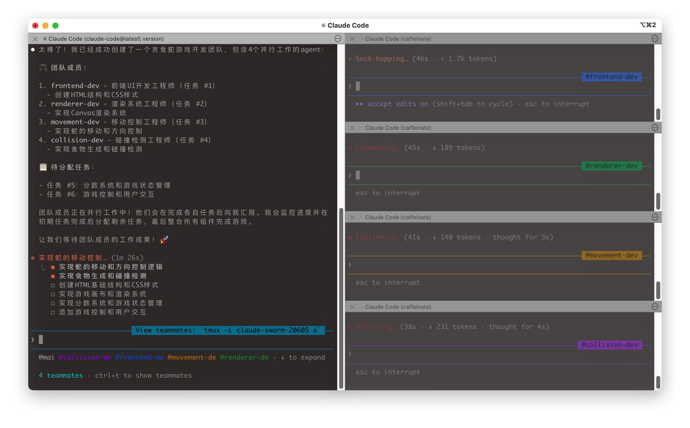

在使用 AI 辅助编程的过程中，当面对一个复杂的开发任务比如需要同时开发前端界面、编写后端 API、完善测试用例，还要更新文档，但单个 AI Agent 只能串行处理，不仅耗时，还容易在切换上下文时出错。

这让我想起了真实的软件团队是如何工作的：我们有前端工程师、后端工程师、测试工程师各司其职，他们并行工作、相互协作，通过任务管理系统来协调进度和依赖关系。那么，AI Agent 能否也像人类团队一样协作呢？

答案是肯定的。Claude Code 提供了强大的 **Agent Team** 功能，让多个 AI Agent 可以像真实团队一样协同工作。你可以创建一个"团队"，其中有负责前端的 Agent、负责后端的 Agent、负责测试的 Agent，它们可以并行工作，通过消息互相沟通，共享任务列表，大大提升复杂项目的开发效率。

接下来我们体验一下。

详细步骤可以参考[官网](https://code.claude.com/docs/en/agent-teams)，这里着重强调下使用自定义模型 URL 遇到的问题以及解决办法。

由于我用的是国内聚合平台提供的接口和 API KEY，所以我在本地 `~/.claude/settings.json` 配置了 `ANTHROPIC_BASE_URL`，`ANTHROPIC_API_KEY` 以及 `ANTHROPIC_MODEL`，但是 Claude Code 在创建 teammates 时没有用这些配置。通过查看官网 issue，发现这个[方法](https://gist.github.com/trhinehart-attentive/0e7fd8f8d636781452a92fa26711e70a)。

所以我也借助 Claude Code 参考这个回答，写了一个脚本：

```
#!/bin/bash
# Wrapper that ensures teammates inherit environment variables from settings.json
# This ensures ANTHROPIC_BASE_URL, ANTHROPIC_API_KEY, and ANTHROPIC_MODEL are properly passed

# Read settings from ~/.claude/settings.json if not already set
if [ -z "$ANTHROPIC_BASE_URL" ]; then
  export ANTHROPIC_BASE_URL=**********
fi

if [ -z "$ANTHROPIC_API_KEY" ]; then
  export ANTHROPIC_API_KEY=**********
fi

if [ -z "$ANTHROPIC_MODEL" ]; then
  export ANTHROPIC_MODEL=**********
fi

# Enable agent teams
export CLAUDE_CODE_EXPERIMENTAL_AGENT_TEAMS="1"

# Get the real claude binary path
REAL_BINARY="/Users/youxingzhi/.nvm/versions/node/v18.18.2/bin/claude"

# Filter out --model arguments
args=()
skip_next=false
for arg in "$@"; do
  if [ "$skip_next" = true ]; then
    skip_next=false
    continue
  fi
  if [ "$arg" = "--model" ]; then
    skip_next=true
    continue
  fi
  # Handle --model=value format
  if [[ "$arg" =~ ^--model= ]]; then
    continue
  fi
  args+=("$arg")
done

# Execute the real binary with filtered arguments and inherited env vars
exec "$REAL_BINARY" "${args[@]}"
```

然后添加环境变量：

```
export CLAUDE_CODE_TEAMMATE_COMMAND="$HOME/.local/bin/claude-wrapper"
```

Claude Code 会在启动 teammate 时，读取这个环境变量的值作为启动脚本来运行。

我们启动 Claude Code 并设置模式为分屏模式：

```
claude --teammate-mode tmux
```

输入如下提示词：


```
请创建一个 agent team 开发一个贪食蛇游戏
```

可以看到如下输出，表明 Agent Team 正常工作：



