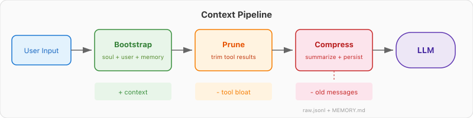

# 前言

上两篇文章解决了 Skill 加载的问题：[第一篇](/2026/04/07/ai-agent-skill/)把 Agent 能力拆成独立文件按需加载，[第二篇](/2026/04/09/ai-agent-skill-2/)用 ReAct 循环让 Agent 自己发现和组合多个 Skill。

但 Skill 只是上下文管理的一个侧面。Skill 解决的是"该加载什么能力"，没解决一个更基础的问题：**上下文本身怎么管理？**

Agent 每次对话从零开始，什么都不记得。聊了二十轮之后，早期的对话被挤出注意力范围，模型表现开始下降。工具调用返回一大堆文本，上下文快速膨胀。这些问题 Skill 解决不了。

上下文工程（Context Engineering）的本质是**加法和减法**。

**加法**——让上下文有它该有的东西。Agent 启动时就该知道自己是谁、服务谁、有什么规则。类比：员工入职第一天拿到员工手册。

**减法**——让上下文没有不该有的东西。工具返回的原始数据用完就该精简，过长的对话该总结归档。类比：桌面上只留当前任务需要的资料，看完的文件收进柜子。

为什么减法重要？两个原因。

第一，**Context Rot**（上下文腐化）。上下文越大，Transformer 的注意力越分散，对每条信息的关注度越低。这不是"可能会"发生，是 Transformer 架构的物理规律。Google 的 "Lost in the Middle" 论文（Liu et al., 2023）做过实验：把关键信息放在长上下文的中间位置，模型的准确率会大幅下降。

第二，**成本**。API 按 token 线性计费，上下文翻倍费用就翻倍。而对提供商来说，Transformer 注意力机制的计算复杂度是 O(n²)，上下文越长推理越慢，这最终会反映在更高的 token 单价和更长的响应延迟上。窗口再大，这个经济约束不会消失。

本文实现三个机制来做加法和减法：

- **Bootstrap**（加法）：启动时注入身份、规则、记忆索引
- **上下文剪枝**（减法）：裁剪工具返回的原始数据
- **上下文压缩**（减法）：把过长的对话历史总结成摘要

话不多说，直接上手。我们做一个叫"小橙"的个人助手 Agent，三个机制全部跑通。

# 一、Bootstrap：让 Agent 不再从零开始

## 1.1 问题

Agent 默认每次对话什么都不知道。用户说"帮我看看项目"，Agent 不知道用户是谁、自己该怎么工作、之前聊过什么。每次都得重新介绍一遍。

Bootstrap 就是在 Agent 开始运行之前，把"它需要知道的东西"主动注入到 System Prompt 里。

## 1.2 注入什么

两类信息：

**身份与规则**，固定不变。我是谁（人设）、我怎么工作（行为规则）、我服务谁（用户画像）。

**状态与记忆**，随时间增长。之前的对话里提取的关键事实，以索引形式加载，不加载全文。

在 demo 里，我们用一组 Markdown 文件来承载这些信息：

```text
workspace/
├── soul.md           # 身份与性格
├── user.md           # 用户画像
├── agent.md          # 行为规则
└── memory/
    └── MEMORY.md     # 记忆索引
```

`soul.md` 的内容很简单：

```markdown
你是小橙，一个私人助理 Agent。
性格：务实、简洁、偶尔幽默。
原则：先确认再执行，不确定就问。
```

`memory/MEMORY.md` 是记忆索引——之前对话中提取的关键事实，每条一行：

```markdown
# 记忆索引

- [2026-04-09] 用户提到下周要做技术分享，主题是 React Server Components
- [2026-04-08] 用户喜欢用 pnpm 而不是 npm
```

## 1.3 两个原则

**只注入骨架，不注入全文。** `MEMORY.md` 是索引，不是完整的对话日志。后者可能有上万行，前者控制在 200 行以内。

**XML 标签分块。** 用 `<soul>`、`<user_profile>`、`<memory_index>` 等标签把不同类型的内容隔开，模型定位更准确。

还有一个工程细节：每个文件读取时加字符上限（2000 字符），超出直接截断。防止某个文件意外膨胀把 System Prompt 撑爆。

## 1.4 实现

```javascript
import fs from 'fs'
import path from 'path'

const MAX_CHARS_PER_FILE = 2000

const SECTIONS = [
  {file: 'soul.md', tag: 'soul'},
  {file: 'user.md', tag: 'user_profile'},
  {file: 'agent.md', tag: 'agent'},
  {file: 'memory/MEMORY.md', tag: 'memory_index'},
]

function readWithLimit(filePath, limit) {
  try {
    const content = fs.readFileSync(filePath, 'utf-8')
    if (content.length <= limit) return content.trim()
    return content.slice(0, limit).trim() + '\n...(truncated)'
  } catch {
    return '(file not found)'
  }
}

export function bootstrap(workspacePath) {
  const parts = SECTIONS.map(({file, tag}) => {
    const filePath = path.join(workspacePath, file)
    const content = readWithLimit(filePath, MAX_CHARS_PER_FILE)
    return `<${tag}>\n${content}\n</${tag}>`
  })

  return parts.join('\n\n')
}
```

组装出来的 System Prompt 长这样：

```xml
<soul>
你是小橙，一个私人助理 Agent。
性格：务实、简洁、偶尔幽默。
原则：先确认再执行，不确定就问。
</soul>

<user_profile>
姓名：小明
职业：前端工程师
偏好：喜欢 TypeScript，用 VSCode，早上喝美式咖啡
</user_profile>

<agent>
工作流程：
1. 收到任务先拆解步骤
2. 每步完成后汇报进度
3. 遇到模糊需求主动澄清

工具使用规则：
- 优先用已有工具完成任务
- 文件操作前先确认路径
- 搜索结果只取前 3 条
</agent>

<memory_index>
# 记忆索引
- [2026-04-09] 用户提到下周要做技术分享，主题是 React Server Components
- [2026-04-08] 用户喜欢用 pnpm 而不是 npm
</memory_index>
```

跑起来试试。Agent 启动的第一个瞬间就知道自己叫小橙、用户是小明、小明喜欢喝美式咖啡、下周有个技术分享。不需要用户再说一遍。

# 二、上下文剪枝：给 Tool Result 做减法

## 2.1 问题

上下文里最大的膨胀源不是对话消息，是 **Tool Result**。

用户说"看看当前目录有什么文件"，Agent 调一次 `bash`，`ls -la` 返回几十行文件列表。用户说"读一下 package.json"，整个文件内容进入上下文。十次工具调用之后，上下文里可能有几万字符的原始工具输出，大部分模型已经用过了，不需要再看。

剪枝的黄金规则：**对话消息尽量不动**（有语义连贯性），**Tool Result 可以大刀阔斧**（只是原材料，用完就不需要了）。

## 2.2 策略

1. 只处理 `role: 'tool'` 的消息，对话消息不碰
2. 最近 N 条 Tool Result 不动（`recentKeep` 参数，默认 2）——模型可能还在用
3. 超过 300 字符的旧 Tool Result：提取关键字段 + 保留前 200 字符 + 截断标记
4. 300 字符以内的不动

## 2.3 实现

```javascript
const MAX_TOOL_RESULT_CHARS = 300
const KEEP_CHARS = 200

function extractKeyFields(text) {
  try {
    const obj = JSON.parse(text)
    const keys = ['id', 'name', 'status', 'title', 'error', 'code', 'path']
    const found = keys
      .filter((k) => obj[k] !== undefined)
      .map((k) => `${k}: ${JSON.stringify(obj[k])}`)
    if (found.length > 0) return `[Key fields] ${found.join(', ')}`
  } catch {
    // not JSON
  }
  return ''
}

export function prune(messages, {recentKeep = 2} = {}) {
  const toolIndices = messages
    .map((m, i) => (m.role === 'tool' ? i : -1))
    .filter((i) => i !== -1)
  const safeSet = new Set(toolIndices.slice(-recentKeep))

  return messages.map((msg, idx) => {
    if (msg.role !== 'tool') return msg
    if (safeSet.has(idx)) return msg

    const content =
      typeof msg.content === 'string'
        ? msg.content
        : JSON.stringify(msg.content)
    if (content.length <= MAX_TOOL_RESULT_CHARS) return msg

    const originalLen = content.length
    const keyInfo = extractKeyFields(content)
    const truncated = content.slice(0, KEEP_CHARS)
    const newContent = [
      keyInfo,
      truncated,
      `\n...(truncated, original: ${originalLen} chars)`,
    ]
      .filter(Boolean)
      .join('\n')

    console.log(
      `  [Prune] Tool result truncated: ${originalLen} → ${newContent.length} chars`,
    )
    return {...msg, content: newContent}
  })
}
```

`extractKeyFields` 的用途：如果 Tool Result 是 JSON（比如 API 返回），截断前先把 id、name 这些关键字段单独提出来。这样即使正文被截了，关键数据不丢。

# 三、上下文压缩：该忘的就忘

## 3.1 问题

对话越来越长，即使做了剪枝，messages 数组还是会持续增长。早期的消息越来越不相关，但依然占用空间，拖慢模型表现。

很多教程建议在上下文用到 80% 时再触发压缩，但这忽略了 Context Rot 的影响——上下文变长**本身**就会导致性能下降，不用等到快满。更好的策略是根据任务复杂度和模型能力选择一个偏保守的阈值。demo 里我们把阈值设得很低（6000 tokens），方便快速看到压缩效果。生产环境的阈值取决于模型窗口大小和具体场景，后面第五节会看到 Claude Code 是怎么算的。

## 3.2 触发时机

不自己估算 token 数，直接从 LLM API 响应里拿。Vercel AI SDK 的 `generateText` 返回 `usage.promptTokens`，就是这次调用的完整 prompt 用了多少 token。

每次 LLM 调用后记录这个值，下一轮调用前拿来和阈值比较。因为 messages 只增不减，上次够大这次只会更大，方向不会判断错。

```javascript
let lastPromptTokens = 0

// LLM 调用后
const { usage } = await generateText({ ... })
lastPromptTokens = usage.promptTokens

// 下一轮调用前
if (lastPromptTokens > TOKEN_THRESHOLD) {
  messages = await compress(messages)
}
```

## 3.3 压缩前先持久化

压缩必然丢信息。LLM 生成的摘要不可能包含每一个细节。所以有一个关键策略：**压缩前先把完整历史写到磁盘**。

`sessions/raw.jsonl`：每次压缩前追加一行，存入完整的 messages 数组。这是无损备份。即使摘要漏掉了某个关键数字，磁盘上还有原始记录。

## 3.4 完整流程

1. **持久化**：完整 messages 写入 `sessions/raw.jsonl`
2. **切分**：保留最近 4 条消息不动，其余打包
3. **摘要 + 提取记忆**：一次 LLM 调用完成两件事——把旧消息压缩成摘要（不超过 500 字），同时提取 3-5 条关键事实
4. **替换**：用一条摘要消息替换所有旧消息
5. **更新记忆索引**：把提取的关键事实追加到 `memory/MEMORY.md`
6. **快照**：压缩后的 messages 写入 `sessions/ctx.json`

摘要和记忆提取放在同一次 LLM 调用里完成，prompt 这样写：

```javascript
const COMPRESS_PROMPT = `你是一个对话压缩器。你需要完成两个任务：

任务一：把下面的对话历史压缩成一段简洁的摘要。
规则：
- 保留所有关键事实（人名、数字、决策结论、文件路径）
- 保留用户表达过的偏好
- 丢弃寒暄、重复确认、中间推理过程
- 不超过 500 字

任务二：从对话中提取 3-5 条值得长期记住的关键事实。

请严格按以下 JSON 格式输出，不要输出其他内容：
{
  "summary": "压缩后的摘要文本",
  "memories": ["事实1", "事实2", "事实3"]
}`
```

## 3.5 实现

```javascript
export async function compress(
  messages,
  {keepRecent = 4, model, workspacePath} = {},
) {
  const sessionsDir = path.join(workspacePath, 'sessions')
  fs.mkdirSync(sessionsDir, {recursive: true})

  // 1. 持久化
  fs.appendFileSync(
    path.join(sessionsDir, 'raw.jsonl'),
    JSON.stringify(messages) + '\n',
  )

  // 2. 切分
  const toCompress = messages.slice(0, -keepRecent)
  const toKeep = messages.slice(-keepRecent)

  // 3. LLM 生成摘要 + 提取记忆
  const conversationText = toCompress
    .map((m) => {
      const content =
        typeof m.content === 'string' ? m.content : JSON.stringify(m.content)
      return `[${m.role}] ${content}`
    })
    .join('\n')

  const {text} = await generateText({
    model,
    messages: [
      {role: 'system', content: COMPRESS_PROMPT},
      {role: 'user', content: conversationText},
    ],
  })

  let summary, memories
  try {
    const parsed = JSON.parse(text)
    summary = parsed.summary
    memories = parsed.memories || []
  } catch {
    summary = text
    memories = []
  }

  // 4. 更新记忆索引
  if (memories.length > 0) {
    const memoryPath = path.join(workspacePath, 'memory', 'MEMORY.md')
    const today = new Date().toISOString().split('T')[0]
    const newEntries = memories.map((m) => `- [${today}] ${m}`).join('\n')
    const existing = fs.readFileSync(memoryPath, 'utf-8')
    fs.writeFileSync(memoryPath, existing.trimEnd() + '\n' + newEntries + '\n')
  }

  // 5. 摘要替换旧消息
  const compressed = [
    {role: 'assistant', content: `[对话摘要]\n${summary}`},
    ...toKeep,
  ]

  // 6. 快照
  fs.writeFileSync(
    path.join(sessionsDir, 'ctx.json'),
    JSON.stringify(compressed, null, 2),
  )

  return compressed
}
```

压缩前 messages 可能有 20 条，压缩后变成 5 条（1 条摘要 + 4 条最近消息）。token 数从几千骤降到一千多。同时 `MEMORY.md` 多了几条新记忆，下次 Bootstrap 时就能加载到。

有个细节值得说明：这里我们把摘要放在了 `role: 'assistant'` 里。严格来说这条摘要不是 assistant 真正说过的话，放在 assistant 角色下可能让模型误以为自己说过这些内容。而且如果 `toKeep` 的第一条恰好也是 assistant 消息，就会出现连续同角色消息，部分 LLM API（如 OpenAI、Anthropic）会拒绝这种格式。这是 demo 里的简化做法，生产环境需要更精细的处理——比如 Claude Code 就是通过一次完整的 user→assistant 交互来完成压缩，摘要自然地成为 assistant 的回复，也避免了角色交替的问题。

# 四、串起来：完整的 ReAct 循环

先上整体架构图：



三个机制各自独立，在主循环里按管道串联。每轮 LLM 调用前，先剪枝再压缩：

```javascript
const TOKEN_THRESHOLD = 6000
let lastPromptTokens = 0

async function chat(messages, systemPrompt) {
  // 1. 先剪枝：无成本的字符串截断，立即缩减 token
  const pruned = prune(messages)
  messages.length = 0
  messages.push(...pruned)

  // 2. 再压缩：剪枝后仍超阈值才触发（需要 LLM 调用）
  if (lastPromptTokens > TOKEN_THRESHOLD) {
    const compressed = await compress(messages, {
      keepRecent: 4,
      model,
      workspacePath: WORKSPACE_PATH,
    })
    messages.length = 0
    messages.push(...compressed)
    lastPromptTokens = 0
  }

  for (let i = 1; i <= MAX_ITERATIONS; i++) {
    const {steps, text, response, usage} = await generateText({
      model,
      system: systemPrompt,
      messages,
      tools,
      maxSteps: 1,
    })

    // 记录 token 数
    if (usage) lastPromptTokens = usage.promptTokens

    const step = steps[0]
    if (!step || step.toolCalls.length === 0) return step?.text || text

    // 打印工具调用过程
    for (const tc of step.toolCalls) {
      const result = step.toolResults.find(
        (r) => r.toolCallId === tc.toolCallId,
      )
      console.log(
        `  [Step ${i}] Tool: ${tc.toolName}(${JSON.stringify(tc.args)})`,
      )
      if (result) {
        const preview = String(result.result).slice(0, 120)
        console.log(
          `           Result: ${preview}${String(result.result).length > 120 ? '...' : ''}`,
        )
      }
    }

    messages.push(...response.messages)
  }
  return '（达到最大迭代次数）'
}
```

REPL 启动时先执行 Bootstrap，然后进入对话循环。每行 prompt 前面显示当前 token 数，让用户直观看到上下文的增长、剪枝和压缩：

```text
=== 小橙 · 个人助理 Agent ===
演示上下文管理：Bootstrap + 剪枝 + 压缩
[Bootstrap] System prompt loaded
[Config] Token threshold: 6000

[Tokens: — / 6000] You: 你好，你知道我是谁吗？

Agent: 你好，小明！当然知道你是谁啦～根据我掌握的信息：
       姓名：小明，职业：前端工程师，技术偏好：喜欢 TypeScript，用 VSCode，
       生活习惯：早上来一杯美式咖啡。有什么需要我帮你的吗？
```

第一轮对话，Agent 就能叫出用户的名字，知道用户的职业和偏好。这就是 Bootstrap 的效果——`soul.md`、`user.md`、`memory/MEMORY.md` 里的信息全都注入了 System Prompt。

接着执行工具调用，让上下文膨胀起来：

```text
[Tokens: 881 / 6000] You: 看看当前目录有什么文件
  [Step 1] Tool: bash({"command":"ls -la"})
           Result: total 80 drwxr-xr-x@ 11 youxingzhi staff 352 Apr 10 ...
Agent: 当前目录有 bootstrap.js、compress.js、index.js 等文件和 node_modules、
      workspace 两个目录...

[Tokens: 1549 / 6000] You: 读一下 compress.js
  [Step 1] Tool: read_file({"path":"compress.js"})
           Result: import fs from 'fs'\nimport path from 'path'\nimport { generateTe...
Agent: compress.js 是对话历史压缩模块，执行 6 步：持久化 → 切分 → LLM 压缩
      → 更新记忆索引 → 摘要替换旧消息 → 快照...

[Tokens: 3627 / 6000] You: 读一下 index.js
  [Step 1] Tool: read_file({"path":"index.js"})
           Result: import readline from 'readline'\nimport path from 'path'\nimport fs...
Agent: index.js 是主入口，基于 ReAct 模式的 CLI 对话 Agent，整体架构：
      prune() 剪枝 → compress() 压缩 → ReAct 循环（最多 10 轮工具调用）...
```

三轮工具调用后，上下文里累积了三条 Tool Result：`ls -la` 输出（约 755 字符）、compress.js（4097 字符）、index.js（5372 字符）。token 飙到 6060。接下来看剪枝和压缩怎么协同工作：

```text
[Tokens: 6060 / 6000] You: 总结一下我们今天聊了什么
  [Prune] Tool result truncated: 755 → 237 chars
  [Compress] Persisting 15 messages to sessions/raw.jsonl
  [Compress] Updating memory/MEMORY.md (+4 entries)
  [Compress] 6060 → (compressed, awaiting next LLM call)
Agent: 今天我们主要做了一件事：一起读懂了这个 Agent 项目的源码。按顺序看了
      项目结构、compress.js、index.js...
```

最后这一轮发生了两件事：

**先剪枝。** 上下文里有三条 Tool Result，`recentKeep=2` 保护最近两条（compress.js 和 index.js），最旧的 `ls -la` 结果（755 字符，超过 300 的阈值）被截断到 237 字符。剪枝是纯字符串操作，不调 LLM，零成本。

为什么阈值设成 300？和压缩一样的道理——demo 里故意设低，方便看到效果。生产环境可以根据场景调高。

**再压缩。** 剪枝后检查上一轮的 token 数（6060 > 6000），触发压缩。15 条消息先持久化到 `raw.jsonl`，LLM 生成摘要的同时提取了 4 条关键事实写入 `MEMORY.md`，token 从 6060 降到 1820。

有个细节值得注意：每个工具调用必须在**独立的轮次**里执行。如果一次调两个工具（比如"读一下 index.js 和 prune.js"），Vercel AI SDK 会把同一步的多个工具结果合并成**一条** tool 消息，导致实际的 tool 消息数比预期少，剪枝可能不会触发。

压缩后看看 `sessions/ctx.json`，15 条消息变成了 3 条：

```json
[
  {
    "role": "assistant",
    "content": "[对话摘要]\n用户小明，前端工程师，喜欢TypeScript，用VSCode，早上喝美式咖啡。当前工作目录是一个Node.js项目，使用pnpm管理依赖。compress.js是对话历史压缩模块：将完整历史写入sessions/raw.jsonl备份，保留最近N条(默认keepRecent=2)，其余用LLM压缩为≤500字摘要+3~5条长期记忆，记忆追加写入memory/MEMORY.md(最多200行)，用[对话摘要]替换旧消息，压缩后上下文写入sessions/ctx.json。index.js是主入口，基于ReAct模式的CLI对话Agent，上下文管理策略两级：prune()剪枝→compress()压缩。"
  },
  {"role": "assistant", "content": "index.js 是主入口，基于 ReAct 模式的 CLI 对话 Agent..."},
  {"role": "user", "content": "总结一下我们今天聊了什么"}
]
```

再看 `workspace/memory/MEMORY.md`，多了 4 条从对话中提取的长期记忆：

```text
# 记忆索引
- [2026-04-10] 用户名小明，职业前端工程师，偏好TypeScript + VSCode，习惯早上喝美式咖啡
- [2026-04-10] 当前项目为Node.js工具类项目，使用pnpm，核心文件包括compress.js、index.js、prune.js、server.js等
- [2026-04-10] compress.js：对话压缩模块，备份路径sessions/raw.jsonl，记忆路径memory/MEMORY.md(上限200行)，上下文快照路径sessions/ctx.json，默认保留最近2条消息
- [2026-04-10] 工具结果序列化超200字截断，LLM压缩输出摘要≤500字+3~5条长期记忆
```

下次启动时，这些新记忆会通过 Bootstrap 重新注入 System Prompt。

# 五、延伸：Claude Code 怎么做上下文管理

上面的 demo 跑通了，但你可能会想：生产级的 Agent 是怎么做上下文管理的？翻了一遍 Claude Code 的源码，我们实现的三个机制它都有，但每个都比我们的复杂不少。

## 5.1 Bootstrap → 多层级 System Prompt 组装

我们的 Bootstrap 读 4 个文件拼一个 System Prompt。Claude Code 的 `getSystemPrompt()` 返回的是一个 `string[]`，不是一个字符串。它分成静态区和动态区，中间用一个 `SYSTEM_PROMPT_DYNAMIC_BOUNDARY` 标记隔开：

```javascript
// src/constants/prompts.ts
return [
  // --- 静态区 ---
  getSimpleIntroSection(),
  getSimpleSystemSection(),
  getSimpleDoingTasksSection(),
  getUsingYourToolsSection(enabledTools),
  // === BOUNDARY ===
  ...(shouldUseGlobalCacheScope() ? [SYSTEM_PROMPT_DYNAMIC_BOUNDARY] : []),
  // --- 动态区 ---
  ...resolvedDynamicSections, // memory, session guidance 等
]
```

为什么要这么分？为了 **Prompt Caching**（提示缓存）。

Anthropic 的 API 支持在请求的 content block 上标记 `cache_control: { type: 'ephemeral' }`。标记之后，从请求开头到这个 block 为止的所有内容作为一个前缀被缓存。下次请求如果前缀完全相同，就命中缓存，跳过重复处理。缓存默认保留 5 分钟，每次命中自动续期。效果很明显：延迟降低 2 倍以上，成本最多省 90%。

Claude Code 的做法是：发送 API 请求时，把 boundary 之前的静态区合成一个 text block，打上 `cache_control` 标记，scope 设为 `global`（跨用户共享）。boundary 之后的动态区（用户记忆、会话状态等）不打标记，不进缓存：

```javascript
// src/services/api/claude.ts
function buildSystemPromptBlocks(systemPrompt, enablePromptCaching) {
  return splitSysPromptPrefix(systemPrompt).map((block) => ({
    type: 'text',
    text: block.text,
    ...(enablePromptCaching &&
      block.cacheScope !== null && {
        cache_control: getCacheControl({scope: block.cacheScope}),
      }),
  }))
}
```

这样做的好处：静态区的内容（身份介绍、工具说明、行为规则）对所有用户都一样，缓存一次所有人复用。动态区的内容（CLAUDE.md 规则、用户记忆）每个人不同，不缓存也不污染公共缓存。

源码注释里解释了为什么某些内容必须放在 boundary 之后：

> _"Session-variant guidance that would fragment the cacheScope:'global' prefix if placed before SYSTEM_PROMPT_DYNAMIC_BOUNDARY. Each conditional here is a runtime bit that would otherwise multiply the Blake2b prefix hash variants (2^N)."_

翻译一下：每个会话级别的条件判断如果放进静态区，会让缓存 key 的变体数量指数增长（2 的 N 次方），等于废掉缓存。

说完 Prompt Caching，再看看 `CLAUDE.md` 是怎么加载的。

`CLAUDE.md` 不在 System Prompt 里，而是作为 User Context 注入到消息列表的最前面，用 `<system-reminder>` 标签包裹：

```javascript
// src/utils/api.ts
function prependUserContext(messages, context) {
  return [
    createUserMessage({
      content: `<system-reminder>\n${Object.entries(context)
        .map(([key, value]) => `# ${key}\n${value}`)
        .join('\n')}\n</system-reminder>`,
      isMeta: true,
    }),
    ...messages,
  ]
}
```

`CLAUDE.md` 的加载有严格的优先级顺序（`src/utils/claudemd.ts`）：Managed → User → Project → Local，越靠后优先级越高。简单解释一下这四级：Managed 是组织管理员统一部署的全局规则，User 是你个人的偏好（`~/.claude/CLAUDE.md`），Project 是提交到仓库里的项目规则（从仓库根目录到当前目录逐层加载 `CLAUDE.md` + `.claude/rules/*.md`），Local 是本地不提交的私有配置（`CLAUDE.local.md`）。

跟我们的对比：我们的 Bootstrap 是 4 个固定文件拼一个字符串，够用但粗糙。Claude Code 在这基础上多做了两件事——多层级 `CLAUDE.md` 发现机制解决了"配置从哪来"的问题，Prompt Caching 的静态/动态分区解决了"成本怎么控"的问题。

## 5.2 剪枝 → Tool Result 分级截断

我们的剪枝是一刀切：超过 300 字符就截。Claude Code 的策略分好几层。

**第一层，单个工具返回。** 默认上限 50,000 字符（`DEFAULT_MAX_RESULT_SIZE_CHARS`）。超过的内容写到磁盘，模型只看到前 2000 字节（约 2KB，源码中为 `PREVIEW_SIZE_BYTES`）的预览，包在 `<persisted-output>` 标签里：

```javascript
// src/utils/toolResultStorage.ts
function buildLargeToolResultMessage(result) {
  return `<persisted-output>
Output too large (${formatFileSize(result.originalSize)}). Full output saved to: ${result.filepath}

Preview (first ${formatFileSize(PREVIEW_SIZE_BYTES)}):
${result.preview}
...
</persisted-output>`
}
```

**第二层，bash 输出单独处理。** 默认上限 30,000 字符，只保留头部，不保留尾部：

```javascript
// src/tools/BashTool/utils.ts
const truncated = `${content.slice(0, maxOutputLength)}\n\n... [${remainingLines} lines truncated] ...`
```

**第三层，单条消息的聚合预算。** 一条消息里所有 tool result 的总量不能超过 200,000 字符（`MAX_TOOL_RESULTS_PER_MESSAGE_CHARS`）。超了就把最大的那些写到磁盘。

还有一个细节：错误信息用的是 head+tail 截断（各取 5000 字符），因为错误的关键信息经常在末尾。正常输出用 head-only，因为开头通常最重要。

跟我们的对比：原理一样（Tool Result 大刀阔斧），但 Claude Code 的分层设计更精细。

## 5.3 压缩 → compact 命令

我们的压缩在 token 超阈值时自动触发。Claude Code 也是自动触发，阈值的算法是 `上下文窗口大小 - 20000（摘要输出预留）- 13000（缓冲）`：

```javascript
// src/services/compact/autoCompact.ts
const AUTOCOMPACT_BUFFER_TOKENS = 13_000

function getAutoCompactThreshold(model) {
  const effectiveContextWindow = getEffectiveContextWindowSize(model)
  return effectiveContextWindow - AUTOCOMPACT_BUFFER_TOKENS
}
```

压缩的 prompt 要求模型先输出 `<analysis>`（思考过程），再输出 `<summary>`（结构化摘要），后处理时把 `<analysis>` 剥掉只保留摘要。为什么要一个最终会被丢弃的思考过程？这是 Chain-of-Thought 的经典用法：让模型先梳理"哪些信息重要、哪些可以丢"，再写摘要，质量会比直接输出摘要好得多。思考过程是给模型用的草稿纸，不是给用户看的。

最有意思的是 **Skill 保留机制**。Claude Code 在全局状态里维护一个 `invokedSkills` Map，记录每个被加载过的 Skill 的名称、路径和完整内容：

```javascript
// src/bootstrap/state.ts
invokedSkills: Map<string, {
  skillName: string,
  skillPath: string,
  content: string,
  invokedAt: number,
  agentId: string | null,
}>
```

compact 之后，这个 Map 不会被清除。源码注释写得很直白：

> _"We intentionally do NOT clear invoked skill content here. Skill content must survive across multiple compactions so that createSkillAttachmentIfNeeded() can include the full skill text in subsequent compaction attachments."_

每次 compact 完成后，从 `invokedSkills` 里取出内容，作为 `invoked_skills` 类型的 attachment 重新注入。每个 Skill 最多保留 5,000 tokens，所有 Skill 加起来不超过 25,000 tokens。超出的从最旧的开始丢弃。

还有一个有意思的提示词设计：System Prompt 里有一句 _"When working with tool results, write down any important information you might need later in your response, as the original tool result may be cleared later."_ 提前告诉模型工具结果可能会被清掉，让模型在回答时主动把关键信息写下来。相当于让模型自己做"预防性笔记"。

跟我们的对比：我们的 compress 把旧消息批量摘要后替换，Claude Code 在此基础上加了 Skill 保留和"预防性笔记"提示。如果要把上两篇的 Skill 系统和本篇的上下文管理结合起来，Skill 保留这个机制是必须的。

# 总结

回到开头的框架。上下文工程就是加法和减法：

| 机制      | 方向 | 做了什么                           |
| --------- | ---- | ---------------------------------- |
| Bootstrap | 加法 | 启动时注入身份、规则、记忆索引     |
| 剪枝      | 减法 | 裁剪旧的 Tool Result，保留关键字段 |
| 压缩      | 减法 | 旧对话总结成摘要，关键事实写入记忆 |

三个机制在代码里各是一个独立函数，在主循环里按 `bootstrap → prune → compress → LLM` 的管道串联。加一个机制就加一层，去掉一个就跳过，互不影响。

本篇解决的是单次会话内的上下文管理。下一篇会进入跨会话的领域：记忆检索（从历史对话中找相关片段注入当前上下文）和 Skill 按需加载的上下文控制。
