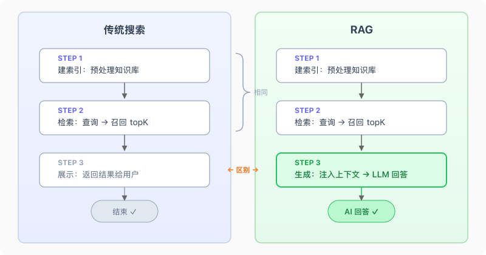

# 前言

[上一篇](/2026/04/14/ai-mem-file/)我们给 Agent 加上了文件系统记忆——memory-save 写偏好、skill-creator 沉淀 SOP、memory-governance 清理垃圾。数据量小的时候，Bootstrap 全量加载 MEMORY.md 就够了。

但你用了三个月之后，问题来了。

MEMORY.md 有 200 行硬上限，三个月的对话积累，200 行根本装不下。你可以按主题拆 topic 文件，但 topic 越来越多，每次 Bootstrap 加载的东西越来越杂，该找的找不到，不该出现的一直占着注意力。更崩溃的是，用户说"上次那个航班"——这种模糊查询在文件系统里根本没法匹配，因为没有任何文件名叫"那个航班"。

说白了，文件系统记忆的瓶颈不在于单个文件，那些确实是按需读取的。**瓶颈在索引本身。** MEMORY.md 这个索引每次 Bootstrap 全量加载，200 行上限装不下越来越多的条目；而且匹配靠的是文件名和描述，没有语义理解能力，"上次那个航班"在索引里根本找不到对应的文件。

解法是把"维护索引 → 按名查找"换成"直接搜数据库"。用户问到历史信息时，Agent 去搜，搜到了注入上下文，搜不到就说不知道——和人的长期记忆一个道理。

这篇要做的就是这件事：给 Agent 接上搜索能力，实现 RAG（Retrieval-Augmented Generation）驱动的长期记忆。

# 一、RAG 的本质

很多人第一次听到 RAG，脑子里浮现的画面是：向量数据库、embedding、余弦相似度。这个印象没错，但不完整。

你写过搜索功能吗？用户输入关键词，后端查数据库，把结果返回给前端展示。这是传统搜索，只有"检索"，没有"生成"。RAG 多了一步：**把检索到的结果塞给 LLM，让它基于这些结果生成回答。** 所以叫 Retrieval-**Augmented** Generation——用检索来增强生成。

拆开看就三步：

1. **建索引（Indexing）**：把知识库预处理，建立可检索的结构
2. **检索（Retrieval）**：拿查询去搜索，召回 topK 条结果
3. **生成（Generation）**：把召回结果注入 LLM 上下文，生成最终回答

前两步和传统搜索一模一样，区别在第三步——传统搜索到"检索"就结束了，RAG 多了一步"把结果喂给模型继续生成"。



搞清楚这个本质，一个常见误区就不攻自破：**RAG ≠ 向量数据库。** RAG 的核心是"检索 + 生成"这个模式，至于检索用什么方式——grep、SQL 全文索引、向量搜索、知识图谱——都行。向量搜索只是检索手段之一，不是 RAG 的定义。

# 二、为什么需要它

文件系统记忆在什么时候会崩？三个时刻。

**第一个崩溃时刻：规模爆炸。** MEMORY.md 有 200 行硬上限，这是 Bootstrap 注意力预算的约束。三个月的对话积累，200 行塞不下。你可以拆主题文件，但 topic 文件越来越多，索引本身也在膨胀，最终还是回到同一个问题：内容太多，无法全量加载。

**第二个崩溃时刻：语义模糊查询。** "上次那个航班"、"之前聊过的投资建议"、"我说过不喜欢的那种回复风格"——这类查询没有精确关键词，文件名匹配不上，全文 grep 也不好使。用户脑子里是语义，文件系统里是字符串，中间隔了一层翻译。

**第三个崩溃时刻：维护成本爆炸。** 文件系统记忆需要 Agent 主动维护：写入、去重、更新时间戳、控制行数。这些工作本身就消耗注意力预算。数据量越大，维护越重，Agent 花在"管理记忆"上的精力比"回答问题"还多，形成恶性循环。

# 三、四种搜索方式

搜索方式不止向量一种。按场景选，混合用，效果才好。

## 3.1 grep / 全文扫描

最朴素的 RAG，没有索引，逐行扫描，正则匹配。

优点是零配置，一个函数就搞定。缺点是 O(n) 性能，数据量一大就慢，而且只能精确匹配——搜"航班"找不到"机票"。

适合：记忆量小（几十条），精确 token 匹配（错误码、变量名、文件路径）。

## 3.2 关键字 + BM25

grep 的问题在于没有索引。加了索引之后，搜索性能从 O(n) 变成 O(1)，这就是倒排索引的价值。

工业标准的关键字搜索算法是 BM25（Best Match 25）。它基于 TF-IDF 改进而来。

TF-IDF 是什么？拆开看就两个词：

- **TF（Term Frequency，词频）**：一个词在当前文档里出现得越多，说明越相关。搜"航班"，一篇文章里出现了 5 次"航班"，另一篇只出现 1 次，前者更可能是你要找的。
- **IDF（Inverse Document Frequency，逆文档频率）**：一个词在所有文档里出现得越少，区分度越高。"的"每篇都有，搜它没意义；"pgvector"只在少数文档出现，搜到就很有价值。

举个例子。假设记忆库里有 100 条记录，你搜"pgvector"：

- "pgvector"在文档 A 里出现了 3 次 → TF 高
- 100 条记录里只有 2 条包含"pgvector" → IDF 高（很稀有）
- TF × IDF = 高分，文档 A 排前面

再搜一个"的"：

- "的"在文档 A 里出现了 10 次 → TF 很高
- 但 100 条记录里 98 条都有"的" → IDF 极低（太常见了）
- TF × IDF ≈ 0，"的"对排序几乎没贡献

所以 TF-IDF 的本质就是：**在当前文档里高频 × 在全局文档里稀有 = 这个词对当前文档很重要。**

BM25 在 TF-IDF 基础上加了**文档长度归一化**——同样出现一次"航班"，50 字的短文档比 5000 字的长文档密度更高，应该加分。用一个具体例子来说明 BM25 怎么综合打分：

假设你搜"向量数据库对比"，记忆库里有两条数据：

- 文档 A（50 字）："用 pgvector 做向量数据库，和 Pinecone 对比了性能"
- 文档 B（500 字）：一篇长长的技术笔记，里面提了一次"向量"

BM25 会综合考虑三个因素：**词频**（"向量"在 A 中出现的密度比 B 高）、**逆文档频率**（"对比"这个词在所有文档中不常出现，权重更高）、**文档长度**（A 只有 50 字，密度更高，加分）。最终 A 的得分远高于 B。

PostgreSQL 原生支持全文搜索，用 `tsvector` + GIN 索引就能做到。这俩分别是什么？

**`tsvector` 是 PostgreSQL 的分词结果类型。** 把一段文本丢给 `to_tsvector()`，它会分词、去停用词、归一化，输出一个紧凑的词条列表。比如：

```sql
SELECT to_tsvector('simple', '用 pgvector 做向量数据库');
-- 结果：'pgvector':2 '做':3 '向量数据库':4 '用':1
```

注意这里用的是 `simple` 配置——它只按空格和标点切分，不做中文分词。所以"向量数据库"整个是一个 token，不会拆成"向量"和"数据库"。英文和拼音天然用空格分隔，`simple` 够用；中文如果需要更细粒度的分词，得装 `zhparser` 或 `pg_jieba` 之类的插件。本文用 `simple` 做演示，足够说明原理。

冒号后面的数字是词在原文中的位置，`ts_rank` 打分时会用到。比如搜 `pgvector performance`，有两条记录都包含这两个词：

- 记录 A：`'pgvector':1 'performance':2` — 位置 1 和 2，紧挨着
- 记录 B：`'pgvector':1 'some':2 'other':3 ... 'performance':10` — 隔了八个词

A 的匹配词紧挨着，更可能是在讨论 "pgvector performance" 这个完整概念，`ts_rank` 会给 A 更高的分数。

**GIN（Generalized Inverted Index，通用倒排索引）是加速 `tsvector` 查询的索引类型。** 倒排索引的原理和书的目录类似：不是"第 3 页有哪些词"，而是反过来——"pgvector 这个词出现在第 2、5、8 条记录"。查询时直接按词条定位到记录，不用扫全表。

两者配合使用，走一遍完整流程就清楚了。假设记忆库里有三条记录：

| id  | search_text                   |
| --- | ----------------------------- |
| 1   | 用 pgvector 做向量数据库      |
| 2   | Pinecone 和 pgvector 性能对比 |
| 3   | 今天天气不错                  |

**写入时**，PostgreSQL 自动对每条 `search_text` 调用 `to_tsvector('simple', ...)` 分词，生成 `tsvector`：

```
记录 1 的 tsvector：'pgvector':2 '做':3 '向量数据库':4 '用':1
记录 2 的 tsvector：'pinecone':1 '和':2 'pgvector':3 '性能':4 '对比':5
记录 3 的 tsvector：'今天':1 '天气':2 '不错':3
```

然后 GIN 索引扫描这些 tsvector，建出倒排表——按词条反向映射到记录：

```
pgvector  → [1, 2]
向量数据库 → [1]
pinecone  → [2]
性能      → [2]
对比      → [2]
今天      → [3]
天气      → [3]
...
```

**查询时**，搜"pgvector 性能"，PostgreSQL 先用 `plainto_tsquery` 把查询分词成 `pgvector` 和 `性能`，然后查倒排表：`pgvector → [1, 2]`、`性能 → [2]`。记录 3 没命中，直接排除。

记录 1 只命中了 `pgvector`，记录 2 命中了 `pgvector` 和 `性能` 两个词，而且回头看记录 2 的 tsvector：`'pgvector':3 '性能':4`——位置 3 和 4 紧挨着。前面说过，匹配词越近分越高。所以 `ts_rank` 综合命中词数和位置距离，给记录 2 打了最高分。

对应的 SQL：

```sql
-- 建全文索引列：写入时自动分词
search_tsv TSVECTOR GENERATED ALWAYS AS (to_tsvector('simple', search_text)) STORED

-- 在分词结果上建倒排索引：查询时 O(1) 定位
CREATE INDEX memories_search_tsv_idx ON memories USING gin (search_tsv);

-- 搜索：分词 → 查倒排索引 → BM25 打分 → 返回 topK
SELECT *, ts_rank(search_tsv, plainto_tsquery('simple', '向量数据库')) AS score
FROM memories ORDER BY score DESC LIMIT 5;
```

**关键字搜索在什么时候比向量搜索强？** 精确 token。函数名、错误码、文件路径这类东西，用户搜的就是那个字符串本身，不需要语义理解。搜 `ERR_CONNECTION_REFUSED`，你希望精确匹配到包含这个错误码的记录，而不是语义相近的"网络连接失败"。

## 3.3 向量语义搜索

关键字搜索搞不定"上次那个航班"——因为记忆里可能存的是"帮你查了 CA1234 航班的延误信息"，关键词完全对不上。

向量搜索把语义相似度变成数学问题：

1. 文本 → Embedding 模型 → 高维向量（float 数组）
2. 两个向量的余弦距离越小 → 语义越相似
3. 搜索时：query 转向量 → 计算和所有记忆向量的余弦距离 → 返回最近的 topK 条

```javascript
import {embed} from 'ai'
import {createOpenAI} from '@ai-sdk/openai'

const openai = createOpenAI({apiKey: process.env.OPENAI_API_KEY})
const model = openai.embedding('text-embedding-3-small')

// 文本 → 向量
const {embedding} = await embed({model, value: '上次那个航班'})
// embedding 是一个 1536 维的 float 数组
```

"上次那个航班"和"CA1234 航班延误信息"在向量空间里距离很近，因为 embedding 模型理解了它们的语义关联。这是关键字搜索做不到的。

## 3.4 知识图谱

前面三种搜索都是"搜一条数据"，知识图谱解决的是"通过关系找到一组数据"：

- Alice → manages → Auth Team → owns → Permissions Service
- 问"Alice 负责哪些服务"，需要沿着关系链遍历两层才能拿到答案

典型工具是 Neo4j、Amazon Neptune。知识图谱在多实体关系推理场景很强，但构建和维护成本高，本文暂不讨论。

## 3.5 对比

| 方式            | 适用场景                   | 精度                   | 性能         | 复杂度 |
| --------------- | -------------------------- | ---------------------- | ------------ | ------ |
| grep / 全文扫描 | 小规模，精确匹配           | 精确匹配高，语义匹配无 | O(n)，慢     | 极低   |
| 关键字 + BM25   | 精确 token，错误码、函数名 | 精确 token 高          | O(1)，快     | 中     |
| 向量语义搜索    | 模糊语义查询               | 语义匹配高             | O(log n)，快 | 中高   |
| 知识图谱        | 多实体关系推理             | 关系推理高             | 取决于图规模 | 高     |

单一方式都有盲区：向量搜索找不到精确错误码，关键字搜索理解不了"上次那个航班"。生产级方案是混合检索——向量 + 关键字，取长补短。

# 四、混合检索实战

这是本文的核心。我们用 PostgreSQL + pgvector 做一个完整的混合检索记忆系统：向量语义搜索和 BM25 关键字搜索在同一条 SQL 里完成，不需要两个数据库。

## 4.1 Schema 设计

先看完整的建表语句，然后逐个说设计决策：

```sql
CREATE EXTENSION IF NOT EXISTS vector;

CREATE TABLE IF NOT EXISTS memories (
    id              TEXT        PRIMARY KEY,          -- 内容哈希，保证幂等
    session_id      TEXT        NOT NULL,
    routing_key     TEXT        NOT NULL,             -- 用户标识

    user_message    TEXT        NOT NULL,
    assistant_reply TEXT        NOT NULL,

    -- LLM 提取的结构化字段
    summary         TEXT        NOT NULL,             -- 一句话摘要
    tags            TEXT[]      NOT NULL DEFAULT '{}', -- 领域标签

    created_at      TIMESTAMPTZ NOT NULL DEFAULT NOW(),
    turn_ts         BIGINT      NOT NULL,

    -- 向量就是普通列，不是独立的向量数据库
    summary_vec     vector(1536),                     -- 摘要向量
    message_vec     vector(1536),                     -- 原始消息向量

    -- 全文搜索列，自动维护
    search_text     TEXT        NOT NULL DEFAULT '',
    search_tsv      TSVECTOR   GENERATED ALWAYS AS
                      (to_tsvector('simple', search_text)) STORED
);

-- 向量索引（HNSW 近似最近邻）
CREATE INDEX IF NOT EXISTS memories_summary_vec_idx
    ON memories USING hnsw (summary_vec vector_cosine_ops);

-- 全文索引（GIN）
CREATE INDEX IF NOT EXISTS memories_search_tsv_idx
    ON memories USING gin (search_tsv);

-- 标量索引
CREATE INDEX IF NOT EXISTS memories_routing_key_idx ON memories (routing_key);
CREATE INDEX IF NOT EXISTS memories_created_at_idx  ON memories (created_at DESC);
CREATE INDEX IF NOT EXISTS memories_tags_idx        ON memories USING gin (tags);
```

这张表的列可以分成三类：**用于检索的**（`summary_vec`、`message_vec`、`search_tsv`、`tags`）、**用于过滤的**（`routing_key`、`created_at`）、**用于回答的**（`user_message`、`assistant_reply`、`summary`）。前两类帮 Agent 找到相关记忆，第三类是找到之后真正注入上下文的内容——Agent 拿到 `summary` 和 `assistant_reply`，组织成自然语言放进当前对话，用户感受到的就是"这个 Agent 记得之前聊过的事"。

三个设计决策展开说一下。

**`search_tsv` 用 `GENERATED ALWAYS AS` 自动维护。** 写入时只需要填 `search_text`（用户消息 + 摘要 + 标签拼接），PostgreSQL 自动把它分词后更新到 `search_tsv` 列。不需要手动维护全文索引，也不会出现索引和数据不一致的问题。

**两个向量列：`summary_vec` 和 `message_vec`。** 为什么要两个？因为搜索意图不同。用户说"上次那个航班"，用摘要向量搜更准（摘要是提炼后的一句话）；用户说"我发过一段很长的代码"，用原始消息向量搜更准（保留了原始细节）。

**向量是普通列，不是独立的向量数据库。** `summary_vec` 和 `message_vec` 就是表里的两个字段，和 `tags`、`created_at` 没有本质区别。一条 SQL 可以同时做向量排序、全文匹配、标量过滤，不需要两个系统之间同步数据。

为什么不用专门的向量数据库（Pinecone、Milvus）？向量和标量分开存，混合检索就得先去向量库搜 topK，再拿 ID 回关系库做标量过滤，两次 I/O。更麻烦的是数据一致性，向量库写成功、关系库写失败怎么办？反过来呢？pgvector 把向量当普通列，一张表一条 SQL，这个问题根本不存在。Supabase、GitHub Copilot 都在用 pgvector，企业级完全扛得住。而且这个方案不绑死 pgvector，任何支持向量列的关系数据库（OceanBase、AlloyDB、Neon）都能用，混合检索的 SQL 逻辑一字不改。

## 4.2 写入：对话 → embedding → 入库

每轮对话结束后，Agent 把值得记住的内容写入记忆库。假设用户刚问了一个航班问题，Agent 回答完之后要存下来：

```javascript
await storeMemory({
  sessionId: 'session_001',
  routingKey: 'user:xiaoming',
  userMessage: '帮我查一下 CA1234 航班的情况',
  assistantReply: 'CA1234 航班延误了 2 小时，目前预计 15:30 起飞。建议你改签到 CA1235...',
  summary: '查询 CA1234 航班延误信息并提供改签建议',
  tags: ['travel', 'flight'],
  turnTs: 1713168000000,
})
```

`storeMemory` 内部做了三件事：

```javascript
// 1. 生成确定性 ID → 幂等写入
const id = createHash('sha256')
  .update(`${sessionId}:${turnTs}`)
  .digest('hex')
  .slice(0, 16)
// → '5f6bbb8fba0ee3ac'

// 2. 并行生成两个向量
const [{embedding: summaryVec}, {embedding: messageVec}] = await Promise.all([
  embed({model: embeddingModel, value: summary}), // 摘要 → 向量
  embed({model: embeddingModel, value: userMessage}), // 原始消息 → 向量
])
// summaryVec: [-0.001, 0.015, 0.038, ...] (1536 维 float 数组)

// 3. 拼接全文搜索文本，写入数据库
const searchText = [userMessage, summary, ...tags].join(' ')
// → '帮我查一下 CA1234 航班的情况 查询 CA1234 航班延误信息并提供改签建议 travel flight'

await query(
  `INSERT INTO memories (...) VALUES (...) ON CONFLICT (id) DO NOTHING`,
  [
    id,
    sessionId,
    routingKey,
    userMessage,
    assistantReply,
    summary,
    tags,
    turnTs,
    summaryVec,
    messageVec,
    searchText,
  ],
)
```

写入后数据库里这条记录长这样（向量列太长，截取前几个值）：

| 列              | 值                                                             | 说明                 |
| --------------- | -------------------------------------------------------------- | -------------------- |
| id              | 5f6bbb8fba0ee3ac                                               |                      |
| user_message    | 帮我查一下 CA1234 航班的情况                                   |                      |
| assistant_reply | CA1234 航班延误了 2 小时，目前预计 15:30 起飞...                |                      |
| summary         | 查询 CA1234 航班延误信息并提供改签建议                         |                      |
| tags            | {travel, flight}                                               |                      |
| search_text     | 帮我查一下 CA1234 航班的情况 查询 CA1234 航班延误信息...       | 拼接后的全文搜索文本 |
| summary_vec     | [-0.001, 0.015, 0.038, 0.008, ...]                             | 摘要 embedding       |
| message_vec     | [-0.007, 0.008, 0.026, 0.008, ...]                             | 原始消息 embedding   |
| search_tsv      | 'ca1234':2,5 'flight':8 'travel':7 '帮我查一下':1 '查询':4 ... | PostgreSQL 自动分词  |

几个关键设计：

**确定性哈希 → 幂等写入。** `sessionId + turnTs` 确定性地映射到一个哈希值，配合 `ON CONFLICT (id) DO NOTHING`。服务重启、网络抖动、手动重跑都不会产生重复数据。

**两个向量同时生成。** 摘要向量用于"上次那个航班"这类模糊搜索，原始消息向量用于"我发过一段很长的代码"这类细节搜索。`Promise.all` 并行执行，省时间。有个容易踩的坑：**写入和查询必须用同一个 embedding 模型。** 不同模型的向量空间不兼容，模型 A 生成的向量和模型 B 生成的，即使输入相同文本，余弦距离也没有意义。

为什么不只存用户消息？因为"帮我转换 PDF"这个 chunk 缺少了"转换成什么格式、结果在哪里"的上下文。一问一答合在一起存，召回后才能还原完整信息。

## 4.3 查询：混合检索

查询是重头戏。一条 SQL 同时做三件事：向量相似度排序、全文关键字匹配、标量条件过滤。

假设记忆库里已经有三条记录：

| id  | user_message                 | assistant_reply                                  | summary                                | tags            | search_text                                                            | summary_vec                   | search_tsv                                            |
| --- | ---------------------------- | ------------------------------------------------ | -------------------------------------- | --------------- | ---------------------------------------------------------------------- | ----------------------------- | ----------------------------------------------------- |
| 1   | 帮我查一下 CA1234 航班的情况 | CA1234 航班延误了 2 小时，目前预计 15:30 起飞... | 查询 CA1234 航班延误信息并提供改签建议 | {travel,flight} | 帮我查一下 CA1234 航班的情况 查询 CA1234 航班延误信息... travel flight | [-0.001, 0.015, 0.038, ...]   | 'ca1234':2,5 'flight':8 'travel':7 '帮我查一下':1 ... |
| 2   | React 和 Vue 哪个好？        | 两者各有优势。React 生态更大、社区更活跃...      | 讨论了 React 和 Vue 框架的优缺点       | {frontend}      | React 和 Vue 哪个好？ 讨论了 React 和 Vue 框架的优缺点 frontend        | [-0.031, 0.004, -0.0004, ...] | 'frontend':10 'react':1,6 'vue':3,8 '和':2,7 ...      |
| 3   | 帮我订下周三的机票           | 已订东航 MU5100，下周三 08:30 从上海虹桥出发...  | 帮用户订了下周三的机票，东航 MU5100    | {travel,flight} | 帮我订下周三的机票 帮用户订了下周三的机票，东航 MU5100 travel flight   | [-0.021, -0.035, -0.004, ...] | 'flight':6 'mu5100':4 'travel':5 '东航':3 ...         |

用户问"上次那个航班怎么回事"，Agent 调用搜索：

```javascript
const results = await searchMemory({
  queryText: '上次那个航班',
  routingKey: 'user:xiaoming',
  topK: 5,
})
```

`searchMemory` 内部的核心是这条 SQL：

```sql
WITH scored AS (
  SELECT *,
    1 - (summary_vec <=> $1::vector) AS vec_score,
    ts_rank(search_tsv, plainto_tsquery('simple', $2)) AS text_score
  FROM memories
  WHERE routing_key = $3
)
SELECT *, (vec_score * 0.7 + text_score * 0.3) AS score
FROM scored ORDER BY score DESC LIMIT 5
```

拆开看三个得分怎么算：

- **`1 - (summary_vec <=> $1::vector)`**：`<=>` 是 pgvector 的余弦距离运算符，返回 0~2（0 = 完全相同）。用 1 减去它，得到相似度分数。
- **`ts_rank(search_tsv, plainto_tsquery(...))`**：PostgreSQL 内置的 BM25 近似评分，返回关键字匹配的相关性分数。
- **`vec_score * 0.7 + text_score * 0.3`**：语义权重更高（0.7），关键字作为补充（0.3）。这个比例是经验值，可以根据场景调。

跑一下看看三条记录各自的得分（query: "上次那个航班"）：

| id  | vec_score | text_score | score (0.7×vec + 0.3×text)  |
| --- | --------- | ---------- | --------------------------- |
| 3   | 0.495     | 0.0        | 0.495×0.7 + 0.0×0.3 = 0.346 |
| 1   | 0.456     | 0.0        | 0.456×0.7 + 0.0×0.3 = 0.319 |
| 2   | 0.159     | 0.0        | 0.159×0.7 + 0.0×0.3 = 0.112 |

看看两路搜索各自在干什么：

- **记录 3** 向量分最高（0.495）：语义上"订机票"和"航班"高度相关，向量搜索把它捞了出来。
- **记录 1** 向量分也不低（0.456）："上次那个航班"和"航班延误信息"语义相近。
- **记录 2** 两路都没命中："React 框架"和"航班"毫无关系。

这里 text_score 全是 0。前面 3.2 说过，`simple` 分词器不做中文分词，"上次那个航班"被当成一整个 token，和库里的 `'航班的情况'`、`'航班延误信息并提供改签建议'` 完全对不上。但向量搜索依然把语义相关的记录捞了回来，这正是混合检索的安全网。

这个例子看起来只有向量在干活，关键字搜索完全没帮上忙。换一个精确关键字试试，搜"CA1234"：

| id  | vec_score | text_score | score (0.7×vec + 0.3×text)    |
| --- | --------- | ---------- | ----------------------------- |
| 1   | 0.475     | 0.076      | 0.475×0.7 + 0.076×0.3 = 0.355 |
| 3   | 0.197     | 0.0        | 0.197×0.7 + 0.0×0.3 = 0.138   |
| 2   | 0.056     | 0.0        | 0.056×0.7 + 0.0×0.3 = 0.040   |

这次记录 1 的 text_score 有了值（0.076），因为"CA1234"精确命中了 search_tsv 里的 `'ca1234':2,5`。两路叠加，记录 1 稳拿第一。

模糊查询靠向量兜底不遗漏，精确查询靠关键字加分更准确，单靠任何一路都做不到这个效果。

# 五、踩坑备忘

前面四节把混合检索从原理到代码走通了，这里聊几个实际用起来容易翻车的地方，以及一些值得坚持的做法。

**什么规模才需要 RAG？** 别一上来就搭 pgvector + embedding pipeline。几十条记忆，grep 扫一遍几毫秒的事；几百条，文件系统按主题分目录就够用。上千条、而且查询经常是模糊的（"上次那个 xxx"），这时候才值得引入搜索驱动的方案。过早上 RAG 就是拿大炮打蚊子，工程复杂度上去了，效果不见得比 grep 好多少。

**只用向量搜索，不做混合检索。** 一上来就全押向量数据库，忽略关键字搜索在精确匹配场景的优势。用户搜"错误码 ERR_500"，向量搜索可能召回一堆"服务器错误"相关的语义内容，而不是那条精确包含 `ERR_500` 的记录。第三节的对比表已经说得很清楚，单一方式都有盲区，混合检索才是生产级方案。

**向量和标量数据别分开存。** 向量存 Pinecone，标量存 PostgreSQL，混合检索时两边 join。两套系统的数据一致性是噩梦，向量库写成功、关系库写失败怎么办？pgvector 把向量当普通列，一张表一条 SQL 一个事务，这个问题根本不存在。能用一张表解决的，别拆成两个系统。

**换了 embedding 模型要全量重跑。** 前面在 4.2 说过，写入和查询必须用同一个模型。所以一旦换模型（比如从 `text-embedding-3-small` 升级到 `text-embedding-3-large`），所有已有记忆的向量列都要重新生成。这不是 bug，是向量搜索的基本约束。建议在 schema 里加个 `embedding_model` 字段记录模型版本，换模型时可以按版本批量重跑，而不是猜"这些向量是哪个模型生成的"。

**chunk 设计优先于模型选型。** 召回效果 80% 取决于 chunk 质量，20% 取决于 embedding 模型。在换模型之前，先检查 chunk 是否语义完整。我们用"一问一答为一个 chunk"，因为问题和回答合在一起才能完整表达语义。如果只存用户消息，"帮我转换 PDF"这个 chunk 缺少了"转成什么格式、结果在哪里"的上下文，召回后无法还原完整信息。

**幂等写入，增量更新。** id 用内容哈希生成，`ON CONFLICT DO NOTHING` 保证幂等。每次对话后只写入新增的 chunk，不重建整个索引。服务重启、网络抖动、手动重跑都不会产生重复数据，也不会触发全量重建的性能开销。

**搜不到时的降级策略写进 Skill 文档。** 用户说"之前聊过的那个东西"，搜出来 score 全低于 0.3，怎么处理？硬编码降级逻辑不是好办法，排列组合写不完。更好的做法是把降级策略写进 Skill 文档：

```markdown
### 降级策略

如果搜索结果为空或相关度太低（score < 0.3），按顺序降级重试：

1. **去掉时间限制** → 重新搜索
2. **去掉标签限制** → 只保留 query 和 routing_key
3. **换更宽泛的 query** → 用更抽象的描述重写查询
   最多重试 2 次。
```

Agent 读到这段文档就会自主执行降级逻辑。不用写代码，改文档就行。上一篇讲过，Skill 文件里写 why，模型才能举一反三——降级策略也是同样的道理。

# 收尾

三篇文章走下来，Agent 的记忆系统从无到有搭了三层。

[第一篇](/2026/04/10/ai-context-engineering/)管的是单次会话内的状态——Bootstrap 注入身份和规则、Tool Result 剪枝、对话压缩。[第二篇](/2026/04/14/ai-mem-file/)把记忆拉到了跨会话——memory-save 写偏好、skill-creator 沉淀 SOP、memory-governance 清理垃圾。这一篇再往前推一步：当记忆量大到文件系统装不下时，用 RAG + pgvector 混合检索实现按需召回。

会话内管好注意力，跨会话留住知识，量大了搜着用。

后面还有不少可以折腾的方向：记忆衰减（时间越久权重越低）、多用户隔离、记忆质量评估（自动检测过时或矛盾的记忆）、更精细的 chunk 策略。留给实际项目里去踩坑吧。
