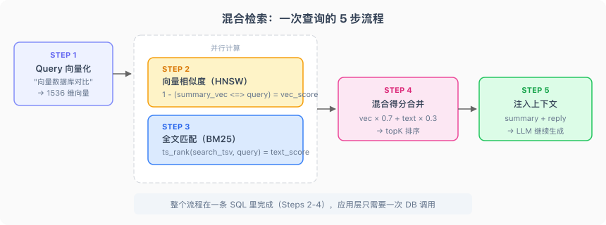

# 前言

[上一篇](/2026/04/14/ai-mem-file/)我们给 Agent 加上了文件系统记忆——memory-save 写偏好、skill-creator 沉淀 SOP、memory-governance 清理垃圾。数据量小的时候，Bootstrap 全量加载 MEMORY.md 就够了。

但你用了三个月之后，问题来了。

MEMORY.md 有 200 行硬上限，三个月的对话积累，200 行根本装不下。你可以按主题拆 topic 文件，但 topic 越来越多，每次 Bootstrap 加载的东西越来越杂，该找的找不到，不该出现的一直占着注意力。更崩溃的是，用户说"上次那个航班"——这种模糊查询在文件系统里根本没法匹配，因为没有任何文件名叫"那个航班"。

说白了，文件系统记忆的核心矛盾是：**数据在增长，但加载方式永远是全量读取。** 量一大，要么装不下，要么装下了也找不到。

解法只有一个：把记忆从"全量加载"变成"按需检索"。用户问到历史信息时，Agent 去搜，搜到了注入上下文，搜不到就说不知道——和人的长期记忆一个道理。

这篇要做的就是这件事：给 Agent 接上搜索能力，实现 RAG（Retrieval-Augmented Generation）驱动的长期记忆。

# 一、RAG 的本质

很多人第一次听到 RAG，脑子里浮现的画面是：向量数据库、embedding、余弦相似度。这个印象没错，但不完整。

你写过搜索功能吗？用户输入关键词，后端查数据库，把结果返回给前端展示。这是传统搜索，只有"检索"，没有"生成"。RAG 多了一步：**把检索到的结果塞给 LLM，让它基于这些结果生成回答。** 所以叫 Retrieval-**Augmented** Generation——用检索来增强生成。

拆开看就三步：

1. **建索引（Indexing）**：把知识库预处理，建立可检索的结构
2. **检索（Retrieval）**：拿查询去搜索，召回 topK 条结果
3. **生成（Generation）**：把召回结果注入 LLM 上下文，生成最终回答

前两步和传统搜索一模一样，区别在第三步——传统搜索到"检索"就结束了，RAG 多了一步"把结果喂给模型继续生成"。


搞清楚这个本质，一个常见误区就不攻自破：**RAG ≠ 向量数据库。** RAG 的核心是"检索 + 生成"这个模式，至于检索用什么方式——grep、SQL 全文索引、向量搜索、知识图谱——都行。向量搜索只是检索手段之一，不是 RAG 的定义。

# 二、为什么需要它

文件系统记忆在什么时候会崩？三个时刻。

**第一个崩溃时刻：规模爆炸。** MEMORY.md 有 200 行硬上限，这是 Bootstrap 注意力预算的约束。三个月的对话积累，200 行塞不下。你可以拆主题文件，但 topic 文件越来越多，索引本身也在膨胀，最终还是回到同一个问题：内容太多，无法全量加载。

**第二个崩溃时刻：语义模糊查询。** "上次那个航班"、"之前聊过的投资建议"、"我说过不喜欢的那种回复风格"——这类查询没有精确关键词，文件名匹配不上，全文 grep 也不好使。用户脑子里是语义，文件系统里是字符串，中间隔了一层翻译。

**第三个崩溃时刻：维护成本爆炸。** 文件系统记忆需要 Agent 主动维护：写入、去重、更新时间戳、控制行数。这些工作本身就消耗注意力预算。数据量越大，维护越重，Agent 花在"管理记忆"上的精力比"回答问题"还多，形成恶性循环。

三个崩溃时刻指向同一个解法：**把记忆从"全量加载"变成"按需检索"。** 不管你有多少条记忆，每次只取最相关的几条注入上下文。这就是搜索驱动的记忆系统要做的事。

# 三、四种搜索方式

搜索方式不止向量一种。按场景选，混合用，效果才好。

## 3.1 grep / 全文扫描

最朴素的 RAG，没有索引，逐行扫描，正则匹配。

```javascript
// 最简单的记忆搜索：grep
import { readFileSync } from 'fs'

function grepMemory(dir, keyword) {
  const files = readdirSync(dir).filter(f => f.endsWith('.md'))
  const results = []
  for (const file of files) {
    const lines = readFileSync(`${dir}/${file}`, 'utf-8').split('\n')
    lines.forEach((line, i) => {
      if (line.includes(keyword)) results.push({ file, line: i, text: line })
    })
  }
  return results
}
```

优点是零配置，一个函数就搞定。缺点是 O(n) 性能，数据量一大就慢，而且只能精确匹配——搜"航班"找不到"机票"。

适合：记忆量小（几十条），精确 token 匹配（错误码、变量名、文件路径）。

## 3.2 关键字 + BM25

grep 的问题在于没有索引。加了索引之后，搜索性能从 O(n) 变成 O(1)，这就是倒排索引的价值。

工业标准的关键字搜索算法是 BM25（Best Match 25）。它在 TF-IDF 的基础上加了文档长度归一化。用一个具体例子来说明它怎么打分：

假设你搜"向量数据库对比"，记忆库里有两条数据：

- 文档 A（50 字）："用 pgvector 做向量数据库，和 Pinecone 对比了性能"
- 文档 B（500 字）：一篇长长的技术笔记，里面提了一次"向量"

BM25 会综合考虑三个因素：**词频**（"向量"在 A 中出现的密度比 B 高）、**逆文档频率**（"对比"这个词在所有文档中不常出现，权重更高）、**文档长度**（A 只有 50 字，密度更高，加分）。最终 A 的得分远高于 B。

PostgreSQL 原生支持全文搜索，用 `tsvector` + GIN 索引就能做到：

```sql
-- 建全文索引列
search_tsv TSVECTOR GENERATED ALWAYS AS (to_tsvector('simple', search_text)) STORED

-- 建 GIN 索引
CREATE INDEX memories_search_tsv_idx ON memories USING gin (search_tsv);

-- 搜索
SELECT *, ts_rank(search_tsv, plainto_tsquery('simple', '向量数据库')) AS score
FROM memories ORDER BY score DESC LIMIT 5;
```

**关键字搜索在什么时候比向量搜索强？** 精确 token。函数名、错误码、文件路径这类东西，用户搜的就是那个字符串本身，不需要语义理解。搜 `ERR_CONNECTION_REFUSED`，你希望精确匹配到包含这个错误码的记录，而不是语义相近的"网络连接失败"。

## 3.3 向量语义搜索

关键字搜索搞不定"上次那个航班"——因为记忆里可能存的是"帮你查了 CA1234 航班的延误信息"，关键词完全对不上。

向量搜索把语义相似度变成数学问题：

1. 文本 → Embedding 模型 → 高维向量（float 数组）
2. 两个向量的余弦距离越小 → 语义越相似
3. 搜索时：query 转向量 → 计算和所有记忆向量的余弦距离 → 返回最近的 topK 条

```javascript
import { embed } from 'ai'
import { createOpenAI } from '@ai-sdk/openai'

const openai = createOpenAI({ apiKey: process.env.OPENAI_API_KEY })
const model = openai.embedding('text-embedding-3-small')

// 文本 → 向量
const { embedding } = await embed({ model, value: '上次那个航班' })
// embedding 是一个 1536 维的 float 数组
```

"上次那个航班"和"CA1234 航班延误信息"在向量空间里距离很近，因为 embedding 模型理解了它们的语义关联。这是关键字搜索做不到的。

## 3.4 知识图谱

前面三种搜索都是"搜一条数据"，知识图谱解决的是"通过关系找到一组数据"：

- Alice → manages → Auth Team → owns → Permissions Service
- 问"Alice 负责哪些服务"，需要沿着关系链遍历两层才能拿到答案

典型工具是 Neo4j、Amazon Neptune。知识图谱在多实体关系推理场景很强，但构建和维护成本高，本文不做代码实现，标记为进阶方向。

## 3.5 对比

| 方式 | 适用场景 | 精度 | 性能 | 复杂度 |
|------|---------|------|------|--------|
| grep / 全文扫描 | 小规模，精确匹配 | 精确匹配高，语义匹配无 | O(n)，慢 | 极低 |
| 关键字 + BM25 | 精确 token，错误码、函数名 | 精确 token 高 | O(1)，快 | 中 |
| 向量语义搜索 | 模糊语义查询 | 语义匹配高 | O(log n)，快 | 中高 |
| 知识图谱 | 多实体关系推理 | 关系推理高 | 取决于图规模 | 高 |

单一方式都有盲区：向量搜索找不到精确错误码，关键字搜索理解不了"上次那个航班"。生产级方案是混合检索——向量 + 关键字，取长补短。

# 四、混合检索实战

这是本文的核心。我们用 PostgreSQL + pgvector 做一个完整的混合检索记忆系统：向量语义搜索和 BM25 关键字搜索在同一条 SQL 里完成，不需要两个数据库。

## 4.1 环境准备

用 Docker 启动一个带 pgvector 扩展的 PostgreSQL：

```bash
docker run --name mem-pg -d \
  -e POSTGRES_PASSWORD=postgres \
  -p 5432:5432 \
  pgvector/pgvector:pg17
```

npm 依赖：

```bash
npm install ai @ai-sdk/openai pg zod
```

## 4.2 Schema 设计

先看完整的建表语句，然后逐个说设计决策：

```sql
CREATE EXTENSION IF NOT EXISTS vector;

CREATE TABLE IF NOT EXISTS memories (
    id              TEXT        PRIMARY KEY,          -- 内容哈希，保证幂等
    session_id      TEXT        NOT NULL,
    routing_key     TEXT        NOT NULL,             -- 用户标识

    user_message    TEXT        NOT NULL,
    assistant_reply TEXT        NOT NULL,

    -- LLM 提取的结构化字段
    summary         TEXT        NOT NULL,             -- 一句话摘要
    tags            TEXT[]      NOT NULL DEFAULT '{}', -- 领域标签

    created_at      TIMESTAMPTZ NOT NULL DEFAULT NOW(),
    turn_ts         BIGINT      NOT NULL,

    -- 向量就是普通列，不是独立的向量数据库
    summary_vec     vector(1536),                     -- 摘要向量
    message_vec     vector(1536),                     -- 原始消息向量

    -- 全文搜索列，自动维护
    search_text     TEXT        NOT NULL DEFAULT '',
    search_tsv      TSVECTOR   GENERATED ALWAYS AS
                      (to_tsvector('simple', search_text)) STORED
);

-- 向量索引（HNSW 近似最近邻）
CREATE INDEX IF NOT EXISTS memories_summary_vec_idx
    ON memories USING hnsw (summary_vec vector_cosine_ops);

-- 全文索引（GIN）
CREATE INDEX IF NOT EXISTS memories_search_tsv_idx
    ON memories USING gin (search_tsv);

-- 标量索引
CREATE INDEX IF NOT EXISTS memories_routing_key_idx ON memories (routing_key);
CREATE INDEX IF NOT EXISTS memories_created_at_idx  ON memories (created_at DESC);
CREATE INDEX IF NOT EXISTS memories_tags_idx        ON memories USING gin (tags);
```

三个设计决策值得展开说。

**`search_tsv` 用 `GENERATED ALWAYS AS` 自动维护。** 写入时只需要填 `search_text`（用户消息 + 摘要 + 标签拼接），PostgreSQL 自动把它分词后更新到 `search_tsv` 列。不需要手动维护全文索引，也不会出现索引和数据不一致的问题。

**两个向量列：`summary_vec` 和 `message_vec`。** 为什么要两个？因为搜索意图不同。用户说"上次那个航班"，用摘要向量搜更准（摘要是提炼后的一句话）；用户说"我发过一段很长的代码"，用原始消息向量搜更准（保留了原始细节）。两个维度的语义搜索，召回更全面。

**向量是普通列，不是独立的向量数据库。** 这是本文最重要的设计原则。`summary_vec` 和 `message_vec` 就是表里的两个字段，和 `tags`、`created_at` 没有本质区别。一条 SQL 可以同时做向量排序、全文匹配、标量过滤，不需要两个系统之间同步数据。

为什么不用专门的向量数据库（Pinecone、Milvus）？因为向量和标量分开存，混合检索就得先去向量库搜 topK，再拿 ID 回关系库做标量过滤，两次 I/O。更麻烦的是数据一致性——向量库写成功、关系库写失败怎么办？反过来呢？pgvector 把向量当普通列，一张表一条 SQL，这个问题根本不存在。Supabase、GitHub Copilot 都在用 pgvector，企业级完全扛得住。

## 4.3 写入：对话 → embedding → 入库

每轮对话结束后，Agent 把值得记住的内容写入记忆库。看简化后的核心代码：

```javascript
import { createHash } from 'crypto'
import { embed } from 'ai'
import { createOpenAI } from '@ai-sdk/openai'
import { query } from './db.js'

const openai = createOpenAI({ apiKey: process.env.OPENAI_API_KEY })
const embeddingModel = openai.embedding('text-embedding-3-small')

// 确定性哈希 → 幂等写入
function makeId(sessionId, turnTs) {
  return createHash('sha256')
    .update(`${sessionId}:${turnTs}`)
    .digest('hex')
    .slice(0, 16)
}

export async function storeMemory({
  sessionId, routingKey, userMessage,
  assistantReply, summary, tags, turnTs,
}) {
  const id = makeId(sessionId, turnTs)

  // 并行生成两个向量
  const [{ embedding: summaryVec }, { embedding: messageVec }] =
    await Promise.all([
      embed({ model: embeddingModel, value: summary }),
      embed({ model: embeddingModel, value: userMessage }),
    ])

  // 拼接全文搜索文本
  const searchText = [userMessage, summary, ...tags].join(' ')

  await query(
    `INSERT INTO memories
       (id, session_id, routing_key, user_message, assistant_reply,
        summary, tags, turn_ts, summary_vec, message_vec, search_text)
     VALUES ($1,$2,$3,$4,$5,$6,$7,$8,$9,$10,$11)
     ON CONFLICT (id) DO NOTHING`,
    [id, sessionId, routingKey, userMessage, assistantReply,
     summary, tags, turnTs,
     JSON.stringify(summaryVec), JSON.stringify(messageVec), searchText]
  )
  return id
}
```

几个关键点：

**`makeId` 用内容哈希生成 ID。** `sessionId + turnTs` 确定性地映射到一个哈希值，同一轮对话不管写多少次，ID 都一样。配合 `ON CONFLICT (id) DO NOTHING`，实现幂等写入——服务重启、网络抖动、手动重跑都不会产生重复数据。

**`embed` 来自 Vercel AI SDK。** 一行代码拿到向量，不用自己拼 HTTP 请求。两个 embed 并行执行，省时间。

**chunk 设计：一问一答为一个 chunk。** 为什么不只存用户消息？因为"帮我转换 PDF"这个 chunk 缺少了"转换成什么格式、结果在哪里"的上下文。只有问答合在一起，召回后才能还原完整信息。

## 4.4 查询：混合检索

查询是重头戏。一条 SQL 同时做三件事：向量相似度排序、全文关键字匹配、标量条件过滤。

```javascript
import { embed } from 'ai'
import { createOpenAI } from '@ai-sdk/openai'
import { query } from './db.js'

const openai = createOpenAI({ apiKey: process.env.OPENAI_API_KEY })
const embeddingModel = openai.embedding('text-embedding-3-small')

export async function searchMemory({
  queryText, routingKey,
  topK = 5, tags = null, afterDate = null,
  vectorWeight = 0.7, textWeight = 0.3,
}) {
  // query 也要向量化，用同一个 embedding 模型
  const { embedding: queryVec } = await embed({
    model: embeddingModel, value: queryText,
  })

  // 动态拼装过滤条件
  const conditions = ['routing_key = $2']
  const params = [JSON.stringify(queryVec), routingKey]
  let paramIdx = 3

  if (tags?.length) {
    conditions.push(`tags @> $${paramIdx}`)
    params.push(tags)
    paramIdx++
  }
  if (afterDate) {
    conditions.push(`created_at > $${paramIdx}`)
    params.push(afterDate)
    paramIdx++
  }

  const sql = `
    WITH scored AS (
      SELECT *,
        1 - (summary_vec <=> $1::vector) AS vec_score,
        ts_rank(search_tsv, plainto_tsquery('simple', $${paramIdx}))
          AS text_score
      FROM memories
      WHERE ${conditions.join(' AND ')}
    )
    SELECT *,
      (vec_score * ${vectorWeight} + text_score * ${textWeight}) AS score
    FROM scored
    ORDER BY score DESC
    LIMIT ${topK}
  `
  params.push(queryText)

  const result = await query(sql, params)
  return result.rows
}
```

这段代码浓度很高，拆开看。

**`1 - (summary_vec <=> $1::vector)` 是向量相似度得分。** `<=>` 是 pgvector 的余弦距离运算符，返回 0~2 之间的值（0 表示完全相同）。用 1 减去它，得到 0~1 之间的相似度分数。

**`ts_rank(search_tsv, plainto_tsquery(...))` 是全文匹配得分。** PostgreSQL 内置的 BM25 近似评分，返回关键字匹配的相关性分数。

**`vec_score * 0.7 + text_score * 0.3` 是混合得分。** 语义相似度权重更高（0.7），关键字匹配作为补充（0.3）。这个 0.7/0.3 是经验值，实际项目中可以根据场景调。

**标量过滤（`routing_key`、`tags`、`afterDate`）和向量排序在同一条 SQL 里。** 这就是 pgvector 的优势——不需要先去向量库搜 topK 再回关系库过滤。

跑一下看看效果。假设记忆库里存了一条"帮用户查了 CA1234 航班的延误情况"，搜索"上次那个航班"：

```text
query: "上次那个航班"
results:
  [0] score: 0.782
      summary: "查询 CA1234 航班延误信息并提供改签建议"
      tags: ["travel", "flight"]
```

"上次那个航班"和"CA1234 航班延误"关键词完全不同，但向量相似度把它们关联起来了。同时 `text_score` 也贡献了一部分分数，因为"航班"这个关键词精确匹配上了。两路搜索互补，召回效果远好于单一方式。

## 4.5 集成到 Agent

把搜索能力封装成 Agent 可以调用的 tool：

```javascript
import { tool } from 'ai'
import { z } from 'zod'
import { searchMemory } from './memory-search.js'

const memorySearchTool = tool({
  description: '从长期记忆中检索历史对话。当用户提到"上次"、"之前"或需要历史上下文时使用。',
  parameters: z.object({
    query: z.string().describe('搜索查询，描述要找什么'),
    routing_key: z.string().describe('用户标识'),
    top_k: z.number().optional().default(5),
    tags: z.array(z.string()).optional(),
    after_date: z.string().optional().describe('ISO 格式日期'),
  }),
  execute: async ({ query, routing_key, top_k, tags, after_date }) => {
    const results = await searchMemory({
      queryText: query,
      routingKey: routing_key,
      topK: top_k,
      tags: tags?.length ? tags : null,
      afterDate: after_date || null,
    })
    if (results.length === 0) return '未找到相关记忆'
    return JSON.stringify(
      results.map(r => ({
        summary: r.summary,
        user_message: r.user_message,
        assistant_reply: r.assistant_reply,
        tags: r.tags,
        score: Math.round(r.score * 1000) / 1000,
      })), null, 2
    )
  },
})
```

Agent 拿到结果后，把 `summary` 和 `assistant_reply` 提取出来，组织成自然语言注入当前对话。用户感受到的就是"这个 Agent 记得之前聊过的事"。

# 五、底层运行机制

上面跑通了代码，但黑盒里面到底发生了什么？把一次查询"上次那个向量数据库对比"的执行过程拆开看。



**第一步：query 向量化。** 收到查询"向量数据库对比"后，调用 `text-embedding-3-small`，把这句话转成 1536 维向量。这一步和写入时对 summary 向量化用的是**同一个模型**——模型一致是向量搜索有效的前提。为什么？因为不同模型的向量空间不兼容。模型 A 生成的向量和模型 B 生成的向量，即使输入相同文本，在各自空间中的位置也完全不同，余弦距离没有意义。

**第二步：向量相似度计算。** pgvector 用 HNSW（Hierarchical Navigable Small World）索引做近似最近邻搜索。HNSW 不是精确搜索，而是在图结构上做贪心遍历，牺牲少量精度（通常 < 1%）换取 O(log n) 的查询性能。精确搜索要扫全表，O(n)；HNSW 只遍历图的几层邻居，快几个数量级。对于记忆召回场景，这点精度损失完全可以接受。

**第三步：全文得分计算。** PostgreSQL 的 `ts_rank` 函数对 `search_tsv` 列做 BM25 近似评分。"向量数据库对比"被分词后，和索引中的词条做匹配，返回关键字相关性分数。

**第四步：混合得分合并。** `score = vec_score × 0.7 + text_score × 0.3`，按得分降序取 topK。语义相似度权重更高，因为大多数记忆查询是模糊的（"上次那个 xxx"）；关键字匹配作为补充，在精确 token 场景兜底。

**第五步：结果注入上下文。** Agent 拿到 JSON 结果，把 `summary` 和 `assistant_reply` 提取出来，组织成自然语言，注入当前对话上下文继续生成回复。用户看到的就是 Agent 自然地说"上次你问过向量数据库的对比，我们讨论了 pgvector 和 Pinecone 的差异……"

回头再看一个精妙的设计：`search_tsv` 列用 `GENERATED ALWAYS AS` 自动维护。全文索引永远和数据保持一致，不需要任何额外的同步逻辑。PostgreSQL 在写入时自动计算并更新这个列，应用层完全不用管。

最后一点：理解了这个底层机制，你完全可以把 pgvector 换成任何支持向量列的数据库——OceanBase、AlloyDB、Neon——混合检索的 SQL 逻辑一字不改。pgvector 不是绑死的技术选型，它只是"关系数据库 + 向量列"这个架构模式的一种实现。

# 六、最佳实践与反模式

## 🚫 反模式

**反模式一：RAG = 向量搜索。** 一上来就引入向量数据库，忽略关键字搜索在精确匹配场景的优势。用户搜"错误码 ERR_500"，向量搜索可能召回一堆"服务器错误"相关的语义内容，而不是那条精确包含 `ERR_500` 的记录。混合检索才是生产级方案。

**反模式二：冷启动就上 RAG。** 记忆量只有几十条，就搭 pgvector + embedding pipeline，工程复杂度远超实际需求。几十条记忆用 grep 就够了，几百条用文件系统就够了，上千条才需要搜索驱动。什么规模用什么方案，过早引入 RAG 是典型的过度工程。

**反模式三：向量和标量数据分离存储。** 向量存 Pinecone，标量存 PostgreSQL，混合检索时两边 join。两套系统的数据一致性是噩梦——向量库写成功、关系库写失败怎么办？分布式事务的复杂度远超收益。pgvector 把向量当普通列，一张表、一条 SQL、一个事务，这个问题不存在。

## 💡 最佳实践

**最佳实践一：chunk 设计优先于模型选型。** 召回效果 80% 取决于 chunk 质量，20% 取决于 embedding 模型。在换模型之前，先检查 chunk 是否语义完整。我们用"一问一答为一个 chunk"，因为问题和回答合在一起才能完整表达语义。如果只存用户消息，"帮我转换 PDF"这个 chunk 缺少了"转成什么格式、结果在哪里"的上下文，召回后无法还原完整信息。

**最佳实践二：幂等写入，增量更新。** id 用内容哈希生成，`ON CONFLICT DO NOTHING` 保证幂等。每次对话后只写入新增的 chunk，不重建整个索引。这在生产中至关重要——服务重启、网络抖动、手动重跑都不会产生重复数据，也不会触发全量重建的性能开销。

**最佳实践三：降级重试策略写进 Skill 文档。** 搜索结果为空时的降级逻辑——去掉时间限制重搜、去掉标签限制重搜、换更宽泛的 query 重搜——不需要写在代码里。写在 Skill 文档里，Agent 读到就会自主执行：

```markdown
### 降级策略
如果搜索结果为空或相关度太低（score < 0.3），按顺序降级重试：
1. **去掉时间限制** → 重新搜索
2. **去掉标签限制** → 只保留 query 和 routing_key
3. **换更宽泛的 query** → 用更抽象的描述重写查询
最多重试 2 次。
```

这是 task 型 Skill 的核心价值：把操作规范变成模型可读的文档，让 Agent 自主决策，工程师只需要维护文档。上一篇讲过，Skill 文件里写 why，模型才能举一反三——降级策略也是同样的道理。

# 收尾

三篇文章走下来，Agent 的记忆系统从无到有搭了三层：

[第一篇](/2026/04/10/ai-context-engineering/)解决的是**单次会话内**的问题——Bootstrap 注入身份和规则、Tool Result 剪枝、对话压缩，让 Agent 在一次对话里能持续保持状态。

[第二篇](/2026/04/14/ai-mem-file/)解决的是**跨会话**的问题——memory-save 写偏好、skill-creator 沉淀 SOP、memory-governance 清理垃圾，让 Agent 在多次对话之间不丢信息。

这一篇解决的是**规模化**的问题——当记忆量大到文件系统装不下时，用 RAG + pgvector 混合检索实现按需召回，让 Agent 在海量历史数据中精准找到相关信息。

三层加在一起：会话内管好注意力，跨会话留住知识，量大了搜着用。这就是一个完整的 Agent 记忆系统的基本骨架。

当然，还有很多可以继续探索的方向：记忆衰减（时间越久权重越低）、多用户隔离（不同用户的记忆互不干扰）、记忆质量评估（自动检测过时或矛盾的记忆）、更精细的 chunk 策略。这些留给实际项目中去踩坑和优化吧。
