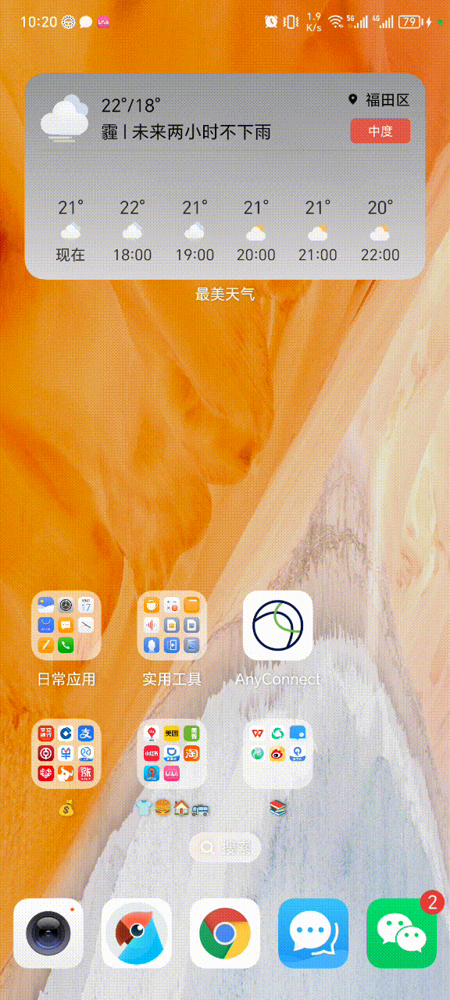

上一篇文章简单调研了下利用 AI 进行 UI 自动化的技术，顺着这个思路，是不是可以给 AI 一个手机，让它帮我们做更多事情呢？搜索一下，发现已经有人开发了 [mobile-use](https://github.com/runablehq/mobile-use) 这个项目，今天就来玩一下。

首先需要安装好 adb，并通过 USB 数据线连接安卓手机，打开开发者模式，并开启 USB 调试模式，在终端输入 `adb devices`，如果显示有设备，则说明安装成功。

然后，写个简单的 Demo 脚本：

```js
const {mobileUse} = require('mobile-use')
const {createOpenAI} = require('@ai-sdk/openai')

const {readFile, access} = require('node:fs/promises')
const yargs = require('yargs')
const {hideBin} = require('yargs/helpers')

const openai = createOpenAI({
  baseURL: process.env.OPENAI_API_BASE_URL,
  apiKey: process.env.OPENAI_API_KEY,
})

const argv = yargs(hideBin(process.argv))
  .usage('Usage: $0 <command> [options]')
  .demandCommand(1, 'Please provide either a command string or a file path')
  .help().argv

async function run() {
  const input = argv._[0].toString()
  let task
  try {
    await access(input)
    task = (await readFile(input, 'utf-8')).trim()
  } catch {
    task = input
  }
  const response = await mobileUse({
    task,
    llm: openai('gpt-4o'),
  })
  return response.text
}

run()
  .catch((error) => console.error(error))
  .then((result) => console.log(result))
```

编写一个 `task.txt` 文件，即将手机笔记本中的内容复制到腾讯元宝中并提交：

```
1. open com.hihonor.notepad
2. Tap Taylor Swift
3. Get content of Taylor Swift as $content
4. open com.tencent.hunyuan.app.chat
5. Type $content
6. Click send
```

执行 `node index.js task.txt`。

效果如下所示：



我们还是通过请求日志来分析一下是怎么实现的。

第一次发送的请求如下所示，可以看到定义了 `openApp`，`listApps` 和 `computer` 三个 tool，这些 tool 最终都是通过 adb 来操作设备。

```json
{
  "model": "gpt-4o",
  "temperature": 0,
  "messages": [
    {
      "role": "system",
      "content": "You are an experienced mobile automation engineer. \nYour job is to navigate an android device and perform actions to fullfil request of the user.\n\n<steps>\nIf the user asks to use a specific app in the request, open it before performing any other action.\nDo not take ui dump more than once per action. If you think you don't need to take ui dump, skip it. Use it sparingly.\n</steps>\n"
    },
    {
      "role": "user",
      "content": "1. open com.hihonor.notepad\n2. Tap Taylor Swift\n3. Get content of Taylor Swift as $content\n4. open com.tencent.hunyuan.app.chat\n5. Type $content\n6. Click send"
    }
  ],
  "tools": [
    {
      "type": "function",
      "function": {
        "name": "openApp",
        "description": "Open an on on android device.",
        "parameters": {
          "type": "object",
          "properties": {
            "name": {
              "type": "string",
              "description": "package name of the app to open such as com.google.android.dialer"
            }
          },
          "required": ["name"],
          "additionalProperties": false
        }
      }
    },
    {
      "type": "function",
      "function": {
        "name": "listApps",
        "description": "Use this to list packages.",
        "parameters": {
          "type": "object",
          "properties": {
            "name": {
              "type": "string",
              "description": "Name of the package to filter."
            }
          },
          "required": ["name"],
          "additionalProperties": false
        }
      }
    },
    {
      "type": "function",
      "function": {
        "name": "computer",
        "description": "Mobile tool to perform actions on a mobile device.",
        "parameters": {
          "type": "object",
          "properties": {
            "action": {
              "type": "string",
              "enum": [
                "ui_dump",
                "tap",
                "swipe",
                "type",
                "press",
                "wait",
                "screenshot"
              ],
              "description": "ui_dump: Get UI elements you can interact with for the current screen.\ntap: Tap on the provided coordinate.\nswipe: Swipe from start_coordinate to end_coordinate.\ntype: Type in the box.\npress: Press mobile key or button.\nscreenshot: Take a screenshot of the current screen if UI dump is not helpful or where you need to see visuals. \n      "
            },
            "coordinate": {"type": "array", "items": {"type": "number"}},
            "start_coordinate": {"type": "array", "items": {"type": "number"}},
            "end_coordinate": {"type": "array", "items": {"type": "number"}},
            "text": {"type": "string"},
            "duration": {"type": "number"}
          },
          "required": ["action"],
          "additionalProperties": false
        }
      }
    }
  ],
  "tool_choice": "auto"
}
```

大模型返回 `openApp` 的 tool call，打开笔记本：

```json
{
  "id": "chatcmpl-BN9A2Vtp0QnGxf9frNG8fMtk4tBHg",
  "choices": [
    {
      "finish_reason": "tool_calls",
      "index": 0,
      "logprobs": null,
      "message": {
        "content": null,
        "refusal": null,
        "role": "assistant",
        "annotations": [],
        "audio": null,
        "function_call": null,
        "tool_calls": [
          {
            "id": "call_ydC7cOmRppTsVEu0AneG3g6R",
            "function": {
              "arguments": "{\"name\":\"com.hihonor.notepad\"}",
              "name": "openApp"
            },
            "type": "function"
          }
        ]
      }
    }
  ],
  ...
}
```

第二次请求，将 `openApp` 以及执行结果追加到 messges 中给大模型：

```json
{
  "model": "gpt-4o",
  "temperature": 0,
  "messages": [
    {
      "role": "system",
      "content": "You are an experienced mobile automation engineer. \nYour job is to navigate an android device and perform actions to fullfil request of the user.\n\n<steps>\nIf the user asks to use a specific app in the request, open it before performing any other action.\nDo not take ui dump more than once per action. If you think you don't need to take ui dump, skip it. Use it sparingly.\n</steps>\n"
    },
    {
      "role": "user",
      "content": "1. open com.hihonor.notepad\n2. Tap Taylor Swift\n3. Get content of Taylor Swift as $content\n4. open com.tencent.hunyuan.app.chat\n5. Type $content\n6. Click send"
    },
    {
      "role": "assistant",
      "content": "",
      "tool_calls": [
        {
          "id": "call_ydC7cOmRppTsVEu0AneG3g6R",
          "type": "function",
          "function": {
            "name": "openApp",
            "arguments": "{\"name\":\"com.hihonor.notepad\"}"
          }
        }
      ]
    },
    {
      "role": "tool",
      "tool_call_id": "call_ydC7cOmRppTsVEu0AneG3g6R",
      "content": "\"Successfull opened com.hihonor.notepad\""
    }
  ],
  "tools": [
    ...
  ],
  "tool_choice": "auto"
}
```

大模型返回 `computer` 类型的 tool call，参数为 `{"action": "ui_dump"}`，即获取页面的 UI 信息：

```json
{
  "id": "chatcmpl-BN9A4Mrj0JZ8QeSZYsdlz7gOMiwhW",
  "choices": [
    {
      "finish_reason": "tool_calls",
      "index": 0,
      "logprobs": null,
      "message": {
        "content": null,
        "refusal": null,
        "role": "assistant",
        "annotations": [],
        "audio": null,
        "function_call": null,
        "tool_calls": [
          {
            "id": "call_2T37XmWjfQhItVmw4vQzkoom",
            "function": {
              "arguments": "{\"action\":\"ui_dump\"}",
              "name": "computer"
            },
            "type": "function"
          }
        ]
      }
    }
  ],
  ...
}
```

看一下 `ui_dump` 返回的结果，是一个 JSON 格式的数据结构，包含所有页面的元素的坐标、类型等信息。它是通过解析 `uiautomator dump` 的结果得到的。

```json
{
  "model": "gpt-4o",
  "temperature": 0,
  "messages": [
    ...
    {
      "role": "assistant",
      "content": "",
      "tool_calls": [
        {
          "id": "call_2T37XmWjfQhItVmw4vQzkoom",
          "type": "function",
          "function": {
            "name": "computer",
            "arguments": "{\"action\":\"ui_dump\"}"
          }
        }
      ]
    },
    {
      "role": "tool",
      "tool_call_id": "call_2T37XmWjfQhItVmw4vQzkoom",
      "content": "[{\"type\":\"text\",\"text\":\"{\\\"type\\\":\\\"view\\\",\\\"clickable\\\":false,\\\"bounds\\\":\\\"[0,0][1080,2316]\\\",\\\"children\\\":[{\\\"type\\\":\\\"view\\\",\\\"clickable\\\":false,\\\"bounds\\\":\\\"[0,84][1080,468]\\\",\\\"desc\\\":\\\"1 条笔记\\\",\\\"id\\\":\\\"collapsing_toolbar\\\",\\\"children\\\":[{\\\"type\\\":\\\"button\\\",\\\"clickable\\\":false,\\\"bounds\\\":\\\"[936,96][1044,240]\\\",\\\"desc\\\":\\\"更多选项\\\",\\\"id\\\":\\\"action_menu_more_button\\\"},{\\\"type\\\":\\\"view\\\",\\\"clickable\\\":false,\\\"bounds\\\":\\\"[72,245][564,366]\\\",\\\"children\\\":[{\\\"type\\\":\\\"text\\\",\\\"clickable\\\":false,\\\"bounds\\\":\\\"[72,245][432,366]\\\",\\\"text\\\":\\\"全部笔记\\\",\\\"id\\\":\\\"extend_appbar_title\\\"}]}]},{\\\"type\\\":\\\"list\\\",\\\"clickable\\\":false,\\\"bounds\\\":\\\"[0,468][1080,2316]\\\",\\\"id\\\":\\\"notes_listview\\\",\\\"children\\\":[{\\\"type\\\":\\\"view\\\",\\\"clickable\\\":false,\\\"bounds\\\":\\\"[0,636][1080,1012]\\\",\\\"id\\\":\\\"swipelayout\\\",\\\"children\\\":[{\\\"type\\\":\\\"text\\\",\\\"clickable\\\":false,\\\"bounds\\\":\\\"[72,666][996,731]\\\",\\\"text\\\":\\\"Taylor Swift\\\",\\\"id\\\":\\\"item_title\\\"},{\\\"type\\\":\\\"text\\\",\\\"clickable\\\":false,\\\"bounds\\\":\\\"[72,749][996,861]\\\",\\\"text\\\":\\\"本服务将笔记中输入的语音内容转换成文本，需联网，需读取设备唯一可识别信息，需收集、读取并传送笔记中输入的语音到服务器，其中语音内容会委托给第三方服务提供商，用于将语音转换成文本。点击“同意”，即可启用该服务。\\\",\\\"id\\\":\\\"item_content_hide\\\"},{\\\"type\\\":\\\"text\\\",\\\"clickable\\\":false,\\\"bounds\\\":\\\"[72,749][996,855]\\\",\\\"text\\\":\\\"We were both young when I first saw you.\\\",\\\"id\\\":\\\"item_content\\\"}]}]},{\\\"type\\\":\\\"view\\\",\\\"clickable\\\":false,\\\"bounds\\\":\\\"[984,468][1080,2316]\\\",\\\"id\\\":\\\"scroll_bar\\\"},{\\\"type\\\":\\\"view\\\",\\\"clickable\\\":false,\\\"bounds\\\":\\\"[0,468][1080,636]\\\",\\\"id\\\":\\\"real_search_view\\\",\\\"children\\\":[{\\\"type\\\":\\\"text\\\",\\\"clickable\\\":false,\\\"bounds\\\":\\\"[36,498][1044,606]\\\",\\\"text\\\":\\\"搜索笔记\\\",\\\"desc\\\":\\\"搜索查询\\\",\\\"id\\\":\\\"search_src_text\\\"}]},{\\\"type\\\":\\\"button\\\",\\\"clickable\\\":false,\\\"bounds\\\":\\\"[864,2016][1008,2160]\\\",\\\"desc\\\":\\\"新建\\\",\\\"id\\\":\\\"fab_add\\\"},{\\\"type\\\":\\\"text\\\",\\\"clickable\\\":false,\\\"bounds\\\":\\\"[0,0][0,0]\\\",\\\"text\\\":\\\"笔记\\\",\\\"id\\\":\\\"content\\\"},{\\\"type\\\":\\\"text\\\",\\\"clickable\\\":false,\\\"bounds\\\":\\\"[0,0][0,0]\\\",\\\"text\\\":\\\"待办\\\",\\\"id\\\":\\\"content\\\"}]}\"}]"
    }
  ],
  "tools": [
    ...
  ],
  "tool_choice": "auto"
}
```

然后 LLM 通过分析页面信息，得到 `Taylor Swift` 的点击坐标返回 `computer` 类型的 tool call，参数为 `{"action": "tap", "coordinate":[72,666]}`：

```json
{
  "id": "chatcmpl-BN9A8OmVB5R8o7cQ15spyO278XpJM",
  "choices": [
    {
      "finish_reason": "tool_calls",
      "index": 0,
      "logprobs": null,
      "message": {
        "content": null,
        "refusal": null,
        "role": "assistant",
        "annotations": [],
        "audio": null,
        "function_call": null,
        "tool_calls": [
          {
            "id": "call_KELEnVExZ9eBD7nmYxoVFrUk",
            "function": {
              "arguments": "{\"action\":\"tap\",\"coordinate\":[72,666]}",
              "name": "computer"
            },
            "type": "function"
          }
        ]
      }
    }
  ],
  ...
}
```

之后就是不停地重复类似的步骤了。

给大模型装配上手和脚以后，可以催生出很多应用场景，比如让大模型同时陪我的几个女朋友一起聊天，我就可以安心学习 AI 了，想想就开心。