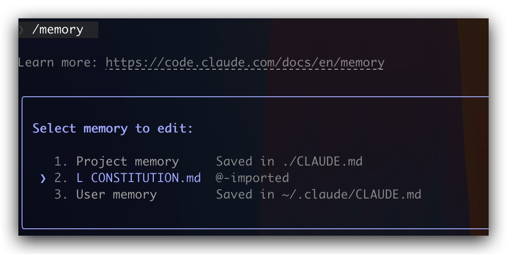
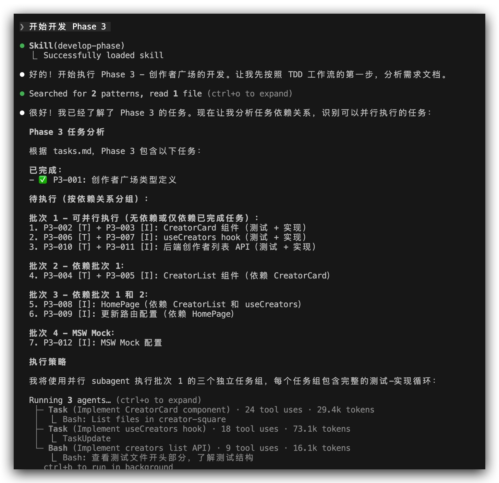

# 前言

在 AI 技术快速发展的今天，我们的软件开发方式正在悄然改变。现在应该都在用 Cursor 或 Claude Code 这样的工具来开发需求了，不过你可能会有这样的感受：虽然 AI 能写出不错的代码片段，但想要它完成一个完整且符合你预期的项目，却不是那么容易。

为什么会这样？我觉得主要一个原因在于“信息丢失”。我们的开发流程一般都是这样的：

1. 产品经理将业务构想，翻译成一份自然语言描述的 PRD。
2. 架构师和开发者阅读 PRD，进行“人脑编译”，将其翻译成技术设计文档。
3. 开发者再次进行“人脑编译”，将设计文档翻译成一行行具体的代码。

这个过程看起来挺顺畅，但实际上充满了损失。产品经理说的"用户体验要好"，到了开发者这里可能变成了"页面首屏加载时间不超过 2 秒"，或者干脆被忽略了。而且随着项目的迭代，代码不断变化，文档却很少更新，慢慢就变得过时，甚至成了开发的阻碍。多年来，我们尝试过敏捷、Scrum、UML 等各种方法来解决这个问题，但效果都不尽如人意。因为我们一直认为：文档只是辅助，代码才是"真理"。我曾经遇到过很多次 PM 在写需求时来问询代码某处的实现逻辑，来作为需求文档的参考信息。

而今天要介绍的 SDD（Spec Driven Developmen）则是要实现一次权利反转，在这场反转中：维护软件的核心，从“修改代码”，变成了“演进规范”。调试 Bug 的核心，从“修复错误代码”，变成了“修正产生错误代码的规范或方案”，当然这里的 Bug 指的是与需求本身相关的，而不是运行环境、依赖缺失等这种技术类型的 Bug。技术重构的核心，从“大规模迁移代码”，变成了“基于同一份规范，生成一个全新技术栈的实现”。

下面，让我们用一个"仅粉丝"的项目来实践一下，它是一个提供内容创作者付费订阅服务的平台，用户可以通过付费订阅来获取创作者的独家内容，完整代码见[这里]()。

# 环境准备

在开始前，我们先准备一下我们 AI 的工作环境，主要包括目录初始化，需要 AI 遵守的一些规范以及 AI 相关的设置：

```
.
├── .claude
│   ├── settings.json // 初始化 permissions 配置，为 AI 制定严格的行为准则，确保安全
│   └── skills // 用于存放 skills
├── CLAUDE.md // 项目操作手册，具体的、操作性的指令
├── CONSTITUTION.md // 项目的宪法，参考 https://github.com/github/spec-kit/blob/main/spec-driven.md
└── specs // SDD 相关的文档
```

我们输入 `/memory` 命令，可以看到这些文档都已经被加载了：



磨刀不误砍柴工，先把准备工作做好，后面正式开发的时候才会事半功倍。

# 需求设计与开发

## 需求与设计

我们现在只有一个 idea，如果直接丢给 AI 来实现，可能最后的效果会跟我们的想象有比较大的出入。所以这里我们先让 AI 协助，产生一份清晰的 PRD 文档。我们输入提示词如下（确保关闭 plan mode）：

```
你好！现在的任务是：我们要从零开始设计并实现 `仅粉丝`。

你现在不仅是资深的前端工程师，更是一位经验丰富的产品经理。我有一个初步的想法，需要你通过向我提问，帮助我澄清需求、挖掘边缘场景，最终目标是共创一份高质量的 `spec.md`。

我的初步想法是：**做一个“仅粉丝”网站，一个提供内容创作者付费订阅服务的平台，用户可以通过付费订阅来获取创作者的独家内容。**

请开始你的提问。
```

经过一番拉扯，这个过程可能要反复 review，反复提示 AI 修改，最终生成符合你需求的 `spec.md` 文档，放在这个目录下面：

```
└── specs
    └── 001-core-functionality
        └── spec.md
```

如果已经有 PRD 文档了，则可以让 AI 结合 PRD 文档再生成一份便于 AI 理解的。最终生成的文件示例如下：

```
# 仅粉丝 平台核心功能规格说明书

**文档版本**: v1.0
**创建日期**: 2026-02-10
**项目类型**: 作品集展示项目
**MVP 范围**: 前端 + 简化本地后端

---

## 📋 目录

1. [项目概述](#项目概述)
2. [用户角色与权限](#用户角色与权限)
3. [核心功能](#核心功能)
4. [用户故事](#用户故事)
...

---

## 项目概述
...

---

## 用户角色与权限
...

---

## 核心功能
...

---

## 用户故事
...

---

...其他章节...

```

## 生成计划

如果把 `spec.md` 类比于我们的 PRD，那接下就应该是进行方案设计，所以这一节我们需要根据 `spec.md` 来生成我们的 `plan.md` 文档。提示词如下：

```
@./specs/001-core-functionality/spec.md
你现在是`仅粉丝`项目的首席架构师。你的任务是基于我提供的 spec.md 以及我们已有的 CONSTITUTION.md，为项目生成一份详细的技术实现方案 plan.md

```
生成示例：

```
# 仅粉丝 技术实现方案

**文档版本**: v1.0
**创建日期**: 2026-02-13
**基于规格**: specs/001-core-functionality/spec.md v1.0

---

## 📋 目录

1. [技术选型与架构设计](#技术选型与架构设计)
2. [项目结构设计](#项目结构设计)
3. [数据模型设计](#数据模型设计)
4. [功能模块划分](#功能模块划分)
5. [开发阶段规划](#开发阶段规划)
6. [关键技术决策](#关键技术决策)
7. [测试策略](#测试策略)
8. [风险与挑战](#风险与挑战)

---

## 技术选型与架构设计

...

---

## 项目结构设计

...
---

## 数据模型设计

...
---

## 功能模块划分

...
---

## 关键技术决策

...
---

## 测试策略

...
---

## 风险与挑战

...
---

## 成功标准

...
---

## 下一步行动

...
---

## 附录

...
---

**文档结束**


```

当然，别忘了还是得要 review 一下。

## 生成任务

有了 `plan.md`，我们距离可执行的代码，还差最后一步：即将宏观的设计分解为具体的步骤。这个阶段，AI 将扮演“技术组长”的角色，生成一份 `task.md` 清单。提示词如下：

```
现在，请扮演技术组长。请仔细阅读 @./specs/001-core-functionality/spec.md 和 @./specs/001-core-functionality/plan.md。

你的目标是将 plan.md 中描述的技术方案，分解成一个**详尽的、原子化的、有依赖关系的、可被AI直接执行的任务列表**。

**关键要求：**
1.  **任务粒度：** 每个任务应该只涉及一个主要文件的修改或创建一个新文件。不要出现“实现所有功能”这种大任务。
2.  **TDD强制：** 根据`CONSTITUTION.md`的“测试先行铁律”，**必须**先生成测试任务，后生成实现任务。
3.  **并行标记：** 对于没有依赖关系的任务，请标记 `[P]`。

完成后，将生成的任务列表写入到`./specs/001-core-functionality/tasks.md`文件中。
```

生成示例如下：

```
#### P2-002 [T]: 创建用户名验证测试
**类型**: 测试
**描述**: 编写 `validateUsername` 函数的单元测试（长度、字符、唯一性）
**文件**: `src/features/auth/validation.test.ts`
**依赖**: P1-009
**并行**: [P]

#### P2-003 [I]: 实现用户名验证
**类型**: 实现
**描述**: 实现 `validateUsername` 函数
**文件**: `src/features/auth/validation.ts`
**依赖**: P2-002
```

其中 `[T]` 表示这是个编写测试用例的任务，`[I]` 表示这是功能实现的任务，可以看到 `[T]` 都在 `[I]` 前面，这就遵循了我们的测试优先原则。`[P]` 标记表示该任务可以与其他 `[P]` 任务并行执行，`依赖` 列出必须先完成的任务 ID。

接下来，我们就可以按照 `task.md` 的列表，phase by phase 的实现我们的需求了。这里先让我们使用官方的 `skill-creator` (需要先安装) 来创建一个可以复用的 skill，提示词如下：


```
帮我创建一个 develop-phase 的 skill，描述如何开发每一个 phase: 
1. 先写测试
2. 运行测试，此时应该会失败
3. 实现功能，跑通测试用例 
4. 编写测试和实现的过程中，提取出可以并行处理的任务同时进行 
5. 使用中文
6. 保存为项目级别的 skill
```

然后，会在 `./.claude/skills` 下创建对应的目录和文件，`SKILL.md` 示例如下（仅展示关键部分）：

```
---
name: develop-phase
description: 阶段开发指导工具，基于测试驱动开发（TDD）方法论。当用户请求"开发 phase x" "开始执行 Phase X"、"开发某个功能阶段"、"实现某个模块"时使用此技能。支持并行任务执行、测试优先开发、持续集成工作流。适用于前端、后端或全栈项目的增量开发。
---

# 阶段开发工作流（Develop Phase）

## 概述
本技能提供基于测试驱动开发（TDD）的标准化阶段开发工作流程...

## 核心开发流程

### 第一步：编写测试（Red - 失败的测试）
**执行要点：**
1. 分析需求
2. 识别测试场景
3. 编写测试代码
...

### 第二步：运行测试（验证测试失败）
**执行要点：**
1. 运行测试命令
2. 验证失败原因
...

### 第三步：实现功能（Green - 让测试通过）
**执行要点：**
1. 最小实现原则
2. 遵循项目规范
...

### 第四步：识别并行任务
**识别标准：**
- 无依赖关系
- 独立模块
...

### 第五步：重构与优化（Refactor）
**执行要点：**
1. 在绿色状态下重构
2. 遵循简单性原则
3. 重构检查清单
...

### 第六步：验证与提交
**执行要点：**
1. 运行完整测试套件
2. 检查测试覆盖率
3. 代码检查
4. 更新任务状态
...

### 第七步：标记完成

在 task.md 中标记当前 task 已完成


## 工作流决策树
...

## 常见模式
...

## 质量检查清单
...

## 故障排查
...

## 最佳实践
...

## 参考
...
```

可以看到，这里我们开发的时候遵循的是测试优先的原则，之后我们只需要输入 `开始开发 phase1` 这样的提示词，Claude 就会按照我们预定的步骤进行开发了。



接下来，我们 phase by phase 的把所有任务都完成即可。

当然也可以使用 agent team 来并行开发多个 phase：

