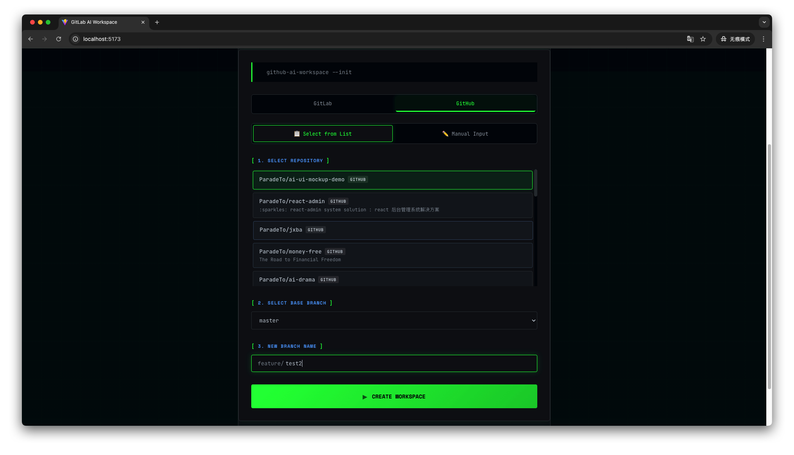
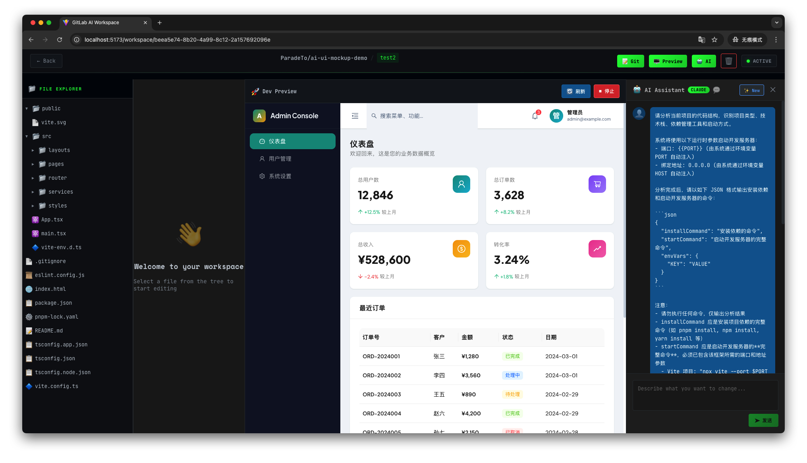
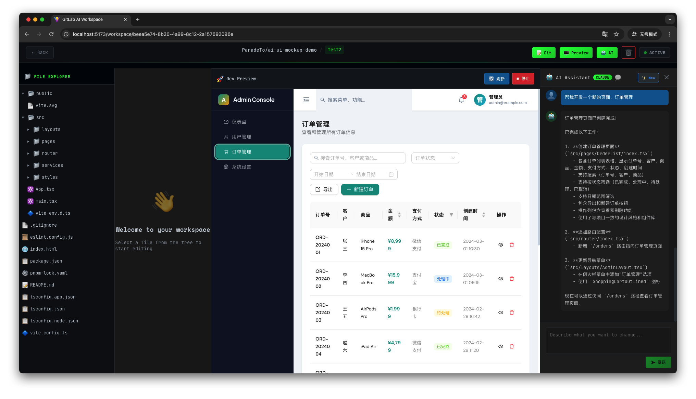
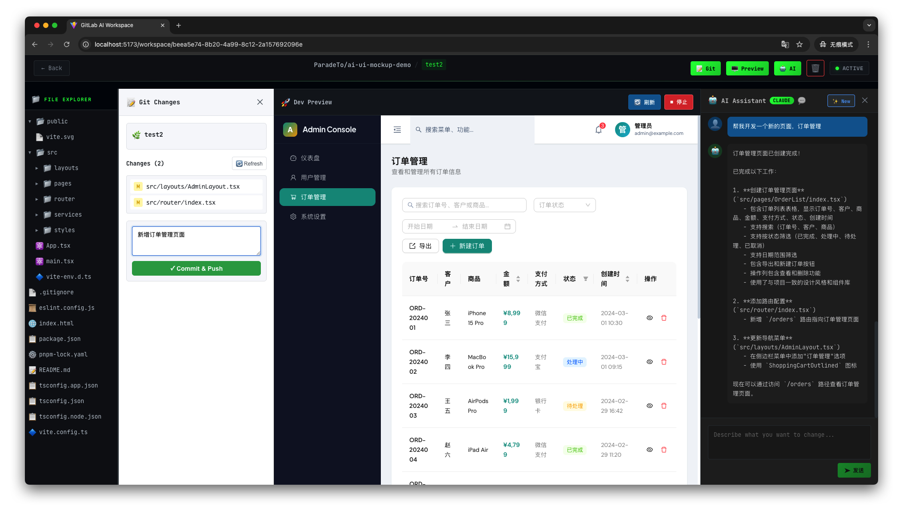
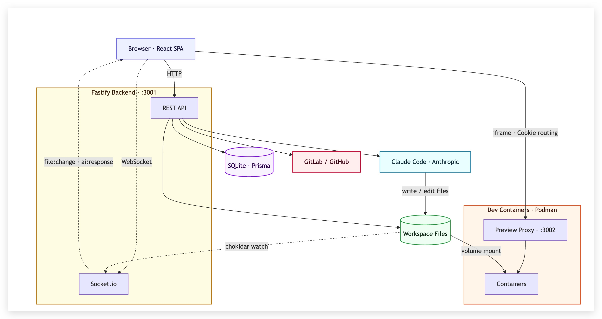

想必大家应该都听说过"某某公司裁掉前端，要求 PM 来切图"这种新闻。确实，随着 AI 的不断发展，这种方式确实越来越可行了。虽然不了解这些公司具体怎么做的，但是有几个问题一直萦绕着我：

- 一般公司都会有自己内部的组件库，PM 切图的时候怎么保证生成的代码符合公司内部的组件库规范？

- 代码生成后，如何实时看到代码运行的效果？

- 代码生成后，还需要跟后端联调，怎么保证顺畅的协作呢？

带着这些问题，我决定自己做个工具来试试看。先来看一下效果：

1. 从当前仓库中 checkout 一个分支出来开始开发，这里我准备了一个简单的 React Admin 项目来进行演示：

2. 进入 workspace 详情页，可以查看仓库代码并使用 AI 来辅助启动项目的开发环境进行预览：

3. 跟 AI 聊天，进行代码修改，并实时预览修改后的效果：

4. 完成后提交代码，代码改动见[这里](https://github.com/ParadeTo/ai-ui-mockup-demo/pull/1/changes)。

接下来就可以基于这个分支去进行页面的联调了。

下面简单介绍下项目的基本原理，首先来看一下架构图：

首先这是一个前后端分析的系统，后端有两个服务 3001 和 3002。其中，3001 主要负责提供 API 接口。3002 负责 proxy，因为同一时间会启动多个 workspace 的开发环境，这里采用了基于 cookie 的方式来实现流量分发，即前端发起 preview 请求时用 workspace ID 作为 cookie，后端 3002 请求根据 ID 去数据库中查询得到对应的端口号，将请求代理到目标服务。

除此之外，项目的核心就是基于 Claude Code SDK 来对项目进行操作，包括使用它来启动开发环境以及修改代码，整个项目可以理解为是一个简陋的云 Cursor。

接下来再回顾一下上面的几个问题。

- 一般公司都会有自己内部的组件库，PM 切图的时候怎么保证生成的代码符合公司内部的组件库规范？

  答：组件库信息就在仓库代码里。理论上只要你的组件库对 AI 友好，生成的效果应该会不错。

- 代码生成后，如何实时看到代码运行的效果？

  答：上面已经介绍了。

- 代码生成后，还需要跟后端联调，怎么保证顺畅的协作呢？

  答：直接提供代码分支，后续 DEV 基于此代码继续开发即可。

接下来还可以优化的方向是支持通过上传图片、Figma 链接、PRD 链接来切图，支持反向导出 PRD 文档等等。
