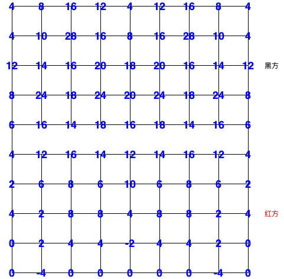
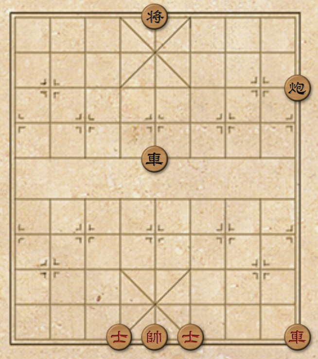
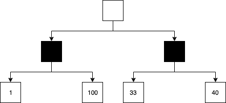
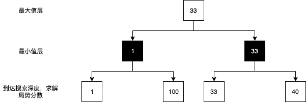
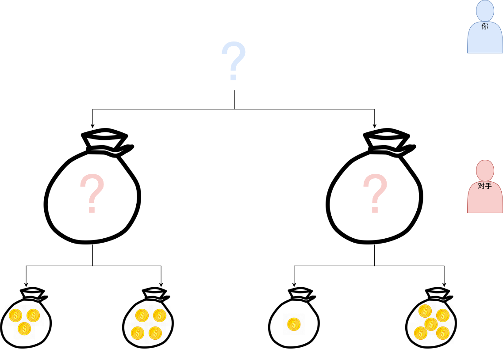
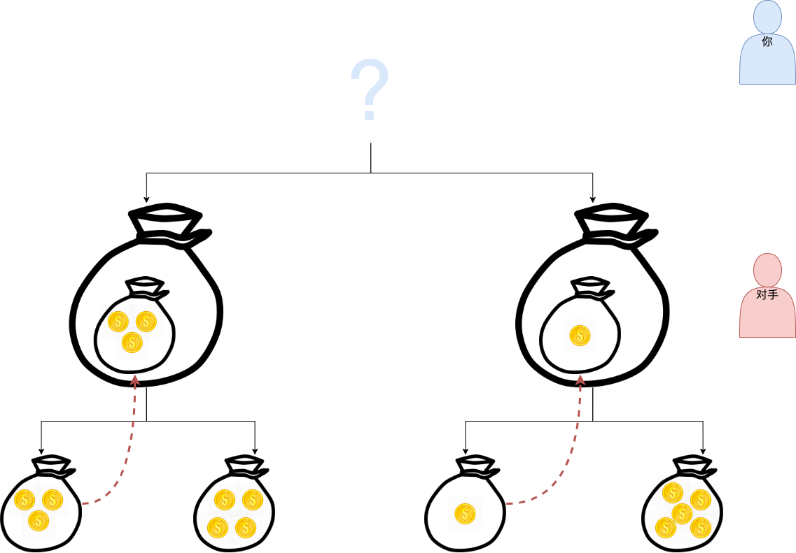
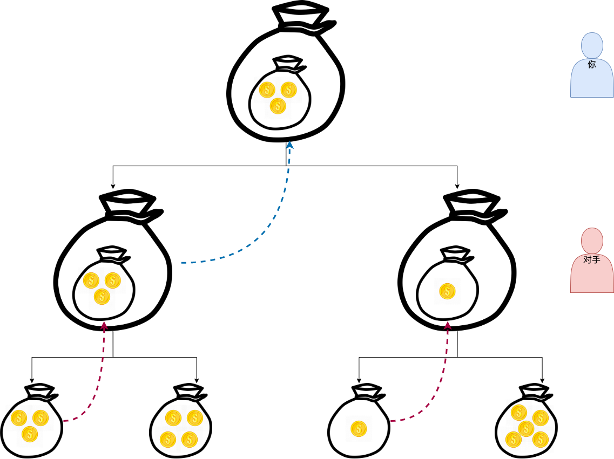

> 本文代码：https://github.com/ParadeTo/chinese-chess
> Demo地址：http://www.paradeto.com/vue-chinese-chess


我们都知道，把大象关进冰箱需要三步。同理，写一个象棋 AI 程序也只需要三步：

1. 遍历出所有可能的走法
2. 选择出最好的走法
3. 走

第三步在这里其实只是凑数而已，可以去掉，这样写一个 AI 程序就更简单了，只需要两步。

其中，第一步对于稍微有点象棋和编程知识的人来说并不是很难，只要注意一些棋子的特殊规则，如“马”的蹩脚、“炮”需要隔子才能吃等，这一部分不在本文的讨论范围之内。

第二步才是本文需要讨论的重点，首先我们要解决的第一个问题是，给定一个棋局，如何判断该棋局的好坏呢？

# 局势评估
关于象棋局势的评估已有不少学者做过研究，有静态单子型、未来局势型、象棋知识型、局面附加信息等。本文采取的是静态单子型。

所谓静态单子型评估，是指对棋盘上的每一个棋子考虑其种类和位置，依种类的重要性与位置的优劣决定它的评估值，然后将棋盘上所有己方棋子的评估值直接累加得到己方战力值，将对手所有棋子的评估值累加得到对手战力值，己方战力值减去对手战力值得到最终的局势评估值。

比如，根据棋子的重要程度我们可以规定棋子的权重为：

```
帅/将: 1000000
仕: 110
象/相: 110
马: 300
车: 600
跑: 300
卒/兵: 70
```

比如，红“车”的位置权重如下所示：



# 最大最小值算法
有了局势评估方法后，每次遍历出所有的可能走法，然后从中选取局势分数最高的走法就是一个最简单的象棋 AI 了。不过这个 AI 会有点蠢，有点短视。比如，下面这个棋局：



假设现在轮到红方下，按照我们的算法，“车一进七”吃掉黑“炮”，可以获得最大的局势评估值。但是，很明显，这样就输了。问题在于，我们的算法只考虑到了一层，这种只顾当下眼前利益的算法显然靠不住。

既然这样，那你可能会想到需要多考虑几层后再计算局势得分，然后从所有的分支中选择分数最高的走法。就像下图这样：



我先遍历出所有可能的走法（图中黑色方块），然后基于该层的走法继续遍历（图中最后一排的白色方块），然后计算局势分数，选择最高分数的走法，即选择左边黑色方块的走法。

但是，你忘记了一点，你走完后，接下来是轮到你对手走了，你如果想得到 100 的分数，就需要你的对手配合你选择分数 100 的走法。很明显你的对手不会那么傻，他会尽量阻止你得到高分，所以他会选择走分数为 1 的那一步。

而如果你选择右边黑色方块的走法，你的对手会选择分数为 33 的走法，你反而会得到一个高一点的分数。

人可以很容易做出这样的决策，但是如何教会计算机也这样思考呢？这就需要用到最大最小值算法了。最大最小算法把搜索树分成最大值层和最小值层，AI 处于最大值层，对手处于最小值层，最大值层总是从下一层选取最大的值作为结果，最小值层总是从下一层选择最小值作为结果。如下图所示：



思路清楚了，代码实现起来就很简单了，以下是来自 [wiki](https://en.wikipedia.org/wiki/Minimax) 的一段伪代码：
```
/**
 * node 当前节点
 * depth 当前搜索层数
 * maximizingPlayer 是否为最大值层
**/
function minimax(node, depth, maximizingPlayer) is
    // 到达搜索最底层，或 node 是一个叶子节点
    if depth = 0 or node is a terminal node then
        return the heuristic value of node
    // 最大值层，从下层选择分数最大的
    if maximizingPlayer then
        value := −∞
        for each child of node do
            value := max(value, minimax(child, depth − 1, FALSE))
        return value
    // 最小值层，从下层选择分数最小的
    else (* minimizing player *)
        value := +∞
        for each child of node do
            value := min(value, minimax(child, depth − 1, TRUE))
        return value
```

这个算法还可以通过一个无聊的游戏来模拟，游戏规则如下：

有两个大袋子，每个大袋子里面有两个小袋子，每个小袋子里面有数量不一的金币。


现在需要你选择一个大袋子，然后你的对手选择里面的一个小袋子给你。你的任务是尽可能地得到更多的金币，而你对手的任务是尽可能地阻止你得到更多的金币。

首先，这个游戏一共可以分出四个分支：



在对手这一层（对应算法中的最小值层），会从下一层选择金币最少的袋子：



在你这一层（对应算法中的最大值层），会从下一层选择金币最多的袋子：




# 总结
本文阐述了实现一个象棋 AI 的基本步骤，引出了最大最小值算法并通过一个无聊的游戏进行了分析。不过该算法比较耗时，假设每次遍历平均产生 30 种走法，则深度为 5 的 AI 的一共需要进行 24300000 次的局势分数计算。事实上该算法通过一定的规则可以进行优化，这个就留在下一篇文中再进行论述吧。


# 参考
1. [中国象棋计算机博弈局面评估技术研究](https://linjian.org/files/academic/cchess-caai2007.pdf)
2. [Minimax](https://en.wikipedia.org/wiki/Minimax)
3. [IntelligentChineseChessSystem](https://github.com/geeeeeeeeek/IntelligentChineseChessSystem)
4. [gobang](https://github.com/lihongxun945/gobang)