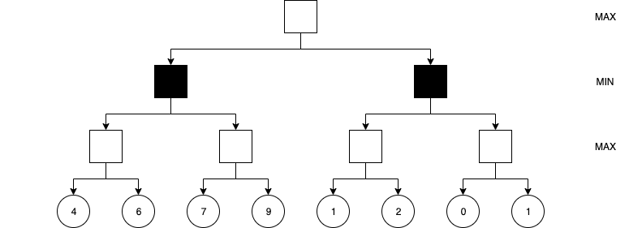
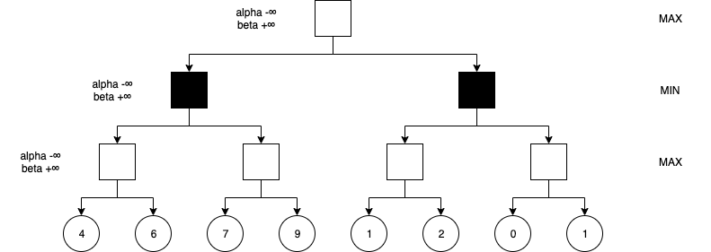
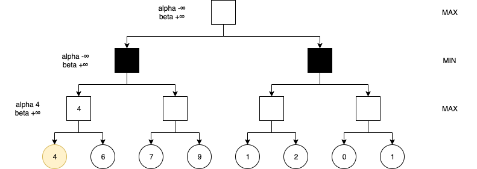
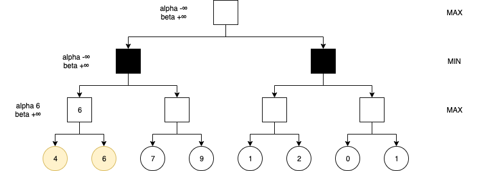
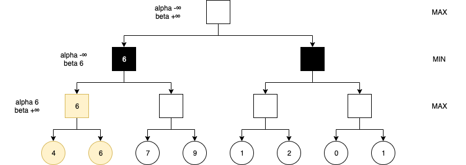
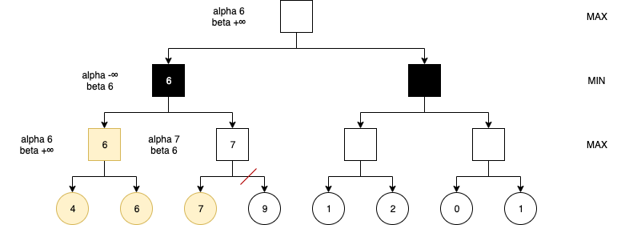
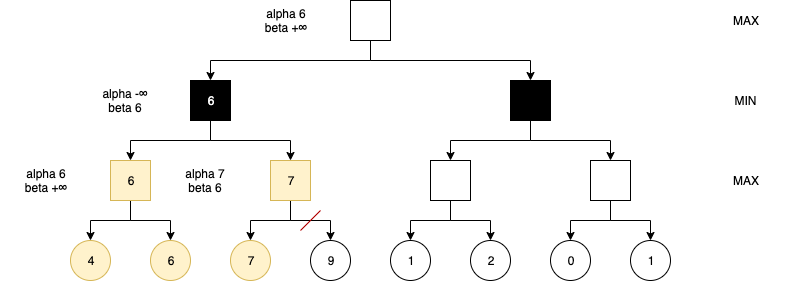
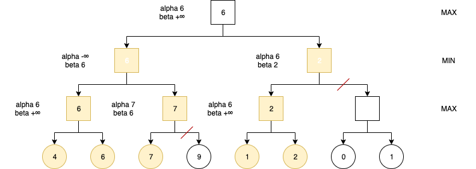

> 本文代码：https://github.com/ParadeTo/chinese-chess
> Demo地址：http://www.paradeto.com/vue-chinese-chess

在[上一篇](/2019/11/09/algo-chinese-chess-1/)文章结尾提到了最大最小值算法有进一步优化的空间，接下来继续。

# alpha-beta 剪枝
上篇文章结尾提到了当最大最小值算法的搜索深度增大时，其计算复杂度会急剧上升。如果有办法可以去掉一些分支的话，算法的效率就会高一些了，这就轮到 alpha-beta 剪枝出场了。不过我们先不讨论该算法，我们先玩一下上一篇的那个游戏。

上篇文章只是大概说了一下游戏的玩法，这里我们一步一步来认真玩一下。

有两个袋子，袋子一中有一台小米9和一台华为p30，袋子二中有一颗螺丝，一粒芝麻，一台 Mac Pro，但是你和你朋友都不知道袋子里的是什么，游戏规则是你选择一个袋子，你朋友从中选择一个物品给你，你想要得到价值最大的物品，而你朋友则千方百计地要阻扰你（这样的朋友还是早点弃了的好）。两个人都盲选的话就没意思了，所以你和你朋友商量了一下，每个人都可以尽可能的尝试多次以后再做出最终的选择。游戏开始：

你：选择袋子一。

你朋友：从袋子里面拿出第一个物品，发现是华为p30。暂时决定：如果你选择袋子一，就给你华为p30。放回。

你朋友：从袋子里面拿出第二个物品，发现是小米9。跟华为p30比较后暂时决定：如果你选择袋子一，就给你小米9。放回。

你朋友：发现袋子中没有其他物品。做出最后决定：如果你选择袋子一，就给你小米9。

你：记录下能得到的物品暂时为小米9。

你：选择袋子二。

你朋友：从袋子里面拿出第一个物品，发现是一颗螺丝。跟你暂时能得到的物品小米9比较后，你朋友决定直接告诉你：如果你选择袋子二，就给你一颗螺丝。为什么这里可以省去比较袋子二中的其他物品呢，明明一粒芝麻的价值更小啊？因为袋子二中的第一个物品的价值就已经小于你暂时可以得到的物品的价值了，这个信息**已经足够**让你放弃选择袋子二了。

经过这些尝试以后，最后你选择了袋子一，然后你朋友把小米9给了你。

上面这个过程其实就是最大最小值算法加 alpha-beta 剪枝。其中选择第二个袋子时你朋友决定放弃袋子中其他物品的尝试就体现了 alpha-beta 剪枝的思想。下面我们来说说 alpha-beta 剪枝。

alpha-beta 剪枝算法中我们定义：

* alpha 记录为最大值层节点当前所能得到的最大分数
* beta 记录为最小值层节点当前所能得到的最小分数

当最小值层的某个节点的 beta 小于 alpha 时，可以停止该节点其余子节点的搜索。当最大值层的某个节点的 alpha 大于 beta 时，可以停止该节点其余子节点的搜索。

这么说肯定听不懂，下面就用下图例子来实战一下。



1. 初始化根节点 alpha 为 -∞，beta 为 +∞，然后通过路径一路传递到倒数第二排左边的节点。



2. 遍历第一个子节点，更新 alpha 为 4，更新当前节点值为 4。判断是否需要剪枝（比较当前节点的 alpha 和 beta，发现 4 小于 +∞，不能剪枝）。



3. 遍历第二个子节点，更新 alpha 为 6，更新当前节点值为 6。判断是否需要剪枝（比较当前节点的 alpha 和 beta，发现 6 小于 +∞，不能剪枝）。



4. 返回 6 到上一层，更新最小值层左边第一个节点的 beta 为 6，更新当前节点值为 6。判断是否需要剪枝（比较当前节点的 beta 和 alpha，发现 6 大于 -∞，不能剪枝）。



5. 将 alpha=-∞，beta=6 传给右边的子节点，继续遍历 7 所在的节点，更新 alpha 为 7，值为7。判断是否需要剪枝（比较当前节点的 beta 和 alpha，发现 6 小于于 7，满足剪枝条件。



6. 返回 7 到上一层，无需更新。



接下来就不一一赘述了，读者可以自己试试把剩下的完成，最后的结果是这样的：



结合[代码](https://en.wikipedia.org/wiki/Alpha%E2%80%93beta_pruning)看可以更好的理解：

```python
function alphabeta(node, depth, α, β, maximizingPlayer) is
    if depth = 0 or node is a terminal node then
        return the heuristic value of node
    if maximizingPlayer then
        value := −∞
        for each child of node do
            value := max(value, alphabeta(child, depth − 1, α, β, FALSE))
            α := max(α, value)
            if α ≥ β then
                break (* β cut-off *)
        return value
    else
        value := +∞
        for each child of node do
            value := min(value, alphabeta(child, depth − 1, α, β, TRUE))
            β := min(β, value)
            if α ≥ β then
                break (* α cut-off *)
        return value
```

这就是 alpha-beta 剪枝的规则，别看只是减去了几个分支不计算而已，如果每层每个节点都可以排除掉几个分支的话，对速度的优化还是非常明显的。

# 并行搜索
另外一个优化的思路是并行计算，把每次产生的走法平均分成多个任务并行处理，每个并行的任务分别产生局部的最优解，最后汇总得到全局的最优解即可。每一个走法对应一个子任务是最快的，不过如果每一层都这样的话，最后的子任务数量也会非常巨大，不管是多进程还是多线程实现都是很不现实的，所以需要限制并行处理的深度。即便仅在第一层开启并行计算，理论上也可以使得计算速度快 30 倍（假设每一层平均产生 30 种走法）。

# 总结
利用最大最小值和 alpha-beta 算法就可以实现简单的[象棋 AI 程序](http://www.paradeto.com/chinese-chess)，不过该 AI 的棋力仅够应付入门级的玩家。一个原因是尽管采取了前面所说的优化方法后，实践发现当搜索深度达到 5 以后，算法的计算时间就慢得不能接受了，无法继续提高搜索的深度；另外一个原因是局势判断的方法略显简单，可以考虑加入一些象棋特有的“套路”来提高局势判断的准确性。后面针对这些问题再优化一下。

# 参考
1. [Alpha–beta pruning](https://en.wikipedia.org/wiki/Alpha%E2%80%93beta_pruning)