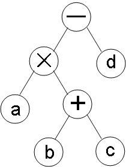
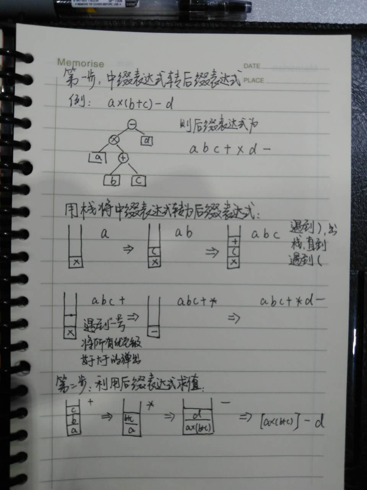

# 原理
利用栈实现简单的四则运算分为两步：
## 第一步-将中缀表达式转换为后缀表达式形式
### 用二叉树来存储表达式
例如：a×(b+c)-d 用二叉树可以表示为：



对其进行后序遍历得到后缀表达式为：
abc+×d-

用二叉树可以很形象的表示一个表达式，不过本文用栈来进行转换

### 用栈实现将中缀表达式转换为后缀表达式形式
（1）从左到右逐个扫描中缀表达式中的各项，如果到达末尾则跳转转到（6），否则根据（2）~（5）的描述进行操作；
（2）遇到操作数直接输出；
（3）遇到运算符（设为a），则和栈顶的操作符（设为b）比较优先级，若a小于等于b的优先级，则连续出栈输出，直到a大于b的优先级或b为``(``，a进栈；
（4）遇到``(``，进栈；
（5）遇到``)``，则连续出栈输出，直到遇到左括弧``(``为止。其中，``(``出栈但是并不输出；
（6）输出栈中剩余的操作符。

## 第二步-利用后缀表达式计算结果
（1）从左到右逐个扫描后缀表达式中的各项，如果到达末尾则进行（4），否则根据（2）~（3）的描述进行操作；
（2）遇到操作数直接入栈；
（3）遇到运算符（设为ope）则出栈两次，设第一次出栈为a，第二次出栈为b，则计算结果c = b ope a，将c入栈；
（4）弹出栈内元素即为结果。

# 手工演算


# 代码实现-js版

```javascript
// 栈
function Stack() {
  this.dataStore = [];
  this.top = 0;
}

Stack.prototype.push = function (element) {
  this.dataStore[this.top++] = element;
};

Stack.prototype.pop = function () {
  return this.dataStore[--this.top];
};

Stack.prototype.peek = function () {
  return this.dataStore[this.top-1];
};

Stack.prototype.length = function () {
  return this.top;
};

Stack.prototype.clear = function () {
  this.top = 0;
};

/**
 * 中缀表达式转为后缀表达式
 */
function transMiddleToSuffix(exp) {
  var expSuffix = [];
  var s = new Stack();
  for (var i = 0, len=exp.length; i < len; i++) {
    switch (exp[i]) {
      case '(':
        s.push(exp[i]);
        break;
      case ')':
        while(s.peek() !== '(' && s.length() > 0){
          expSuffix.push(s.pop());
        }
        s.pop(); // 弹出(
        break;
      case '+':// 优先级最低，出栈直到遇到(
      case '-':
        while(s.length() > 0 && s.peek() !== '('){
          expSuffix.push(s.pop());
        }
        s.push(exp[i]);
        break;
      case '*':// 出栈直到遇到( * /
      case '/':
        while(s.length() > 0 && s.peek() !== '(' && (s.peek() === '*' || s.peek() === '/')) {
          expSuffix.push(s.pop());
        }
        s.push(exp[i]);
        break;
      default: // 默认是数字
        expSuffix.push(exp[i]);
        break;
    }
  }
  while(s.length() > 0) {
    expSuffix.push(s.pop());
  }

  return expSuffix;
}

/**
  利用后缀表达式求结果
 */
function compute(expSuffix) {
  var s = new Stack();
  for (var i = 0, len=expSuffix.length; i < len; i++) {
    switch (expSuffix[i]) {
      case '+':
        var right = s.pop();
        var left = s.pop();
        s.push(parseInt(left) + parseInt(right));
        break;
      case '-':
        var right = s.pop();
        var left = s.pop();
        s.push(left - right);
        break;
      case '*':
        var right = s.pop();
        var left = s.pop();
        s.push(left * right);
        break;
      case '/':
        var right = s.pop();
        var left = s.pop();
        s.push(left / right);
        break;
      default: // 默认是数字,进栈
        s.push(expSuffix[i]);
        break;
    }
    console.log(s.dataStore)
  }
  return s.pop();
}

var a = ['1','*','(','1','+','2','*','3',')'];
console.log(compute(transMiddleToSuffix(a)));
```
