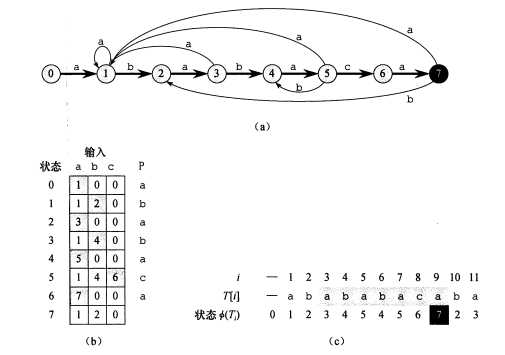

假设要从字符串 T = abababacaba 中匹配 P = ababaca

一、先构造P的有限状态机：

如何构造的呢：

1. 状态为0时，输入a，可以匹配P的最大前缀为a，则可以转换到状态1，其他输入都转换到状态0
2. 状态为1时，输入b（完整字符串为ab），可以匹配P的最大前缀为ab，转换到状态2,。输入a（完整字符串为aa），可以匹配P的最大前缀为a，转换到状态1。输入c（完整字符串为ac），可以匹配P的最大前缀为空，转换到状态0。

剩下的步骤类似

二、匹配过程

将T中的字符逐个输入到状态机中，若最后到达状态7，则说明匹配成功