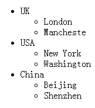
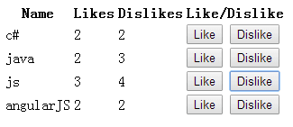
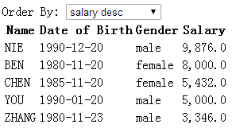
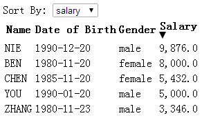

## AngularJS的优势
* Dependency Injection
* Two Way Data-Binding
  Changes to the model updates the view
  Changes to the view update the model
* Testing
* MVC

## ng-app
带有ng-app标签内的内容才会被angular所执行
```
<body>
    <div ng-app>
        10 + 20 = {{10+20}}
    </div>
    <div>
        40+50={{40+50}}
    </div>
</body>
结果：
10 + 20 = 30
40+50={{40+50}}
```
## 模型和控制器
### 模型
模型可以看成其他语言的Main()方法
### 创建模型
```
// 第一个参数是模型的名字，第二个是其依赖的模型
var myApp = angular.module('myModule',[])
```
### 控制器
可以看成javascript 函数，其工作是为试图创建一个模型
### 创建控制器
$scope是一个angular对象，自动传递到controller中
```
var myController = function($scope){
  $scope.message = "AngularJS Tutorial";
}
```
### 综合实例
```
<html ng-app="myModule">
<head lang="en">
    <script src="//cdn.bootcss.com/angular.js/1.3.0/angular.min.js"></script>
</head>
<body>
    <div ng-controller="myController">
        {{message}}
    </div>
    <div>    
        {{message}}
    </div>
</body>
<script>
    // 创建模块
    var myApp = angular.module('myModule',[]);
    // 创建控制器
    var myController = function($scope) {
        $scope.message = 'AngularJS';
    }
    // 注册controller
    myApp.controller('myController',myController);
</script>
</html>
结果：
AngularJS
```
一行创建所有
```
    var myApp = angular
                        .module('myModule',[])
                        .controller('myController',function($scope) {
                            var employee = {
                                firstName: 'David',
                                lastName: 'Hastings',
                                gender: 'Malle'
                            }
                            $scope.employee = employee;
                        });
                        
```
**使用binding expression给图片src赋值会导致404：**
```
<body>
    <div ng-controller="myController">
        <div>
            Name: {{obj.name}}
        </div>
        
    </div>
</body>
<script>
    // 创建模块
    var myApp = angular
                        .module('myModule',[])
                        .controller('myController',function($scope) {
                            var obj = {
                                name: 'testPic',
                                flag: '../../public/img/author.jpg'
                            }
                            $scope.obj = obj;
                        });
</script>
报错：
GET http://localhost:63342/blog/test/angular/%7B%7Bobj.flag%7D%7D 404 (Not Found)
```
原因是当页面渲染之际，angularJS还没有开始执行，此时src的值为{{obj.flag}}
解决办法是使用ng-src
## 双向数据绑定
保持模型和视图的数据一致
```
<body>
    <div ng-controller="myController">
        <table>
            <tr>
                <td>First Name</td>
                <td>
                    <input type="text" ng-model="employee.firstName"/>
                </td>
            </tr>
            <tr>
                <td>Last Name</td>
                <td>
                    <input type="text" ng-model="employee.lastName"/>
                </td>
            </tr>
            <tr>
                <td>age</td>
                <td>
                    <input type="text" ng-model="employee.age"/>
                </td>
            </tr>
        </table>
        </br>
        <table>
            <tr>
                <td>First Name</td>
                <td>
                    {{employee.firstName}}
                </td>
            </tr>
            <tr>
                <td>Last Name</td>
                <td>
                    {{employee.lastName}}
                </td>
            </tr>
            <tr>
                <td>age</td>
                <td>
                    {{employee.age}}
                </td>
            </tr>
        </table>
    </div>
</body>
<script>
    // 创建模块
    var myApp = angular
                        .module('myModule',[])
                        .controller('myController',function($scope) {
                            var employee = {
                                firstName: 'You',
                                lastName:'Xingzhi',
                                age:27
                            }
                            $scope.employee = employee
                        });
</script>
```
ng-model只能用于：
* input
* select
* textarea

## ng-repeat
例：
```
<body>
    <div ng-controller="myController">
        <table>
            <thead>
                <tr>
                    <th>FirstName</th>
                    <th>LastName</th>
                    <th>age</th>
                </tr>
            </thead>
            <tbody>
                <tr ng-repeat="employee in employees">
                    <td>{{employee.firstName}}</td>
                    <td>{{employee.lastName}}</td>
                    <td>{{employee.age}}</td>
                </tr>
            </tbody>
        </table>
    </div>
</body>
<script>
    // 创建模块
    var myApp = angular
                        .module('myModule',[])
                        .controller('myController',function($scope) {
                            var employees = [
                                {
                                    firstName: 'You',
                                    lastName:'Xingzhi',
                                    age:27
                                },
                                {
                                    firstName: 'You',
                                    lastName:'Xingzhi',
                                    age:27
                                },                                {
                                    firstName: 'You',
                                    lastName:'Xingzhi',
                                    age:27
                                },
                            ];

                            $scope.employees = employees;
                        });
</script>
```
例：
```
<body>
    <div ng-controller="myController">
        <ul>
            <li ng-repeat="country in countries">
                {{country.name}}
                <ul>
                    <li ng-repeat="city in country.cities">
                        {{city.name}}
                    </li>
                </ul>
            </li>
        </ul>
    </div>
</body>
<script>
    // 创建模块
    var myApp = angular
                        .module('myModule',[])
                        .controller('myController',function($scope) {
                            var countries =[
                                {
                                    name:'UK',
                                    cities:[
                                        {
                                            name:'London'
                                        },
                                        {
                                            name:'Mancheste'
                                        }
                                    ]
                                },
                                {
                                    name:'USA',
                                    cities:[
                                        {
                                            name:'New York'
                                        },
                                        {
                                            name:'Washington'
                                        }
                                    ]
                                },
                                {
                                    name:'China',
                                    cities:[
                                        {
                                            name:'Beijing'
                                        },
                                        {
                                            name:'Shenzhen'
                                        }
                                    ]
                                }
                            ]
                            $scope.countries = countries;
                        });
</script>
```


### index
* 使用$index获取当前项目的index
* 使用$parent.$index 或 ng-init="parentIndex = $index"来获取父标签的index
```
  <ul>
	<li ng-repeat="country in countries" ng-init="parentIndex=$index">
		{{country.name}}-Parent Index ={{$parent.$index}} , Index = {{$index}}
		<ul>
			<li ng-repeat="city in country.cities">
				{{city.name}}-Parent Index ={{parentIndex}} , Index = {{$index}}
			</li>
		</ul>
	</li>
</ul>
```

## 事件
例：
```
<body>
    <div ng-controller="myController">
        <table>
            <thead>
                <tr>
                    <th>Name</th>
                    <th>Likes</th>
                    <th>Dislikes</th>
                    <th>Like/Dislike</th>
                </tr>
            </thead>
            <tbody>
                <tr ng-repeat="technology in technologies">
                    <td>{{technology.name}}</td>
                    <td>{{technology.likes}}</td>
                    <td>{{technology.dislikes}}</td>
                    <td>
                        <input type="button" value="Like" ng-click="incrementLikes(technology)"/>
                        <input type="button" value="Dislike" ng-click="incrementDislikes(technology)"/>
                    </td>
                </tr>
            </tbody>
        </table>
    </div>
</body>
<script>
    // 创建模块
    var myApp = angular
                        .module('myModule',[])
                        .controller('myController',function($scope) {
                            var technologies = [
                                {name:'c#',likes:0,dislikes:0},
                                {name:'java',likes:0,dislikes:0},
                                {name:'js',likes:0,dislikes:0},
                                {name:'angularJS',likes:0,dislikes:0}
                            ];
                            $scope.technologies = technologies;
                            $scope.incrementLikes = function(techonology) {
                                techonology.likes++;
                            };
                            $scope.incrementDislikes = function(techonology) {
                                techonology.dislikes++;
                            };
                        });
</script>
```



## Filters
* 3个用途
  * Format, Sort and Filter Data
* 能用在binding expression 或者 directive中
* 用法
```
{{ expression | filterName:parameter }}
```
* 常用Filters
  * lowercase
  * uppercase
  * number
  * currency
  * date
  * limitTo
```
{{ expression | limitTo : limit : begin }}
```

### format data
例子：
```
<body>
    <div ng-controller="myController">
        Rows to display: <input type="number" step="1" min="0" max="5" ng-model="rowLimit"/>
        </br>
        <table>
            <thead>
                <tr>
                    <th>Name</th>
                    <th>Date of Birth</th>
                    <th>Gender</th>
                    <th>Salary (number)</th>
                    <th>Salary (currency)</th>
                </tr>
            </thead>
            <tbody>
                <tr ng-repeat="employee in employees | limitTo:rowLimit">
                    <td>{{employee.name | uppercase}}</td>
                    <td>{{employee.dateOfBirth | date:'yyyy-MM-dd hh:mm:ss'}}</td>
                    <td>{{employee.gender | lowercase}}</td>
                    <td>{{employee.salary | number:1}}</td>
                    <td>{{employee.salary | currency:'￥':1}}</td>
                </tr>
            </tbody>
        </table>
    </div>
</body>
<script>
    // 创建模块
    var myApp = angular
                        .module('myModule',[])
                        .controller('myController',function($scope) {
                            var employees = [
                                {name:'Ben',dateOfBirth:new Date('1980-11-20'),gender:'Male',salary:8000},
                                {name:'You',dateOfBirth:new Date('1990-01-20'),gender:'Male',salary:8000},
                                {name:'Nie',dateOfBirth:new Date('1990-12-20'),gender:'Male',salary:8000},
                                {name:'Chen',dateOfBirth:new Date('1985-11-20'),gender:'Male',salary:8000},
                                {name:'Zhang',dateOfBirth:new Date('1980-11-23'),gender:'Male',salary:8000},
                            ];
                            $scope.employees = employees;
                            $scope.rowLimit = 3;
                        });
</script>
```

### sorting data
用法：
```
{{ expression | orderBy : expression : reverse }} // 默认升序
例：
{{ employee in employees | orderBy : 'salary' : 'false' }}
或
{{ employee in employees | orderBy : '+salary' }} //升序
```
例一：
```
<body>
    <div ng-controller="myController">
        Order By:
        <select ng-model="sortColumn">
            <option value="name">name asc</option>
            <option value="dateOfBirth">date of birth asc</option>
            <option value="gender">gender asc</option>
            <option value="-salary">salary desc</option>
        </select>
        </br>
        <table>
            <thead>
                <tr>
                    <th>Name</th>
                    <th>Date of Birth</th>
                    <th>Gender</th>
                    <th>Salary</th>
                </tr>
            </thead>
            <tbody>
                <tr ng-repeat="employee in employees | orderBy:sortColumn">
                    <td>{{employee.name | uppercase}}</td>
                    <td>{{employee.dateOfBirth | date:'yyyy-MM-dd'}}</td>
                    <td>{{employee.gender | lowercase}}</td>
                    <td>{{employee.salary | number:1}}</td>
                </tr>
            </tbody>
        </table>
    </div>
</body>
<script>
    // 创建模块
    var myApp = angular
                        .module('myModule',[])
                        .controller('myController',function($scope) {
                            var employees = [
                                {name:'Ben',dateOfBirth:new Date('1980-11-20'),gender:'Female',salary:8000},
                                {name:'You',dateOfBirth:new Date('1990-01-20'),gender:'Male',salary:5000},
                                {name:'Nie',dateOfBirth:new Date('1990-12-20'),gender:'Male',salary:9876},
                                {name:'Chen',dateOfBirth:new Date('1985-11-20'),gender:'Female',salary:5432},
                                {name:'Zhang',dateOfBirth:new Date('1980-11-23'),gender:'Male',salary:3346},
                            ];
                            $scope.employees = employees;
                            $scope.sortColumn = 'name';
                        });
</script>
```



例二：
```
<head lang="en">
    <script src="//cdn.bootcss.com/angular.js/1.3.0/angular.js"></script>
    <style>
        .arrow-up {
            width:0;
            height:0;
            border-left:5px solid transparent;
            border-right:5px solid transparent;
            border-bottom: 10px solid black;;
        }
        .arrow-down {
            width:0;
            height: 0;
            border-left:5px solid transparent;
            border-right:5px solid transparent;
            border-top:10px solid black;
        }
    </style>
</head>
<body>
    <div ng-controller="myController">
        Sort By:
        <select ng-model="sortColumn">
            <option value="name">name</option>
            <option value="dateOfBirth">date</option>
            <option value="gender">gender</option>
            <option value="salary">salary</option>
        </select>
        </br>
        <table>
            <thead>
                <tr>
                    <th ng-click="sortDate('name')">
                        Name
                        <div ng-class="getSortClass('name')"></div>
                    </th>
                    <th ng-click="sortDate('dateOfBirth')">
                        Date of Birth
                        <div ng-class="getSortClass('dateOfBirth')"></div>
                    </th>
                    <th ng-click="sortDate('gender')">
                        Gender
                        <div ng-class="getSortClass('gender')"></div>
                    </th>
                    <th ng-click="sortDate('salary')">
                        Salary
                        <div ng-class="getSortClass('salary')"></div>
                    </th>
                </tr>
            </thead>
            <tbody>
                <tr ng-repeat="employee in employees | orderBy:sortColumn:reverseSort">
                    <td>{{employee.name | uppercase}}</td>
                    <td>{{employee.dateOfBirth | date:'yyyy-MM-dd'}}</td>
                    <td>{{employee.gender | lowercase}}</td>
                    <td>{{employee.salary | number:1}}</td>
                </tr>
            </tbody>
        </table>
    </div>
</body>
<script>
    // 创建模块
    var myApp = angular
                        .module('myModule',[])
                        .controller('myController',function($scope) {
                            var employees = [
                                {name:'Ben',dateOfBirth:new Date('1980-11-20'),gender:'Female',salary:8000},
                                {name:'You',dateOfBirth:new Date('1990-01-20'),gender:'Male',salary:5000},
                                {name:'Nie',dateOfBirth:new Date('1990-12-20'),gender:'Male',salary:9876},
                                {name:'Chen',dateOfBirth:new Date('1985-11-20'),gender:'Female',salary:5432},
                                {name:'Zhang',dateOfBirth:new Date('1980-11-23'),gender:'Male',salary:3346},
                            ];
                            $scope.employees = employees;
                            $scope.sortColumn = 'name';
                            $scope.reverseSort = false;

                            $scope.sortDate = function (column) {
                                $scope.reverseSort = ($scope.sortColumn == column) ? !$scope.reverseSort : false;
                                $scope.sortColumn = column;
                            }

                            $scope.getSortClass = function (column) {
                                if ($scope.sortColumn == column) {
                                    return $scope.reverseSort ? 'arrow-down' : 'arrow-up';
                                }
                                return '';
                            }
                        });
</script>
```

