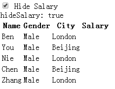
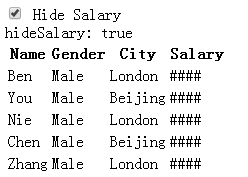
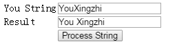

## Search filter
```
Search: <input type="text" placeholder="Search employees" ng-model="searchText"/>
...
...
// 对所有的列
<tr ng-repeat="employee in employees | filter:searchText">
// 对name这一列
<tr ng-repeat="employee in employees | filter:{name:searchText}">
```

## 多列过滤
### 交集
```
Search: <input type="text" placeholder="Search name" ng-model="searchText.name"/>
<input type="text" placeholder="Search city" ng-model="searchText.city"/>
<input type="checkbox" ng-model="exactMatch"/> Exact Match
...
...
<tr ng-repeat="employee in employees | filter:searchText:exactMatch">
```
### 并集
```
Search: <input type="text" placeholder="Search city & name" ng-model="searchText"/>
...
...
// search方法会应用在每一列
<tr ng-repeat="employee in employees | filter:search">
// search方法
  $scope.search = function(item) {
                                if ($scope.searchText == undefined) {
                                    return true;
                                }
                                else {
                                    if (item.name.toLowerCase().indexOf($scope.searchText.toLowerCase()) !=-1 ||
                                            item.city.toLowerCase().indexOf($scope.searchText.toLowerCase()) !=-1 ) {
                                        return true;
                                    }
                                }
                                return false;
                            }
```
## 通用filter
例：
以下实现gender从数字转到字符
```
<tr ng-repeat="employee in employees ">
	<td>{{employee.name}}</td>
	<td>{{employee.gender | gender}}</td>
	<td>{{employee.salary}}</td>
</tr>
...
.module('myModule',[])
.filter('gender',function() {
	return function(gender) {
		switch (gender) {
			case 1:
				return 'Male';
			case 2:
				return "Female";
			case 3:
				return "Not disclosed";
		}
	}
})
.controller('myController',function($scope) {
...
```
还可以把filter提取到单独的文件中
filter.js
```
app.filter('gender',function() {
....
```

## ng-hide & ng-show
```
<input type="checkbox" ng-model="hideSalary"/> Hide Salary
...
<th ng-show="hideSalary">Salary</th>
...
<td ng-hide="hideSalary">{{employee.salary}}</td>
```


```
<td ng-hide="hideSalary">{{employee.salary}}</td>
<td ng-show="hideSalary">####</td>
```



## ng-include
```
<div ng-include="employeeView"></div>
...
$scope.employeeView = 'employeeTable.html';
```
更高级的例子：
```
Select View:
<select ng-model="employeeView">
	<option value="EmployeeTable.html"></option>
	<option value="EmployeeList.html"></option>
</select>
<div ng-include="employeeView"></div>
```
## $http service
会返回一个promise对象
```
$http.get('****')
        .then(function(response){
            var data = response.data;
            $log.info(response);
        })
```

## Services
其实就是提供某种服务的对象，像$http，$log。
提供了可复用的逻辑，不属于任何地方。
* 可复用
* 依赖注入
* 可检测性

### 例子

```
<!DOCTYPE html>
<html ng-app="myModule">
<head lang="en">
    <script src="//cdn.bootcss.com/angular.js/1.3.0/angular.js"></script>
</head>
<body>
    <div ng-controller="myController">
        <table>
            <tr>
                <td>You String</td>
                <td><input type="text" ng-model="input"/></td>
            </tr>
            <tr>
                <td>Result</td>
                <td><input type="text" ng-model="output"/></td>
            </tr>
            <tr>
                <td></td>
                <td><input type="button" ng-click="transformString(input)" value="Process String"/></td>
            </tr>
        </table>
    </div>
</body>
<script>
    var myApp = angular
                        .module('myModule',[])
                        .controller('myController',function($scope, stringService) { // 依赖注入stringService
                            $scope.transformString = function (input) {
                                $scope.output = stringService.processString(input);
                            }
                        });
    // 创建一个service
    myApp.factory('stringService',function () {
       return {
           processString : function(input) {
               if (!input) {
                   return input;
               }
               var output = "";
               for (var i=0;i<input.length;i++) {
                   if(i>0 && input[i] == input[i].toUpperCase()) {
                       output = output + ' ';
                   }
                   output += input[i];
               }
               return output;
           }
       }
    });
</script>
</html>
```



## $anchorscroll Service
用来跳转到页面上一个特定的元素
```
<body ng-controller="myController">
    <button id="top" ng-click="scrollTo('bottom')">Go to bottom</button>
    <div>
        假装这里有很多东西
        假装这里有很多东西
        假装这里有很多东西
        假装这里有很多东西
   </div>
    <button id="bottom" ng-click="scrollTo('top')">Go to top</button>
</body>
<script>
    var myApp = angular
                        .module('myModule',[])
                        .controller('myController',function($scope, $location, $anchorScroll) {
                            $scope.scrollTo = function (scrollLocation) {
                                $location.hash(scrollLocation); //地址栏后面加hash
                                $anchorScroll.hash(scrollLocation);// scroll到id处
                            }
                        });
</script>
```
