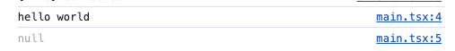

> 模仿 [big-react](https://github.com/BetaSu/big-react)，使用 Rust 和 WebAssembly，从 0 到 1 实现从零实现 React v18 的核心功能。深入理解 React 源码的同时，还锻炼了 Rust 的技能，简直赢麻了！
>
> 代码地址：https://github.com/ParadeTo/big-react-wasm
>
> 本文对应 tag：[v1](https://github.com/ParadeTo/big-react-wasm/tree/v1)

> Based on [big-react](https://github.com/BetaSu/big-react)，I am going to implement React v18 core features from scratch using WASM and Rust.
>
> Code Repository：https://github.com/ParadeTo/big-react-wasm
>
> The tag related to this article：[v1](https://github.com/ParadeTo/big-react-wasm/tree/v1)

# 工具

# Tools

[**Rust**](https://www.rust-lang.org/)：一种安全、高效和现代的编程语言（省略一万字）。按照官网所示安装即可。

[**wasm-pack**](https://rustwasm.github.io/wasm-pack/installer/)：构建、测试、和发布 Rust WebAssembly 的一站式工具。

[**cargo-generate**](https://github.com/cargo-generate/cargo-generate)：通过已有的 Git 仓库作为模版，快速创建 Rust 项目。

更多介绍可以参考 [Rust 和 WebAssembly 入门教程](https://rustwasm.github.io/docs/book/)。

其他前端常用的工具自行安装即可，就不赘述了。

[**Rust**](https://www.rust-lang.org/): A secure, efficient, and modern programming language (omitting ten thousand words). You can simply follow the installation instructions provided on the official website.

[**wasm-pack**](https://rustwasm.github.io/wasm-pack/installer/): A one-stop tool for building, testing, and publishing Rust WebAssembly.

[**cargo-generate**](https://github.com/cargo-generate/cargo-generate): Quickly create Rust projects by using existing Git repositories as templates.

更多介绍可以参考 [Rust 和 WebAssembly 入门教程](https://rustwasm.github.io/docs/book/)。

For more information, you can refer to the [Rust and WebAssembly](https://rustwasm.github.io/docs/book/).

# 项目结构

# Project Structure

首先，我们搭建起如下的项目结构：

First, let's set up the following project structure:

```js
.
├── Cargo.toml
├── package.json
├── examples
│   └── hello-world // React project initialized by vite
├── packages
│   ├── react // WASM project created by cargo generate --git https://github.com/rustwasm/wasm-pack-template
│   ├── react-dom // WASM project created by cargo generate --git https://github.com/rustwasm/wasm-pack-template
│   ├── react-reconciler // Rust project created by cargo new
│   └── shared // Rust project created by cargo new
```

`Cargo.toml` 如下所示，类似于前端中常说的 monorepo 架构。

The `Cargo.toml` file is shown below, similar to the commonly mentioned monorepo architecture in frontend development.

```
[workspace]

members = [
    "packages/react",
    "packages/react-dom",
    "packages/react-reconciler",
    "packages/shared"
]
```

因为 react 和 react-dom 会导出方法供 JS 侧进行调用，所以需要通过 `cargo generate --git https://github.com/rustwasm/wasm-pack-template` 创建 WASM 项目，另外两个使用 `cargon new` 创建普通的 Rust 项目即可。

Because `react` and `react-dom` will export methods for JavaScript to call, we need to create a WASM project using `cargo generate --git https://github.com/rustwasm/wasm-pack-template` for those two. The other two can be created as regular Rust projects using `cargo new`.

# 构建调试环境

# Setting Up the Debugging Environment

我们先删掉 `hello-world/src/main.tsx` 中的代码，写一个非常简单的例子：

Let's delete the code in `hello-world/src/main.tsx` and write a very simple example:

```ts
import {createRoot} from 'react-dom'

const comp = <div>hello world</div>
console.log(comp)
console.log(createRoot(document.getElementById('root')))
```

在开发环境运行起来，在浏览器调试窗口中可以看到编译后的代码是这样的：

When running in the development environment, you can see the compiled code in the browser's debug window as follows:


现在我们的目标是让 hello-world 里面使用的是我们当前正在开发的 React，要让上述代码成功运行，我们需要做以下几步：

Now, our goal is to make the hello-world use the React version we are currently developing. To get the above code to run successfully, we need to do the following steps:

1. 修改 hello-world 项目下的 `package.json`：

1 Modify the `package.json` in the hello-world project:

```json
    "react": "file://../../packages/react/pkg/react",
    "react-dom": "file://../../packages/react-dom/pkg/react-dom",
```

2. 在根目录下的 `package.json` 添加打包命令，使用 wasm-pack 把 react 和 react-dom 打包成 WASM：

2 Add a packaging command to the `package.json` in the root directory, using `wasm-pack` to package react and react-dom into WASM:

```json
  "scripts": {
    "build:react": "wasm-pack build packages/react --out-dir pkg/react --out-name jsx-dev-runtime",
    "build:react-dom": "wasm-pack build packages/react-dom --out-dir pkg/react-dom --out-name index",
    "build": "npm run build:react && npm run build:react-dom"
  },
```

3. 分别在 react 和 react-dom 中的 `lib.rs` 添加如下代码：

3 Add the following code to the `lib.rs` in both react and react-dom:

```rust
// react/src/lib.rs
use wasm_bindgen::prelude::*;

#[wasm_bindgen]
pub fn jsxDEV() -> String {
    "hello world".to_string()
}
```

```rust
// react-dom/src/lib.rs
use wasm_bindgen::prelude::*;

#[wasm_bindgen]
pub fn createRoot(container: &JsValue) -> JsValue {
    JsValue::null()
}
```

由于 Rust 中的命名风格一般是下划线风格的，所以最好改成这样：

Since the naming convention in Rust is generally snake_case, it's better to change it to this:

```rust
// react/src/lib.rs
use wasm_bindgen::prelude::*;

#[wasm_bindgen(js_name = jsxDev)]
pub fn jsx_dev() -> String {
    "hello world".to_string()
}
```

```rust
// react-dom/src/lib.rs
use wasm_bindgen::prelude::*;

#[wasm_bindgen(js_name = createRoot)]
pub fn create_root(container: &JsValue) -> JsValue {
    JsValue::null()
}
```

4. 在根目录下运行 `npm run build`，然后在 hello-world 目录下运行 `pnpm install` 和 `npm run dev`，在浏览器中打开页面，可以看到如下输出：

4 Run `npm run build` in the root directory, then run `pnpm install` and `npm run dev` in the hello-world directory, open the page in the browser, and you will see the following output:



这说明在 JS 侧成功调用了 WASM 导出的方法，调试环境搭建好了。不过有点麻烦的是，如果修改了代码，需要重新执行步骤 4。

下一篇我们来实现 `jsx_dev` 的功能，敬请期待。

This indicates that the method exported by WASM has been successfully called on the JS side, and the debugging environment is set up. However, the slightly troublesome part is that if the code is modified, step 4 needs to be executed again.

In the next article, we will implement the jsx_dev function, so stay tuned.
