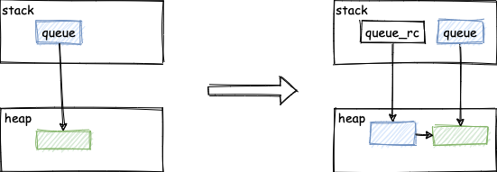
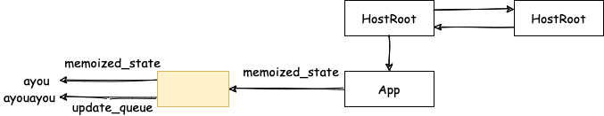
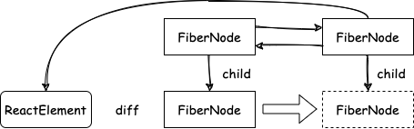
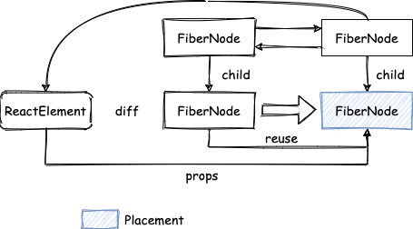
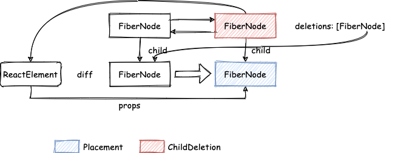
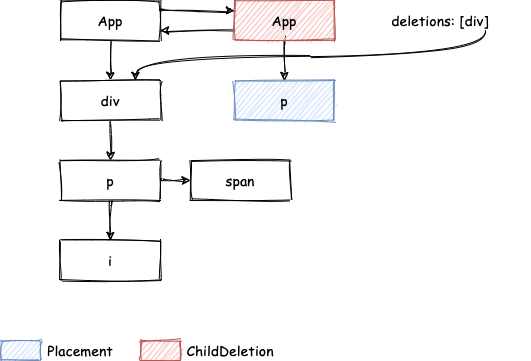

> 模仿 [big-react](https://github.com/BetaSu/big-react)，使用 Rust 和 WebAssembly，从零实现 React v18 的核心功能。深入理解 React 源码的同时，还锻炼了 Rust 的技能，简直赢麻了！
>
> 代码地址：https://github.com/ParadeTo/big-react-wasm
>
> 本文对应 tag：[v10](https://github.com/ParadeTo/big-react-wasm/tree/v10)

> Based on [big-react](https://github.com/BetaSu/big-react)，I am going to implement React v18 core features from scratch using WASM and Rust.
>
> Code Repository：https://github.com/ParadeTo/big-react-wasm
>
> The tag related to this article：[v10](https://github.com/ParadeTo/big-react-wasm/tree/v10)

上上篇文章末尾说了我们目前还没有完整的实现更新流程，所以这篇文章我们来实现一下。

The previous article mentioned that we haven't fully implemented the update process yet. So, in this article, we will implement it.

还是用之前的例子：

Let's continue using the previous example:

```js
function App() {
  const [name, setName] = useState(() => 'ayou')
  setTimeout(() => {
    setName('ayouayou')
  }, 1000)
  return (
    <div>
      <Comp>{name}</Comp>
    </div>
  )
}
```

当我们调用 `setName('ayouayou')` 时，会触发更新流程，而 `setName` 这个方法是在首次渲染的时候在 `mount_state` 中返回的，该方法会在当前 `FiberNode` 的 `memoized_state` 上挂载一个 `Hook` 节点，如果有多个 Hooks, 会形成一个链表。`Hook` 节点上有个 `update_queue`，显而易见，这是个更新队列。还有个 `memoized_state` 属性，记录当前 `Hook` 的状态：

When we call `setName('ayouayou')`, it triggers the update process. The `setName` method is returned in the `mount_state` during the initial render. This method attaches a `Hook` node to the `memoized_state` of the current `FiberNode`. If there are multiple hooks, they form a linked list. The `Hook` node has an `update_queue`, which is clearly an update queue. It also has a `memoized_state` property that records the current state of the `Hook`.

```rust
fn mount_state(initial_state: &JsValue) -> Result<Vec<JsValue>, JsValue> {
  // Add hook to current FiberNode memoized_state
  let hook = mount_work_in_progress_hook();
  let memoized_state: JsValue;

  if initial_state.is_function() {
    memoized_state = initial_state
        .dyn_ref::<Function>()
        .unwrap()
        .call0(&JsValue::null())?;
  } else {
      memoized_state = initial_state.clone();
  }

  hook.as_ref().unwrap().clone().borrow_mut().memoized_state =
      Some(MemoizedState::JsValue(memoized_state.clone()));
  let queue = create_update_queue();
  hook.as_ref().unwrap().clone().borrow_mut().update_queue = Some(queue.clone());
  ...
}
```

`mount_state` 最终会返回 `initial_state` 和一个函数：

`mount_state` ultimately returns `initial_state` and a function:

```rust
let q_rc = Rc::new(queue.clone());
let q_rc_cloned = q_rc.clone();
let fiber = unsafe {
    CURRENTLY_RENDERING_FIBER.clone().unwrap()
};
let closure = Closure::wrap(Box::new(move |action: &JsValue| unsafe {
    dispatch_set_state(
        fiber.clone(),
        (*q_rc_cloned).clone(),
        action,
    )
}) as Box<dyn Fn(&JsValue)>);
let function = closure.as_ref().unchecked_ref::<Function>().clone();
closure.forget();

queue.clone().borrow_mut().dispatch = Some(function.clone());

Ok(vec![memoized_state, function.into()])
```

这里有点奇怪的是 `closure` 中的 `q_rc_cloned`，明明 `queue` 已经是个 `Rc` 类型了，为什么还要在外面再包一层 `Rc`？因为如果把 `(*q_rc_cloned).clone()` 改成 `queue.clone()`，会报如下错误：

It's a bit strange here with `q_rc_cloned` in the closure. `queue` is already of type `Rc`, so why is there an additional layer of `Rc` on the outside? This is because if we change `(*q_rc_cloned).clone()` to `queue.clone()`, it will result in the following error:

```rust
error[E0382]: borrow of moved value: `queue`
   --> packages/react-reconciler/src/fiber_hooks.rs:251:5
    |
233 |     let queue = create_update_queue();
    |         ----- move occurs because `queue` has type `Rc<RefCell<UpdateQueue>>`, which does not implement the `Copy` trait
...
240 |     let closure = Closure::wrap(Box::new(move |action: &JsValue| unsafe {
    |                                          ----------------------- value moved into closure here
...
243 |             queue.clone(),
    |             ----- variable moved due to use in closure
...
251 |     queue.clone().borrow_mut().dispatch = Some(function.clone());
    |     ^^^^^ value borrowed here after move

```

原因在于 `queue` 的值的所有权已经被 move 进闭包中了，外面不能再继续使用了。那去掉 move 行么？试试看，结果发现会报这个错误：

The reason is that the ownership of the value of `queue` has already been moved into the closure, so it can no longer be used outside. Can we remove the move? Let's try, and we find that it results in this error:

```rust
error[E0597]: `queue` does not live long enough
   --> packages/react-reconciler/src/fiber_hooks.rs:243:13
    |
240 |       let closure = Closure::wrap(Box::new(|action: &JsValue| unsafe {
    |                                   -        ------------------ value captured here
    |  _________________________________|
    | |
241 | |         dispatch_set_state(
242 | |             fiber.clone(),
243 | |             queue.clone(),
    | |             ^^^^^ borrowed value does not live long enough
...   |
246 | |         )
247 | |     }) as Box<dyn Fn(&JsValue)>);
    | |______- cast requires that `queue` is borrowed for `'static`
...
254 |   }
    |   - `queue` dropped here while still borrowed
```

原因在于，如果不 move 进去，`queue` 在 `mount_state` 执行完后就会被回收，而闭包里面却仍然在借用，显然不行。

The reason is that if we don't move it in, `queue` will be deallocated after `mount_state` is executed, but it is still borrowed inside the closure, which is obviously not allowed.

都说 Rust 学习曲线陡峭的原因就在此，大部分时候都在和编译器作斗争。不过 Rust 的理念就是这样，在程序编译时就把大部分的问题给发现出来，这样修复的效率比上线后发现再修复的效率要高得多。而且，Rust 编译器也很智能，给出的问题描述一般都很清晰。

It is often said that the steep learning curve of Rust lies in the fact that you are constantly fighting with the compiler. However, this is the philosophy of Rust: to discover most issues during compilation, which leads to a much higher efficiency in fixing them compared to discovering and fixing them after deployment. Moreover, the Rust compiler is quite intelligent and provides clear problem descriptions.

继续回到使用 move 和 `queue` 的错误。分析一下，因为 `queue` 被 move 了，所以后面不能使用 `queue`，那么如果我们 move 一个别的值不就可以了么，所以就有了 `queue_rc`，两者的内存模型对比如下所示：

Let's get back to the error of using move and `queue`. Analyzing the situation, since `queue` has been moved, we can't use `queue` afterwards. So, if we move some other value, wouldn't that work? That's why we have `queue_rc`, and the memory models of the two are compared as shown below:



还有一个值得说明的地方是，我们把这个闭包函数挂载到了每个 `Hook` 节点的 `queue` 的 `dispatch` 属性上：

Another point worth mentioning is that we attach this closure function to the `dispatch` property of the `queue` of each `Hook` node:

```rust
queue.clone().borrow_mut().dispatch = Some(function.clone());
```

是为了在 `update_state` 时返回同样的函数：

This is done to return the same function during `update_state`:

```rust
fn update_state(initial_state: &JsValue) -> Result<Vec<JsValue>, JsValue> {
   ...
    Ok(vec![
        hook.clone().unwrap().clone()
            .borrow()
            .memoized_state
            .clone()
            .unwrap()
            .js_value()
            .unwrap().clone(),
        queue.clone().unwrap().borrow().dispatch.clone().into(),
    ])
}
```

不过我感觉这个 `dispatch` 作为 `Hook` 的属性更合适，至少目前来看它跟 `queue` 好像没什么关联。

However, I feel that having `dispatch` as an attribute of `Hook` is more appropriate. At least for now, it doesn't seem to have any direct association with `queue`.

回到代码，当调用 `dispatch` 时，最后会调用 `dispatch_set_state`：

Returning to the code, when `dispatch` is called, it eventually invokes `dispatch_set_state`:

```rust
fn dispatch_set_state(
    fiber: Rc<RefCell<FiberNode>>,
    update_queue: Rc<RefCell<UpdateQueue>>,
    action: &JsValue,
) {
    let update = create_update(action.clone());
    enqueue_update(update_queue.clone(), update);
    unsafe {
        WORK_LOOP
            .as_ref()
            .unwrap()
            .clone()
            .borrow()
            .schedule_update_on_fiber(fiber.clone());
    }
}
```

它的作用就是使用传入的 `action` 更新 `Hook` 节点的 `update_queue`，并开启一轮新的更新流程，此时 `App` 节点状态如下图所示：

Its purpose is to update the `update_queue` of the `Hook` node with the provided `action` and initiate a new round of update process. At this point, the state of the `App` node looks as shown in the following diagram:



接下来流程跟首次渲染类似，首先看 begin work，更新过程的 begin work 主要是对于 `FiberNode` 的子节点的处理，它通过当前 Fiber Tree 中的子 `FiberNode` 节点和新产生的 `ReactElement` （代码中叫做 children）来生成新的子 `FiberNode`，也就是我们常说的 diff 过程：

Next, the process is similar to the initial rendering. First, let's look at the "begin work" phase. During the update process, the "begin work" phase primarily handles the child nodes of the `FiberNode`. It generates new child `FiberNode` by comparing the existing child `FiberNode` in the Fiber Tree with the newly generated `ReactElement` (referred to as `children` in the code). This is commonly known as the diffing process:



其中，不同类型的 `FiberNode` 节点产生 children 的方式有所不同：

- `HostRoot`：从 `memoized_state` 取值
- `HostComponent`：从 `pending_props` 中取值
- `FunctionComponent`：通过执行 `type` 指向的 `Function` 来得到
- `HostText`：没有这个过程，略

The way children are generated differs based on the type of `FiberNode`:

- `HostRoot`: Values are taken from `memoized_state`.
- `HostComponent`: Values are taken from `pending_props`.
- `FunctionComponent`: Obtained by executing the `Function` pointed to by the `type`.
- `HostText`: This process is not applicable and can be ignored.

而如何产生这个新的子 `FiberNode`，也有两种情况：

There are two scenarios for generating these new child `FiberNode`:

- Diff 的 `ReactElement` 和 `FiberNode` 的 `key` 和 `type` 都一样。复用 `FiberNode`，使用 `ReactElement` 上的 `props` 来更新 `FiberNode` 中的 `pending_props`：

* When the `key` and `type` of the diffing `ReactElement` and `FiberNode` are the same. The `FiberNode` is reused, and the `pending_props` of the `FiberNode` are updated with the `props` from the `ReactElement`:



- 其他情况。创建新的 `FiberNode`，并在父节点打上 `ChildDeletion` 标记，同时把旧的 `FiberNode` 添加到 `deletions` 列表中：

* In other cases, a new `FiberNode` is created, and the parent node is marked with the `ChildDeletion` flag. The old `FiberNode` is added to the `deletions` list:



代码就不贴了，可以查看[本次改动](https://github.com/ParadeTo/big-react-wasm/pull/9/files)的 `child_fiber` 文件。

I won't provide the code here, but you can refer to the `child_fiber` file in [this commit](https://github.com/ParadeTo/big-react-wasm/pull/9/files).

由于 `FunctionComponent` 产生 children 的方式相对复杂一点，我们再回过头来看看 `render_with_hooks` 方法，主要改动点为：

Since generating children for `FunctionComponent` is a bit more complex, let's go back and look at the changes made in the `render_with_hooks` method. The main changes are:

```rust
pub fn render_with_hooks(work_in_progress: Rc<RefCell<FiberNode>>) -> Result<JsValue, JsValue> {
  ...
  if current.is_some() {
      // log!("还未实现update时renderWithHooks");
      update_hooks_to_dispatcher(true);
  } else {
      update_hooks_to_dispatcher(false);
  }
  ...
}

fn update_hooks_to_dispatcher(is_update: bool) {
    let object = Object::new();

    let closure = Closure::wrap(Box::new(if is_update { update_state } else { mount_state })
        as Box<dyn Fn(&JsValue) -> Result<Vec<JsValue>, JsValue>>);
    let function = closure.as_ref().unchecked_ref::<Function>().clone();
    closure.forget();
    Reflect::set(&object, &"use_state".into(), &function).expect("TODO: panic set use_state");

    updateDispatcher(&object.into());
}
```

也就是在更新的时候把 `dispatcher` 里的 `use_state` 更新为 `update_state` 方法，而 `update_state` 中主要是根据 `Hooks` 上的 `update_queue` 和 `memoized_state` 计算出新的 `memoized_state` 进行返回，同时还返回了 `dispatch` 函数：

During the update, the `use_state` in the `dispatcher` is replaced with the `update_state` method. The `update_state` method primarily calculates the new `memoized_state` based on the `update_queue` and `memoized_state` of the `Hooks` and returns it. It also returns the `dispatch` function.

```rust
fn update_state(initial_state: &JsValue) -> Result<Vec<JsValue>, JsValue> {
    let hook = update_work_in_progress_hook();

    let hook_cloned = hook.clone().unwrap().clone();
    let queue = hook_cloned.borrow().update_queue.clone();
    let base_state = hook_cloned.borrow().memoized_state.clone();

    unsafe {
        hook_cloned.borrow_mut().memoized_state = process_update_queue(
            base_state,
            queue.clone(),
            CURRENTLY_RENDERING_FIBER.clone().unwrap(),
        );
    }

    Ok(vec![
        hook.clone().unwrap().clone()
            .borrow()
            .memoized_state
            .clone()
            .unwrap()
            .js_value()
            .unwrap().clone(),
        queue.clone().unwrap().borrow().dispatch.clone().into(),
    ])
}
```

begin work 阶段就说这么多，接下来看看 complete work 阶段，complete work 阶段相对来说简单一点，主要是对节点进行 `Update` 标记，修改了处理 `HostText` 和 `HostComponent` 的逻辑：

That's all for the "begin work" phase. Next, let's take a look at the "complete work" phase, which is relatively simpler. In this phase, nodes are marked with the `Update` flag, and the logic for handling `HostText` and `HostComponent` is modified.

```rust
WorkTag::HostText => {
  if current.is_some() && work_in_progress_cloned.borrow().state_node.is_some() {
      // reuse FiberNode
      let old_text = derive_from_js_value(&current.clone().unwrap().clone().borrow().memoized_props, "content");
      let new_test = derive_from_js_value(&new_props, "content");
      if !Object::is(&old_text, &new_test) {
          CompleteWork::mark_update(work_in_progress.clone());
      }
  } else {
      let text_instance = self.host_config.create_text_instance(
          Reflect::get(&new_props, &JsValue::from_str("content"))
              .unwrap()
              .as_string()
              .unwrap(),
      );
      work_in_progress.clone().borrow_mut().state_node =
          Some(Rc::new(StateNode::Element(text_instance.clone())));
  }

  self.bubble_properties(work_in_progress.clone());
  None
}，
WorkTag::HostComponent => {
  if current.is_some() && work_in_progress_cloned.borrow().state_node.is_some() {
    // reuse FiberNode
    log!("TODO: update properties")
  } else {
      let instance = self.host_config.create_instance(
          work_in_progress
              .clone()
              .borrow()
              ._type
              .as_ref()
              .as_string()
              .unwrap(),
      );
      self.append_all_children(instance.clone(), work_in_progress.clone());
      work_in_progress.clone().borrow_mut().state_node =
          Some(Rc::new(StateNode::Element(instance.clone())));
  }

  self.bubble_properties(work_in_progress.clone());
  None
}
```

最后是 commit 阶段，主要就是在 `commit_mutation_effects_on_fiber` 中增加对 `Update` 和 `ChildDeletion` 的处理：

Finally, we have the "commit" phase, which mainly involves adding handling for `Update` and `ChildDeletion` in the `commit_mutation_effects_on_fiber` function.

```rust
fn commit_mutation_effects_on_fiber(&self, finished_work: Rc<RefCell<FiberNode>>) {
  ...
  if flags.contains(Flags::ChildDeletion) {
      let deletions = finished_work.clone().borrow().deletions.clone();
      if deletions.is_some() {
          let deletions = deletions.unwrap();
          for child_to_delete in deletions {
              self.commit_deletion(child_to_delete);
          }
      }
      finished_work.clone().borrow_mut().flags -= Flags::ChildDeletion;
  }

  if flags.contains(Flags::Update) {
      self.commit_update(finished_work.clone());
      finished_work.clone().borrow_mut().flags -= Flags::Update;
  }
  ...
```

`Update` 中目前只处理了 `HostText`，比较简单，就不介绍了，直接看代码吧，这里重点介绍下 `ChildDeletion`。

In the `Update` part, only `HostText` is currently handled, which is relatively simple, so we won't go into detail. Let's directly look at the code. Here, I'll focus on explaining `ChildDeletion`.

begin work 中我们说过标记为删除的子节点会被加入父节点的 `deletions` 列表中，所以这里会遍历这个列表，然后调用 `commit_deletion`，该函数会采取前序的方式遍历（优先遍历根节点） `child_to_delete` 为根节点的子树，并执行这些节点上相关的副作用，如：执行 `componentWillUnmount` 方法或 `useEffect` 返回的 `destroy` 方法，从这里也可以发现父组件的副作用会先执行。

In the "begin work" phase, we mentioned that child nodes marked for deletion are added to the `deletions` list of their parent node. So here, we iterate over this list and call `commit_deletion`. This function traverses the subtree rooted at `child_to_delete` in a pre-order manner (prioritizing the traversal of the root node). It executes the relevant side effects on these nodes, such as invoking the `componentWillUnmount` method or the `destroy` method returned by `useEffect`. From this, we can observe that the side effects of the parent component are executed first.

比如下面这个例子：

For example, consider the following example:



的遍历顺序为 `div->p->i->span`。同时还会记录第一个遍历到的节点，此例为 `div`，然后在该节点上执行删除操作。

The traversal order is `div -> p -> i -> span`. Additionally, the first node encountered during traversal is recorded, which in this case is `div`. The deletion operation is then performed on this node.

好了，单节点更新流程就实现完毕了，简单总结下就是：

Alright, the single-node update process is now complete. In summary:

- 在 begin work 阶段中标记子节点的删除、插入
- complete work 阶段中标记节点的更新
- commit 流程中深度优先遍历 Fiber Tree，处理有标记的节点。对于标记为 `ChildDeletion` 的节点，会采用前序遍历的方式遍历以此节点为根节点的子树。

- In the "begin work" phase, mark child nodes for deletion or insertion.
- In the "complete work" phase, mark nodes for update.
- In the commit phase, perform a depth-first traversal of the Fiber Tree, processing the marked nodes. For nodes marked as `ChildDeletion`, a pre-order traversal is performed on the subtree rooted at that node.

更多详见本次[更新](https://github.com/ParadeTo/big-react-wasm/pull/9)。

For more details, please refer to this [update](https://github.com/ParadeTo/big-react-wasm/pull/9).
