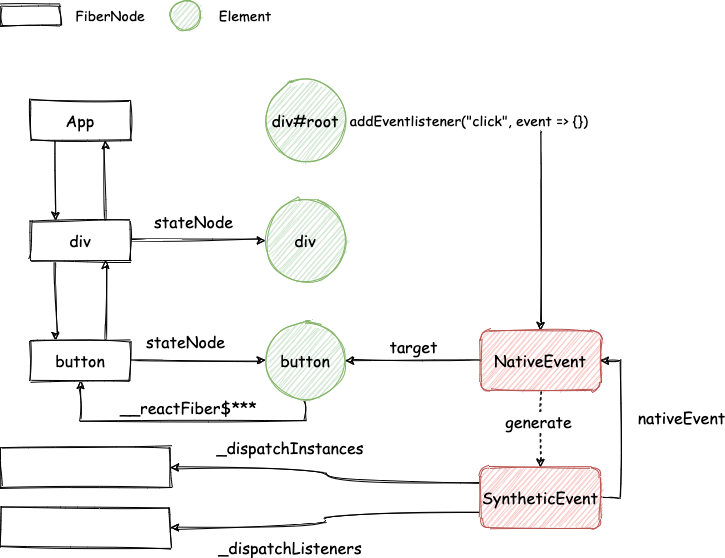
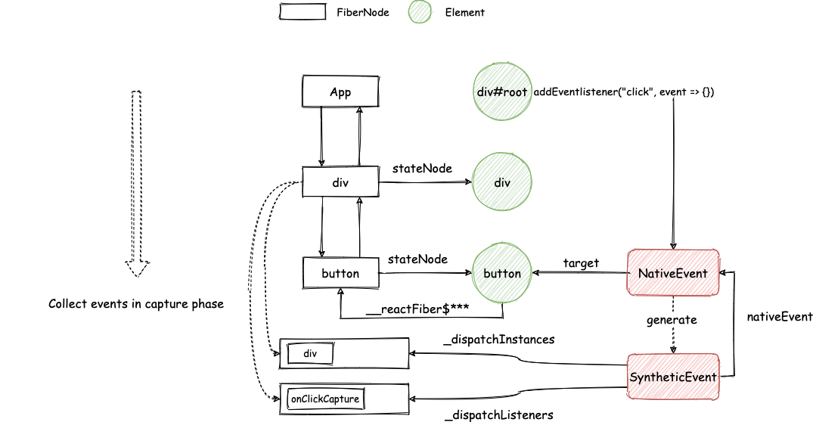
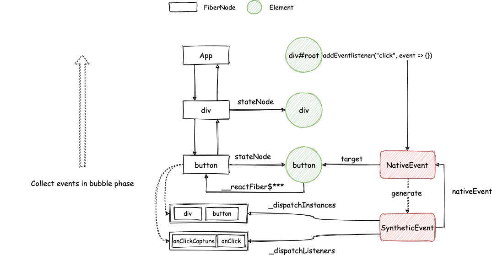
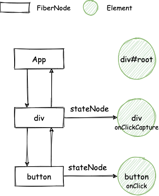
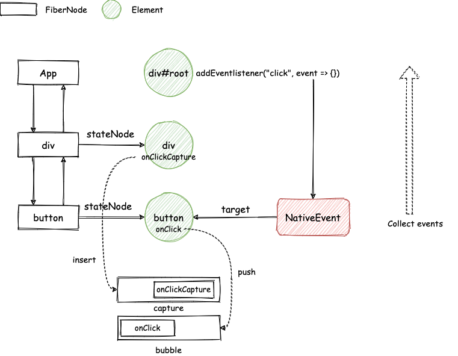

> 模仿 [big-react](https://github.com/BetaSu/big-react)，使用 Rust 和 WebAssembly，从零实现 React v18 的核心功能。深入理解 React 源码的同时，还锻炼了 Rust 的技能，简直赢麻了！
>
> 代码地址：https://github.com/ParadeTo/big-react-wasm
>
> 本文对应 tag：[v11](https://github.com/ParadeTo/big-react-wasm/tree/v11)

> Based on [big-react](https://github.com/BetaSu/big-react)，I am going to implement React v18 core features from scratch using WASM and Rust.
>
> Code Repository：https://github.com/ParadeTo/big-react-wasm
>
> The tag related to this article：[v11](https://github.com/ParadeTo/big-react-wasm/tree/v11)

没有事件系统的 React 是没有灵魂的，用户完全无法进行交互，所以这篇文章我们以 `click` 事件为例来介绍如何实现。

Without an event system, React lacks interactivity, and users are unable to interact with the application. Therefore, in this article, we will use the `click` event as an example to demonstrate how to implement it.

以下面的代码为例，我们先来回顾一下，正版的 React 是怎么实现的。

Let's take a look at how the official version of React handles events, using the following code as an example.

```js
const App = () => {
  innerClick = () => {
    console.log('A: react inner click.')
  }

  outerClick = () => {
    console.log('B: react outer click.')
  }

  return (
    <div id='outer' onClickCapture={this.outerClick}>
      <button id='inner' onClick={this.innerClick}>
        button
      </button>
    </div>
  )
}
```

当事件在根元素上触发的时候，我们可以拿到原生事件对象 `NativeEvent`，通过 target 可以访问到当前点击的元素 `button`，通过其属性 `__reactFiber$*****`（\*表示随机数）可以获取 `button` 所对应的 `FiberNode`。同时，React 还会利用 `NativeEvent` 来生成 `SyntheticEvent`，其中 `SyntheticEvent` 有几个重要的属性值得关注：

- `nativeEvent`，指向 `NativeEvent`。
- `_dispatchListeners`，存储要执行的事件监听函数。
- `_dispatchInstances`，存储要执行的事件监听函数所属的 `FiberNode` 对象。

When an event is triggered on the root element, we can obtain the native event object `NativeEvent`. By accessing the `target` property, we can retrieve the current clicked element, which in this case is the `button`. Using the property `__reactFiber$*****` (where `*` represents a random number) on the button, we can access the corresponding `FiberNode`. Additionally, React utilizes the `NativeEvent` to generate a `SyntheticEvent`, which has several important properties worth noting:

- `nativeEvent`: Points to the `NativeEvent`.
- `_dispatchListeners`: Stores the event listener functions to be executed.
- `_dispatchInstances`: Stores the `FiberNode` objects to which the event listener functions belong.



接下来分别按照捕获和冒泡两个阶段来收集要执行的事件监听函数：

Next, we will collect the event listener functions to be executed in both the capturing and bubbling phases.





最后，按照顺序执行 `_dispatchListeners` 中的方法，并通过 `_dispatchInstances` 中的 `FiberNode` 来得到对应的 `stateNode` 作为 `SyntheticEvent` 上的 `currentTarget`。

`SyntheticEvent` 上也有 `stopPropagation` 方法，调用它以后 `_dispatchListeners` 后面的方法就不会执行了，从而达到了阻止事件传播的效果。

React 事件系统的介绍就到这，更多内容可以参考[这篇文章](/2020/08/20/react-event/)。

不过，big react 的实现方式跟正版的 React 不同，它是这样做的。

在 complete work 阶段，创建 `FiberNode` 节点的 `stateNode` 时，将 `FiberNode` 节点上的事件监听函数复制到 `Element` 上：

Finally, the methods in `_dispatchListeners` are executed in order, and the corresponding `stateNode` is obtained from the `FiberNode` in `_dispatchInstances` as the `currentTarget` on the `SyntheticEvent`.

The `SyntheticEvent` also has a `stopPropagation` method. Once called, the methods following `_dispatchListeners` will not be executed, effectively preventing event propagation.

That concludes the introduction to the React event system. For more information, you can refer to [this article](/2020/08/20/react-event/).

However, the implementation of Big React differs from the official React. Here's how it's done:

During the complete work phase, when creating the `stateNode` for a `FiberNode` node, the event listener functions on the `FiberNode` node are copied to the `Element`.



当事件触发时，通过 `NativeEvent` 上的 `target` 一路往上收集事件监听函数，如果是 `onClick`，则 `push` 到 `bubble` 这个列表中，是 `onClickCapture` 的话则 `insert` 到 `capture` 这个列表中：

When an event is triggered, the event listener functions are collected by traversing up the tree using the `target` property on the `NativeEvent`. If it's an `onClick` event, the function is `pushed` into the `bubble` list. If it's an `onClickCapture` event, the function is `inserted` into the `capture` list.



然后先从头到尾依次执行 `capture` 中的事件监听函数，再从头到尾依次执行 `bubble` 中的事件监听函数。

阻止事件传播是怎么实现的呢？答案是修改了 `NativeEvent` 上的该方法：

Then, the event listener functions in the `capture` list are executed from start to finish, followed by the event listener functions in the `bubble` list.

How is event propagation prevented? The answer lies in modifying the method on the `NativeEvent`.

```rust
fn create_synthetic_event(e: Event) -> Event {
    Reflect::set(&*e, &"__stopPropagation".into(), &JsValue::from_bool(false));

    let e_cloned = e.clone();
    let origin_stop_propagation = derive_from_js_value(&*e, "stopPropagation");
    let closure = Closure::wrap(Box::new(move || {
        // set __stopPropagation to true
        Reflect::set(
            &*e_cloned,
            &"__stopPropagation".into(),
            &JsValue::from_bool(true),
        );
        if origin_stop_propagation.is_function() {
            let origin_stop_propagation = origin_stop_propagation.dyn_ref::<Function>().unwrap();
            origin_stop_propagation.call0(&JsValue::null());
        }
    }) as Box<dyn Fn()>);
    let function = closure.as_ref().unchecked_ref::<Function>().clone();
    closure.forget();
    Reflect::set(&*e.clone(), &"stopPropagation".into(), &function.into());
    e
}

fn trigger_event_flow(paths: Vec<Function>, se: &Event) {
    for callback in paths {
        callback.call1(&JsValue::null(), se);
        // If __stopPropagation is true, break
        if derive_from_js_value(se, "__stopPropagation")
            .as_bool()
            .unwrap()
        {
            break;
        }
    }
}
```

不过这里还有个问题，就是 `currentTarget` 并没有像正版的 React 那样进行修正，这里的 `currentTarget` 一直都是根元素，因为事件监听函数是绑定在该元素上的：

However, there is another issue here. The `currentTarget` is not corrected as it is in the official version of React. In this case, the `currentTarget` always refers to the root element because the event listener functions are bound to that element.

```rust
pub fn init_event(container: JsValue, event_type: String) {
  ...
  let element = container
      .clone()
      .dyn_into::<Element>()
      .expect("container is not element");
  let on_click = EventListener::new(&element.clone(), event_type.clone(), move |event| {
      dispatch_event(&element, event_type.clone(), event)
  });
  on_click.forget();
}
```

本次更新详见[这里](https://github.com/ParadeTo/big-react-wasm/pull/10)。

This update can be found in detail [here](https://github.com/ParadeTo/big-react-wasm/pull/10).
