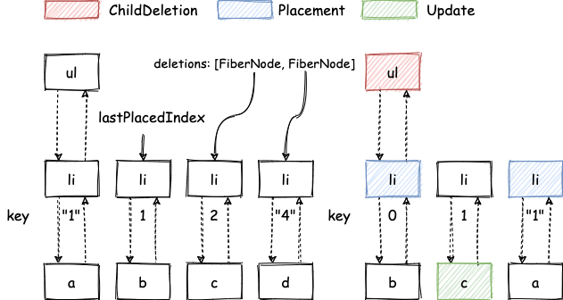
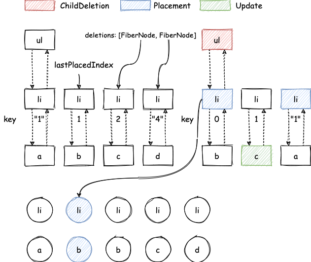
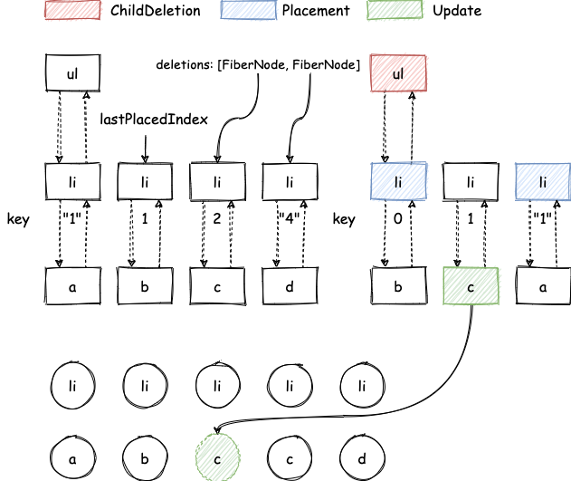
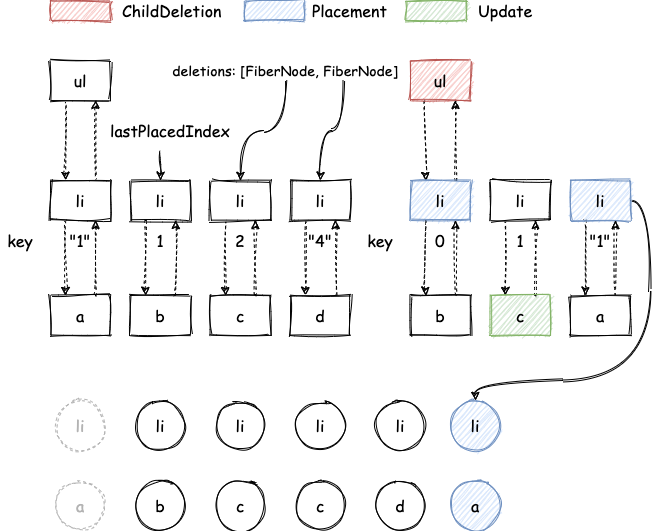
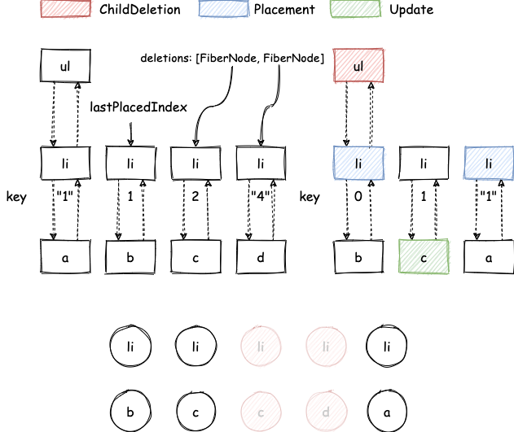

> 模仿 [big-react](https://github.com/BetaSu/big-react)，使用 Rust 和 WebAssembly，从零实现 React v18 的核心功能。深入理解 React 源码的同时，还锻炼了 Rust 的技能，简直赢麻了！
>
> 代码地址：https://github.com/ParadeTo/big-react-wasm
>
> 本文对应 tag：[v12](https://github.com/ParadeTo/big-react-wasm/tree/v12)

之前已经实现了单节点的更新流程，这篇文章继续介绍如何实现多节点的更新。

首先，还是来看 begin work 阶段，这里的实现方式跟官方的类似，可以看之前写的[这篇文章](/2021/03/08/react-reconcile-diff/) 多节点 Diff 的章节，主要区别在于去掉了第一轮遍历的过程。

值得注意的是这里，TS 中可以像这样声明一个 `Map` 的类型:

```ts
Map<string | number, Fiber>
```

但是 WASM 中的 `key` 是 `JsValue` 类型的，当我们尝试这样声明类型时，会提示 `JsValue` 没有实现 `Hash` 和 `Eq` trait：

```rust
HashMap<JsValue, Rc<RefCell<FiberNode>>>
```

那实现一下不就行了？由于 Rust 中的“孤儿规则”限制，我们不能直接给 `JsValue` 实现这些 trait，需要新建一个 `struct` 包裹一下：

```rust
struct Key(JsValue);

impl PartialEq for Key {
    fn eq(&self, other: &Self) -> bool {
        Object::is(&self.0, &other.0)
    }
}

impl Eq for Key {}

impl Hash for Key {
    fn hash<H: Hasher>(&self, state: &mut H) {
        if self.0.is_string() {
            self.0.as_string().unwrap().hash(state)
        } else if let Some(n) = self.0.as_f64() {
            n.to_bits().hash(state)
        } else if self.0.is_null() {
            "null".hash(state)
        }
    }
}
```

多节点 Diff 完成后，会给需要移动的 `FiberNode` 打上 `Placement` 的标记，给需要删除的 `FiberNode` 的父节点打上 `ChildDeletion` 的标记，以下面这个为例：

```
// before
<ul>
  <li key={1}>a</li> // key: "1"
  <li>b</li> // key: 1
  <li>c</li> // key: 2
  <li key={4}>d</li> // key: "4"
</ul>

// after
<ul>
  <li>b</li> // key: 0
  <li>c</li> // key: 1
  <li key={1}>d</li> // key: "1"
</ul>
```

begin work 和 complete work 后的结果如下所示：



稍微解释下：

- 传入的 key 都会转为 string 类型，如果没有传 key，则用索引作为 key。
- key 为 0 的 li 节点找不到相同 key 的节点，所以需要插入一个新节点，标记为 `Placement`。
- key 为 1 的 li 节点可复用，只需要更新其子节点内容由 b 到 c，标记为 `Update`。
- key 为 "1" 的 li 节点可复用，但由于 `oldIndex` 小于 `lastPlacedIndex`，所以需要移动，标记为 `Placement`。

接下来，就到了 commit 阶段，该阶段会按照深度优先遍历的方式处理节点上的副作用。

在执行插入操作时，会在 `siblings` 中尝试找到一个插入点 `before`。难点在于这个插入点可能并不是他的同级 `sibling`。比如 `<div/><B/>` 其中 B 是 `FunctionComponent` 类型： `function B() {return <div/>}`，这里 `before` 实际是 B 的 `child`，实际情况层级可能更深。同时，如果一个 `FiberNode` 被标记 `Placement`，那他就是不稳定的（他对应的 `Element` 在本次 commit 阶段会移动），也不能作为 `before`。

如果能找到这个插入点 `before`，则调用 `parent.insertBefore(node, before)`，否则调用 `parent.appendChild(node)`。

还是上面的例子，会依次处理 `li(0) -> c -> li("1") -> ul` 上的副作用，结果将会如下所示：

- commitPlacement
  
- commitUpdate
  
- commitPlacement
  
- commitDeletion
  

本次更新详见[这里](https://github.com/ParadeTo/big-react-wasm/pull/11)
