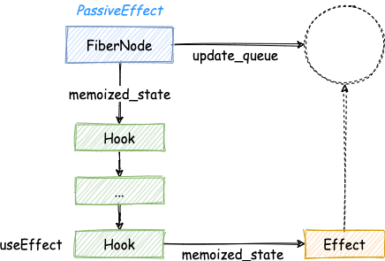

> 模仿 [big-react](https://github.com/BetaSu/big-react)，使用 Rust 和 WebAssembly，从零实现 React v18 的核心功能。深入理解 React 源码的同时，还锻炼了 Rust 的技能，简直赢麻了！
>
> 代码地址：https://github.com/ParadeTo/big-react-wasm
>
> 本文对应 tag：[v15](https://github.com/ParadeTo/big-react-wasm/tree/v15)

> Based on [big-react](https://github.com/BetaSu/big-react)，I am going to implement React v18 core features from scratch using WASM and Rust.
>
> Code Repository：https://github.com/ParadeTo/big-react-wasm
>
> The tag related to this article：[v14](https://github.com/ParadeTo/big-react-wasm/tree/v14)

本次更新详见[这里](https://github.com/ParadeTo/big-react-wasm/pull/14/files)，下面来过一遍整个流程。

The details of this update can be seen [here](https://github.com/ParadeTo/big-react-wasm/pull/14/files). Let's go through the entire process below.

跟 `useState` 一样，首先需要在 `react` 包中导出这个方法，它接收两个参数：

Like `useState`, we first need to export this method from the `react` package. It takes two parameters:

```rust
#[wasm_bindgen(js_name = useEffect)]
pub unsafe fn use_effect(create: &JsValue, deps: &JsValue) {
    let use_effect = &CURRENT_DISPATCHER.current.as_ref().unwrap().use_effect;
    use_effect.call2(&JsValue::null(), create, deps);
}
```

然后，我们需要分别为首次渲染和更新实现 `mount_effect` 和 `update_effect`。其中 `mount_effect` 会给 `FiberNode` 的 Hook 链表上新增一个 `Hook` 节点，其 `memoized_state` 属性指向一个 `Effect` 对象，同时这个对象还会被加入 `FiberNode` 上的 `update_queue`, 它是一个环形队列。另外，`FiberNode` 还被被标记为 `PassiveEffect`：

Next, we need to implement `mount_effect` and `update_effect` for the initial render and updates, respectively. `mount_effect` adds a new `Hook` node to the linked list of Hooks on the `FiberNode`, with its `memoized_state` property pointing to an `Effect` object. This object is also added to the `update_queue` on the `FiberNode`, which is a circular queue. Additionally, the `FiberNode` is marked with `PassiveEffect`:



`update_effect` 的工作与 `mount_effect` 类似，会更新 `Effect` 节点，不过他会把传入的 `deps` 与之前的 `prev_deps` 中的元素依次进行浅比较，如果全部相同就不会给 `FiberNode` 标记 `PassiveEffect`。

The work of `update_effect` is similar to `mount_effect`, updating the `Effect` node, but it performs a shallow comparison of the incoming `deps` with the previous `prev_deps`. If they are all the same, it will not mark the `FiberNode` with `PassiveEffect`.

`Effect` 中的属性包含这些：

The properties included in `Effect` are as follows:

```rust
pub struct Effect {
  pub tag: Flags, // 副作用标记
  pub create: Function, // 传入 useEffect 的第一个参数，必须为函数
  pub destroy: JsValue, // useEffect 的第一个参数执行后返回的函数
  pub deps: JsValue, // 出入 useEffect 的第二个参数
  pub next: Option<Rc<RefCell<Effect>>>,
}
```

接着，Render 阶段不需要更改，Commit 阶段我们需要在 `commit_mutation_effects` 前新增处理 `useEffect` 的逻辑：

During the Render phase, no changes are needed. In the Commit phase, we need to add logic to handle `useEffect` before `commit_mutation_effects`:

```rust
// useEffect
let root_cloned = root.clone();
let passive_mask = get_passive_mask();
if flags.clone() & passive_mask.clone() != Flags::NoFlags
    || subtree_flags.clone() & passive_mask != Flags::NoFlags
{
    if unsafe { !ROOT_DOES_HAVE_PASSIVE_EFFECTS } {
        unsafe { ROOT_DOES_HAVE_PASSIVE_EFFECTS = true }
        let closure = Closure::wrap(Box::new(move || {
            flush_passive_effects(root_cloned.borrow().pending_passive_effects.clone());
        }) as Box<dyn Fn()>);
        let function = closure.as_ref().unchecked_ref::<Function>().clone();
        closure.forget();
        unstable_schedule_callback_no_delay(Priority::NormalPriority, function);
    }
}
```

这里，我们使用上一篇文章实现的 `scheduler` 来调度一个任务执行 `flush_passive_effects` 方法：

Here, we use the `scheduler` implemented in the previous article to schedule a task to execute the `flush_passive_effects` method:

```rust
fn flush_passive_effects(pending_passive_effects: Rc<RefCell<PendingPassiveEffects>>) {
    unsafe {
        if EXECUTION_CONTEXT
            .contains(ExecutionContext::RenderContext | ExecutionContext::CommitContext)
        {
            log!("Cannot execute useEffect callback in React work loop")
        }

        for effect in &pending_passive_effects.borrow().unmount {
            CommitWork::commit_hook_effect_list_destroy(Flags::Passive, effect.clone());
        }
        pending_passive_effects.borrow_mut().unmount = vec![];

        for effect in &pending_passive_effects.borrow().update {
            CommitWork::commit_hook_effect_list_unmount(
                Flags::Passive | Flags::HookHasEffect,
                effect.clone(),
            );
        }
        for effect in &pending_passive_effects.borrow().update {
            CommitWork::commit_hook_effect_list_mount(
                Flags::Passive | Flags::HookHasEffect,
                effect.clone(),
            );
        }
        pending_passive_effects.borrow_mut().update = vec![];
    }
}
```

这里的 `pending_passive_effects` 是 `FiberRootNode` 上的一个属性，用于保存此次需要执行的 `Effect`：

The `pending_passive_effects` here is a property on the `FiberRootNode`, used to store the `Effect` that needs to be executed this time:

```rust
pub struct PendingPassiveEffects {
    pub unmount: Vec<Rc<RefCell<Effect>>>,
    pub update: Vec<Rc<RefCell<Effect>>>,
}
```

其中，因为组件卸载需要处理的 `Effect` 保存在 `unmount` 中，因为更新需要处理的 `Effect` 保存在 `update` 中。从代码中看到，这里会先处理因组件卸载需要处理的 `Effect`，即使这个组件顺序比较靠后，比如这个例子：

Among them, the `Effect` that needs to be handled due to component unmounting is saved in `unmount`, and the `Effect` that needs to be handled due to updates is saved in `update`. From the code, we can see that the `Effect` due to component unmounting is handled first, even if the component is later in the sequence, like in this example:

```js
function App() {
  const [num, updateNum] = useState(0)
  return (
    <ul
      onClick={(e) => {
        updateNum((num: number) => num + 1)
      }}>
      <Child1 num={num} />
      {num === 1 ? null : <Child2 num={num} />}
    </ul>
  )
}
function Child1({num}: {num: number}) {
  useEffect(() => {
    console.log('child1 create')
    return () => {
      console.log('child1 destroy')
    }
  }, [num])
  return <div>child1 {num}</div>
}

function Child2({num}: {num: number}) {
  useEffect(() => {
    console.log('child2 create')
    return () => {
      console.log('child2 destroy')
    }
  }, [num])
  return <div>child2 {num}</div>
}
```

点击后会先执行 `Child2` 的 `useEffect` 的 `destroy`，打印 `child2 destroy`。而如果换成这样：

After clicking, the `destroy` of `Child2`'s `useEffect` will be executed first, printing `child2 destroy`. But if it's changed to this:

```js
function App() {
  const [num, updateNum] = useState(0)
  return (
    <ul
      onClick={(e) => {
        updateNum((num: number) => num + 1)
      }}>
      <Child1 num={num} />
      <Child2 num={num} />
    </ul>
  )
}
```

点击后会先执行 `Child1` 的 `useEffect` 的 `destroy`，打印 `child1 destroy`。

After clicking, the `destroy` of `Child1`'s `useEffect` will be executed first, printing `child1 destroy`.

那 `pending_passive_effects` 里面的 `Effect` 是什么时候加进去的呢？答案是在 `commit_mutation_effects` 中，有两种情况：

So when are the `Effect` in `pending_passive_effects` added? The answer is in `commit_mutation_effects`, there are two situations:

1. 如果 `FiberNode` 节点被标记需要删除且为 `FunctionComponent` 类型，则需要把 `update_queue` 中的 `Effect` 加入 `pending_passive_effects` 中的 `unmount` 列表中。

1. If the `FiberNode` node is marked for deletion and is of the `FunctionComponent` type, then the `Effect` in the `update_queue` needs to be added to the `unmount` list in `pending_passive_effects`.

```rust
fn commit_deletion(
    &self,
    child_to_delete: Rc<RefCell<FiberNode>>,
    root: Rc<RefCell<FiberRootNode>>,
) {
  let first_host_fiber: Rc<RefCell<Option<Rc<RefCell<FiberNode>>>>> =
      Rc::new(RefCell::new(None));
  self.commit_nested_unmounts(child_to_delete.clone(), |unmount_fiber| {
      let cloned = first_host_fiber.clone();
      match unmount_fiber.borrow().tag {
          WorkTag::FunctionComponent => {
              CommitWork::commit_passive_effect(
                  unmount_fiber.clone(),
                  root.clone(),
                  "unmount",
              );
          }
          ...
      }
  }
}
```

1. 如果 `FiberNode` 节点被标记为 `PassiveEffect`，则需要把 `update_queue` 中的 `Effect` 加入 `pending_passive_effects` 中的 `update` 列表中。

2. If the `FiberNode` node is marked with `PassiveEffect`, then the `Effect` in the `update_queue` needs to be added to the `update` list in `pending_passive_effects`.

```rust
if flags & Flags::PassiveEffect != Flags::NoFlags {
  CommitWork::commit_passive_effect(finished_work.clone(), root, "update");
  finished_work.borrow_mut().flags -= Flags::PassiveEffect;
}
```

大致流程介绍完毕，更多细节请参考[这里](https://github.com/ParadeTo/big-react-wasm/pull/14/files)。

The general process is now complete, for more details please refer to [here](https://github.com/ParadeTo/big-react-wasm/pull/14/files).
