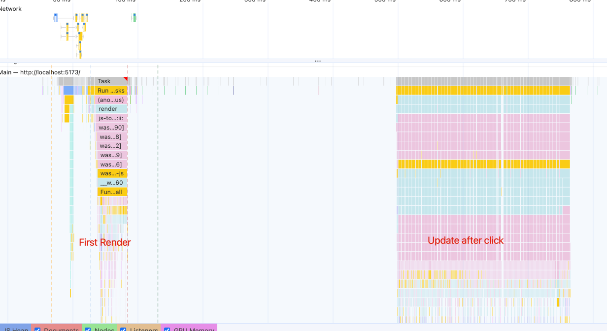

> 模仿 [big-react](https://github.com/BetaSu/big-react)，使用 Rust 和 WebAssembly，从零实现 React v18 的核心功能。深入理解 React 源码的同时，还锻炼了 Rust 的技能，简直赢麻了！
>
> 代码地址：https://github.com/ParadeTo/big-react-wasm
>
> 本文对应 tag：[v17](https://github.com/ParadeTo/big-react-wasm/tree/v17)

> Based on [big-react](https://github.com/BetaSu/big-react)，I am going to implement React v18 core features from scratch using WASM and Rust.
>
> Code Repository：https://github.com/ParadeTo/big-react-wasm
>
> The tag related to this article：[v17](https://github.com/ParadeTo/big-react-wasm/tree/v17)

React v18 最大卖点之一就是 Concurrent 模式，接下来我们以 Time Slicing 这个功能为切入点来尝试实现一下。对时间切片不熟悉的可以先看一下[这篇文章](/2020/12/30/react-concurrent-1/)。

One of the biggest selling points of React v18 is Concurrent mode. Next, let's try to implement Time Slicing as an entry point. If you're not familiar with Time Slicing, you can read this article first: [link](/2020/12/30/react-concurrent-1/).

改动最大的部分还是 reconciler 库的 `work_loop.rs`，先回顾下之前的流程：

The biggest changes are in the `work_loop.rs` file of the reconciler library. Let's review the previous flow:

```js
schedule_update_on_fiber -> ensure_root_is_scheduled -> perform_sync_work_on_root -> work_loop -> commit_root
```

现在需要改成这样：

Now it needs to be changed to:

```js
schedule_update_on_fiber -> ensure_root_is_scheduled -> perform_sync_work_on_root -> render_root -> work_loop_sync -> commit_root
                                     |                                                  ^   |                            ^
                                     | --->   perform_concurrent_work_on_root ----------|   |---> work_loop_concurrent --|
```

也是就增加了一条 Concurrent 模式的支线，另外增加了 `render_root`，这样 Render 和 Commit 两大过程也更直观了。

This adds a new branch for the Concurrent mode and introduces the `render_root` function, making the Render and Commit processes more intuitive.

其中 `perform_concurrent_work_on_root` 需要使用之前实现的 `scheduler` 来进行调度：

The `perform_concurrent_work_on_root` function needs to use the previously implemented `scheduler` to schedule the work:

```rust
let scheduler_priority = lanes_to_scheduler_priority(cur_priority.clone());
let closure = Closure::wrap(Box::new(move |did_timeout_js_value: JsValue| {
    let did_timeout = did_timeout_js_value.as_bool().unwrap();
    perform_concurrent_work_on_root(root_cloned.clone(), did_timeout)
}) as Box<dyn Fn(JsValue) -> JsValue>);
let function = closure.as_ref().unchecked_ref::<Function>().clone();
closure.forget();
new_callback_node = Some(unstable_schedule_callback_no_delay(
    scheduler_priority,
    function,
))
```

而在 `perform_concurrent_work_on_root` 中，我们需要根据 Render 阶段结束时的返回状态来判断，Render 工作是否完成。

In the `perform_concurrent_work_on_root` function, we need to check the return status at the end of the Render phase to determine if the Render work is complete.

如果返回状态为 `ROOT_INCOMPLETE`，说明没完成，也就是时间切片用完了，Render 工作暂时停止，此时需要再次返回一个函数：

If the return status is `ROOT_INCOMPLETE`, it means that the work is not complete, and the Render work is temporarily paused because the time slice has been used up. In this case, we need to return a function again:

```rust
let exit_status = render_root(root.clone(), lanes.clone(), should_time_slice);
if exit_status == ROOT_INCOMPLETE {
    let root_cloned = root.clone();
    let closure = Closure::wrap(Box::new(move |did_timeout_js_value: JsValue| {
        let did_timeout = did_timeout_js_value.as_bool().unwrap();
        perform_concurrent_work_on_root(root_cloned.clone(), did_timeout)
    }) as Box<dyn Fn(JsValue) -> JsValue>);
    let function = closure.as_ref().unchecked_ref::<Function>().clone();
    closure.forget();
    return function.into();
}
```

因为 `scheduler` 有这样的特性，比如下面这个例子：

Because the `scheduler` has a feature like this, for example:

```js
import Scheduler from 'react/packages/scheduler'

function func2(didTimeout) {
  if (!didTimeout) console.log(2)
}

function func1() {
  console.log(1)
  return func2
}

const task = Scheduler.unstable_scheduleCallback(1, func1)
```

`func1` 结束后返回了 `func2` 则两个函数会共用 `task` 的过期时间。

什么意思呢？比如 `task` 的过期时间是 3 秒，`func1` 执行用了 2 秒，那么执行到 `func2` 时，`task` 还未过期，`didTimeout` 为 `false`。
如果 `func1` 执行用了 4 秒，那么执行到 `func2` 时，`task` 已过期，`didTimeout` 为 `true`。

否则，如果返回状态为 `ROOT_COMPLETED`，则说明 Render 流程已完全完成，则进行 Commit 流程，这个与之前就是一样的了。

接下来看看 `render_root`，该方法新增了一个参数 `should_time_slice`，如果为 `true` 就调用 `work_loop_concurrent` 方法，否则调用 `work_loop_sync` 方法：

When `func1` finishes and returns `func2`, both functions will share the expiration time of `task`.

What does this mean? For example, if the expiration time of `task` is 3 seconds and `func1` takes 2 seconds to execute, when `func2` is executed, `task` has not expired yet, and `didTimeout` is `false`. If `func1` takes 4 seconds to execute, when `func2` is executed, `task` has expired, and `didTimeout` is `true`.

Otherwise, if the return status is `ROOT_COMPLETED`, it means that the Render process has been fully completed, and the Commit process is performed as before.

Next, let's take a look at the `render_root` function. It adds a new parameter `should_time_slice`, and if it's `true`, it calls the `work_loop_concurrent` function; otherwise, it calls the `work_loop_sync` function:

```rust
loop {
    match if should_time_slice {
        work_loop_concurrent()
    } else {
        work_loop_sync()
    } {
        Ok(_) => {
            break;
        }
        Err(e) => unsafe {
            log!("work_loop error {:?}", e);
            WORK_IN_PROGRESS = None
        },
    };
}
```

其中 `work_loop_concurrent` 与 `work_loop_sync` 不同之处仅在于增加了 `unstable_should_yield_to_host` 的约束，即判断时间切片是否已用完：

The only difference between `work_loop_concurrent` and `work_loop_sync` is the addition of the constraint `unstable_should_yield_to_host`, which checks if the time slice has been used up:

```rust
fn work_loop_concurrent() -> Result<(), JsValue> {
    unsafe {
        while WORK_IN_PROGRESS.is_some() && !unstable_should_yield_to_host() {
            log!("work_loop_concurrent");
            perform_unit_of_work(WORK_IN_PROGRESS.clone().unwrap())?;
        }
    }
    Ok(())
}
```

当跳出循环时，如果 `should_time_slice` 为 `true` 且 `WORK_IN_PROGRESS` 不为空，说明 Render 阶段还未完成，此时 `render_root` 返回 `ROOT_INCOMPLETE`：

When the loop is exited, if `should_time_slice` is `true` and `WORK_IN_PROGRESS` is not empty, it means that the Render phase is not yet complete. In this case, `render_root` returns `ROOT_INCOMPLETE`:

```rust
unsafe {
    EXECUTION_CONTEXT = prev_execution_context;
    WORK_IN_PROGRESS_ROOT_RENDER_LANE = Lane::NoLane;

    if should_time_slice && WORK_IN_PROGRESS.is_some() {
        return ROOT_INCOMPLETE;
    }

    ...
}
```

这样，整个流程就串起来了。

那什么时候需要使用 Concurrent 模式呢？这个取决于更新的优先级，一般来说，不那么紧急的更新可以使用 Concurrent 模式。

big-react 中目前是这么规定的：

This connects the entire process.

When should we use Concurrent mode? It depends on the priority of the update. Generally, less urgent updates can use Concurrent mode.

In big-react, the current rule is as follows:

```js
const eventTypeToEventPriority = (eventType: string) => {
  switch (eventType) {
    case 'click':
    case 'keydown':
    case 'keyup':
      return SyncLane
    case 'scroll':
      return InputContinuousLane
    // TODO 更多事件类型
    default:
      return DefaultLane
  }
}
```

在调用事件的回调函数之前会将 `scheduler` 中的全局变量 `currentPriorityLevel` 改成对应的值：

Before calling the event callback function, the global variable `currentPriorityLevel` in the `scheduler` is changed to the corresponding value:

```js
// react-dom
const triggerEventFlow = (paths: EventCallback[], se: SyntheticEvent) => {
  for (let i = 0; i < paths.length; i++) {
    const callback = paths[i]
    runWithPriority(eventTypeToEventPriority(se.type), () => {
      callback.call(null, se)
    })

    if (se.__stopPropagation) {
      break
    }
  }
}

// scheduler
function unstable_runWithPriority(priorityLevel, eventHandler) {
  ...

  var previousPriorityLevel = currentPriorityLevel
  currentPriorityLevel = priorityLevel

  try {
    return eventHandler()
  } finally {
    currentPriorityLevel = previousPriorityLevel
  }
}
```

不过，他这里貌似有点小问题，`eventTypeToEventPriority` 返回的是 Lane，需要转换为 `scheduler` 中的 Priority 才行，所以我这里做了下修改：

However, there seems to be a small problem here. `eventTypeToEventPriority` returns Lane, but it needs to be converted to the Priority in the `scheduler`. So I made some modifications here:

```rust
fn event_type_to_event_priority(event_type: &str) -> Priority {
    let lane = match event_type {
        "click" | "keydown" | "keyup" => Lane::SyncLane,
        "scroll" => Lane::InputContinuousLane,
        _ => Lane::DefaultLane,
    };
    lanes_to_scheduler_priority(lane)
}
```

但是这里只是更新了 `scheduler` 中的 Priority 而已，我们还需要更新 `reconciler` 中的 Lane，这个是怎么实现的呢？

答案就在 `fiber_hooks`。`useState` 返回的第二个值是个函数，当它被调用时，会执行下面这个方法：

But changing the Priority in the `scheduler` is not enough. We also need to update the Lane in the `reconciler`. How is this implemented?

The answer lies in `fiber_hooks`. When the second value returned by `useState` is called, the following method is executed:

```rust
fn dispatch_set_state(
    fiber: Rc<RefCell<FiberNode>>,
    update_queue: Rc<RefCell<UpdateQueue>>,
    action: &JsValue,
) {
    let lane = request_update_lane();
    let update = create_update(action.clone(), lane.clone());
    enqueue_update(update_queue.clone(), update);
    unsafe {
        schedule_update_on_fiber(fiber.clone(), lane);
    }
}
```

这里有个 `request_update_lane`，它的作用就是根据 `scheduler` 中的 Priority 来得到对应的 Lane：

There is a `request_update_lane`, which obtains the corresponding Lane based on the Priority in the `scheduler`:

```rust
pub fn request_update_lane() -> Lane {
    let current_scheduler_priority_level = unstable_get_current_priority_level();
    let update_lane = scheduler_priority_to_lane(current_scheduler_priority_level);
    update_lane
}
```

这样，当我们触发事件时，就可以将 `scheduler` 中的 Priority 和当次更新的 Lane 都修改成对应的值了。

一切就绪，我们来测试一下，为了方便，我暂时将 `click` 的优先级改低一点：

In this way, when we trigger an event, we can change both the Priority in the `scheduler` and the Lane of the current update to the corresponding values.

Everything is ready. Let's test it. For convenience, I temporarily lowered the priority of `click`:

```rust
fn event_type_to_event_priority(event_type: &str) -> Priority {
    let lane = match event_type {
        "click" | "keydown" | "keyup" => Lane::InputContinuousLane,
        "scroll" => Lane::InputContinuousLane,
        _ => Lane::DefaultLane,
    };
    lanes_to_scheduler_priority(lane)
}
```

然后用下面这个例子：

Then use the following example:

```js
import {useState} from 'react'
function App() {
  const [num, updateNum] = useState(0)
  const len = 100

  return (
    <ul
      onClick={(e) => {
        updateNum((num: number) => num + 1)
      }}>
      {Array(len)
        .fill(1)
        .map((_, i) => {
          return <Child i={`${i} ${num}`} />
        })}
    </ul>
  )
}

function Child({i}) {
  return <p>i am child {i}</p>
}

export default App
```

运行后可以得到如下结果：

After running, you can get the following result:



其中左边这一部分是首次渲染，没有开启时间切片，右边是点击后的更新，可以看到有很多小的 Task，证明我们的时间切片功能成功实现了。

此次更新代码可以查看[这里](https://github.com/ParadeTo/big-react-wasm/pull/16)。

The left part is the initial render without time slicing, and the right part is the update after clicking. You can see many small tasks, proving that our time slicing feature has been successfully implemented.

You can check out the updated code here.
