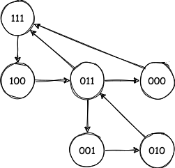

> 模仿 [big-react](https://github.com/BetaSu/big-react)，使用 Rust 和 WebAssembly，从零实现 React v18 的核心功能。深入理解 React 源码的同时，还锻炼了 Rust 的技能，简直赢麻了！
>
> 代码地址：https://github.com/ParadeTo/big-react-wasm
>
> 本文对应 tag：[v19](https://github.com/ParadeTo/big-react-wasm/tree/v19)

React 中有两种优化策略，分别叫做 bailout 和 eagerState。所谓 bailout，就是在更新过程中，当满足某些条件时，跳过当前 FiberNode 或其子孙节点，或者两者兼有的 reconciler 过程。而 eagerState 则是在更新 state 时，若满足某些条件，直接不触发更新。下面，我们通过一个例子来说明（react 版本为 18.2.0）：

```js
function Child({num}) {
  console.log('Child render')
  return <div>Child {num}</div>
}

function Parent() {
  console.log('Parent render')
  const [num, setNum] = useState(1)
  return (
    <div onClick={() => setNum(2)}>
      Parent {num}
      <Child num={num} />
    </div>
  )
}

export default function App() {
  console.log('App render')
  return (
    <div>
      App
      <Parent />
    </div>
  )
}
```

1 首次渲染，控制台打印输出：

```
App render
Parent render
Child render
```

2 第一次点击，控制台打印输出：

```
Parent render
Child render
```

3 第二次点击，控制台打印输出：

```
Parent render
```

4 第三次点击，控制台没有任何输出

我们来简单分析下：

- 首次渲染，都打印，这个自然不用多说。

- 第一次点击时，App 组件即没有 props 的变化，又没有触发更新任务，不打印 App render 是合理的。Parent 触发了更新 (1->2)，打印 Parent render，合理。Child 的 props 发生变化，打印 Child render，也合理。

- 第二次点击时，Parent 虽然触发了更新，但是前后 state 并没有发生变化，貌似不应该打印 Parent render，此为第一个疑点。而且既然 Parent 组件重新执行了，那意外着 Parent 组件下的 ReactElement 也都重新创建了一遍，那 Child 的新旧 props 应该是不同的，那为什么 Child render 没打印？此为第二个疑点。

- 第三次点击时，Parent 虽然触发了更新，但是前后 state 并没有发生变化，不应该 Parent render，也不打印 Child render，合理。

对于疑点一，其实这反映了 react 的优化做得还不够彻底，详情请见[这篇文章](https://mp.weixin.qq.com/s/zbDW3pBj-w9m59o_4SIfZA)。

对于疑点二，下面会说明。

接下来我们来简单介绍下，如何实现这两个优化，本次改动详见[这里](https://github.com/ParadeTo/big-react-wasm/pull/19/files)。

# bailout

实现之前，我们先来想想，一个 FiberNode 什么时候可以跳过 reconciler 流程呢？仔细思考下，应该需要满足以下几种情况：

- 这个节点的 `props` 且 `type` 没变
- 这个节点上面的更新优先级小于此次更新优先级
- 没有使用 `Context`
- 开发者没有使用 `shouldComponentUpdate` 或 `React.memo` 来进行跳过

由于我们的 big react wasm 还没有实现后两者，所以接下来我们暂时只讨论前面两种情况。

我们需要在 `begin_work` 的最前面加入 bailout 的逻辑，代码如下：

```rust
...
unsafe {
    DID_RECEIVE_UPDATE = false;
};
let current = work_in_progress.borrow().alternate.clone();

if current.is_some() {
    let current = current.unwrap();
    let old_props = current.borrow().memoized_props.clone();
    let old_type = current.borrow()._type.clone();
    let new_props = work_in_progress.borrow().pending_props.clone();
    let new_type = work_in_progress.borrow()._type.clone();
    // Condition 1
    if !Object::is(&old_props, &new_props) || !Object::is(&old_type, &new_type) {
        unsafe { DID_RECEIVE_UPDATE = true }
    } else {
        // Condition 2
        let has_scheduled_update_or_context =
            check_scheduled_update_or_context(current.clone(), render_lane.clone());

        if !has_scheduled_update_or_context {
            unsafe { DID_RECEIVE_UPDATE = false }
            return Ok(bailout_on_already_finished_work(
                work_in_progress,
                render_lane,
            ));
        }
    }
}

work_in_progress.borrow_mut().lanes = Lane::NoLane;
...
```

```rust
fn check_scheduled_update_or_context(current: Rc<RefCell<FiberNode>>, render_lane: Lane) -> bool {
    let update_lanes = current.borrow().lanes.clone();
    if include_some_lanes(update_lanes, render_lane) {
        return true;
    }
    // TODO Context
    false
}
```

并且，当这个 FiberNode 命中 bailout 策略时，如果子节点中也没有满足此次更新的优先级的节点，则以当前 FiberNode 为根的整颗子树也可以跳过：

```rust
fn bailout_on_already_finished_work(
    wip: Rc<RefCell<FiberNode>>,
    render_lane: Lane,
) -> Option<Rc<RefCell<FiberNode>>> {

    if !include_some_lanes(wip.borrow().child_lanes.clone(), render_lane) {
        if is_dev() {
            log!("bailout the whole subtree {:?}", wip);
        }
        return None;
    }
    if is_dev() {
        log!("bailout current fiber {:?}", wip);
    }
    clone_child_fiblers(wip.clone());
    wip.borrow().child.clone()
}
```

这里的 `child_lanes` 是某个 FiberNode 节点的所有子孙节点的 `lanes` 的合集，如下所示：



当某个节点触发更新时，会一路向上冒泡更新其祖先的 `child_lanes`。

前面说过了，bailout 策略有三种场景：跳过当前 FiberNode，跳过当前 FiberNode 及其子孙节点，跳过子孙节点。这里已经介绍了跳过当前 FiberNode 和跳过当前 FiberNode 及其子孙节点两种场景，那么第三种情况什么时候会发生呢？其实这也是上文说的第二个疑点的答案。答案就在 `update_function_component`：

```rust
fn update_function_component(
    work_in_progress: Rc<RefCell<FiberNode>>,
    render_lane: Lane,
) -> Result<Option<Rc<RefCell<FiberNode>>>, JsValue> {
    let next_children = render_with_hooks(work_in_progress.clone(), render_lane.clone())?;

    let current = work_in_progress.borrow().alternate.clone();
    if current.is_some() && unsafe { !DID_RECEIVE_UPDATE } {
        bailout_hook(work_in_progress.clone(), render_lane.clone());
        return Ok(bailout_on_already_finished_work(
            work_in_progress,
            render_lane,
        ));
    }

    reconcile_children(work_in_progress.clone(), Some(next_children));
    Ok(work_in_progress.clone().borrow().child.clone())
}
```

这里会先去执行一次当前 FiberNode 节点对应的组件代码，只有发现某个 state 更新前后的值不一样，才会将 `DID_RECEIVE_UPDATE` 设为 `true`：

```rust
// filber_hooks.rs
...
if !Object::is(&ms_value, &ps_value) {
    mark_wip_received_update();
}
...
```

```rust
// begin_work.rs
static mut DID_RECEIVE_UPDATE: bool = false;

pub fn mark_wip_received_update() {
    unsafe { DID_RECEIVE_UPDATE = true };
}

```

那如果都一样，则可以进入 `bailout_on_already_finished_work` 的逻辑了。

这样就解释了疑点二，虽然 Parent 意外的重新 Render 了，但是通过这一层额外的保障，不至于让影响面扩大。

# eagerState

eagerState 实现起来相对简单一点，当在 `dispatch_set_state` 时，如果 WIP 和 Current 上的更新优先级都为 NoLane，以及更新前后 state 的值相等，则可以直接不触发更新：

```rust
fn dispatch_set_state(
    fiber: Rc<RefCell<FiberNode>>,
    update_queue: Rc<RefCell<UpdateQueue>>,
    action: &JsValue,
) {
    let lane = request_update_lane();
    let mut update = create_update(action.clone(), lane.clone());
    let current = { fiber.borrow().alternate.clone() };

    if fiber.borrow().lanes == Lane::NoLane
        && (current.is_none() || current.unwrap().borrow().lanes == Lane::NoLane)
    {
        let current_state = update_queue.borrow().last_rendered_state.clone();
        if current_state.is_none() {
            panic!("current state is none")
        }
        let current_state = current_state.unwrap();
        let eager_state = basic_state_reducer(&current_state, &action);
        // if not ok, the update will be handled in render phase, means the error will be handled in render phase
        if eager_state.is_ok() {
            let eager_state = eager_state.unwrap();
            update.has_eager_state = true;
            update.eager_state = Some(eager_state.clone());
            if Object::is(&current_state, &eager_state) {
                enqueue_update(update_queue.clone(), update, fiber.clone(), Lane::NoLane);
                if is_dev() {
                    log!("Hit eager state")
                }
                return;
            }
        }
    }
    ...
}
```

[这篇文章](https://mp.weixin.qq.com/s/zbDW3pBj-w9m59o_4SIfZA) 总结了 react 优化没有彻底的原因是因为 react 中存在两棵 FiberNode 树，点击时只清除了某一棵树上的“更新标记”，所以需要多执行一次才能保证两棵树上的“更新标记”都清除了。所以如果多加一句代码到这，就可以达到彻底优化的效果了：

```rust
pub fn begin_work(
    work_in_progress: Rc<RefCell<FiberNode>>,
    render_lane: Lane,
) -> Result<Option<Rc<RefCell<FiberNode>>>, JsValue> {
...
work_in_progress.borrow_mut().lanes = Lane::NoLane;
+ if current.is_some() {
+     let current = current.clone().unwrap();
+     current.borrow_mut().lanes = Lane::NoLane;
+ }
...
}
```
