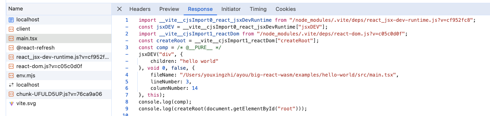
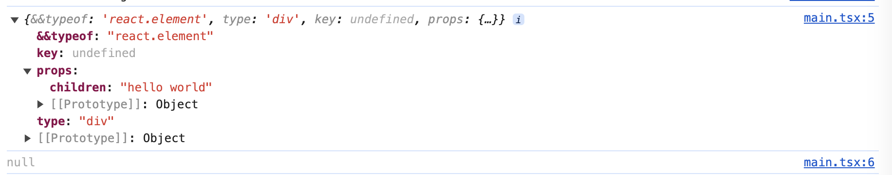
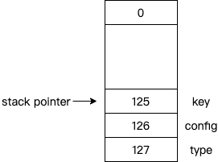
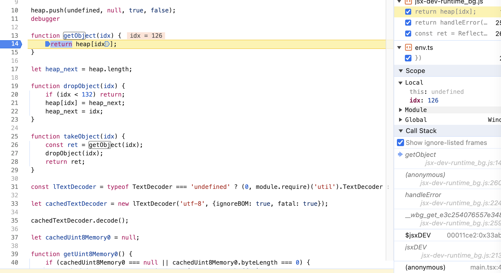
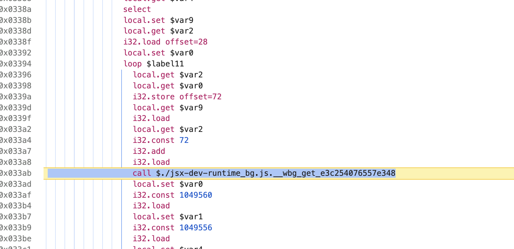
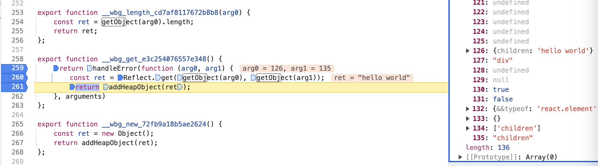

> 模仿 [big-react](https://github.com/BetaSu/big-react)，使用 Rust 和 WebAssembly，从零实现 React v18 的核心功能。深入理解 React 源码的同时，还锻炼了 Rust 的技能，简直赢麻了！
>
> 代码地址：https://github.com/ParadeTo/big-react-wasm
>
> 本文对应 tag：[v2](https://github.com/ParadeTo/big-react-wasm/tree/v2)

> Based on [big-react](https://github.com/BetaSu/big-react)，I am going to implement React v18 core features from scratch using WASM and Rust.
>
> Code Repository：https://github.com/ParadeTo/big-react-wasm
>
> The tag related to this article：[v2](https://github.com/ParadeTo/big-react-wasm/tree/v2)

# 实现 react 库

# Implement react Library

[上篇文章](/2024/04/03/big-react-wasm-1/)我们搭建好了开发调式环境，这次我们来实现 react 这个库。

话不多说，我们还是来看看编译后的代码：

In the previous article, we set up the development debugging environment. This time, we will implement the react library.

Without further ado, let's take a look at the compiled code:



我们暂时只关注传入 `jsxDEV` 的前三个参数，他们分别是：

- `type`，表示 `ReactElement` 的类型，如果是 `HTMLElement` 这里就是它对应的 tag（`string`），如果是用户自定义组件，这里就是 `function`。

- `props`，传给 `ReactElement` 的参数，包括 `children` 也在这里。
- `key`，这个不用多说，大家都知道是啥。

按照这个顺序，我们来定义我们的 `jsx_dev` 函数：

For now, we are only concerned with the first three parameters passed into `jsxDEV`, which are:

- `type`, representing the type of `ReactElement`. If it's an `HTMLElement`, this would be its corresponding tag (`string`). If it's a user-defined component, this would be a `function`.

- `props`, the parameters passed to the `ReactElement`, including `children`.

- `key`, this does not need much explanation, everyone knows what it is.

Following this order, let's define our `jsx_dev` function:

```rust

#[wasm_bindgen(js_name = jsxDEV)]
pub fn jsx_dev(_type: &JsValue, config: &JsValue，key: &JsValue) -> JsValue {

}
```

这里有几个点说明下：

- JsValue 是什么，为什么类型用 JsValue？

JsValue 内部包括了一个 u32 类型的索引，可以通过这个索引来访问 JS 中的对象，详情见文末。

- 为什么返回不是 `ReactElement` 对象？

因为返回的这个 `ReactElement` 对象，最后还是会传给 react-dom，到时候还是只能定义为 `JsValue`，所以这里也没必要了。

实现这个方法也比较简单，把传入的参数转成如下所示的对象即可：

Here are a few points to note:

- What is JsValue, and why is the type JsValue?
  JsValue internally contains a u32 type index, which can be used to access objects in JS. More details can be found at the end of the document.

- Why isn't the return a `ReactElement` object?
  Because this `ReactElement` object will eventually be passed to react-dom, it will still only be defined as `JsValue`. Therefore, there's no need to define it as `ReactElement` here.

Implementing this method is also quite simple, just convert the incoming parameters into an object as shown below:

```
{
  $$typeof: REACT_ELEMENT_TYPE,
  type: type,
  key: key,
  ref: ref,
  props: props,
}
```

代码如下：

The code is as follows:

```rust
use js_sys::{Object, Reflect};
use wasm_bindgen::prelude::*;

use shared::REACT_ELEMENT_TYPE;

#[wasm_bindgen(js_name = jsxDEV)]
pub fn jsx_dev(_type: &JsValue, config: &JsValue, key: &JsValue) -> JsValue {
    // Initialize an empty object
    let react_element = Object::new();
    // Set properties of react_element using Reflect::set
    Reflect::set(
        &react_element,
        &"&&typeof".into(),
        &JsValue::from_str(REACT_ELEMENT_TYPE),
    )
    .expect("$$typeof panic");
    Reflect::set(&react_element, &"type".into(), _type).expect("_type panic");
    Reflect::set(&react_element, &"key".into(), key).expect("key panic");

    // Iterate config and copy every property to props except ref.
    // The ref property will be set to react_element
    let conf = config.dyn_ref::<Object>().unwrap();
    let props = Object::new();
    for prop in Object::keys(conf) {
        let val = Reflect::get(conf, &prop);
        match prop.as_string() {
            None => {}
            Some(k) => {
                if k == "ref" && val.is_ok() {
                    Reflect::set(&react_element, &"ref".into(), &val.unwrap()).expect("ref panic");
                } else if val.is_ok() {
                    Reflect::set(&props, &JsValue::from(k), &val.unwrap()).expect("props panic");
                }
            }
        }
    }

    // Set props of react_element using Reflect::set
    Reflect::set(&react_element, &"props".into(), &props).expect("props panic");
    // Convert Object into JsValue
    react_element.into()
}

```

为了简单起见，`REACT_ELEMENT_TYPE` 我们没有用 `Symbol`，而是直接用字符串：

For simplicity, we did not define `REACT_ELEMENT_TYPE` as `Symbol`, but `&str`:

```rust
pub static REACT_ELEMENT_TYPE: &str = "react.element";
```

它是定义在 shared 这个项目中的，所以 react 项目中的 `Cargo.toml` 文件还需要加入这一段：

It is defined in the shared project, so the `Cargo.toml` file in the react project also needs to add the code as below:

```
[dependencies]
shared = { path = "../shared" }
```

重新构建运行，还是用之前的例子，可以看到如下输出，这样 react 部分就完成了：

Rebuild and run the previous example, you can see the following output, that means the react library is completed:



本文小试牛刀实现了 WASM 版 React18 中的 react 部分，还是比较简单的，接下来就要开始难度升级了。我们知道 React 一次更新流程分为 render 和 commit 两大阶段，所以下一篇我们来实现 render 阶段。

This article has touched on the implementation of the react library of the React18 WASM, which is relatively simple. The difficulty will increase from now on. We know that a single update process in React is divided into two major phases: render and commit. So in the next article, we will implement the render phase.

# 补充：JsValue 原理探究

# Supplement: Exploring the Principles of JsValue

前面简单的讲了下 JsValue，现在我们进一步来研究下其原理。首先我们来看看 `wasm-pack` 打包后的 `jsx-dev-runtime_bg.js` 文件中的代码，我们找到 `jsxDEV` 函数：

Previously, we briefly discussed JsValue. Now, let's delve deeper into its principles. First, let's look at the code in the `jsx-dev-runtime_bg.js` file after packaging with `wasm-pack`. We find the `jsxDEV` function:

```js
export function jsxDEV(_type, config, key) {
  try {
    const ret = wasm.jsxDEV(
      addBorrowedObject(_type),
      addBorrowedObject(config),
      addBorrowedObject(key)
    )
    return takeObject(ret)
  } finally {
    heap[stack_pointer++] = undefined
    heap[stack_pointer++] = undefined
    heap[stack_pointer++] = undefined
  }
}
```

传入的参数都被 `addBorrowedObject` 这个方法处理过，那么继续来看看它：

The parameters passed in are all processed by the `addBorrowedObject` method, so let's continue to look into it:

```js
const heap = new Array(128).fill(undefined);

heap.push(undefined, null, true, false);
let stack_pointer = 128;
...
function addBorrowedObject(obj) {
  if (stack_pointer == 1) throw new Error('out of js stack')
  heap[--stack_pointer] = obj
  return stack_pointer
}
```

哦，原来是在 JS 这边通过 `Array` 模拟了一个堆结构，把参数都存到了这个堆上，上面三个参数会按如下方式存放：

Oh, it turns out that on the JS side, an array is used to simulate a heap structure, and the parameters are all stored on this heap. The three parameters are stored in the following way:



而真正传入 `wasm.jsxDEV` 中的竟然只是数组的下标而已。那 WASM 这边是怎么通过这个索引获取到真正的对象的呢？比如，这个代码 `Reflect::get(conf, &prop);` 是怎么工作的呢？

仔细想想，既然数据还在 JS 这边，传给 WASM 的只是索引，那必然 JS 这边还必须提供一些接口给 WASM 那边调用才行。我们继续看 `jsx-dev-runtime_bg.js` 中的代码，发现有一个 `getObject(idx)` 的方法，他的作用是通过索引来获取堆中的数据：

And what's actually passed into wasm.jsxDEV is just the index of the array. So, how does the WASM side obtain the actual object through this index? For example, how does this code Reflect::get(conf, &prop); work?

If you think about it carefully, since the data is still on the JS side and only the index is passed to WASM, it's necessary that the JS side must also provide some interfaces for the WASM side to call. Continuing to look at the code in jsx-dev-runtime_bg.js, we find a method getObject(idx), which is used to retrieve data from the heap through an index:

```js
function getObject(idx) {
  return heap[idx]
}
```

那我们在这个函数打个断点，不断下一步，直到来到这样一个调用栈：

So, let's set a breakpoint in this function and continue stepping through until we reach a call stack like this:



WASM 中显示调用了 `__wbg_get_e3c254076557e348` 这个方法：

In WASM, it shows that the method `__wbg_get_e3c254076557e348` was called:



`__wbg_get_e3c254076557e348` 这个方法在 `jsx-dev-runtime_bg.js` 可以找到：

The method `__wbg_get_e3c254076557e348` can be found in `jsx-dev-runtime_bg.js`:

```js
export function __wbg_get_e3c254076557e348() {
  return handleError(function (arg0, arg1) {
    const ret = Reflect.get(getObject(arg0), getObject(arg1))
    return addHeapObject(ret)
  }, arguments)
}
```

此时，相关的数据如图所示：

At this point, the related data is as shown in the figure:



相当于是在执行 Rust 代码中的这一步：

This corresponds to the execution of this step in the Rust code:

```rust
let val = Reflect::get(conf, &prop); // prop 为 children
```

到此，真相大白。

At this point, the truth is revealed.
