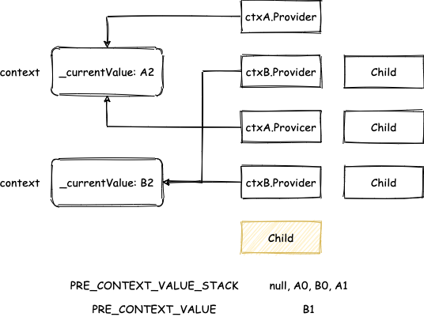
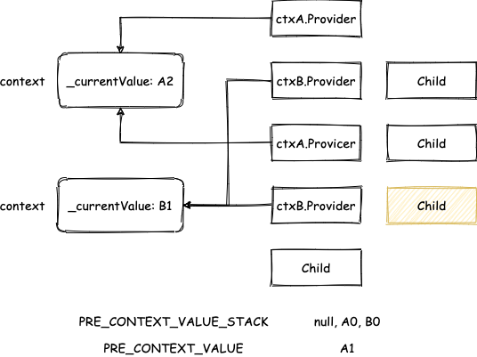
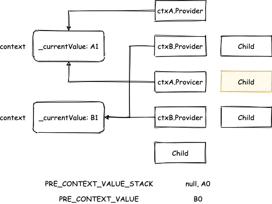
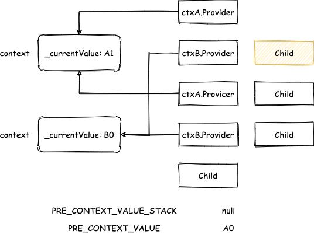

> 模仿 [big-react](https://github.com/BetaSu/big-react)，使用 Rust 和 WebAssembly，从零实现 React v18 的核心功能。深入理解 React 源码的同时，还锻炼了 Rust 的技能，简直赢麻了！
>
> 代码地址：https://github.com/ParadeTo/big-react-wasm
>
> 本文对应 tag：[v20](https://github.com/ParadeTo/big-react-wasm/tree/v20)

> Based on [big-react](https://github.com/BetaSu/big-react)，I am going to implement React v18 core features from scratch using WASM and Rust.
>
> Code Repository：https://github.com/ParadeTo/big-react-wasm
>
> The tag related to this article：[v20](https://github.com/ParadeTo/big-react-wasm/tree/v20)

Context 也是 React 中非常重要的一个特性，所以我们的 WASM 版也得安排上。回想下，我们平时一般都会这样来使用 Context：

```js
import {createContext, useContext} from 'react'

const ctx = createContext('A')

export default function App() {
  return (
    <ctxA.Provider value={'B'}>
      <Cpn />
    </ctxA.Provider>
  )
}

function Cpn() {
  const value = useContext(ctx)
  return <div>{value}</div>
}
```

所以，我们需要先从 react 库中导出两个方法：

```rust
#[wasm_bindgen(js_name = useContext)]
pub unsafe fn use_context(context: &JsValue) -> Result<JsValue, JsValue> {
  ...
}

#[wasm_bindgen(js_name = createContext)]
pub unsafe fn create_context(default_value: &JsValue) -> JsValue {
    let context = Object::new();
    Reflect::set(
        &context,
        &"$$typeof".into(),
        &JsValue::from_str(REACT_CONTEXT_TYPE),
    );
    Reflect::set(&context, &"_currentValue".into(), default_value);
    let provider = Object::new();
    Reflect::set(
        &provider,
        &"$$typeof".into(),
        &JsValue::from_str(REACT_PROVIDER_TYPE),
    );
    Reflect::set(&provider, &"_context".into(), &context);
    Reflect::set(&context, &"Provider".into(), &provider);
    context.into()
}
```

其中，`create_context` 中的代码翻译成 JS，是下面这样：

```js
const context {
  $$typeof: REACT_CONTEXT_TYPE,
  Provider: null,
  _currentValue: defaultValue,
}
context.Provider = {
  $$typeof: REACT_PROVIDER_TYPE,
  _context: context,
}
return context
```

可见，`ctxA.Provider` 是一种新的 `FiberNode` 类型，我们需要新增分支进行处理，按照流程顺序，首先是 `begin_work`：

```rust
fn update_context_provider(
    work_in_progress: Rc<RefCell<FiberNode>>,
) -> Option<Rc<RefCell<FiberNode>>> {
    let provider_type = { work_in_progress.borrow()._type.clone() };
    let context = derive_from_js_value(&provider_type, "_context");
    let new_props = { work_in_progress.borrow().pending_props.clone() };
    push_provider(&context, derive_from_js_value(&new_props, "value"));
    let next_children = derive_from_js_value(&new_props, "children");
    reconcile_children(work_in_progress.clone(), Some(next_children));
    work_in_progress.clone().borrow().child.clone()
}
```

这里难以理解的是 `push_provider`：

```rust
static mut PREV_CONTEXT_VALUE: JsValue = JsValue::null();
static mut PREV_CONTEXT_VALUE_STACK: Vec<JsValue> = vec![];

pub fn push_provider(context: &JsValue, new_value: JsValue) {
    unsafe {
        PREV_CONTEXT_VALUE_STACK.push(PREV_CONTEXT_VALUE.clone());
        PREV_CONTEXT_VALUE = Reflect::get(context, &"_currentValue".into()).unwrap();
        Reflect::set(context, &"_currentValue".into(), &new_value);
    }
}
```

与之对应的，还有一个 `pop_provider`：

```rust
pub fn pop_provider(context: &JsValue) {
    unsafe {
        Reflect::set(context, &"_currentValue".into(), &PREV_CONTEXT_VALUE);
        let top = PREV_CONTEXT_VALUE_STACK.pop();
        if top.is_none() {
            PREV_CONTEXT_VALUE = JsValue::null();
        } else {
            PREV_CONTEXT_VALUE = top.unwrap();
        }
    }
}
```

它会在 `complete_work` 中调用：

```rust
WorkTag::ContextProvider => {
  let _type = { work_in_progress.borrow()._type.clone() };
  let context = derive_from_js_value(&_type, "_context");
  pop_provider(&context);
  self.bubble_properties(work_in_progress.clone());
  None
}
```

我们通过下面这个例子来搞清楚这部分代码：

```js
const ctxA = createContext('A0')
const ctxB = createContext('B0')

export default function App() {
  return (
    <ctxA.Provider value='A1'>
      <ctxB.Provider value='B1'>
        <ctxA.Provider value='A2'>
          <ctxB.Provider value='B2'>
            <Child />
          </ctxB.Provider>
          <Child />
        </ctxA.Provider>
        <Child />
      </ctxB.Provider>
      <Child />
    </ctxA.Provider>
  )
}

function Child() {
  const a = useContext(ctxA)
  const b = useContext(ctxB)
  return (
    <div>
      A: {a} B: {b}
    </div>
  )
}
```

上述例子结果显而易见，应该是：

```
A: A2 B: B2
A: A2 B: B1
A: A1 B: B1
A: A1 B: B0
```

我们来分析一下，根据流程，当 `begin_work` 执行到最底层的 `Child` 时，此时经过了四次 `push_provider`，`FiberNode` 状态如下：



到了第三层的 `Child` 时，会执行一次 `pop_provider`，状态如下：



到了第二层的 `Child` 时，再执行一次 `pop_provider`，状态如下：



到了第一层的 `Child` 时，最后执行一次 `pop_provider`，状态如下：



这里不好理解的原因在于它把多个 Context 的值都存到一个 stack 里面了，可以对着这个例子多看几遍。

理解了这个，Context 的基本流程就介绍差不多了。不过还有一个 `useContext`，它也很简单，按照之前其他 Hooks 的流程添加相关代码即可，最后的核心是 `fiber_hooks` 中的 `read_context` 方法：

```rust
fn read_context(context: JsValue) -> JsValue {
  let consumer = unsafe { CURRENTLY_RENDERING_FIBER.clone() };
  if consumer.is_none() {
      panic!("Can only call useContext in Function Component");
  }
  let value = derive_from_js_value(&context, "_currentValue");
  value
}
```

这样，上面的例子就可以跑起来了，本次更新详见[这里](https://github.com/ParadeTo/big-react-wasm/pull/20/files#diff-31401af59fde9c70273d07c510a6fdeb5c5c68541f5c099b2b24d896dc2fd393)。

不过，目前的 Context 还不够完善，一旦它跟性能优化相关的特性结合起来使用，就会有问题了，比如下面这个例子：

```js
const ctx = createContext(0)

export default function App() {
  const [num, update] = useState(0)
  const memoChild = useMemo(() => {
    return <Child />
  }, [])
  console.log('App render ', num)
  return (
    <ctx.Provider value={num}>
      <div
        onClick={() => {
          update(1)
        }}>
        {memoChild}
      </div>
    </ctx.Provider>
  )
}

function Child() {
  console.log('Child render')
  const val = useContext(ctx)

  return <div>ctx: {val}</div>
}
```

点击后 `Child` 组件不会重新渲染，页面没有得到更新。原因在于 `Child` 命中了 `bailout` 策略，但其实 `Child` 中使用了 context，而 context 的值发生了变化，`Child` 应该重新渲染才对，这个问题就留到下篇文章再解决吧。
