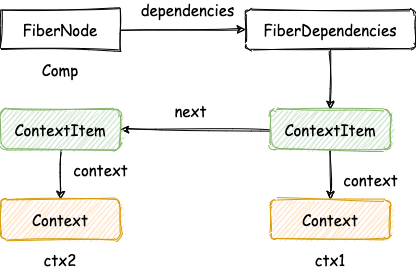
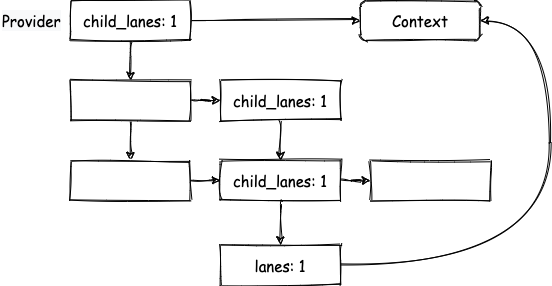
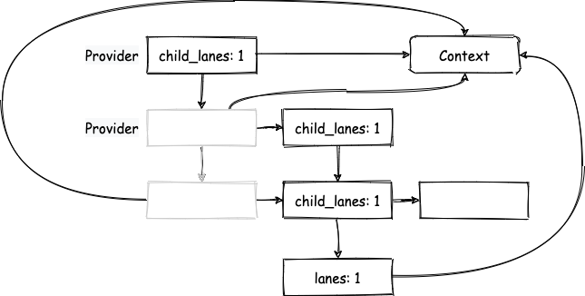

上篇文章实现了 Context，但是无法跟性能优化相关的特性结合起来，这篇文章我们来解决这个问题。还是用之前的例子：

```js
const ctx = createContext(0)

export default function App() {
  const [num, update] = useState(0)
  const memoChild = useMemo(() => {
    return <Child />
  }, [])
  console.log('App render ', num)
  return (
    <ctx.Provider value={num}>
      <div
        onClick={() => {
          update(1)
        }}>
        {memoChild}
      </div>
    </ctx.Provider>
  )
}

function Child() {
  console.log('Child render')
  const val = useContext(ctx)

  return <div>ctx: {val}</div>
}
```

点击后 `Child` 组件不会重新渲染，页面没有得到更新。原因在于 `Child` 命中了 `bailout` 策略，但其实 `Child` 中使用了 context，也可以说是 `Child` 依赖 ctx 这个 Context。所以，我们需要在 `FiberNode` 中新增一个字段保存所依赖的 Context：

```rust
#[derive(Clone, Debug)]
pub struct ContextItem {
    context: JsValue,
    memoized_state: JsValue,
    next: Option<Rc<RefCell<ContextItem>>>,
}

pub struct FiberDependencies {
    pub first_context: Option<Rc<RefCell<ContextItem>>>,
    pub lanes: Lane,
}
...
pub struct FiberNode {
  ...
  pub dependencies: Option<Rc<RefCell<FiberDependencies>>>,
  ...
}
```

什么时候更新这个字段呢？当然是在调用 `useContext` 的时候，也就是 `fiber_hooks` 中的 `read_context`：

```rust
// fiber_hooks.rs
use crate::fiber_context::read_context as read_context_origin;
...
fn read_context(context: JsValue) -> JsValue {
    let consumer = unsafe { CURRENTLY_RENDERING_FIBER.clone() };
    read_context_origin(consumer, context)
}

// fiber_context.rs
pub fn read_context(consumer: Option<Rc<RefCell<FiberNode>>>, context: JsValue) -> JsValue {
    if consumer.is_none() {
        panic!("Can only call useContext in Function Component");
    }
    let consumer = consumer.unwrap();
    let value = derive_from_js_value(&context, "_currentValue");

    let context_item = Rc::new(RefCell::new(ContextItem {
        context,
        next: None,
        memoized_state: value.clone(),
    }));

    if unsafe { LAST_CONTEXT_DEP.is_none() } {
        unsafe { LAST_CONTEXT_DEP = Some(context_item.clone()) };
        consumer.borrow_mut().dependencies = Some(Rc::new(RefCell::new(FiberDependencies {
            first_context: Some(context_item),
            lanes: Lane::NoLane,
        })));
    } else {
        let next = Some(context_item.clone());
        unsafe {
            LAST_CONTEXT_DEP.clone().unwrap().borrow_mut().next = next.clone();
            LAST_CONTEXT_DEP = next;
        }
    }
    value
}
```

这个函数会把当前 `FiberNode` 所依赖的 Context 都添加到一个链表上面，然后挂载到 `dependencies` 属性上，比如下面的例子：

```js
function App() {
  const value1 = useContext(ctx1)
  const value2 = useContext(ctx2)
}
```

会形成如下的数据结构：



接下来，还是按照更新流程介绍，首先是 begin work，我们需要修改 `update_context_provider`，其中最重要的是下面这一句：

```rust
propagate_context_change(work_in_progress.clone(), context, render_lane);
```

从函数名可以看到，应该是要通知依赖该 Context 的其他 `FiberNode`，它的值已经发生了变化。具体来说，`propagate_context_change` 中会按照深度优先的方式从子树中查找依赖该 Context 的 `FiberNode`，将 `render_lane` 加入其 `lanes` 中，以及它的祖先（到 Context 的 Provider 截止）的 `child_lanes` 中，如图所示：



遍历过程中如果遇到了同一个 Context 的 Provider，会跳过它以及以他为根的子树，如图所示：



原因是 Context 有就近原则，比如下面这个例子，`Child` 中的 ctx 值来自最靠近它的祖先节点，所以外层 `Provider` 值的变化对其没有影响：

```js
function App() {
  return (
    <ctx.Provider value='a'>
      <ctx.Provider value='b'>
        <div>
          <Child />
        </div>
      </ctx.Provider>
    </ctx.Provider>
  )
}
```

这样，当 begin work 执行到这些 `FiberNode` 时，由于 `child_lanes` 中包含了 `render_lane`，所以只会跳过他们本身，最后仍会到达依赖 Context 的那个 `FiberNode`，而它的 `lanes` 中包含了 `render_lane`，所以对应的组件会重新渲染，执行 `useContext`，得到新的值。

现在文章开头的例子就可以正常工作了，本次改动详见[这里](https://github.com/ParadeTo/big-react-wasm/pull/21)。
