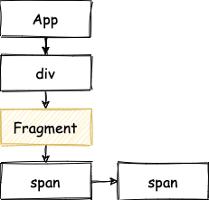

> 模仿 [big-react](https://github.com/BetaSu/big-react)，使用 Rust 和 WebAssembly，从零实现 React v18 的核心功能。深入理解 React 源码的同时，还锻炼了 Rust 的技能，简直赢麻了！
>
> 代码地址：https://github.com/ParadeTo/big-react-wasm
>
> 本文对应 tag：[v23](https://github.com/ParadeTo/big-react-wasm/tree/v23)

> Based on [big-react](https://github.com/BetaSu/big-react)，I am going to implement React v18 core features from scratch using WASM and Rust.
>
> Code Repository：https://github.com/ParadeTo/big-react-wasm
>
> The tag related to this article：[v23](https://github.com/ParadeTo/big-react-wasm/tree/v23)

Fragment 也是 react 中一个基本的功能，所以 WASM 版本也得支持才行。不过我们先来修复几个比较严重的 Bug。

Fragment is also a basic feature in React, so the WASM version needs to support it as well. But first, let's fix a few critical bugs.

Bug 1：下面的例子，只有第一次点击会有效果（更新为 1），之后都保持 1 不变。

Bug 1: In the following example, only the first click has an effect (updates to 1), and subsequent clicks keep it at 1.

```js
function App() {
  const [num, setNum] = useState(0)
  return <div onClick={() => setNum((prev) => prev + 1)}>{num}</div>
}
```

原因在于 `update_queue.rs` 更新 `new_base_state` 有问题，需要按如下所示进行修改：

The issue lies in the update of `new_base_state` in `update_queue.rs`. It needs to be modified as follows:

```rust
-   new_base_state = result.memoized_state.clone();
+   new_base_state = new_state.clone();
```

上面的 Bug 修复后，仍然会有问题，还是跟 `useState` 相关。

After fixing the above bug, there is still an issue related to `useState`.

Bug 2: 下面的例子，只有第一次点击会有效果（更新为 1），之后都保持 1 不变。

Bug 2: In the following example, only the first click has an effect (updates to 1), and subsequent clicks keep it at 1.

```js
function App() {
  const [num, setNum] = useState(0)
  return <div onClick={() => setNum(num + 1)}>{num}</div>
}
```

经过一番定位后，发现 `onClick` 函数中的 `num` 永远都为 0，即使第一次点击后 `num` 已经为 1 了，根本原因在于 `div` 的 `onClick` 引用的一直都是第一次渲染时传入的那个函数，其闭包捕获的 `num` 也是首次渲染时的 0。

After investigation, it was found that the `num` inside the `onClick` function always remains 0, even after the first click when `num` should be 1. The root cause is that the `onClick` of the `div` always references the function passed during the initial rendering, and the captured closure's `num` is also the initial 0.

翻看代码，发现我们漏了对于 `HostComponent` 这类 `FiberNode` 的 props 的更新逻辑，之前都只处理了 `HostText` 类型，接下来让我们补上这一块。

Upon reviewing the code, it was discovered that we missed the update logic for `props` of `HostComponent` type `FiberNode`. We only handled the `HostText` type before. Let's fill in this part.

首先，我们重新定义一下 `HostConfig`，去掉 `commit_text_update`，新增 `commit_update`：

First, let's redefine `HostConfig` by removing `commit_text_update` and adding `commit_update`:

```rust
-    fn commit_text_update(&self, text_instance: Rc<dyn Any>, content: &JsValue);
+    fn commit_update(&self, fiber: Rc<RefCell<FiberNode>>);
```

然后在 `react-dom` 库中重新实现这个 Trait：

Then, implement this trait in the `react-dom` library as follows:

```rust
fn commit_update(&self, fiber: Rc<RefCell<FiberNode>>) {
  let instance = FiberNode::derive_state_node(fiber.clone());
  let memoized_props = fiber.borrow().memoized_props.clone();
  match fiber.borrow().tag {
      WorkTag::HostText => {
          let text = derive_from_js_value(&memoized_props, "content");
          self.commit_text_update(instance.unwrap(), &text);
      }
      WorkTag::HostComponent => {
          update_fiber_props(
              instance
                  .unwrap()
                  .downcast::<Node>()
                  .unwrap()
                  .dyn_ref::<Element>()
                  .unwrap(),
              &memoized_props,
          );
      }
      _ => {
          log!("Unsupported update type")
      }
  };
}
```

这里的 `update_fiber_props` 之前就有了，作用就是把最新的 `props` 更新到 `FiberNode` 对应的 `Element` 上面。

Here, `update_fiber_props` already exists, and its purpose is to update the latest `props` onto the corresponding `Element` of the `FiberNode`.

然后，在 `complete_work.rs` 中新增如下代码：

Next, add the following code in `complete_work.rs`:

```rust
WorkTag::HostComponent => {
        if current.is_some() && work_in_progress_cloned.borrow().state_node.is_some() {
          // todo: compare props to decide if need to update
+         CompleteWork::mark_update(work_in_progress.clone());
```

也就是给 `FiberNode` 打上 `Update` 的标记，这里也可以进一步进行优化（对比前后的 props 来决定是否打标记），简单起见先不加了。

This marks the `FiberNode` with the `Update` flag. Further optimization can be done here (comparing the previous and current props to decide whether to mark the update flag), but for simplicity, let's skip it for now.

最后，修改 `commit_work.rs` 中对于 `Update` 的处理：

Finally, modify the handling of `Update` in `commit_work.rs`:

```rust
if flags.contains(Flags::Update) {
  unsafe {
      HOST_CONFIG
          .as_ref()
          .unwrap()
          .commit_update(finished_work.clone())
  }
  finished_work.borrow_mut().flags -= Flags::Update;
}
```

Bug 修复的 PR 见[这里](https://github.com/ParadeTo/big-react-wasm/pull/24)。修复完毕，接下来实现 `Fragment`。

The PR for fixing the bugs can be found [here](https://github.com/ParadeTo/big-react-wasm/pull/24). With the bug fixes completed, let's proceed to implement `Fragment`.

首先，`Fragment` 是从 `react` 中导出的一个常量，但是在 Rust 中，当我们尝试下面这样写时，会报错 "#[wasm_bindgen] can only be applied to a function, struct, enum, impl, or extern block"：

First, `Fragment` is exported as a constant from `react`. However, when we try to write it as follows in Rust, an error occurs: "#[wasm_bindgen] can only be applied to a function, struct, enum, impl, or extern block":

```rust
#[wasm_bindgen]
pub static Fragment: &str = "react.fragment";
```

看来是不支持从 rust 导出字符串给 JS，那我们只能继续通过构建脚本来修改编译后的产物了，即在最终输出的 JS 文件中加上导出 `Fragment` 的代码。

It seems that exporting strings from Rust to JavaScript is not supported. Therefore, we need to continue modifying the compiled output through the build script, specifically by adding the code to export `Fragment` in the final JS file.

```js
// add Fragment
const reactIndexFilename = `${cwd}/dist/react/jsx-dev-runtime.js`
const reactIndexData = fs.readFileSync(reactIndexFilename)
fs.writeFileSync(
  reactIndexFilename,
  reactIndexData + `export const Fragment='react.fragment';\n`
)
const reactTsIndexFilename = `${cwd}/dist/react/jsx-dev-runtime.d.ts`
const reactTsIndexData = fs.readFileSync(reactTsIndexFilename)
fs.writeFileSync(
  reactTsIndexFilename,
  reactTsIndexData + `export const Fragment: string;\n`
)
```

接着，需要在 `fiber.rs` 中新增一个 `create_fiber_from_fragment` 的方法：

Next, we need to add a method `create_fiber_from_fragment` in `fiber.rs`:

```rust
pub fn create_fiber_from_fragment(elements: JsValue, key: JsValue) -> FiberNode {
  FiberNode::new(WorkTag::Fragment, elements, key, JsValue::null())
}
```

这里的 `elements` 是他的 `children`。

Here, `elements` refers to the `children` of the fragment.

然后，按照流程，需要在 `begin_work.rs` 中新增对于 `Fragment` 的处理：

Then, following the workflow, we need to add handling for `Fragment` in `begin_work.rs`:

```rust
pub fn begin_work(
    work_in_progress: Rc<RefCell<FiberNode>>,
    render_lane: Lane,
) -> Result<Option<Rc<RefCell<FiberNode>>>, JsValue> {
  ...
  return match tag {
    ...
    WorkTag::Fragment => Ok(update_fragment(work_in_progress.clone())),
  };
}

fn update_fragment(work_in_progress: Rc<RefCell<FiberNode>>) -> Option<Rc<RefCell<FiberNode>>> {
    let next_children = work_in_progress.borrow().pending_props.clone();
    reconcile_children(work_in_progress.clone(), Some(next_children));
    work_in_progress.borrow().child.clone()
}
```

在 `reconcile_single_element` 函数中，也需要新增对于 `Fragment` 的处理：

In the `reconcile_single_element` function, we also need to add handling for `Fragment`:

```rust
-    let mut fiber = FiberNode::create_fiber_from_element(element);
+    let mut fiber ;
+    if derive_from_js_value(&element, "type") == REACT_FRAGMENT_TYPE {
+        let props = derive_from_js_value(&element, "props");
+        let children = derive_from_js_value(&props, "children");
+        fiber = FiberNode::create_fiber_from_fragment(children, key);
+    } else {
+        fiber = FiberNode::create_fiber_from_element(element);
+    }
```

这样，我们的 react 就可以支持 `Fragment` 了。

This way, our React implementation can support `Fragment`.

不过，还有一种情况也需要支持，比如：

However, there is another case that needs to be supported, for example:

```js
function App() {
  const arr = [<span>Hello</span>, <span>World</span>]
  return <div>{arr}</div>
}
```

上面的例子并没有显示的使用 `Fragment`，但我们处理的时候得加一层，即：

In the above example, `Fragment` is not explicitly used, but we still need to add a layer of handling, as shown below:



这一部分主要涉及到 `child_fiber.rs` 中 `update_from_map` 函数的修改，详情请见[这里](https://github.com/ParadeTo/big-react-wasm/pull/25)。

This mainly involves modifying the `update_from_map` function in `child_fiber.rs`. For more details, please refer to [here](https://github.com/ParadeTo/big-react-wasm/pull/25).
