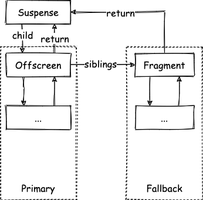
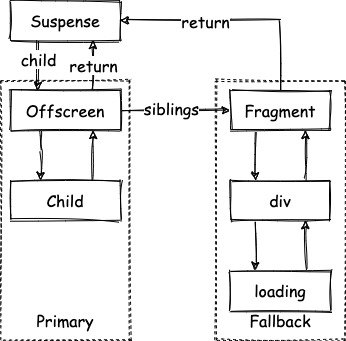

> 模仿 [big-react](https://github.com/BetaSu/big-react)，使用 Rust 和 WebAssembly，从零实现 React v18 的核心功能。深入理解 React 源码的同时，还锻炼了 Rust 的技能，简直赢麻了！
>
> 代码地址：https://github.com/ParadeTo/big-react-wasm
>
> 本文对应 tag：[v24](https://github.com/ParadeTo/big-react-wasm/tree/v24)

> Based on [big-react](https://github.com/BetaSu/big-react)，I am going to implement React v18 core features from scratch using WASM and Rust.
>
> Code Repository：https://github.com/ParadeTo/big-react-wasm
>
> The tag related to this article：[v24](https://github.com/ParadeTo/big-react-wasm/tree/v24)

Suspense 无疑是新版 react 中最吸引人的一个特性，所以我们也来实现一下。本文是第一部分，实现 Suspense 的 Fallback 渲染。

Suspense is undoubtedly one of the most appealing features in the new version of React, so let's implement it ourselves. This article is the first part, focusing on implementing the Fallback rendering of Suspense.

以下面代码为例：

Consider the following code as an example:

```js
import {Suspense} from 'react'

export default function App() {
  return (
    <Suspense fallback={<div>loading</div>}>
      <Child />
    </Suspense>
  )
}

function Child() {
  throw new Promise((resolve) => setTimeout(resolve, 1000))
}
```

对于 `Suspense` 节点来说，他有两条子分支，分别对应 `Primary` 和 `Fallback`，其中 `Primary` 分支的根节点为 `Offscreen` 类型的节点，`Fallback` 分支的根节点为 `Fragment` 类型的节点：

For the `Suspense` node, it has two child branches corresponding to `Primary` and `Fallback`. The root node of the `Primary` branch is of type `Offscreen`, and the root node of the `Fallback` branch is of type `Fragment`:



具体到上面的例子则为：

Specifically, in the example above:



首次渲染时，会进入 Primary 分支，当处理到 `Child` 组件时，由于该组件抛出了 `Promise` 对象，开始进入 `unwind` 流程，该流程会往上找到最近的 `Suspense` 节点，并添加 `DidCapture` 的标记，接着从该节点继续 render 流程。

During the initial render, the code enters the Primary branch. When it reaches the `Child` component, an exception is thrown because the component throws a `Promise` object. This triggers the "unwind" process, which searches for the nearest `Suspense` node and adds the `DidCapture` flag to it, and then continues the render process from that node.

这次因为 `Suspense` 节点上有 `DidCapture` 标记，所以会进入 Fallback 分支，接下来就是正常的 render 和 commit 流程，最终渲染出 Fallback 中的内容。

Since the `Suspense` node has the `DidCapture` flag, the code enters the Fallback branch. The subsequent steps involve the normal render and commit processes, eventually rendering the content within the Fallback.

这就是本次我们要实现的功能，下面来简单过一下代码。

That's the functionality we want to implement. Now let's briefly go through the code.

首先，还是看看 `begin_work.rs`，需要新增对于 `Suspense` 的处理：

First, let's take a look at `begin_work.rs` where we need to add handling for `Suspense`:

```rs
fn update_suspense_component(
    work_in_progress: Rc<RefCell<FiberNode>>,
) -> Option<Rc<RefCell<FiberNode>>> {
    let current = { work_in_progress.borrow().alternate.clone() };
    let next_props = { work_in_progress.borrow().pending_props.clone() };

    let mut show_fallback = false;
    let did_suspend =
        (work_in_progress.borrow().flags.clone() & Flags::DidCapture) != Flags::NoFlags;

    if did_suspend {
        show_fallback = true;
        work_in_progress.borrow_mut().flags -= Flags::DidCapture;
    }

    let next_primary_children = derive_from_js_value(&next_props, "children");
    let next_fallback_children = derive_from_js_value(&next_props, "fallback");
    push_suspense_handler(work_in_progress.clone());

    if current.is_none() {
        if show_fallback {
            return Some(mount_suspense_fallback_children(
                work_in_progress.clone(),
                next_primary_children.clone(),
                next_fallback_children.clone(),
            ));
        } else {
            return Some(mount_suspense_primary_children(
                work_in_progress.clone(),
                next_primary_children.clone(),
            ));
        }
    } else {
        if show_fallback {
            return Some(update_suspense_fallback_children(
                work_in_progress.clone(),
                next_primary_children.clone(),
                next_fallback_children.clone(),
            ));
        } else {
            return Some(update_suspense_primary_children(
                work_in_progress.clone(),
                next_primary_children.clone(),
            ));
        }
    }
}
```

这里，根据当前是否显示 Fallback 以及是否为首次更新分为了四个分支来处理。

Here, we handle four branches based on whether the Fallback is shown and whether it's the first update.

接下来，看看 `work_loop.rs`：

Next, let's look at `work_loop.rs`:

```rs
loop {
  unsafe {
      if WORK_IN_PROGRESS_SUSPENDED_REASON != NOT_SUSPENDED && WORK_IN_PROGRESS.is_some() {
          // unwind process
          ...
      }
  }
  match if should_time_slice {
      work_loop_concurrent()
  } else {
      work_loop_sync()
  } {
      Ok(_) => {
          break;
      }
      Err(e) => handle_throw(root.clone(), e),
  };
}
```

当组件中抛出异常时，会进入 Err 的分支，这里主要是增加了 `handle_throw` 流程，目前比较简单：

When an exception is thrown in the component, it enters the `Err` branch, where we mainly add the `handle_throw` process, which is currently simple:

```rs
fn handle_throw(root: Rc<RefCell<FiberRootNode>>, thrown_value: JsValue) {
    unsafe {
        WORK_IN_PROGRESS_SUSPENDED_REASON = SUSPENDED_ON_DATA;
        WORK_IN_PROGRESS_THROWN_VALUE = Some(thrown_value);
    }
}
```

接着，循环继续，进入 `unwind` 流程：

The loop continues, entering the unwind process:

```rs
loop {
  unsafe {
      if WORK_IN_PROGRESS_SUSPENDED_REASON != NOT_SUSPENDED && WORK_IN_PROGRESS.is_some() {
          let thrown_value = WORK_IN_PROGRESS_THROWN_VALUE.clone().unwrap();

          WORK_IN_PROGRESS_SUSPENDED_REASON = NOT_SUSPENDED;
          WORK_IN_PROGRESS_THROWN_VALUE = None;

          throw_and_unwind_work_loop(
              root.clone(),
              WORK_IN_PROGRESS.clone().unwrap(),
              thrown_value,
              lane.clone(),
          );
      }
  }
  ...
}
```

```rs
fn throw_and_unwind_work_loop(
    root: Rc<RefCell<FiberRootNode>>,
    unit_of_work: Rc<RefCell<FiberNode>>,
    thrown_value: JsValue,
    lane: Lane,
) {
    unwind_unit_of_work(unit_of_work);
}
```

这里的任务就是往上找到最近的 `Suspense` 节点，并标记 `DidCapture`。

The task here is to find the nearest `Suspense` node and mark it with `DidCapture`.

到这我们的任务就完成了，不过为了给下一篇文章多铺点路，我们再来多实现一点功能。

With this, our task is complete. However, to pave the way for the next article, let's implement a bit more functionality.

还是以上面代码为例，首次渲染处理到 `Child` 组件时，应该要捕获到其抛出的 `Promise` 对象，并调用它的 `then` 方法，然后在传入的函数中触发重新渲染的逻辑。

Using the same code example, when the initial render reaches the `Child` component, we should capture the `Promise` object it throws, call its `then` method, and trigger the re-rendering logic in the provided function.

这样，当 `Promise` 对象状态变成 fullfilled 后，会再次进入 render 流程，此时处理到 `Child` 组件仍然会抛出异常，结果就是不停重复上面的流程，不过没关系，我们暂时不处理，因为目前我们还没有实现 `use` hook，暂时只能这样来测试。

This way, when the `Promise` object's state becomes fulfilled, it will re-enter the render process. At this point, if the `Child` component still throws an exception, the same process repeats. However, for now, we won't handle this because we haven't implemented the `use` hook yet. So, this is just a temporary approach for testing.

我们来看看怎么捕获 `Promise` 对象并在对象 `fullfilled` 时，重新开启渲染流程：

Let's see how we can capture the `Promise` object and trigger the re-rendering when it becomes fulfilled:

首先，我们在 `throw_and_unwind_work_loop` 中添加 `throw_exception` 方法：

First, let's add the `throw_exception` method in `throw_and_unwind_work_loop`:

```rs
fn throw_and_unwind_work_loop(
    root: Rc<RefCell<FiberRootNode>>,
    unit_of_work: Rc<RefCell<FiberNode>>,
    thrown_value: JsValue,
    lane: Lane,
) {
    throw_exception(root.clone(), thrown_value, lane.clone());
}

fn attach_ping_listener(root: Rc<RefCell<FiberRootNode>>, wakeable: JsValue, lane: Lane) {
    let then_value = derive_from_js_value(&wakeable, "then");
    let then = then_value.dyn_ref::<Function>().unwrap();
    let closure = Closure::wrap(Box::new(move || {
        root.clone().borrow_mut().mark_root_updated(lane.clone());
        ensure_root_is_scheduled(root.clone());
    }) as Box<dyn Fn()>);
    let ping = closure.as_ref().unchecked_ref::<Function>().clone();
    closure.forget();
    then.call2(&wakeable, &ping, &ping)
        .expect("failed to call then function");
}

pub fn throw_exception(root: Rc<RefCell<FiberRootNode>>, value: JsValue, lane: Lane) {
    if !value.is_null()
        && type_of(&value, "object")
        && derive_from_js_value(&value, "then").is_function()
    {
        let suspense_boundary = get_suspense_handler();
        if suspense_boundary.is_some() {
            let suspense_boundary = suspense_boundary.unwrap();
            suspense_boundary.borrow_mut().flags |= Flags::ShouldCapture;
        }

        attach_ping_listener(root, value, lane)
    }
}
```

其中 `ping` 函数就是传入 `then` 的函数，核心逻辑就是把当前的 `lane` 作为下次更新的优先级，并调用 `ensure_root_is_scheduled` 开启新的更新。不过测试发现，这样还不够，因为 `begin_work.rs` 中性能优化的功能会从根节点开始 bailout 掉这次更新，big-react 也有这个问题（切换到 master 分支并运行 suspense-use 这个例子可以复现，详见 [issue](https://github.com/BetaSu/big-react/issues/67)）。

The `ping` function is the function passed to `then`. The core logic is to set the current `lane` as the priority for the next update and call `ensure_root_is_scheduled` to start a new update. However, it was found during testing that this is not enough because the performance optimization in `begin_work.rs` will bail out the update starting from the root node. This issue also exists in big-react (switch to the master branch and run the "suspense-use" example to reproduce it, see the [issue](https://github.com/BetaSu/big-react/issues/67) for details).

解决这个问题，权宜之计是在 unwind 流程之前，把更新优先级再网上冒泡一次，这样当再次从根节点开始更新时，由于 `subtree_flags` 上的标记，就不会进入 bailout 的流程了。

To solve this problem, a temporary solution is to bubble up the update priority one more time before the unwind process. This way, when the update starts again from the root node, it won't enter the bailout process due to the flags on `subtree_flags`.

```rs
loop {
    unsafe {
        if WORK_IN_PROGRESS_SUSPENDED_REASON != NOT_SUSPENDED && WORK_IN_PROGRESS.is_some() {
            let thrown_value = WORK_IN_PROGRESS_THROWN_VALUE.clone().unwrap();

            WORK_IN_PROGRESS_SUSPENDED_REASON = NOT_SUSPENDED;
            WORK_IN_PROGRESS_THROWN_VALUE = None;


            mark_update_lane_from_fiber_to_root(
                WORK_IN_PROGRESS.clone().unwrap(),
                lane.clone(),
            );

            ...
        }
    }
    ...
}
```

本次更新详见[这里](https://github.com/ParadeTo/big-react-wasm/pull/26)。

You can find the details of this update [here](https://github.com/ParadeTo/big-react-wasm/pull/26).
