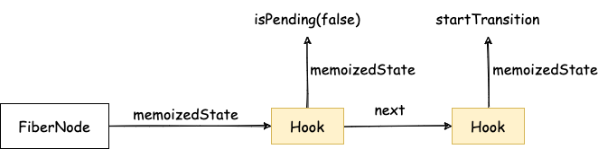
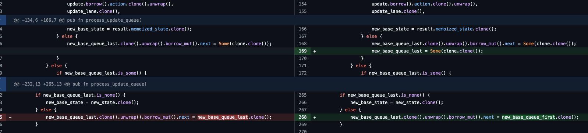

> 模仿 [big-react](https://github.com/BetaSu/big-react)，使用 Rust 和 WebAssembly，从零实现 React v18 的核心功能。深入理解 React 源码的同时，还锻炼了 Rust 的技能，简直赢麻了！
>
> 代码地址：https://github.com/ParadeTo/big-react-wasm
>
> 本文对应 tag：[v27](https://github.com/ParadeTo/big-react-wasm/tree/v27)

`useTransition` 是 React 中一个新推出的 Hook，可以让你在不阻塞 UI 的情况下更新状态。官网这里有个[例子](https://react.dev/reference/react/useTransition#examples)对比了使用它前后的区别，这里也有篇[文章](/2022/04/27/react-transition/)分析了一下原理。接下来我们就来实现一下，本次改动详情见[这里](https://github.com/ParadeTo/big-react-wasm/pull/29)。

我们先按照之前新增 Hook 的流程把相关代码都加上，最后会来到 `fiber_hooks.rs`：

```rust
fn mount_transition() -> Vec<JsValue> {
    let result = mount_state(&JsValue::from(false)).unwrap();
    let is_pending = result[0].as_bool().unwrap();
    let set_pending = result[1].clone().dyn_into::<Function>().unwrap();
    let hook = mount_work_in_progress_hook();
    let set_pending_cloned = set_pending.clone();
    let closure = Closure::wrap(Box::new(move |callback: Function| {
        start_transition(set_pending_cloned.clone(), callback);
    }) as Box<dyn Fn(Function)>);
    let start: Function = closure.as_ref().unchecked_ref::<Function>().clone();
    closure.forget();
    hook.as_ref().unwrap().clone().borrow_mut().memoized_state =
        Some(MemoizedState::MemoizedJsValue(start.clone().into()));
    vec![JsValue::from_bool(is_pending), start.into()]
}
```

`mount_transition` 时，会形成如下的数据结构：



所以 `update_transition` 时，依次取出 Hooks 上面的值即可：

```rust
fn update_transition() -> Vec<JsValue> {
    let result = update_state(&JsValue::undefined()).unwrap();
    let is_pending = result[0].as_bool().unwrap();
    let hook = update_work_in_progress_hook();
    if let MemoizedState::MemoizedJsValue(start) = hook
        .as_ref()
        .unwrap()
        .clone()
        .borrow()
        .memoized_state
        .as_ref()
        .unwrap()
    {
        return vec![JsValue::from_bool(is_pending), start.into()];
    }
    panic!("update_transition")
}
```

关键在于 `startTransition` 的实现：

```rust
fn start_transition(set_pending: Function, callback: Function) {
    set_pending.call1(&JsValue::null(), &JsValue::from_bool(true));
    let prev_transition = unsafe { REACT_CURRENT_BATCH_CONFIG.transition };

    // low priority
    unsafe { REACT_CURRENT_BATCH_CONFIG.transition = Lane::TransitionLane.bits() };
    callback.call0(&JsValue::null());
    set_pending.call1(&JsValue::null(), &JsValue::from_bool(false));

    unsafe { REACT_CURRENT_BATCH_CONFIG.transition = prev_transition };
}
```

根据这篇[文章](/2022/04/27/react-transition/)的分析结果，这里首先以当前优先级将 `isPending` 更新为 `true`。然后降低优先级，执行 `callbak` 并将 `isPending` 更新为 `false`。最后，将优先级恢复为原来的优先级。

降低优先级后的更新流程会使用 Concurrent Mode，这也是不阻塞 UI 的原因：

```rust
if cur_priority == Lane::SyncLane {
  ...
} else {
    if is_dev() {
        log!("Schedule in macrotask, priority {:?}", update_lanes);
    }
    let scheduler_priority = lanes_to_scheduler_priority(cur_priority.clone());
    let closure = Closure::wrap(Box::new(move |did_timeout_js_value: JsValue| {
        let did_timeout = did_timeout_js_value.as_bool().unwrap();
        perform_concurrent_work_on_root(root_cloned.clone(), did_timeout)
    }) as Box<dyn Fn(JsValue) -> JsValue>);
    let function = closure.as_ref().unchecked_ref::<Function>().clone();
    closure.forget();
    new_callback_node = Some(unstable_schedule_callback_no_delay(
        scheduler_priority,
        function,
    ))
}
```

到这，`useTransition` 的实现基本上就完成了，不过实现过程中遇到了几个 bug：

第一个 Bug 在 `begin_work.rs` 中：

```rust
work_in_progress.borrow_mut().lanes = Lane::NoLane;
```

当一个 FiberNode 上有多个 Lane 时，这样会有问题，应该改成：

```rust
work_in_progress.borrow_mut().lanes -= render_lane;
```

即每次只把当前渲染的 Lane 给去掉。

第二个 Bug 在 `work_loop.rs` 中：

```rust
log!("render over {:?}", *root.clone().borrow());
WORK_IN_PROGRESS_ROOT_RENDER_LANE = Lane::NoLane;
```

原来这一句是在 `render_root` 函数中，即 Render 阶段结束后，将该变量重置。但是 Concurrent Mode 模式下，当 Render 流程被打断后，不应该重置这个变量。所以，把这一句移到了 `perform_concurrent_work_on_root`：

```rust
if exit_status == ROOT_COMPLETED {
    ...
    unsafe { WORK_IN_PROGRESS_ROOT_RENDER_LANE = Lane::NoLane };
}
```

即只有当 Render 流程完整的结束了以后才重置这个变量。

第三个 Bug 在 `update_queue.rs` 中，如下所示：



另外，还重构了 Scheduler。之前的小顶堆是这样定义的：

```rust
static mut TASK_QUEUE: Vec<Task> = vec![];
static mut TIMER_QUEUE: Vec<Task> = vec![];
```

这样就导致当我们需要修改堆中 `Task` 中的属性时，还得单独实现一个 `peek_mut` 的函数：

```rust
let mut task = peek_mut(&mut TASK_QUEUE);
task.callback = JsValue::null();
```

现在改成这样：

```rust
static mut TASK_QUEUE: Vec<Rc<RefCell<Task>>> = vec![];
static mut TIMER_QUEUE: Vec<Rc<RefCell<Task>>> = vec![];
```

统一使用 `peek` 就可以了：

```rust
let task = peek(&TASK_QUEUE);
task.borrow_mut().callback = JsValue::null();
```
