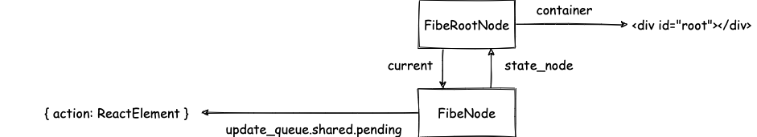
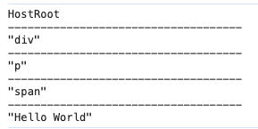

> 模仿 [big-react](https://github.com/BetaSu/big-react)，使用 Rust 和 WebAssembly，从零实现 React v18 的核心功能。深入理解 React 源码的同时，还锻炼了 Rust 的技能，简直赢麻了！
>
> 代码地址：https://github.com/ParadeTo/big-react-wasm
>
> 本文对应 tag：[v4](https://github.com/ParadeTo/big-react-wasm/tree/v4)

> Based on [big-react](https://github.com/BetaSu/big-react)，I am going to implement React v18 core features from scratch using WASM and Rust.
>
> Code Repository：https://github.com/ParadeTo/big-react-wasm
>
> The tag related to this article：[v4](https://github.com/ParadeTo/big-react-wasm/tree/v4)

React 一次更新过程可以分为 Render 和 Commit 两大流程，其中 Render 流程又可以分为 begin work 和 complete work 两个阶段。本文实现 begin work 阶段。

The update process in React can be divided into two main phases: Render and Commit. The Render phase can further be divided into two stages: begin work and complete work. This article focuses on implementing the begin work stage.

上篇文章介绍了当调用 `render()` 方法时，会调用 `reconciler` 中的 `update_container` 方法：

In the previous article, we discussed that when the `render()` method is called, it invokes the `update_container` method in the `reconciler`:

```rust
pub fn update_container(&self, element: Rc<JsValue>, root: Rc<RefCell<FiberRootNode>>) {
    let host_root_fiber = Rc::clone(&root).borrow().current.clone();
    let update = create_update(element);
    enqueue_update(host_root_fiber.borrow(), update);
    ...
}
```

执行完上述代码后，会构造一个这样的数据结构：

After executing the above code, a data structure like the following will be constructed:



其中，`FiberRootNode` 和 `FiberNode` 定义如下：

The definitions of `FiberRootNode` and `FiberNode` are as follows:

```rust
pub struct FiberRootNode {
    pub container: Rc<JsValue>,
    pub current: Rc<RefCell<FiberNode>>,
    pub finished_work: Option<Rc<RefCell<FiberNode>>>,
}

pub struct FiberNode {
    pub tag: WorkTag,
    pub pending_props: Option<Rc<JsValue>>,
    key: Option<String>,
    pub state_node: Option<Rc<StateNode>>,
    pub update_queue: Option<Rc<RefCell<UpdateQueue>>>,
    pub _return: Option<Rc<RefCell<FiberNode>>>,
    pub sibling: Option<Rc<RefCell<FiberNode>>>,
    pub child: Option<Rc<RefCell<FiberNode>>>,
    pub alternate: Option<Rc<RefCell<FiberNode>>>,
    pub _type: Option<Rc<JsValue>>,
    pub flags: Flags,
    pub subtree_flags: Flags,
    pub memoized_props: Option<Rc<JsValue>>,
    pub memoized_state: Option<Rc<JsValue>>,
}
```

这里使用 `Rc` 智能指针来让一个值可以有多个所有者，对于某些需要修改的字段还使用 `RefCell` 来实现“内部可变性”。

Here, the `Rc` smart pointer is used to allow a value to have multiple owners, and `RefCell` is used for "interior mutability" for certain fields that need to be modified.

接下来就是要构建一颗 FiberNode Tree 了：

Next, we are going to build a FiberNode Tree:

```rust
pub fn update_container(&self, element: Rc<JsValue>, root: Rc<RefCell<FiberRootNode>>) {
    ...
    let mut work_loop = WorkLoop::new(self.host_config.clone());
    work_loop.schedule_update_on_fiber(host_root_fiber);
}
```

因为后面的代码都是参考 big-react 的实现，把 JS 翻译成了 Rust 而已，所以就不过多的赘述了，这里提几点区别。

Because the subsequent code is mostly a translation of the implementation in big-react from JavaScript to Rust, there is no need to go into too much detail. Here are a few differences to note.

区别一：workInProgress

Difference 1: `workInProgress`

big-react 中 `workInProgress` 是一个模块级别的变量，但是 Rust 中没有这个概念，所以改成了 struct 中的一个属性：

In big-react, `workInProgress` is a module-level variable. However, Rust does not have the concept of module-level variables, so it has been changed to be an attribute within a struct.

```rust
pub struct WorkLoop {
    work_in_progress: Option<Rc<RefCell<FiberNode>>>,
}
```

其中 `WorkLoop` 这个 struct 也是 Rust 中新加的，big-react 中是在 `work_loop.js` 这个模块中直接导出了 function。

In Rust, a new struct called `WorkLoop` has been introduced, whereas in big-react, it was exported as a function in the `work_loop.js` module.

区别二：stateNode

Difference 2: `stateNode`

big-react 中的 `stateNode` 是 any 类型，因为对于根 `FiberNode` 节点，它的 `stateNode` 是 `FiberRootNode`，而其他节点的 `stateNode` 是 JS 中的 DOM 对象。Rust 中是使用一个 enum 来表示：

In big-react, the `stateNode` is of type `any` because for the root `FiberNode`, its `stateNode` is a `FiberRootNode`, while for other nodes, the `stateNode` is a DOM object in JavaScript. In Rust, an enum is used to represent this:

```rust
pub enum StateNode {
    FiberRootNode(Rc<RefCell<FiberRootNode>>),
    Element(Rc<dyn Any>),
}
```

使用的时候也很稍微麻烦一点，使用 match 来进行分支处理：

It is a bit more cumbersome to use, as it requires the use of match for branching and handling different cases:

```rust
match fiber_node.state_node {
    None => {}
    Some(state_node) => {
        match &*state_node {
            StateNode::FiberRootNode(fiber_root_node) => {}
            StateNode::Element(ele) => {},
        };
    }
}
```

或者类似于 JS 中的解构赋值：

Alternatively, it can be done similarly to destructuring assignment in JavaScript:

```rust
let Some(StateNode::FiberRootNode(fiber_root_node)) = fiber_node.state_node.clone();
```

区别三：performSyncWorkOnRoot

Difference 3: performSyncWorkOnRoot

big-react 中使用 `try catch` 来捕获 `workLoop` 过程中的任何错误：

In big-react, `try-catch` is used to catch any errors that occur during the `workLoop` process:

```js
// render阶段具体操作
do {
  try {
    workLoop()
    break
  } catch (e) {
    console.error('workLoop发生错误', e)
    workInProgress = null
  }
} while (true)
```

由于 Rust 中不支持 `try catch`，而是使用 `Result` 来处理错误，这里暂时先不考虑，后面再实现：

Since Rust does not support `try-catch`, but instead uses `Result` to handle errors, we won't consider it for now and will implement it later:

```rust
loop {
  self.work_loop();
  break;
}
```

由于我们暂时只实现 begin work 这个阶段，所以在 `perform_unit_of_work` 中暂时注释掉 `complete_unit_of_work`，改为给 `work_in_progress` 赋值为 `None`，使得循环可以退出：

Since we are currently only implementing the begin work phase, we will temporarily comment out `complete_unit_of_work` in `perform_unit_of_work`. Instead, we will assign `None` to `work_in_progress` to make the loop exit:

```rust
fn work_loop(&mut self) {
  while self.work_in_progress.is_some() {
      self.perform_unit_of_work(self.work_in_progress.clone().unwrap());
  }
}

fn perform_unit_of_work(&mut self, fiber: Rc<RefCell<FiberNode>>) {
  let next = begin_work(fiber.clone());

  if next.is_none() {
      // self.complete_unit_of_work(fiber.clone())
      self.work_in_progress = None;
  } else {
      self.work_in_progress = Some(next.unwrap());
  }
}
```

然后，我们打印这个阶段生成的 FiberNode tree 看看结果是否正确：

Next, let's print the generated FiberNode tree in this phase to see if the results are correct:

```rust
fn perform_sync_work_on_root(&mut self, root: Rc<RefCell<FiberRootNode>>) {
  self.prepare_fresh_stack(Rc::clone(&root));

  loop {
      self.work_loop();
      break;
  }

  log!("{:?}", *root.clone().borrow());
}
```

为了打印 `FiberRootNode`，我们还需要给它实现 `Debug` 这个 trait：

To print the `FiberRootNode`, we also need to implement the `Debug` trait for it:

```rust
impl Debug for FiberRootNode {
    fn fmt(&self, f: &mut Formatter<'_>) -> std::fmt::Result {
    }
}
```

实现方式是采取的广度遍历的方式，可自行查看代码。然后我们修改一下 hello world 中的例子：

The implementation approach is to use breadth-first traversal. You can refer to the code for more details. Now, let's modify the example in the "hello world" project:

```js
import {createRoot} from 'react-dom'
const comp = (
  <div>
    <p>
      <span>Hello World</span>
    </p>
  </div>
)
const root = createRoot(document.getElementById('root'))
root.render(comp)
```

可以看到如下输出：

You can see the following output:



由于目前还没有实现 children 为数组的 reconcile 流程，所以暂时只能测试单个 child 的情况。

Since the reconciliation process for children as an array has not been implemented yet, we can only test the case with a single child for now.
