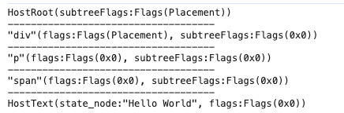

> 模仿 [big-react](https://github.com/BetaSu/big-react)，使用 Rust 和 WebAssembly，从零实现 React v18 的核心功能。深入理解 React 源码的同时，还锻炼了 Rust 的技能，简直赢麻了！
>
> 代码地址：https://github.com/ParadeTo/big-react-wasm
>
> 本文对应 tag：[v5](https://github.com/ParadeTo/big-react-wasm/tree/v5)

上篇文章实现了 Render 流程中的 begin work 阶段，这篇来实现 complete work。

更多关于 Render 流程的内容可以参考 [React 技术揭秘](https://react.iamkasong.com/process/reconciler.html) 或 [React 源码解读之首次渲染流程（含例子）](https://juejin.cn/post/6858617093471633421)。

因为是仿写，代码仍然不赘述了，[这里](https://github.com/ParadeTo/big-react-wasm/pull/1/files#diff-b572860610fbe556d94c04680b61e47a6a5724b351cdc1d3d1e89ad2ef556ca7)可以看到两个版本的对比，下面解释一些特别的地方。

- completeWork

`CompleteWork` 仍然是定义为一个含有 `host_config` 属性的 struct：

```rust
// complete_work.rs
pub struct CompleteWork {
    pub host_config: Rc<dyn HostConfig>,
}
```

并且它还作为 `WorkLoop` 的属性，在 `WorkLoop` 实例初始化时也一并初始化：

```rust
// work_loop.rs
pub struct WorkLoop {
    work_in_progress: Option<Rc<RefCell<FiberNode>>>,
    complete_work: CompleteWork,
}
impl WorkLoop {
    pub fn new(host_config: Rc<dyn HostConfig>) -> Self {
        Self {
            work_in_progress: None,
            complete_work: CompleteWork::new(host_config),
        }
    }
    ...
}
```

- 修改 react-dom 中的 `HostConfig` 实现

原来的 `create_text_instance` 和 `create_instance` 中的返回值分别为 `Text` 和 `Element`（虽然最后他们都作为 `dyn Any` 返回），但是当在 `append_initial_child` 需要把他们 `downcast` 回来时就比较麻烦了，因为 `child` 可以是 `Text` 或 `Element`，所以需要尝试两次。所以，为了后续使用方便，这里统一转为 `Node` 返回：

```rust
fn create_text_instance(&self, content: String) -> Rc<dyn Any> {
  ...
  Rc::new(Node::from(document.create_text_node(content.as_str())))
}

fn create_instance(&self, _type: String) -> Rc<dyn Any> {
  ...
  match document.create_element(_type.as_ref()) {
      Ok(element) => {
          Rc::new(Node::from(element))
      }
      Err(_) => todo!(),
  }
}

```

这样，在 `append_initial_child` 我们只需要 `downcast` 为 `Node` 即可：

```rust
fn append_initial_child(&self, parent: Rc<dyn Any>, child: Rc<dyn Any>) {
  let p = parent.clone().downcast::<Node>().unwrap();
  let c = child.clone().downcast::<Node>().unwrap();
  ...
}
```

- 代码中有一些看似多余的 `{}` 代码块，是为了解决 Rust 中关于所有权的一些限制，因为 Rust 中规定“在同一个作用域下，我们不能同时有活跃的可变借用和不可变借用”。比如下面这个例子就会报 `already borrowed: BorrowMutError` 的错误：

```rust
use std::cell::RefCell;

fn main() {
    let data = RefCell::new(5);

    let b1 = data.borrow();
    let b2 = data.borrow_mut();

    println!("{}", b1);
}
```

改成这样就没问题了：

```rust
use std::cell::RefCell;

fn main() {
    let data = RefCell::new(5);
    {
      let b1 = data.borrow();
    }
    {
      let b2 = data.borrow_mut();
    }
    println!("{}", data.borrow());
}
```

原因在于现在 `b1` 和 `b2` 的借用作用域都被限定在 `{}` 之中。

对 React 最新几个版本不太熟悉的人可能会疑惑，怎么 Render 阶段没有生成 Effect List？原因在于 React 为了支持 `Suspense`，在 `v16.14.0` 版本中去掉了 Effect List，改为使用 `subtreeFlags` 来标记子树中是否有副作用，更多信息可以参考[这篇文章](https://mp.weixin.qq.com/s/-UNN45YttXJPA2TlrnSy3Q)。

为了验证 complete work 阶段代码是否正确，我们在 `FiberRootNode` 的 `fmt` 方法中增加一些关于 `flags` 的调式信息：

```rust
...
WorkTag::HostRoot => {
    write!(f, "{:?}(subtreeFlags:{:?})", WorkTag::HostRoot, current_ref.subtree_flags);
}
WorkTag::HostComponent => {
    let current_borrowed = current.borrow();
    write!(
        f,
        "{:?}(flags:{:?}, subtreeFlags:{:?})",
        ...
    );
}
WorkTag::HostText => {
    let current_borrowed = current.borrow();

    write!(
        f,
        "{:?}(state_node:{:?}, flags:{:?})",
...
```

重新构建并安装依赖，运行 hello world 项目：

```ts
import {createRoot} from 'react-dom'

const comp = (
  <div>
    <p>
      <span>Hello World</span>
    </p>
  </div>
)
const root = createRoot(document.getElementById('root'))
root.render(comp)
```

可以看到如下结果：



Render 流程到这里暂时告一段落了，后续加入其它功能会再修改这里的内容。下一篇文章我们来实现 Commit 流程。
