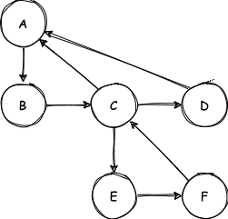
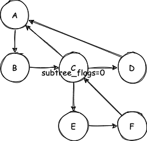

> 模仿 [big-react](https://github.com/BetaSu/big-react)，使用 Rust 和 WebAssembly，从零实现 React v18 的核心功能。深入理解 React 源码的同时，还锻炼了 Rust 的技能，简直赢麻了！
>
> 代码地址：https://github.com/ParadeTo/big-react-wasm
>
> 本文对应 tag：[v6](https://github.com/ParadeTo/big-react-wasm/tree/v6)

上篇文章已经实现了 React 一次更新过程的 Render 流程，本篇我们来实现最后一步，即 Commit。

首先，在 `work_loop` 中加入 `commit` 步骤：

```rust
fn perform_sync_work_on_root(&mut self, root: Rc<RefCell<FiberRootNode>>) {
  ...

  root.clone().borrow_mut().finished_work = finished_work;
  self.commit_root(root);
}
```

这里的 `finished_work` 就是根 `FiberNode`。

完整的 Commit 流程包括 `commitBeforeMutaionEffects`，`commitMutationEffects`，`commitLayoutEffects` 等步骤。这里简单起见，先只实现 `commitMutationEffects`，
当然可以先判断根节点或者其子节点是否有副作用，有副作用才需要执行：

```rust
fn commit_root(&self, root: Rc<RefCell<FiberRootNode>>) {
    ...
    if subtree_has_effect || root_has_effect {
        commit_work.commit_mutation_effects(finished_work.clone());
        cloned.borrow_mut().current = finished_work.clone();
    } else {
        cloned.borrow_mut().current = finished_work.clone();
    }
}
```

`commit_mutation_effects` 中会采取深度优先的方式遍历 Fiber Tree，比如下面这个例子的遍历顺序为 BEFCDA：



同时还会根据 `subtree_flags` 的值来决定是否继续遍历子树，比如下面这个例子会跳过 EF，最后的顺序为 BCDA：



每个节点根据他本身的 `flags` 来提交不同的操作，这里暂时只处理 `Placement`：

```rust
fn commit_mutation_effects_on_fiber(&self, finished_work: Rc<RefCell<FiberNode>>) {
    let flags = finished_work.clone().borrow().flags.clone();
    if flags.contains(Flags::Placement) {
        self.commit_placement(finished_work.clone());
        finished_work.clone().borrow_mut().flags -= Flags::Placement
    }
}
```
