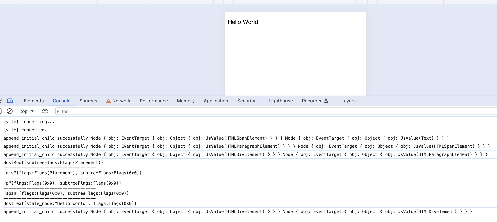

> 模仿 [big-react](https://github.com/BetaSu/big-react)，使用 Rust 和 WebAssembly，从零实现 React v18 的核心功能。深入理解 React 源码的同时，还锻炼了 Rust 的技能，简直赢麻了！
>
> 代码地址：https://github.com/ParadeTo/big-react-wasm
>
> 本文对应 tag：[v6](https://github.com/ParadeTo/big-react-wasm/tree/v6)

> Based on [big-react](https://github.com/BetaSu/big-react)，I am going to implement React v18 core features from scratch using WASM and Rust.
>
> Code Repository：https://github.com/ParadeTo/big-react-wasm
>
> The tag related to this article：[v6](https://github.com/ParadeTo/big-react-wasm/tree/v6)

上篇文章已经实现了 React 一次更新过程的 Render 流程，本篇我们来实现最后一步，即 Commit。

The previous article has already implemented the render process. In this article, we will implement the final step, which is the commit phase.

首先，在 `work_loop` 中加入 `commit` 步骤：

Firstly, add the `commit` step to the `work_loop` function:

```rust
fn perform_sync_work_on_root(&mut self, root: Rc<RefCell<FiberRootNode>>) {
  ...

  root.clone().borrow_mut().finished_work = finished_work;
  self.commit_root(root);
}
```

这里的 `finished_work` 就是根 `FiberNode`。

The `finished_work` here refers to the root `FiberNode`.

完整的 Commit 流程包括 `commitBeforeMutaionEffects`，`commitMutationEffects`，`commitLayoutEffects` 等步骤。这里简单起见，先只实现 `commitMutationEffects`，
当然可以先判断根节点或者其子节点是否有副作用，有副作用才需要执行：

The complete commit process includes steps like `commitBeforeMutationEffects`, `commitMutationEffects`, `commitLayoutEffects`, and so on. For simplicity, let's start by implementing only the `commitMutationEffects` step. Of course, we can first check if the root node or its child nodes have any side effects ahead:

```rust
fn commit_root(&self, root: Rc<RefCell<FiberRootNode>>) {
    ...
    if subtree_has_effect || root_has_effect {
        commit_work.commit_mutation_effects(finished_work.clone());
        cloned.borrow_mut().current = finished_work.clone();
    } else {
        cloned.borrow_mut().current = finished_work.clone();
    }
}
```

`commit_mutation_effects` 中会采取深度优先的方式遍历 Fiber Tree，比如下面这个例子的遍历顺序为 BEFCDA：

In the `commit_mutation_effects` step, the Fiber tree is traversed in depth-first way. For example, the traversal order for the following example is BEFCDA:


同时还会根据 `subtree_flags` 的值来决定是否继续遍历子树，比如下面这个例子会跳过 EF，最后的顺序为 BCDA：

And the traversal of the subtree is determined based on the value of `subtree_flags`. For example, in the following example, EF is skipped, and the final order is BCDA:


而 `subtree_flags` 是在 `CompleteWork` 中的 `bubble_properties` 中更新的，即每完成一个节点，就会合并他所有子节点的 `flags`：

The `subtree_flags` are updated in the `bubble_properties` of `CompleteWork`. This means that after completing a node, the `flags` of all its child nodes are merged.

```rust
fn bubble_properties(&self, complete_work: Rc<RefCell<FiberNode>>) {
    let mut subtree_flags = Flags::NoFlags;
    {
        let mut child = complete_work.clone().borrow().child.clone();
        while child.is_some() {
            let child_rc = child.clone().unwrap().clone();
            {
                let child_borrowed = child_rc.borrow();
                subtree_flags |= child_borrowed.subtree_flags.clone();
                subtree_flags |= child_borrowed.flags.clone();
            }
            {
                child_rc.borrow_mut()._return = Some(complete_work.clone());
            }
            child = child_rc.borrow().sibling.clone();
        }
    }

    complete_work.clone().borrow_mut().subtree_flags |= subtree_flags.clone();
}
```

每个节点根据他本身的 `flags` 来提交不同的操作，这里暂时只处理 `Placement`：

Each node submits different operations based on its own `flags`. For now, we will only handle the `Placement` operation.

```rust
fn commit_mutation_effects_on_fiber(&self, finished_work: Rc<RefCell<FiberNode>>) {
    let flags = finished_work.clone().borrow().flags.clone();
    if flags.contains(Flags::Placement) {
        self.commit_placement(finished_work.clone());
        finished_work.clone().borrow_mut().flags -= Flags::Placement
    }
}
```

`commit_placement` 中会先获取离当前处理的 `FiberNode` 最近的 `HostComponent` 或 `HostRoot` 作为其所要插入的目标父节点：

In `commit_placement`, the nearest `HostComponent` or `HostRoot` to the currently processed `FiberNode` is first obtained as the target parent node for insertion.

```rust
fn commit_placement(&self, finished_work: Rc<RefCell<FiberNode>>) {
    let host_parent = self.get_host_parent(finished_work.clone());
    if host_parent.is_none() {
        return;
    }
    let parent_state_node = FiberNode::derive_state_node(host_parent.unwrap());

    if parent_state_node.is_some() {
        self.append_placement_node_into_container(
            finished_work.clone(),
            parent_state_node.unwrap(),
        );
    }
}

fn get_host_parent(&self, fiber: Rc<RefCell<FiberNode>>) -> Option<Rc<RefCell<FiberNode>>> {
    let mut parent = fiber.clone().borrow()._return.clone();
    while parent.is_some() {
        let p = parent.clone().unwrap();
        let parent_tag = p.borrow().tag.clone();
        if parent_tag == WorkTag::HostComponent || parent_tag == WorkTag::HostRoot {
            return Some(p);
        }
        parent = p.borrow()._return.clone();
    }

    None
}

```

最后执行插入操作是会判断当前 `FiberNode` 节点类型是不是 `HostComponent` 或 `HostText`，如果不是会尝试插入其所有子节点：

In the `commit_placement` function, the nearest `HostComponent` or `HostRoot` to the currently processed `FiberNode` is obtained as the target parent node where it will be inserted.

```rust
fn append_placement_node_into_container(
    &self,
    fiber: Rc<RefCell<FiberNode>>,
    parent: Rc<dyn Any>,
) {
    let fiber = fiber.clone();
    let tag = fiber.borrow().tag.clone();
    if tag == WorkTag::HostComponent || tag == WorkTag::HostText {
        let state_node = fiber.clone().borrow().state_node.clone().unwrap();
        self.host_config.append_child_to_container(
            self.get_element_from_state_node(state_node),
            parent.clone(),
        );
        return;
    }

    let child = fiber.borrow().child.clone();
    if child.is_some() {
        self.append_placement_node_into_container(child.clone().unwrap(), parent.clone());
        let mut sibling = child.unwrap().clone().borrow().sibling.clone();
        while sibling.is_some() {
            self.append_placement_node_into_container(sibling.clone().unwrap(), parent.clone());
            sibling = sibling.clone().unwrap().clone().borrow().sibling.clone();
        }
    }
}
```

本次详细代码变更可以参考[这里](https://github.com/ParadeTo/big-react-wasm/pull/2)。

You can refer to [this link](https://github.com/ParadeTo/big-react-wasm/pull/2) for detailed code changes in this update.

到此，我们已经复刻出了 big react v2 版本，即可以实现单节点的首次渲染，支持 `HostComponent` 和 `HostText`。

So far, we have replicated the big react v2 version, which can perform initial rendering of a single node and supports `HostComponent` and `HostText`.

重新构建和安装依赖，还是运行上一篇的例子，最终效果如下图：

After rebuilding and installing dependencies, running the example from the previous article, the final result will look like the following image:



从结果中还可以看到，有些插入操作是在 Commit 阶段这前就完成了，具体到代码中，是在 `complete_work` 中：

From the result, we can also see that some insertion operations are completed before the Commit phase. Specifically in the code, this is done in the `complete_work` function:

```rust
...
WorkTag::HostComponent => {
  let instance = self.host_config.create_instance(
      work_in_progress
          .clone()
          .borrow()
          ._type
          .clone()
          .unwrap()
          .clone()
          .as_string()
          .unwrap(),
  );
  self.append_all_children(instance.clone(), work_in_progress.clone());
  work_in_progress.clone().borrow_mut().state_node =
      Some(Rc::new(StateNode::Element(instance.clone())));
  self.bubble_properties(work_in_progress.clone());
  None
}
...
```

这样在 Commit 阶段的时候，只需要一次性插入一颗离屏的 DOM 树就好了，也算是一个小优化了。

This way, during the Commit phase, we only need to insert an off-screen DOM tree once, which can be considered a small optimization.
