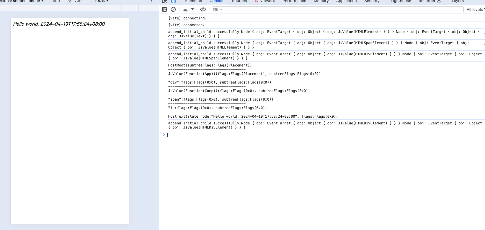
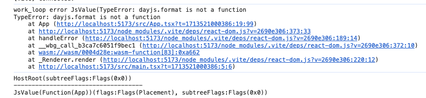

> 模仿 [big-react](https://github.com/BetaSu/big-react)，使用 Rust 和 WebAssembly，从零实现 React v18 的核心功能。深入理解 React 源码的同时，还锻炼了 Rust 的技能，简直赢麻了！
>
> 代码地址：https://github.com/ParadeTo/big-react-wasm
>
> 本文对应 tag：[v7](https://github.com/ParadeTo/big-react-wasm/tree/v7)

> Based on [big-react](https://github.com/BetaSu/big-react)，I am going to implement React v18 core features from scratch using WASM and Rust.
>
> Code Repository：https://github.com/ParadeTo/big-react-wasm
>
> The tag related to this article：[v7](https://github.com/ParadeTo/big-react-wasm/tree/v7)

上篇文章已经实现了 `HostComponent` 和 `HostText` 类型的首次渲染，这篇文章我们把 `FunctionComponent` 也加上，不过暂时不支持 `Hooks`。

The previous article has already implemented the initial rendering for `HostComponent` and `HostText` types. In this article, we will add support for `FunctionComponent`, although `Hooks` are not supported for now.

按照流程，首先是要在 `begin_work` 中增加对 `FunctionComponent` 的分支处理：

Following the process, the first step is to add a branch for handling `FunctionComponent` in `begin_work`:

```rust
pub fn begin_work(work_in_progress: Rc<RefCell<FiberNode>>) -> Option<Rc<RefCell<FiberNode>> {
  let tag = work_in_progress.clone().borrow().tag.clone();
  return match tag {
      WorkTag::FunctionComponent => update_function_component(work_in_progress.clone()),
      ...
  };
}

fn update_function_component(
    work_in_progress: Rc<RefCell<FiberNode>>,
) -> Option<Rc<RefCell<FiberNode>>> {
    let fiber_hooks = &mut FiberHooks::new();
    let next_children = Rc::new(fiber_hooks.render_with_hooks(work_in_progress.clone())?);
    reconcile_children(work_in_progress.clone(), Some(next_children));
    work_in_progress.clone().borrow().child.clone()
}
```

从代码中可以看到，我们需要新建一个 `FiberHooks` 的 struct，并实现 `render_with_hooks` 方法，目前该方法的核心就是从 `FiberNode` 中提取 `_type` 和 `pending_props`，并调用 `_type` 指向的函数（参数为 `pending_props` 所指向的对象），得到 `children`：

From the code, we can see that we need to create a new struct called `FiberHooks` and implement the `render_with_hooks` method. Currently, the core of this method is to extract `_type` and `pending_props` from the `FiberNode` and call the function pointed to by `_type` (with `pending_props` as the argument) to obtain `children`:

```rust
impl FiberHooks {
    ...
    pub fn render_with_hooks(&mut self, work_in_progress: Rc<RefCell<FiberNode>>) -> Result<JsValue, JsValue> {
        ...
        let work_in_progress_borrow = work_in_progress_cloned.borrow();
        let _type = work_in_progress_borrow._type.as_ref().unwrap();
        let props = work_in_progress_borrow.pending_props.as_ref().unwrap();
        let component = JsValue::dyn_ref::<Function>(_type).unwrap();
        let children = component.call1(&JsValue::null(), props);
        children
    }
}

```

由于函数执行是有可能抛出异常的，Rust 中没有 `try catch`，而是使用 `Result<T, E>` 这种 enum 来处理异常，其中 `T` 表示返回值，`E` 表示抛出的异常。它包括两种变体，`Ok(T)` 表示正常的返回，`Err(E)` 表示返回错误：

Since function execution can potentially throw exceptions, Rust doesn't have a `try-catch` mechanism. Instead, it uses the `Result<T, E>` enum to handle exceptions. In this enum, `T` represents the return value, and `E` represents the thrown exception. It has two variants: `Ok(T)` represents a successful return, and `Err(E)` represents an error return:

```rust
enum Result {
  Ok(T),
  Err(E)
}
```

我们可以通过 match 来处理返回值或抛出的异常，比如下面这个例子：

We can handle the return value or thrown exceptions using `match`, as shown in the following example:

```rust
fn fn1() -> Result<(), String> {
    Err("a".to_string())
}

fn my_fn() {
    match fn1() {
        Ok(return_value) => {
            println!("return: {:?}", return_value)
        }
        Err(e) => {
            println!("error: {:?}", e)
        }
    }
}

fn main() {
    my_fn();
}

```

还可以使用 `?` 操作符来对错误进行传播，比如下面这个例子：

We can also use the `?` operator to propagate errors, as shown in the following example:

```rust
fn fn1() -> Result<(), String> {
    Err("a".to_string())
}

fn my_fn() -> Result<String, String> {
    fn1()?;
    Ok("my_fn succeed".to_string())
}


fn main() {
    match my_fn() {
        Ok(return_value) => {
            println!("return: {:?}", return_value)
        }
        Err(e) => {
            println!("error: {:?}", e)
        }
    }
}
```

其中 `fn1()?;` 等价于：

The expression `fn1()?;` is equivalent to:

```rust
match fn1() {
    Ok(return_value) => {
        return_value
    }
    Err(e) => {
        return Err(e.into())
    }
};
```

回到我们的代码，`component.call1(&JsValue::null(), props)` 执行后返回类型为 `Result<JsValue, JsValue>`，我们需要将抛出的错误传播到 `perform_sync_work_on_root` 中进行处理：

Returning to our code, after executing `component.call1(&JsValue::null(), props)`, the return type is `Result<JsValue, JsValue>`. We need to propagate the thrown error to `perform_sync_work_on_root` for handling:

```rust
fn perform_sync_work_on_root(&mut self, root: Rc<RefCell<FiberRootNode>>) {
  ...
  loop {
      match self.work_loop() {
          Ok(_) => {
              break;
          }
          Err(e) => {

              self.work_in_progress = None;
          }
      };
  }
  ...
}
```

所以，他们之间的函数返回值都需要改成 `Result`，比如 `begin_work` 需要改成这样：

Therefore, the return values of the functions between them need to be changed to `Result`. For example, `begin_work` needs to be modified as follows:

```rust
pub fn begin_work(work_in_progress: Rc<RefCell<FiberNode>>) -> Result<Option<Rc<RefCell<FiberNode>>>, JsValue> {
    let tag = work_in_progress.clone().borrow().tag.clone();
    return match tag {
        WorkTag::FunctionComponent => update_function_component(work_in_progress.clone()),
        WorkTag::HostRoot => Ok(update_host_root(work_in_progress.clone())),
        WorkTag::HostComponent => Ok(update_host_component(work_in_progress.clone())),
        WorkTag::HostText => Ok(None),
    };
}
```

又比如 `perform_unit_of_work` 修改了返回值，并使用了 `?` 来传播错误：

For example, `perform_unit_of_work` has been modified to change its return value and uses `?` to propagate errors:

```rust
fn perform_unit_of_work(&mut self, fiber: Rc<RefCell<FiberNode>>) -> Result<(), JsValue> {
    let next = begin_work(fiber.clone())?;
    ...
}
```

接着是 `complete_work`，对于 `FunctionComponent`，很简单，只需要执行 `bubble_properties` 即可：

Next is `complete_work`. For `FunctionComponent`, it is straightforward. We just need to execute `bubble_properties`:

```rust
...
WorkTag::FunctionComponent => {
    self.bubble_properties(work_in_progress.clone());
    None
}
...
```

最后到 Commit，无需改动，非常 Nice。

Finally, we reach the Commit phase, which doesn't require any modifications. It looks great.

接下来，我们来测试一下，下面是 Demo：

Next, let's test it out. Here's a demo:

```js
// App.tsx
import dayjs from 'dayjs'

function App() {
  return (
    <div>
      <Comp>{dayjs().format()}</Comp>
    </div>
  )
}

function Comp({children}) {
  return (
    <span>
      <i>{`Hello world, ${children}`}</i>
    </span>
  )
}

export default App

// main.tsx
import {createRoot} from 'react-dom'
import App from './App.tsx'

const root = createRoot(document.getElementById('root'))
root.render(<App />)
```

重新构建并安装依赖，运行后可以看到如下效果：

Rebuild and install the dependencies. After running it, you will see the following result:



日志以及页面渲染结果均正常。

The logs and the rendered result on the page are both normal.

然后，我们再来测试下抛出异常的场景：

Next, let's test the scenario where an exception is thrown:

```js
function App() {
  return (
    <div>
      {/* will throw error */}
      <Comp>{dayjs.format()}</Comp>
    </div>
  )
}
```



目前我们还没有对异常进行处理，只是中断了 Render 过程而已。

Currently, we haven't handled the exceptions，we have only interrupted the render process.

这样，首次渲染对于 `FunctionComponent` 的支持就完成了，由于目前还未实现 `Hooks`，所以需要修改的地方并不多。

With this, the initial rendering support for `FunctionComponent` is complete. Since we haven't implemented `Hooks` yet, there aren't many areas that need modification.
