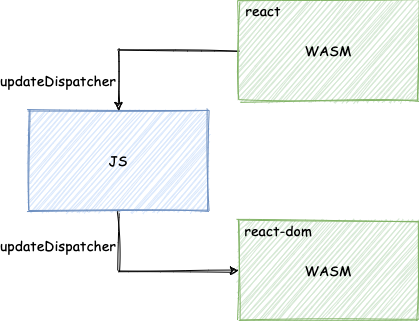
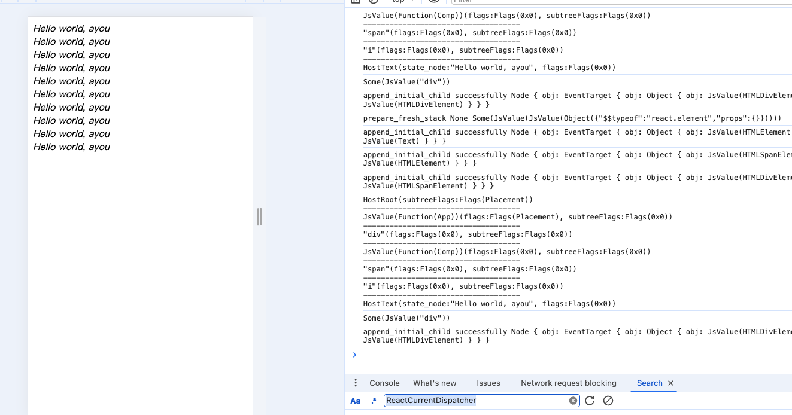

> 模仿 [big-react](https://github.com/BetaSu/big-react)，使用 Rust 和 WebAssembly，从零实现 React v18 的核心功能。深入理解 React 源码的同时，还锻炼了 Rust 的技能，简直赢麻了！
>
> 代码地址：https://github.com/ParadeTo/big-react-wasm
>
> 本文对应 tag：[v8](https://github.com/ParadeTo/big-react-wasm/tree/v8)

> Based on [big-react](https://github.com/BetaSu/big-react)，I am going to implement React v18 core features from scratch using WASM and Rust.
>
> Code Repository：https://github.com/ParadeTo/big-react-wasm
>
> The tag related to this article：[v8](https://github.com/ParadeTo/big-react-wasm/tree/v8)

上篇文章实现了对 `FunctionComponent` 类型的支持，但是还不支持 Hooks，这篇文章我们以 `useState` 为例，来介绍如何实现。

The previous article implemented support for the `FunctionComponent` type, but it doesn't support Hooks yet. In this article, we'll use `useState` as an example to explain how to implement it.

不知道经常使用 react 的你有没有过这样的疑问：`useState` 是从 `react` 库里面引入的，但是 `useState` 的具体实现则是在 `react-reconciler` 中，那是怎么做到的呢？react 依赖了 `react-reconciler`？

If you frequently use React, you may have wondered about this: `useState` is imported from the `react` library, but its actual implementation is in `react-reconciler`. How is that achieved? Does React depend on `react-reconciler`?

为了搞清楚这个问题，我们先来分析下 big-react。

To understand this issue, let's analyze Big React.

首先看下 `useState` 的入口文件：

First, let's take a look at the entry file for `useState`:

```ts
// react/index.ts
import currentDispatcher, {
	Dispatcher,
	resolveDispatcher
} from './src/currentDispatcher';

export const useState = <State>(initialState: (() => State) | State) => {
	const dispatcher = resolveDispatcher() as Dispatcher;
	return dispatcher.useState<State>(initialState);
};

export const __SECRET_INTERNALS_DO_NOT_USE_OR_YOU_WILL_BE_FIRED = {
	currentDispatcher
};

// react/src/currentDispatcher.ts
...
const currentDispatcher: { current: null | Dispatcher } = {
	current: null
};

export const resolveDispatcher = () => {
	const dispatcher = currentDispatcher.current;

	if (dispatcher === null) {
		console.error('resolve dispatcher时dispatcher不存在');
	}
	return dispatcher;
};

export default currentDispatcher;
```

代码很简单，执行 `useState` 时，核心逻辑为调用 `currentDispatcher.current` 上的 `useState` 方法。很明显，`currentDispatcher.current` 初始化是 `null`，那么它在哪里进行赋值的呢？答案是在 `renderWithHooks` 中：

The code is straightforward. When `useState` is executed, the core logic involves calling the `useState` method on `currentDispatcher.current`. It's evident that `currentDispatcher.current` is initially set to `null`. So, where is it assigned a value? The answer lies in `renderWithHooks`:

```js
// react-reconciler/src/fiberHooks.ts
export const renderWithHooks = (workInProgress: FiberNode) => {
  ...
  currentDispatcher.current = HooksDispatcherOnMount
  ...
}
```

并且这里的 `currentDispatcher` 还不是直接从 `react` 导入的，而是从 `shared` 这个库导入，而 `shared` 最后从 `react` 中导入了 `__SECRET_INTERNALS_DO_NOT_USE_OR_YOU_WILL_BE_FIRED`，它包含 `currentDispatcher` 属性：

Moreover, the `currentDispatcher` here is not directly imported from `react`, but from the `shared` library. And `shared` ultimately imports `__SECRET_INTERNALS_DO_NOT_USE_OR_YOU_WILL_BE_FIRED` from `react`, which contains the `currentDispatcher` property:

```js
// react-reconciler/src/fiberHooks.ts
import sharedInternals from 'shared/internals'
const {currentDispatcher} = sharedInternals

// shared/internals.ts
import * as React from 'react'
const internals = React.__SECRET_INTERNALS_DO_NOT_USE_OR_YOU_WILL_BE_FIRED
export default internals

// react/index.ts
export const __SECRET_INTERNALS_DO_NOT_USE_OR_YOU_WILL_BE_FIRED = {
  currentDispatcher,
}
```

所以就形成了这样一个依赖关系：

So, it forms a dependency relationship like this:

```
react-dom ---depend on--> react-reconciler ---depend on--> shared ---depend on--> react
```

打包时，`react` 和 `shared` 打包成一个 `react.js`，而打包 `react-dom` 时需要指定 `react` 为 external, 这样打包出来的 `react-dom.js` 中不会包含 `react` 的代码，而是作为外部依赖：

During bundling, `react` and `shared` are bundled together into a `react.js` file. When bundling `react-dom`, `react` needs to be specified as an external dependency. This means that the resulting `react-dom.js` file won't include the code for `react` but will treat it as an external dependency:

```
react + shared => react.js
react-dom + react-reconciler + shared => react-dom.js
```

这样的好处是可以方便的替换 Renderer，比如后续要实现用于单测的 `react-noop`：

This approach allows for easy replacement of the renderer. For example, if you want to implement `react-noop` for testing purposes:

```
react-noop + react-reconciler + shared => react-noop.js
```

但是 WASM 构建明显是不支持 external 的，怎么办呢？重新思考下，发现要实现上面的要求，核心在于两点：

However, it's apparent that WASM builds don't support externals. So, what can be done? Upon reconsideration, it's realized that to meet the requirements mentioned above, two key points need to be addressed:

- react 和 renderer 代码要分开打包
- 要让 renderer 去依赖 react，并能够在运行时修改 react 中的变量的值

- React and renderer code should be bundled separately.
- The renderer should depend on React and be able to modify the values of variables in React at runtime.

其中分开打包现在我们已经实现了，现在要实现第二点，也就是要实现一个 WASM 模块修改另一个 WASM 模块中的变量的值。查阅 `wasm-bindgen` 的文档，发现除了 WASM 可以导出方法给 JS 使用外，也可以从 JS 中导入方法给 WASM 来调用：

We have already achieved the separation of bundling. Now, to implement the second point, which is modifying a variable's value in one WASM module from another WASM module, we refer to the documentation of `wasm-bindgen` and discover that besides exporting functions from WASM for JavaScript usage, it's also possible to import functions from JavaScript for WASM to invoke:

```rust
use wasm_bindgen::prelude::*;

#[wasm_bindgen]
extern "C" {
  fn alert(s: &str);
}

#[wasm_bindgen]
pub fn greet(name: &str) {
  // the alert is from JS
  alert(&format!("Hello, {}!", name));
}
```

所以，我们可以通过 JS 作为中转来实现一个 WASM 模块修改另一个 WASM 模块中的变量的值。具体做法如下：

So, we can achieve the modification of a variable's value in one WASM module from another by using JavaScript as an intermediary. The specific approach is as follows:

我们在 `react` 中导出一个 `updateDispatcher` 方法给 `JS`，用于更新 `react` 中的 `CURRENT_DISPATCHER.current`

We export an `updateDispatcher` method from `react` to JavaScript, which is used to update `CURRENT_DISPATCHER.current` in `react`.

```rust
fn derive_function_from_js_value(js_value: &JsValue, name: &str) -> Function {
    Reflect::get(js_value, &name.into()).unwrap().dyn_into::<Function>().unwrap()
}

#[wasm_bindgen(js_name = updateDispatcher)]
pub unsafe fn update_dispatcher(args: &JsValue) {
    let use_state = derive_function_from_js_value(args, "use_state");
    CURRENT_DISPATCHER.current = Some(Box::new(Dispatcher::new(use_state)))
}
```

然后，我们在 `react-reconciler` 中声明对这个方法的导入（这里简单起见没有再从 `shared` 中导入了）：

Then, we declare the import of this method in `react-reconciler` (for simplicity, we omitted importing from `shared` here):

```rust
#[wasm_bindgen]
extern "C" {
    fn updateDispatcher(args: &JsValue);
}
```

在 `render_with_hooks` 时，会调用 `updateDispatcher`，传入一个包含 `use_state` 属性的 `Object`：

During `render_with_hooks`, the `updateDispatcher` is called, passing an `Object` that contains the `use_state` property:

```rust

fn update_mount_hooks_to_dispatcher() {
    let object = Object::new();

    let closure = Closure::wrap(Box::new(mount_state) as Box<dyn Fn(&JsValue) -> Vec<JsValue>>);
    let function = closure.as_ref().unchecked_ref::<Function>().clone();
    closure.forget();
    Reflect::set(&object, &"use_state".into(), &function).expect("TODO: panic set use_state");

    updateDispatcher(&object.into());
}
```

最后，我们需要在打包出来的 `react-dom/index_bg.js` 顶部插入一段代码，从 `react` 中引入 `updateDispatcher` 这个方法：

Finally, we need to insert a piece of code at the top of the bundled `react-dom/index_bg.js` file to import the `updateDispatcher` method from `react`:

```js
import {updateDispatcher} from 'react'
```

当然，这一步可以写一个脚本来实现。

总结下来，上面的流程可以简单表示为：

Certainly, this step can be implemented using a script.

To summarize, the above process can be represented simply as:



本次的更新详见[这里](https://github.com/ParadeTo/big-react-wasm/pull/4)。

我们来测试下，修改一下 hello-world 的例子：

The details of this update can be found [here](https://github.com/ParadeTo/big-react-wasm/pull/4).

Let's test it by modifying the hello-world example:

```ts
import {useState} from 'react'

function App() {
  const [name, setName] = useState(() => 'ayou')
  setTimeout(() => {
    setName('ayouayou')
  }, 1000)
  return (
    <div>
      <Comp>{name}</Comp>
    </div>
  )
}

function Comp({children}) {
  return (
    <span>
      <i>{`Hello world, ${children}`}</i>
    </span>
  )
}

export default App
```

结果如下所示：

The result is shown below:



很奇怪吧？那是因为我们目前还没有完整的实现更新流程。

到此，我们已经复刻出了 big react v3 这个版本。跪求 star！

It looks strange, right? That's because we haven't fully implemented the update process yet.

So far, we have replicated the Big React v3 version. Please kindly give it a star!
