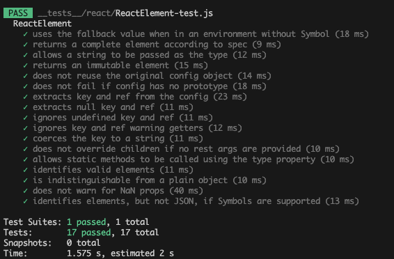

> 模仿 [big-react](https://github.com/BetaSu/big-react)，使用 Rust 和 WebAssembly，从零实现 React v18 的核心功能。深入理解 React 源码的同时，还锻炼了 Rust 的技能，简直赢麻了！
>
> 代码地址：https://github.com/ParadeTo/big-react-wasm
>
> 本文对应 tag：[v9](https://github.com/ParadeTo/big-react-wasm/tree/v9)

> Based on [big-react](https://github.com/BetaSu/big-react)，I am going to implement React v18 core features from scratch using WASM and Rust.
>
> Code Repository：https://github.com/ParadeTo/big-react-wasm
>
> The tag related to this article：[v9](https://github.com/ParadeTo/big-react-wasm/tree/v9)

一个成熟稳定的~~男人~~库肯定少不了单元测试，所以这篇我们先暂停下功能开发，给 `big-react-wasm` 增加单元测试，这次的目标是也跟 `big-react` 一样，跑通 `react` 官方关于 `ReactElement` 的 17 个测试用例。

由于测试用例的代码是跑在 Node 环境中的，所以我们需要修改一下我们的构建输出结果，首先我们新增一条 script：

A mature and stable ~~man~~ library like `big-react-wasm` definitely needs unit tests. So, in this article, we will pause the feature development for now and add unit tests to `big-react-wasm`. The goal this time is to run the 17 test cases provided by the `react` official documentation for `ReactElement`.

Since the test case code runs in a Node environment, we need to modify our build output. First, let's add a new script:

```js
"build:test": "node scripts/build.js --test",
```

然后，在我们的 `build.js` 中增加对于 `--test` 的处理。主要有两点，第一是 `wasm-pack` 的输出目标需要改为 `nodejs`：

Next, let's add handling for `--test` in our `build.js` file. There are two main points to consider. First, we need to change the output target of `wasm-pack` to `nodejs`:

```js
execSync(
  `wasm-pack build packages/react --out-dir ${cwd}/dist/react --out-name jsx-dev-runtime ${
    isTest ? '--target nodejs' : ''
  }`
)
```

`react-dom/index.js` 中从 `react` 引入 `updateDispatcher` 的语句需要改成 `commonjs` 的格式：

In `react-dom/index.js`, the statement that imports `updateDispatcher` from `react` needs to be changed to the `commonjs` format:

```js
isTest
  ? 'const {updateDispatcher} = require("react");\n'
  : 'import {updateDispatcher} from "react";\n'
```

搭建好 Jest 的环境后，我们把 `big-react` 中的 `ReactElement-test.js` 拷贝过来，并修改模块引入路径：

After setting up the Jest environment, we'll copy the `ReactElement-test.js` file from `big-react` and modify the module import paths:

```js
// ReactElement-test.js
React = require('../../dist/react')
ReactDOM = require('../../dist/react-dom')
ReactTestUtils = require('../utils/test-utils')

// test-utils.js
const ReactDOM = require('../../dist/react-dom')

exports.renderIntoDocument = (element) => {
  const div = document.createElement('div')
  return ReactDOM.createRoot(div).render(element)
}
```

执行 `jest`，会发现有几个用例是跑不通的，主要是以下几个问题：

When executing `jest`, you may notice that several test cases fail due to the following issues:

- REACT_ELEMENT_TYPE 的类型

- Type of `REACT_ELEMENT_TYPE`

由于 `big-react-wasm` 的 `REACT_ELEMENT_TYPE` 是字符串类型，所以这里的用例要改一下：

Since `REACT_ELEMENT_TYPE` in `big-react-wasm` is of type string, we need to modify these test cases accordingly:

```js
it('uses the fallback value when in an environment without Symbol', () => {
  expect((<div />).$$typeof).toBe('react.element')
})
```

这个差异还会影响到下面这个用例的执行：

This difference will also affect the execution of the following test case:

```js
const jsonElement = JSON.stringify(React.createElement('div'))
expect(React.isValidElement(JSON.parse(jsonElement))).toBe(false)
```

原因在于，正常的 `$$typeof` 的值是 `Symbol` 类型，所以在对 `ReactElement` 进行 `JSON.stringify` 时，该属性会被去掉，而 `React.isValidElement` 中会判断 `$$typeof` 是否等于 `REACT_ELEMENT_TYPE`，所以结果会是 `false`。但 big-react-wasm 的 `REACT_ELEMENT_TYPE` 是字符串，所以这里的结果返回是 `true`。

The reason is that the normal value of `$$typeof` is of type `Symbol`. Therefore, when `ReactElement` is `JSON.stringify`-ed, this property gets removed. In `React.isValidElement`, it checks whether `$$typeof` is equal to `REACT_ELEMENT_TYPE`, resulting in `false` as the output. However, in `big-react-wasm`, `REACT_ELEMENT_TYPE` is a string, so the result is `true`.

那为什么不改成 `Symbol`？因为 Rust 为了保证线程安全性，进行了很多限制，所以定义一个 `Symbol` 类型的常量是比较麻烦的，看一个 ChatGPT 给的例子就知道了：

Why not change it to `Symbol` then? Well, Rust has many restrictions in place to ensure thread safety, making it cumbersome to define a constant of type `Symbol`. Let me provide an example given by ChatGPT to illustrate this:

```rust
use wasm_bindgen::prelude::*;
use js_sys::Symbol;
use std::sync::Mutex;

pub static REACT_ELEMENT_TYPE: Mutex<Option<Symbol>> = Mutex::new(None);

// Somewhere in your initialization code, you would set the symbol:
fn initialize() {
    let mut symbol = REACT_ELEMENT_TYPE.lock().unwrap();
    *symbol = Some(Symbol::for_("react.element"));
}

// And when you need to use the symbol, you would lock the Mutex to safely access it:
fn use_symbol() {
    let symbol = REACT_ELEMENT_TYPE.lock().unwrap();
    if let Some(ref symbol) = *symbol {
        // Use the symbol here
    }
}

```

— 没有原型的 Object

- Object without a prototype

下面这个用例使用 `Object.create` 创建了一个没有原型对象的对象，在 JS 中是可以正常遍历这个对象的 key 的。

The following test case creates an object without a prototype using `Object.create`. In JavaScript, it is possible to iterate over the keys of this object.

但是当在 Rust 中调用 `config.dyn_ref::<Object>()` 将其转为 `Object` 时，得到的是 `None`，而调用 `config.is_object()` 时，结果又确实是 `true`。

However, when calling `config.dyn_ref::<Object>()` to convert it to an `Object` in Rust, it returns `None`. But when calling `config.is_object()`, the result is indeed `true`.

```js
it('does not fail if config has no prototype', () => {
  const config = Object.create(null, {foo: {value: 1, enumerable: true}})
  const element = React.createElement(ComponentFC, config)
  console.log(element)
  expect(element.props.foo).toBe(1)
})
```

所以，对于这种情况，我们直接把原来的 `config` 作为 `props` 即可：

So, for this situation, we can simply use the original `config` as the `props`:

```js
Reflect::set(&react_element, &"props".into(), &config).expect("props panic");
```

- `react-dom` Host Config

原来的 `react-dom` 对于 `HostConfig` 的实现中，当 `window` 对象不存在时，程序会报错：

In the original implementation of `react-dom`'s `HostConfig`, an error occurs if the `window` object does not exist:

```js
fn create_text_instance(&self, content: String) -> Rc<dyn Any> {
    let window = window().expect("no global `window` exists");
    let document = window.document().expect("should have a document on window");
    Rc::new(Node::from(document.create_text_node(content.as_str())))
}
```

所以，我们需要修改一下：

So, we need to make some modifications:

```rust
fn create_text_instance(&self, content: String) -> Rc<dyn Any> {
    match window() {
        None => {
            log!("no global `window` exists");
            Rc::new(())
        }
        Some(window) => {
            let document = window.document().expect("should have a document on window");
            Rc::new(Node::from(document.create_text_node(content.as_str())))
        }
    }
}
```

不过等等，为啥 big-react 不报错？因为它指定了测试环境为 `jsdom`，从官网介绍来看，`jsdom` 是一个纯 JavaScript 实现的 Web 标准的库，特别是用于 Node.js 的 WHATWG DOM 和 HTML 标准。

But wait, why doesn't big-react throw an error? It's because big-react specifies the testing environment as `jsdom`. According to the official documentation, `jsdom` is a pure JavaScript implementation of the web standards, specifically designed for Node.js, including the WHATWG DOM and HTML standards.

```js
module.exports = {
  testEnvironment: 'jsdom',
}
```

那既然这样，为啥同样在 `jsdom` 的环境中，`big-react-wasm` 就不行呢？经过一番源码研究后，我发现调用 `window()` 时，实际执行的是如下代码：

If that's the case, why doesn't `big-react-wasm` work in the same `jsdom` environment? After studying the source code, I found that when `window()` is called, it actually executes the following code:

```rust
js_sys::global().dyn_into::<Window>().ok()
```

其中，调用 `dyn_into::<Window>()` 时，会通过 `instanceof` 来判断当前对象是不是 `Window`，难道是这里的原因？我们来实验一下，在测试用例中加一段这样的代码：

In the code snippet, when `dyn_into::<Window>()` is called, it uses `instanceof` to check if the current object is a `Window`. Could this be the reason? Let's experiment by adding a code snippet like this to the test cases:

```js
console.log(window instanceof Window)
```

结果竟然是 `false`，看来这应该是 `jsdom` 的一个 bug。去 github 搜一下，果然发现有这样一个 [issue](https://github.com/jsdom/jsdom/issues/2740)，而且已经有人给出了解决办法：

The result is `false`, surprisingly. It seems to be a bug in `jsdom`. Let's search on GitHub and indeed, we found an [issue](https://github.com/jsdom/jsdom/issues/2740) related to this. Moreover, someone has already provided a solution:

```js
// jest-config.js
module.exports = {
  setupFilesAfterEnv: ['<rootDir>/setup-jest.js'],
}

// setup-jest.js
Object.setPrototypeOf(window, Window.prototype)
```

我们把这个加上，然后把 Host Config 改回原样。

Let's add that solution and revert the Host Config back to its original state.

这样，17 个测试用例就都跑通了：

With these changes, all 17 test cases pass successfully.


