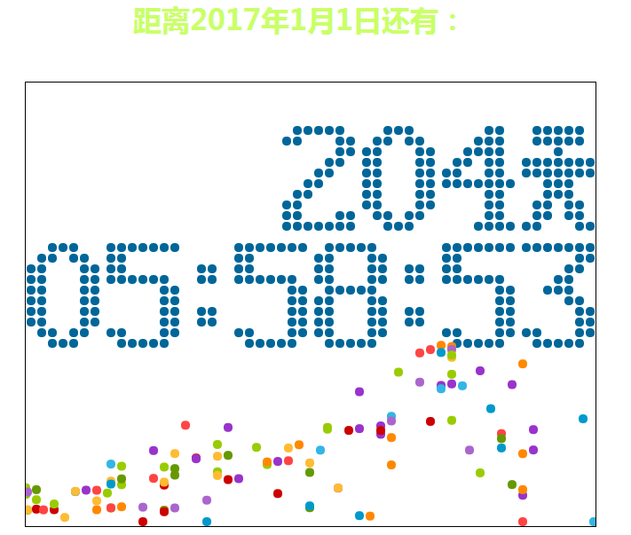
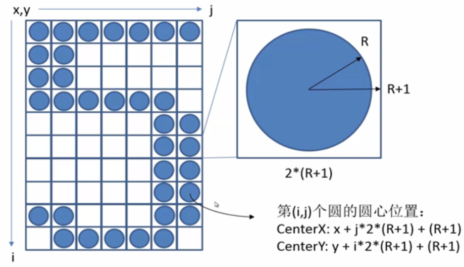
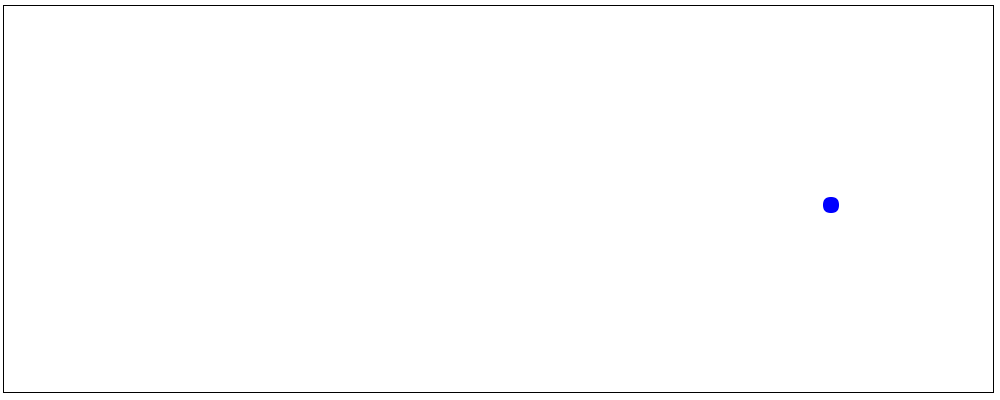
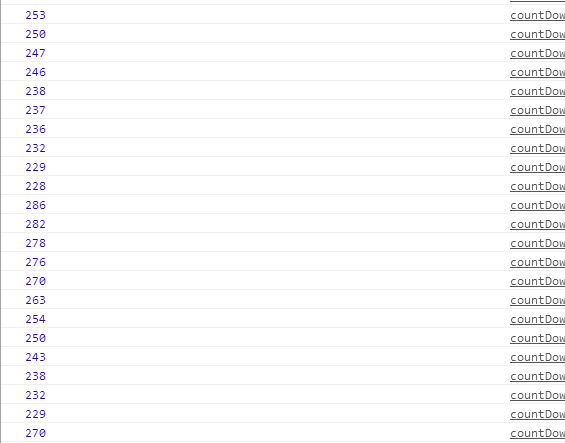

最近开始学习canvas，实现了[慕课网](http://www.imooc.com/learn/133)上的一个倒计时例子。
## 最终效果

最后的效果是不是很绚丽呢
## 数字表示方法
用二维矩阵表示0~9，：，“天”这些后面需要用到的字符
```javascript
digit =
    [
        [
            [0, 0, 1, 1, 1, 0, 0],
            [0, 1, 1, 0, 1, 1, 0],
            [1, 1, 0, 0, 0, 1, 1],
            [1, 1, 0, 0, 0, 1, 1],
            [1, 1, 0, 0, 0, 1, 1],
            [1, 1, 0, 0, 0, 1, 1],
            [1, 1, 0, 0, 0, 1, 1],
            [1, 1, 0, 0, 0, 1, 1],
            [0, 1, 1, 0, 1, 1, 0],
            [0, 0, 1, 1, 1, 0, 0]
        ],//0
        [
            [0, 0, 0, 1, 1, 0, 0],
            [0, 1, 1, 1, 1, 0, 0],
            [0, 0, 0, 1, 1, 0, 0],
            [0, 0, 0, 1, 1, 0, 0],
            [0, 0, 0, 1, 1, 0, 0],
            [0, 0, 0, 1, 1, 0, 0],
            [0, 0, 0, 1, 1, 0, 0],
            [0, 0, 0, 1, 1, 0, 0],
            [0, 0, 0, 1, 1, 0, 0],
            [1, 1, 1, 1, 1, 1, 1]
        ],//1
        [
            [0, 1, 1, 1, 1, 1, 0],
            [1, 1, 0, 0, 0, 1, 1],
            [0, 0, 0, 0, 0, 1, 1],
            [0, 0, 0, 0, 1, 1, 0],
            [0, 0, 0, 1, 1, 0, 0],
            [0, 0, 1, 1, 0, 0, 0],
            [0, 1, 1, 0, 0, 0, 0],
            [1, 1, 0, 0, 0, 0, 0],
            [1, 1, 0, 0, 0, 1, 1],
            [1, 1, 1, 1, 1, 1, 1]
        ],//2
        [
            [1, 1, 1, 1, 1, 1, 1],
            [0, 0, 0, 0, 0, 1, 1],
            [0, 0, 0, 0, 1, 1, 0],
            [0, 0, 0, 1, 1, 0, 0],
            [0, 0, 1, 1, 1, 0, 0],
            [0, 0, 0, 0, 1, 1, 0],
            [0, 0, 0, 0, 0, 1, 1],
            [0, 0, 0, 0, 0, 1, 1],
            [1, 1, 0, 0, 0, 1, 1],
            [0, 1, 1, 1, 1, 1, 0]
        ],//3
        [
            [0, 0, 0, 0, 1, 1, 0],
            [0, 0, 0, 1, 1, 1, 0],
            [0, 0, 1, 1, 1, 1, 0],
            [0, 1, 1, 0, 1, 1, 0],
            [1, 1, 0, 0, 1, 1, 0],
            [1, 1, 1, 1, 1, 1, 1],
            [0, 0, 0, 0, 1, 1, 0],
            [0, 0, 0, 0, 1, 1, 0],
            [0, 0, 0, 0, 1, 1, 0],
            [0, 0, 0, 1, 1, 1, 1]
        ],//4
        [
            [1, 1, 1, 1, 1, 1, 1],
            [1, 1, 0, 0, 0, 0, 0],
            [1, 1, 0, 0, 0, 0, 0],
            [1, 1, 1, 1, 1, 1, 0],
            [0, 0, 0, 0, 0, 1, 1],
            [0, 0, 0, 0, 0, 1, 1],
            [0, 0, 0, 0, 0, 1, 1],
            [0, 0, 0, 0, 0, 1, 1],
            [1, 1, 0, 0, 0, 1, 1],
            [0, 1, 1, 1, 1, 1, 0]
        ],//5
        [
            [0, 0, 0, 0, 1, 1, 0],
            [0, 0, 1, 1, 0, 0, 0],
            [0, 1, 1, 0, 0, 0, 0],
            [1, 1, 0, 0, 0, 0, 0],
            [1, 1, 0, 1, 1, 1, 0],
            [1, 1, 0, 0, 0, 1, 1],
            [1, 1, 0, 0, 0, 1, 1],
            [1, 1, 0, 0, 0, 1, 1],
            [1, 1, 0, 0, 0, 1, 1],
            [0, 1, 1, 1, 1, 1, 0]
        ],//6
        [
            [1, 1, 1, 1, 1, 1, 1],
            [1, 1, 0, 0, 0, 1, 1],
            [0, 0, 0, 0, 1, 1, 0],
            [0, 0, 0, 0, 1, 1, 0],
            [0, 0, 0, 1, 1, 0, 0],
            [0, 0, 0, 1, 1, 0, 0],
            [0, 0, 1, 1, 0, 0, 0],
            [0, 0, 1, 1, 0, 0, 0],
            [0, 0, 1, 1, 0, 0, 0],
            [0, 0, 1, 1, 0, 0, 0]
        ],//7
        [
            [0, 1, 1, 1, 1, 1, 0],
            [1, 1, 0, 0, 0, 1, 1],
            [1, 1, 0, 0, 0, 1, 1],
            [1, 1, 0, 0, 0, 1, 1],
            [0, 1, 1, 1, 1, 1, 0],
            [1, 1, 0, 0, 0, 1, 1],
            [1, 1, 0, 0, 0, 1, 1],
            [1, 1, 0, 0, 0, 1, 1],
            [1, 1, 0, 0, 0, 1, 1],
            [0, 1, 1, 1, 1, 1, 0]
        ],//8
        [
            [0, 1, 1, 1, 1, 1, 0],
            [1, 1, 0, 0, 0, 1, 1],
            [1, 1, 0, 0, 0, 1, 1],
            [1, 1, 0, 0, 0, 1, 1],
            [0, 1, 1, 1, 0, 1, 1],
            [0, 0, 0, 0, 0, 1, 1],
            [0, 0, 0, 0, 0, 1, 1],
            [0, 0, 0, 0, 1, 1, 0],
            [0, 0, 0, 1, 1, 0, 0],
            [0, 1, 1, 0, 0, 0, 0]
        ],//9
        [
            [0, 0, 0, 0],
            [0, 0, 0, 0],
            [0, 1, 1, 0],
            [0, 1, 1, 0],
            [0, 0, 0, 0],
            [0, 0, 0, 0],
            [0, 1, 1, 0],
            [0, 1, 1, 0],
            [0, 0, 0, 0],
            [0, 0, 0, 0]
        ],//:
        [
            [0, 1, 1, 1, 1, 1, 0],
            [0, 1, 1, 1, 1, 1, 0],
            [0, 0, 0, 1, 0, 0, 0],
            [1, 1, 1, 1, 1, 1, 1],
            [1, 1, 1, 1, 1, 1, 1],
            [0, 0, 1, 1, 1, 0, 0],
            [0, 0, 1, 1, 1, 0, 0],
            [0, 1, 1, 0, 1, 1, 0],
            [0, 1, 1, 0, 1, 1, 0],
            [1, 1, 0, 0, 0, 1, 1]
        ]//天
    ];
```
一个数字的绘制原理(详见[慕课网](http://www.imooc.com/video/2450)):

## 模拟一个小球的运动
例子中，当数字发生变化时，会出现很多彩色的运动的小球，这是怎么实现的呢，先从模拟一个小球的运动开始：
```javascript
var WINDOW_WIDTH = 1024;
var WINDOW_HEIGHT = 400;
var RADIUS = 8;
var MARGIN_TOP = 60;
var MARGIN_LEFT = 30;

var curShowTimeSeconds = 0

var balls = [];
const colors = ["#33B5E5", "#0099CC", "#AA66CC", "#9933CC", "#99CC00", "#669900", "#FFBB33", "#FF8800", "#FF4444", "#CC0000"]

// x,y表示小球的坐标
// g表示重力加速度
// vx，vy表示水平和垂直方向上的速度
// color 表示小球的颜色
var ball = {x: 1000, y: 50, g: 2, vx: -4, vy: -10, color: "blue"};

window.onload = function () {

    var canvas = document.getElementById('canvas');
    var context = canvas.getContext("2d");

    canvas.width = WINDOW_WIDTH;
    canvas.height = WINDOW_HEIGHT;

    curShowTimeSeconds = getCurrentShowTimeSeconds()
    setInterval(
        function () {
            render(context);
            updateBalls();
        }
        ,
        50
    );
}
function getCurrentShowTimeSeconds() {
    var curTime = new Date();
    var ret = endTime.getTime() - curTime.getTime();
    ret = Math.round(ret / 1000)
    return ret >= 0   ret : 0;
}
function updateBalls() {
    ball.vy += ball.g; // 速度变化
    ball.x += ball.vx; // 水平方向的位置变化
    ball.y += ball.vy;  // 垂直方向的位置变化
    if (ball.y >= WINDOW_HEIGHT - RADIUS) {
        // 反弹
        ball.y = WINDOW_HEIGHT - RADIUS;
        // 能量损耗
        ball.vy = -ball.vy*0.75;
    }
}
// 绘制小球
function render(cxt) {
    cxt.clearRect(0, 0, WINDOW_WIDTH, WINDOW_HEIGHT);
    cxt.fillStyle = ball.color;
    cxt.beginPath();
    cxt.arc(ball.x, ball.y, RADIUS, 0, 2 * Math.PI, true);
    cxt.closePath();
    cxt.fill();
}
```
小球会先做一个斜抛运动，然后碰到底部后反弹起来，如此反复，一直到垂直速度为0.


## 完整动画
完整例子代码如下图所示：
```javascript
var WINDOW_WIDTH = 642;
var WINDOW_HEIGHT = 500;
var RADIUS = 5;
var MARGIN_TOP = 180;
var MARGIN_LEFT = 0;
const endTime = new Date(2016,11,31,23,59,59);
var curShowTimeSeconds = 0;

var balls = [];
const colors = ["#33B5E5","#0099CC","#AA66CC","#9933CC","#99CC00","#669900","#FFBB33","#FF8800","#FF4444","#CC0000"]

window.onload = function() {
    var canvas = document.getElementById('canvas');
    var context =canvas.getContext("2d");
    canvas.width = WINDOW_WIDTH;
    canvas.height = WINDOW_HEIGHT;
    curShowTimeSeconds = getCurrentShowTimeSeconds();

    // 不停的更新和重绘，这里时间必须要小于1秒，否则不准确
    setInterval(function() {
        render(context);
        update();
    },50);
}
/**
 * 判断秒数是否发生了变化来决定是否更新时间
 */
function update() {
    var nextShowTimeSeconds = getCurrentShowTimeSeconds();

    var nextDays = parseInt(nextShowTimeSeconds/(24*3600));
    var nextHours = parseInt((nextShowTimeSeconds-nextDays*24*3600)/3600);
    var nextMinutes = parseInt((nextShowTimeSeconds-nextDays*24*3600-nextHours*3600)/60);
    var nextSeconds = nextShowTimeSeconds % 60;

    var curDays = parseInt(curShowTimeSeconds/(24*3600));
    var curHours = parseInt((curShowTimeSeconds-curDays*24*3600)/3600);
    var curMinutes = parseInt((curShowTimeSeconds-curDays*24*3600-curHours*3600)/60);
    var curSeconds = curShowTimeSeconds % 60;


    var nextSeconds = nextShowTimeSeconds % 60;
    var curSeconds = curShowTimeSeconds % 60;
    if (nextSeconds != curSeconds) {
        var sNextDays = nextDays.toString();
        sNextDays = sNextDays.length < 3    '0' + sNextDays : sNextDays;
        var sCurDays = curDays.toString();
        sCurDays = sCurDays.length < 3   '0' + sCurDays : sCurDays;

        // 天-百位
        if ( sNextDays[0] != sCurDays[0]) {
            addBalls( MARGIN_LEFT + 93*(RADIUS+1) - 45 * (RADIUS+1), MARGIN_TOP-22*(RADIUS+1) , sCurDays[0] );
        }
        // 天-十位
        if ( sNextDays[1] != sCurDays[1]) {
            addBalls( MARGIN_LEFT + 93*(RADIUS+1) - 30 * (RADIUS+1), MARGIN_TOP-22*(RADIUS+1) , sCurDays[1] );
        }
        // 天-个位
        if ( sNextDays[2] != sCurDays[2]) {
            addBalls( MARGIN_LEFT + 93*(RADIUS+1) - 15 * (RADIUS+1), MARGIN_TOP-22*(RADIUS+1) , sCurDays[2] );
        }
        // 时-十位
        if( parseInt(curHours/10) != parseInt(nextHours/10) ){
            addBalls( MARGIN_LEFT + 0 , MARGIN_TOP , parseInt(curHours/10) );
        }
        // 时-个位
        if( parseInt(curHours%10) != parseInt(nextHours%10) ){
            addBalls( MARGIN_LEFT + 15*(RADIUS+1) , MARGIN_TOP , parseInt(curHours/10) );
        }
        // 分-十位
        if( parseInt(curMinutes/10) != parseInt(nextMinutes/10) ){
            addBalls( MARGIN_LEFT + 39*(RADIUS+1) , MARGIN_TOP , parseInt(curMinutes/10) );
        }
        // 分-个位
        if( parseInt(curMinutes%10) != parseInt(nextMinutes%10) ){
            addBalls( MARGIN_LEFT + 54*(RADIUS+1) , MARGIN_TOP , parseInt(curMinutes%10) );
        }
        // 秒-十位
        if( parseInt(curSeconds/10) != parseInt(nextSeconds/10) ){
            addBalls( MARGIN_LEFT + 78*(RADIUS+1) , MARGIN_TOP , parseInt(curSeconds/10) );
        }
        // 秒-个位
        if( parseInt(curSeconds%10) != parseInt(nextSeconds%10) ){
            addBalls( MARGIN_LEFT + 93*(RADIUS+1) , MARGIN_TOP , parseInt(nextSeconds%10) );
        }
        curShowTimeSeconds = nextShowTimeSeconds;
    }
    updateBalls();
}
/**
 * 更新小球的运动轨迹
 */
function updateBalls(){

    for( var i = 0 ; i < balls.length ; i ++ ){

        balls[i].x += balls[i].vx;
        balls[i].y += balls[i].vy;
        balls[i].vy += balls[i].g;

        // 反弹
        if( balls[i].y >= WINDOW_HEIGHT-RADIUS ){
            balls[i].y = WINDOW_HEIGHT-RADIUS;
            // 能量损耗
            balls[i].vy = - balls[i].vy*0.75;
        }
    }
}
/**
 * 给变化的数字增加彩色小球
 * @param x 数字左上角x
 * @param y 数字左上角y
 * @param num 数字
 */
function addBalls(x, y, num) {
    for( var i = 0  ; i < digit[num].length ; i ++ ) {
        for( var j = 0  ; j < digit[num][i].length ; j ++ ) {
            if( digit[num][i][j] == 1 ){
                var aBall = {
                    x:x+j*2*(RADIUS+1)+(RADIUS+1),
                    y:y+i*2*(RADIUS+1)+(RADIUS+1),
                    g:1.5+Math.random(),// 随机重力加速度
                    vx:Math.pow( -1 , Math.ceil( Math.random()*1000 ) ) * 4,//随机水平速度
                    vy:-5,
                    color: colors[ Math.floor( Math.random()*colors.length ) ] // 随机颜色
                }

                balls.push( aBall )
            }
        }
    }
}
/**
 * 得到当前倒计时的秒数
 * @returns {number}
 */
function getCurrentShowTimeSeconds() {
    var curTime = new Date();
    var ret = endTime.getTime() - curTime.getTime();
    ret = Math.round(ret/1000);
    return ret>=0 ret:0;
}
/**
 * 计算天、时、分、秒
 * @param cxt
 */
function render(cxt) {

    // 清空矩形空间
    cxt.clearRect(0,0,WINDOW_WIDTH,WINDOW_HEIGHT);
    // 计算天、时、分、秒
    var days = parseInt(curShowTimeSeconds/(24*3600));
    var hours = parseInt((curShowTimeSeconds-days*24*3600)/3600);
    var minutes = parseInt((curShowTimeSeconds-days*24*3600-hours*3600)/60);
    var seconds = curShowTimeSeconds % 60;
    // 天
    days = days.toString();
    days = days.length < 3   '0' + days : days;
    for (var i=days.length- 1;i>=0;i--) {
        renderDigit(MARGIN_LEFT + 93*(RADIUS+1) - 15 * (days.length-i) * (RADIUS+1), MARGIN_TOP-22*(RADIUS+1), days[i], cxt);
    }
    renderDigit(MARGIN_LEFT + 93*(RADIUS+1),MARGIN_TOP-22*(RADIUS+1),11,cxt);
    // 小时：分：秒
    renderDigit(MARGIN_LEFT,MARGIN_TOP,parseInt(hours/10),cxt);
    renderDigit(MARGIN_LEFT + 15*(RADIUS+1),MARGIN_TOP,parseInt(hours%10),cxt);
    renderDigit(MARGIN_LEFT + 30*(RADIUS+1),MARGIN_TOP,10,cxt);
    renderDigit(MARGIN_LEFT + 39*(RADIUS+1),MARGIN_TOP,parseInt(minutes/10),cxt);
    renderDigit(MARGIN_LEFT + 54*(RADIUS+1),MARGIN_TOP,parseInt(minutes%10),cxt);
    renderDigit(MARGIN_LEFT + 69*(RADIUS+1),MARGIN_TOP,10,cxt);
    renderDigit(MARGIN_LEFT + 78*(RADIUS+1),MARGIN_TOP,parseInt(seconds/10),cxt);
    renderDigit(MARGIN_LEFT + 93*(RADIUS+1),MARGIN_TOP,parseInt(seconds%10),cxt);

    // 画小球
    renderBalls(cxt);
}
/**
 * 画图
 * @param x
 * @param y
 * @param num
 * @param cxt
 */
function renderDigit(x,y,num,cxt) {
    cxt.fillStyle = "rgb(0,102,153)";
    for(var i=0;i<digit[num].length;i++) {
        for(var j=0;j<digit[num].length;j++) {
            if (digit[num][i][j] === 1) {
                cxt.beginPath();
                cxt.arc(x+j*2*(RADIUS+1)+(RADIUS+1),y+i*2*(RADIUS+1)+(RADIUS+1 ),
                    RADIUS, 0, 2*Math.PI);
                cxt.closePath();
                cxt.fill();
            }
        }
    }
}

/**
 * 画球
 * @param cxt
 */
function renderBalls(cxt) {
    for( var i = 0 ; i < balls.length ; i ++ ){
        cxt.fillStyle=balls[i].color;

        cxt.beginPath();
        cxt.arc( balls[i].x , balls[i].y , RADIUS , 0 , 2*Math.PI , true );
        cxt.closePath();

        cxt.fill();
    }
}
```
## 优化
上面的代码有一个问题，就是随着程序的运行balls数组长度会一直增长，但其实运行到画布之外的小球就可以从数组中删去了，所以我在updateBalls（计算反弹前）加了以下代码，跟课程有点不同（嘿嘿，代码更简洁哦）：
```javascript
        // 删去画布外小球
        if (balls[i].x + RADIUS < 0 || balls[i].x - RADIUS > WINDOW_WIDTH) {
            balls.splice(i--,1);// 把当前元素删除后，索引要减一 比如[1,2,3]中 删掉2后下一个元素的索引还是1
            continue;
        }
```
打印数组的长度，其长度不会无限增加

